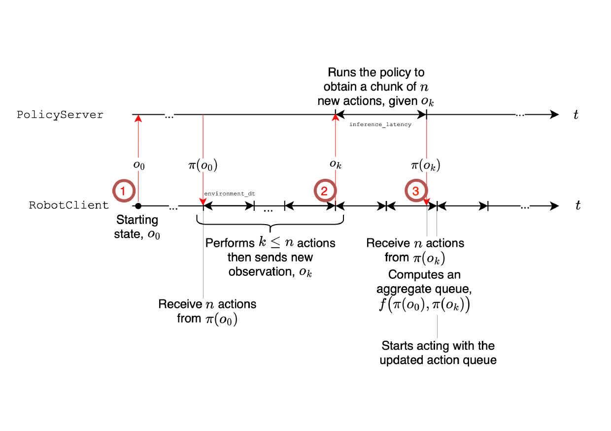

# 异步推理

层裁剪、视觉 token 压缩、专家减窄、少步分块压缩的是单次前向本身，异步推理减少的是控制回路上的等待：它把动作预测和动作执行解耦，让机器人在消费当前动作队列的同时，后台完成下一块的预测，避免推理时的空闲停顿。

## 本节目标

理解异步推理解耦的是哪两件事、动作队列和阈值怎么触发下一次推理、新旧动作块如何聚合，以及它在真机上的吞吐与延迟收益。最后给出 SmolVLA 相对 π0 的整体收益与代价。

<figure>
  
  <figcaption>异步推理的时间线。RobotClient 执行完队列里一部分动作后（k ≤ n 个），把新观测 o_k 发给 PolicyServer；服务器推理期间客户端继续执行剩余动作，收到新块后把新旧块在重叠时间步上聚合成更新后的队列再继续执行。策略可以运行在带 GPU 的远程服务器上。图为论文示意。</figcaption>
</figure>

## 解耦预测与执行

常见的同步做法是把一整段动作块执行完，再用新观测计算下一块。这样计算每隔 n 步才发生一次，平均算力占用低，但机器人在计算下一块的这段时间里处于空闲，控制回路上出现停顿，两次观测之间仍是开环。

异步推理把动作块预测和动作执行拆成两件事：一个 RobotClient 负责执行动作，一个 PolicyServer 负责推理。客户端从一个就绪的动作队列里逐个取动作执行，队列尚未耗尽时就触发下一次推理，算得的新块并入队列。预测在执行的间隙完成，运行时的空闲停顿被消除。这套解耦还带来一个部署上的好处：PolicyServer 可以放在算力更强的远程机器上（可带 GPU），通过网络把动作发给机器人，适合算力受限的低功耗平台。

客户端每个控制步的动作可以浓缩成几行：

```
每步 t：
  a ← 从队列头取一个动作并执行
  若 队列剩余比例 |A|/n < g：
    采集新观测 o；若 o 与上一帧不近重复：
      非阻塞地发出 o、触发推理，得到新块 Ã
      A ← 聚合(A, Ã)          # 在重叠时间步上合并
```

关键在于这一步是非阻塞的：发出观测后控制回路不等结果，继续执行队列里剩下的动作，新块要等推理返回才并入队列。阈值 g、聚合规则、近重复判定这三处，正是下面几段展开的重点。

## 队列、阈值与块聚合

触发下一次推理靠一个队列阈值 g。客户端每执行一个动作，就检查队列剩余比例，当 `|A_t| / n < g` 时，采集一帧新观测发给服务器，触发一次非阻塞推理，控制回路不因此阻塞。服务器返回新块后，新块与队列里剩下的旧块逐时间步聚合成更新后的队列。论文只把这一步写成一个抽象的聚合函数，具体规则留给实现：lerobot 的异步栈把它做成一组按时间步逐元素的加权平均，默认给旧块 0.3、新块 0.7。

```python
AGGREGATE_FUNCTIONS = {
    "weighted_average": lambda old, new: 0.3 * old + 0.7 * new,
    "latest_only":      lambda old, new: new,
    "average":          lambda old, new: 0.5 * old + 0.5 * new,
    "conservative":     lambda old, new: 0.7 * old + 0.3 * new,
}
```

默认档偏向新块，让队列尽快跟上最新观测，又保留少量旧块作缓冲；`latest_only` 直接丢弃旧块，`conservative` 反过来偏向旧块。重叠段的聚合给建模误差留了缓冲。

逐时间步的加权仍是硬拼接。为让衔接更平滑，生产路径默认再叠加一层 RTC（real-time chunking）：把仍在执行的旧块作为软约束注入下一块的采样，前缀注意力沿执行进度线性放松（`prefix_attention_schedule=LINEAR`），引导强度由 `max_guidance_weight` 控制、作用范围由 `execution_horizon` 界定。新块因此在重叠段与正在执行的动作保持连续，块与块之间的过渡比单纯队列加权更平滑。

为避免重复请求，观测按状态向量算 L2 距离（只比状态、不比图像），距离低于阈值 `atol`（默认为 1）的近重复观测被丢弃、不发去服务器；但队列一旦为空，最近一帧观测无论是否近重复都会被处理，防止机器人停止动作。

阈值 g 决定反应性和算力的平衡。记服务器推理延迟为 E[ℓ_S]，控制周期为 Δt，30 帧每秒时 Δt 约 33 毫秒。一次请求的往返分三段：客户端发到服务器、服务器推理、服务器发回客户端；网络两段通常远小于推理，整段往返约等于 E[ℓ_S]。队列每 Δt 输出一个动作，一次推理期间会消耗约 `E[ℓ_S]/Δt` 个；要让新块在队列耗尽前到达，就要在剩余动作达到这一数量时触发，写成剩余比例阈值即 `g ≥ (E[ℓ_S]/Δt)/n`。取到这个档位后，客户端每 `(1-g)·n·Δt` 秒发一次观测，平均每 `(1-g)·n·Δt + E[ℓ_S]` 收到一个新块。三种取值对应三种情形：

- g=0：把整块执行完才发新观测，等下一块的往返延迟里队列是空的，退化成完全顺序的部署，平均空闲约 E[ℓ_S] 秒。
- g=0.7：执行约 1-g=0.3 的队列后就触发推理，摊薄计算又不让队列耗尽，块重叠还留了误差缓冲，是推荐的异步档。
- g=1：每个控制步都发一次观测，队列几乎总是满的、反应性最强，但每个控制步一次前向，算力代价在受限硬件上过高。

## 真机上的收益

异步与同步在真机上的对比很直接。执行同一组任务，同步的平均完成时间为 13.75 秒，异步降到 9.70 秒，快约 30%。固定 60 秒里，同步平均完成 1.8 个任务，异步完成 3.8 个，吞吐约 2 倍。两者成功率相当，同步 78.3%、异步 73.3%。收益的来源是消除了推理时的空闲：单次前向的成本没变，但机器人不再因等待推理而停顿。

## 整体收益与代价

把单次前向的压缩和异步推理综合来看，SmolVLA 相对 π0 这个 33 亿参数、在上万小时机器人数据上预训练的基线：参数量小约 7 倍，训练显存约六分之一，训练快约 40%，且不做机器人预训练，成功率仍与 VLM 初始化的 π0 相当。代价是小骨干的容量有限，遇到更复杂或更长程的任务时，精度和泛化可能不如大模型；异步推理换来的吞吐也以维护一套客户端服务器的执行栈为前提。工程上还可叠加 bfloat16 与 `torch.compile` 进一步压低延迟。

## 本页小结

- 异步推理把动作预测与执行解耦，RobotClient 执行队列、PolicyServer 推理，预测在执行间隙完成，消除单次前向压缩无法覆盖的空闲停顿。
- 队列阈值 g 触发非阻塞推理，新旧块在重叠时间步做加权平均聚合（默认旧 0.3、新 0.7），生产路径再叠 RTC 让衔接更平滑，近重复观测按状态向量 L2 距离过滤；g=0.7 是推荐档，g=0 退化为顺序、g=1 每步一次前向代价过高。
- 真机上异步比同步完成时间快约 30%、吞吐约 2 倍，成功率相当。
- 相对 π0，SmolVLA 参数量约七分之一、训练显存约六分之一、无机器人预训练而成功率相当，代价是小骨干容量有限、复杂任务可能受限。

## 导航

- 上一节：[压缩单次前向](03-compress-single-forward.md)
- 返回上级：[SmolVLA](../01-smolvla.md)
