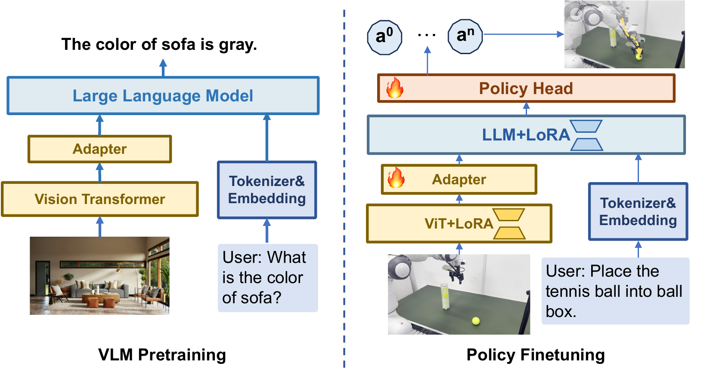

# 整体架构

TinyVLA 由两部分组成：一个负责感知的 Llava-Pythia VLM，和一个负责生成动作的 diffusion policy 头。VLM 把多路图像、语言指令编码成特征，diffusion 头读这份特征，再拼接机器人本体状态，用扩散去噪一次生成一段连续动作块；动作改变机器人状态，新的观测再回到 VLM。

## 本节目标

理解 TinyVLA 的架构：VLM 侧怎么把图像和指令编码成条件、diffusion 头侧怎么组织、两者靠什么连接，以及一段动作从噪声到输出的生成路径。

<figure>
  
  <figcaption>TinyVLA 架构。左侧是 Llava-Pythia VLM，多路图像经 CLIP 编码为视觉 token，与指令文本 token 拼接后送入 Pythia 语言骨干。VLM 末层特征经池化、与本体状态拼接后作为条件，注入右侧的 diffusion policy 头；该头从噪声出发去噪，一次输出整段动作块。图为论文框架示意。</figcaption>
</figure>

## VLM 侧：Llava-Pythia

TinyVLA 的 VLM 是 Llava-Pythia，把 Pythia 语言骨干放进 LLaVA 框架组装而成，只按 LLaVA 流程做视觉-语言预训练，不使用机器人数据。它有两个组件：

- 视觉编码器：CLIP ViT-L/14-336，把每路 RGB 图像编码成视觉 token。多路相机的视觉 token 直接拼接后一起送入语言骨干。
- 语言骨干：Pythia，参数量从 70M 到 1.4B，对应 TinyVLA-S / B / H 三档（约 0.4B / 0.7B / 1.3B）。视觉 token 与指令文本 token 拼成一条序列，经 Pythia 前向，末层 hidden states 就是动作生成的条件。

骨干规模决定了指令理解和定位能力，也决定了成功率，是 [TinyVLA 是什么](01-what-is-tinyvla.md)里规模律的来源。

## diffusion 头侧：ConditionalUnet1D

动作头是一个 diffusion policy，实现为 `ConditionalUnet1D`，一个一维卷积 U-Net（`down_dims=[256, 512, 1024]`，`kernel_size=5`）。它替代了 OpenVLA 把动作离散成 token 的做法：训练目标是 DDPM 的去噪。训练时对干净动作块按采样到的时间步加高斯噪声，U-Net 以 VLM 特征为条件预测所加的噪声 ε，损失是预测噪声与真实噪声的 MSE（`prediction_type='epsilon'`），既不直接回归动作，也不逐 token 分类。动作空间为 7 自由度，位置 xyz、姿态 roll/pitch/yaw、夹爪开合。

选 diffusion 头不只是为了快。同一骨干换头的消融里（Franka 五任务），diffusion 头平均成功率约 94.0，ACT 头约 13.3，MLP 头因容量不足在五个任务上全数为 0（论文报告）。动作头的表示能力直接决定成功率，diffusion 头在精度上也明显强于另两种。

## 连接与生成路径

VLM 与 diffusion 头之间不再加投影层，末层特征直接当条件（衔接处 `proj_to_action` 是 `nn.Identity`）。条件的组装在 `ConditionalUnet1D` 内部是一条固定流水线：

1. VLM 末层特征经 `AdaptiveAvgPool1d(1)` 池化成一个定长向量，消掉可变的 token 长度。
2. 池化结果经一层 `LayerNorm`。
3. 与 7 维本体状态拼接，再经一层线性 `combine` 合回条件维度。
4. 合并后的条件向量经 FiLM 注入 U-Net 的各层。

对应 `ConditionalUnet1D.forward` 里的四行：

```python
# global_cond 是 VLM 末层特征，states 是 7 维本体状态
global_cond = self.global_1d_pool(global_cond.permute(0, 2, 1)).squeeze(-1)  # 池化成定长向量
global_cond = self.norm_after_pool(global_cond)                              # LayerNorm
global_cond = torch.cat([global_cond, states], dim=-1)                       # 拼接本体状态
global_cond = self.combine(global_cond)                                      # 线性合回条件维度
```

diffusion 头一次预测 `chunk_size` 步动作（`num_queries = chunk_size`），即一整段动作块，而不是逐步生成。生成时从与动作块同形状的高斯噪声出发，沿 U-Net 反复去噪得到动作块；去噪的步数与调度器是推理延迟的关键，在[降低推理延迟](03-fast-inference.md)展开。

训练时 VLM 用 LoRA 微调、diffusion 头全参数更新，数据只用目标任务的少量轨迹，训练细节不在本页展开。

## 本页小结

- TinyVLA 分感知的 Llava-Pythia VLM 和生成动作的 diffusion policy 头：VLM 把图像和指令编码成条件，diffusion 头去噪生成动作块。
- VLM 是 CLIP ViT-L/14-336 加 Pythia 语言骨干（70M 到 1.4B，三档 S/B/H），按 LLaVA 流程组装并只做视觉-语言预训练。
- 动作头是 `ConditionalUnet1D` 一维卷积 U-Net，用 DDPM 去噪目标预测噪声、损失为噪声 MSE，取代离散动作 token；换头消融里精度明显高于 ACT 与 MLP（约 94.0 对 13.3 对 0，论文报告）。
- VLM 末层特征经池化、LayerNorm、与本体状态拼接、线性合并后经 FiLM 注入 U-Net，一次去噪输出整段 `chunk_size` 动作块。

## 导航

- 上一节：[TinyVLA 是什么](01-what-is-tinyvla.md)
- 返回上级：[TinyVLA](../02-tinyvla.md)
- 下一节：[降低推理延迟](03-fast-inference.md)
