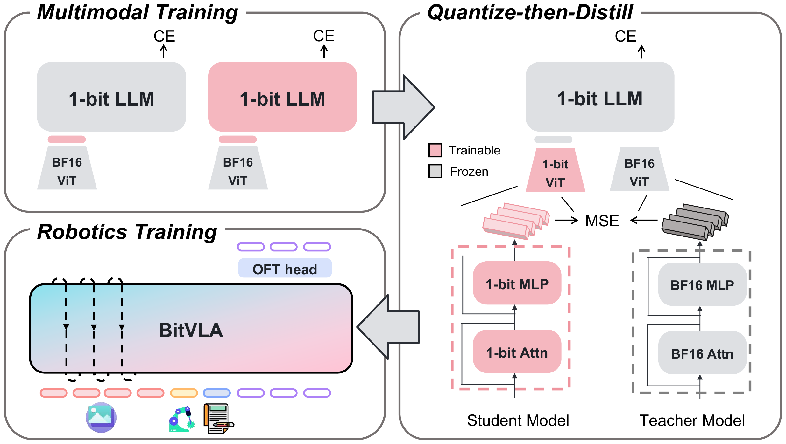

# 整体架构

BitVLA 是一个 LLaVA 式的 VLM 加动作头。视觉编码器把图像编码成视觉 token，经一个 MLP 连接层投影到语言空间，与指令文本 token、本体状态 token 拼成一条序列，送入 BitNet 语言主干；主干末层在动作 token 位置的隐藏状态送进动作头，一次回归出一段连续动作块。低比特只落在视觉编码器和主干的线性层上，连接层和动作头保留全精度。

## 本节目标

理解 BitVLA 的架构：视觉编码器、连接层、BitNet 主干、动作头各是什么、如何连接，三阶段训练如何把视觉编码器过渡到低比特，以及一段动作从观测到输出的生成路径。

<figure>
  
  <figcaption>BitVLA 的训练流程与结构。多模态训练阶段用 1-bit LLM 配全精度 ViT 做视觉-语言学习；Quantize-then-Distill 阶段把视觉编码器压缩到 1.58-bit，学生编码器的逐层表示对齐全精度 teacher 的表示（MSE）；机器人训练阶段在 BitVLA 上接入 OFT 动作头，输入图像、机器人状态和指令，输出动作块。图为论文框架示意。</figcaption>
</figure>

## 组成与数据流

BitVLA 沿用 LLaVA 的组装方式，四个部件各有分工：

- 视觉编码器：SigLIP-L，在 224×224 分辨率下把每张图编码成 256 个视觉 token。经 Quantize-then-Distill 后权重取三值、激活取 INT8。
- 连接层：一个带 GeLU 的两层 MLP，把视觉 token 投影到语言主干的隐藏维度。保留全精度。
- 语言主干：BitNet b1.58 2B4T，权重三值、激活 INT8。视觉 token、指令文本 token 与本体状态 token 拼成一条序列，经主干前向。
- 动作头：一个全精度的 L1 回归头（`MLPResNet`），读主干末层在动作位置的隐藏状态，回归归一化后的连续动作。

本体状态经一个 MLP 投影成单个 state token，附在视觉 token 之后一起进入主干。图像、指令、状态在同一条序列里由主干统一编码。

## 三阶段训练：视觉编码器如何过渡到低比特

BitNet 主干在语言预训练时就是原生三值，无需再压。视觉编码器则从全精度出发，分三阶段过渡到低比特（对应上图左侧到右侧）：

1. 多模态训练：主干为 1-bit LLM，视觉编码器仍是全精度 BF16 ViT，按 LLaVA 流程做视觉对齐与指令微调。
2. Quantize-then-Distill：把视觉编码器从全精度压缩到 1.58-bit 权重加 INT8 激活，用全精度编码器当 teacher 做逐层对齐，只更新视觉编码器。这一阶段是低比特视觉编码器维持精度的关键，机制在 [Quantize-then-Distill](04-quantize-then-distill.md) 展开。
3. 机器人训练：在约 1M 条 Open X-Embodiment 轨迹上训练，接上 OFT 动作头，学习从观测到动作块的映射。

## 动作生成路径

动作侧沿用 OpenVLA-OFT：并行解码加动作分块，配全精度 L1 回归头，区别于 OpenVLA 把动作离散成 token 再逐维自回归。`BitVLAForActionPrediction.predict_action` 的流程是先在序列末尾追加 `ACTION_DIM × NUM_ACTIONS_CHUNK` 个占位动作 token，把图像特征和本体特征散射到对应位置，再把占位动作 token 的 embedding 清零，只保留位置信息；随后主干以双向注意力一次前向，取末层在动作位置的隐藏状态送入动作头：

```python
# 主干一次前向，OFT 用双向注意力（并行解码，非自回归）
llava_output = LlavaForConditionalGeneration.forward(
    self, inputs_embeds=input_embeddings, attention_mask=attention_mask,
    output_hidden_states=True, use_bi_attn=True,
)
last_hidden_states = llava_output.hidden_states[-1][:, :-1, :]
actions_hidden_states = last_hidden_states[all_actions_mask.squeeze(-1)].unsqueeze(0)
# 全精度 L1 回归头一次回归整段动作块
normalized_actions = action_head.predict_action(actions_hidden_states)
normalized_actions = normalized_actions.reshape(NUM_ACTIONS_CHUNK, ACTION_DIM)
```

整段 `NUM_ACTIONS_CHUNK` 动作在一次主干前向里并行产出，不逐 token 解码。动作头再把归一化动作按各数据集的统计量反归一化回真实动作单位。一处与 OpenVLA-OFT 的差别：BitVLA 保留 BitNet 主干的因果注意力，若换成双向掩码，真机任务上成功率会明显下降，因此主干前向仍用因果注意力，也便于接入 Flash-Attention（论文报告）。

## 本页小结

- BitVLA 是 LLaVA 式 VLM 加动作头：SigLIP 视觉编码器、全精度 MLP 连接层、BitNet 三值主干、全精度 L1 回归动作头；本体状态经 MLP 投影成单个 state token。
- 视觉编码器分三阶段从全精度过渡到 1.58-bit：多模态训练、Quantize-then-Distill、机器人训练；BitNet 主干在语言预训练时已是原生三值。
- 动作侧沿用 OpenVLA-OFT，`predict_action` 追加占位动作 token、清零其 embedding、主干一次前向取末层隐藏状态，动作头一次回归整段动作块，不逐 token 自回归。
- 主干保留因果注意力，换成双向掩码会在真机任务上明显降低成功率（论文报告）。

## 导航

- 上一节：[BitVLA 是什么](01-what-is-bitvla.md)
- 返回上级：[BitVLA](../03-bitvla.md)
- 下一节：[低比特量化](03-low-bit-quantization.md)
