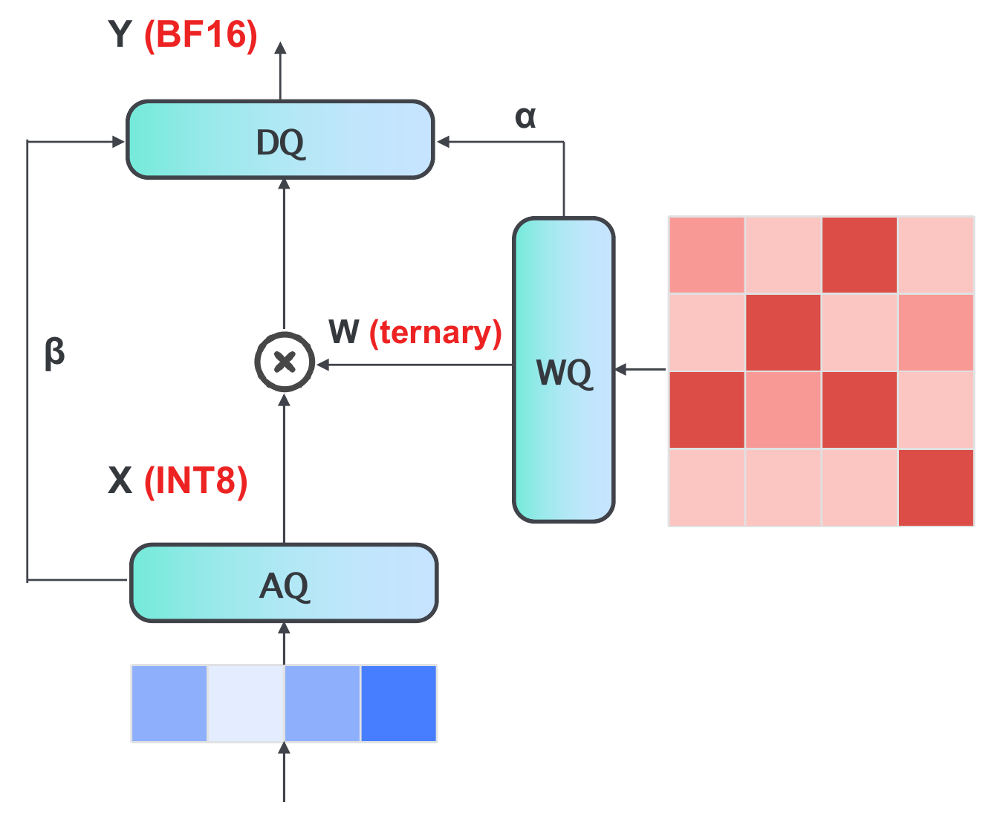

# 低比特量化

BitVLA 的推理开销压缩集中在一件事：把视觉编码器和主干的线性层权重量化到三值 {−1, 0, 1}、激活量化到 INT8。三值权重按约 1.58-bit 存储，直接减小显存和访存；权重只取 {−1, 0, 1} 后，矩阵乘里的乘法退化为加减，浮点只剩每元素缩放。本页给出两个量化器、BitLinear 覆盖哪些层、低比特为何降低显存与计算量，以及在线量化与真实打包部署的差别。

## 本节目标

理解 BitVLA 的三值权重和 INT8 激活如何构成、落在哪些线性层、为什么能降低显存和计算量，以及仓库里发布的权重走的是在线量化还是真实打包，各对应哪段源码和哪组加速数字。

## 两个量化器：三值权重与 INT8 激活

量化在自定义的 `BitLinear` 里完成，靠两个带直通估计（STE）的量化器。权重量化 `WeightQuant` 用 absmean 缩放，把权重映射到 {−1, 0, 1}；激活量化 `ActQuant` 用逐 token 的 absmax 缩放，把激活映射到 INT8 的 [−128, 127]。两者反传都是直通，梯度原样穿过量化（`modeling_bitnet.py`）：

```python
class WeightQuant(torch.autograd.Function):
    @staticmethod
    def forward(ctx, x):
        s = 1.0 / x.abs().mean().clamp_(min=1e-5)     # absmean 缩放
        return ((x * s).round().clamp(-1, 1) / s)     # 映射到 {-1, 0, 1} 再还原尺度

class ActQuant(torch.autograd.Function):
    @staticmethod
    def forward(ctx, x):
        s = 127 / x.abs().max(dim=-1, keepdim=True).values.clamp_(min=1e-5)  # 逐 token absmax
        return ((x * s).round().clamp(-128, 127) / s)  # 映射到 INT8 再还原尺度
```

记权重缩放 α 为 absmean、激活缩放 β 为 absmax，量化后的线性层输出为

$$Y = \frac{\beta}{127}\,\alpha \cdot \big(Q_w(W)\,Q_a(x)\big),$$

其中 $Q_w(W)$ 是三值权重、$Q_a(x)$ 是 INT8 激活。核心矩阵乘在三值权重和 INT8 激活之间进行，α、β 只作为标量在乘法前后缩放。

<figure>
  
  <figcaption>量化线性层的前向。输入激活经 AQ 量化到 INT8（缩放 β），权重经 WQ 量化到三值（缩放 α），两者相乘后经 DQ 用 α、β 反量化回 BF16 输出。核心乘法在 INT8 激活与三值权重之间进行。图为论文示意。</figcaption>
</figure>

## BitLinear 覆盖哪些层

量化只替换视觉编码器和主干里的线性层，其余保持普通 `nn.Linear` 或 `nn.Embedding`：

- BitNet 主干：注意力的 `q_proj`、`k_proj`、`v_proj`、`o_proj`，MLP 的 `gate_proj`、`up_proj`、`down_proj`，都是 `BitLinear`。
- SigLIP 视觉编码器：注意力的 `q/k/v/out_proj` 与 MLP 的 `fc1`、`fc2` 是 `BitLinear`，由配置里的 `vit_weight_bits`、`vit_act_bits` 决定是否启用（低比特 checkpoint 设为 1 与 8）。
- 保留全精度：`lm_head`、`embed_tokens`、连接层 MLP、动作头。

主干和视觉编码器的参数集中在这些注意力和 MLP 线性层，量化它们降低大部分显存占用；输出层和 embedding 保留全精度，避免量化词表投影带来的精度损失。

## 低比特为什么降低显存与计算量

显存的下降来自权重位宽。三值权重每个值只需约 1.58-bit，可按 2-bit 打包，`quantize_to_int2` 把 4 个三值打进一个 `uint8`：

```python
def quantize_to_int2(weight):
    step = weight.abs().mean().clamp(min=1e-5)                 # absmean 尺度
    q = (weight / step).round().clamp(-1, 1).to(torch.uint8) + 1   # {-1,0,1} -> {0,1,2}
    ...
    packed = (q[:, 0] | (q[:, 1] << 2) | (q[:, 2] << 4) | (q[:, 3] << 6))  # 4 个 2-bit 打进一字节
    return packed, step, weight.shape, n
```

BF16 权重每个值 16-bit，三值打包后约 2-bit，权重存储约缩到八分之一。视觉编码器单独从 0.8GB 压缩到 0.1GB，整机从全精度 OpenVLA-OFT 的 15.4GB 压缩到 1.4GB（论文报告）。

计算量的下降来自权重取值。全精度线性层 $y = Wx$ 要做 $O(n^2)$ 次浮点乘加。权重量化成 {−1, 0, 1} 后，每个点积不再需要乘法：权重为 +1 就加、−1 就减、0 直接跳过，主要是整数加减；浮点只剩 α、β 两个标量缩放，量化和反量化合计约 $O(n)$ 次标量乘法。BitVLA 的线性变换因此比全精度少约一个数量级的浮点运算（论文报告）。

## 在线量化与真实打包：仓库发布权重的口径

发布的 BitVLA 权重保留 BF16 的 master 权重，采用在线量化：每次前向都调用 `WeightQuant` 把权重在线量化成三值、调用 `ActQuant` 把激活在线量化成 INT8，再做一次常规 BF16 的 `F.linear`。`BitLinear.forward` 里 `enable_qlora` 默认为 False，走的是在线分支：

```python
def forward(self, input):
    input = ActQuant.apply(input)                     # 激活在线量化到 INT8
    if self.enable_qlora:                             # 打包分支，仓库脚本未启用
        weight = dequantize_from_int2(self.q_weight, self.w_step.item(),
                                      self.orig_shape, self.n_elems).type(input.dtype)
    else:
        weight = WeightQuant.apply(self.weight)       # 默认：权重在线量化到三值
    return F.linear(input, weight, self.bias)
```

`quantize_to_int2` 与 `quantize_weights` 这套 2-bit 打包代码在仓库里存在，但没有调用点，`enable_qlora` 始终为 False。也就是说，仓库脚本的训练和评测都运行在线量化（模拟量化）路径，矩阵乘仍是稠密 BF16 的 `F.linear`，不涉及真实 2-bit 存储或加减 kernel。真实的显存节省需要把权重离线打包到 1.58-bit，配 bitnet.cpp 这类推理框架执行加减 kernel（README 说明，专用推理框架另行提供）。论文报告的 1.4GB 显存与延迟数字对应的是这条打包部署路径，不是仓库脚本的在线量化路径。

## 加速数字

低比特换来的显存和吞吐收益如下（论文报告）：

| 指标 | BitVLA | 对照 |
| --- | --- | --- |
| 整机显存 | 1.4GB | OpenVLA-OFT 15.4GB，约 11× |
| 视觉编码器显存 | 0.1GB | BF16 版 0.8GB，约 8× |
| 单次动作延迟 | 73ms | OpenVLA-OFT+ 321ms，约 4.4× |
| 吞吐 | 341.1Hz | OpenVLA-OFT+ 77.9Hz，约 4.4× |

延迟和吞吐在 A100 上测得，动作块 K=25，输入为三张 224×224 图像加 14 维机器人状态与指令，取 100 次查询的平均。相比 π₀ 的 86ms、Diffusion Policy 的 90ms，BitVLA 的 73ms 也更低。与训练后量化的对比在 [BitVLA 是什么](01-what-is-bitvla.md)：BitVLA 的 1.4GB 与 INT4 版 OpenVLA-OFT 的 4.7GB 精度相当，显存不到其三分之一。

## 本页小结

- 量化靠 `BitLinear` 里两个 STE 量化器：`WeightQuant` 用 absmean 把权重映射到三值 {−1, 0, 1}，`ActQuant` 用逐 token absmax 把激活映射到 INT8；输出 $Y = (\beta/127)\,\alpha \cdot Q_w(W)Q_a(x)$。
- 量化只替换主干注意力/MLP 的 `q/k/v/o_proj`、`gate/up/down_proj` 和 SigLIP 的 `q/k/v/out_proj`、`fc1/fc2`；`lm_head`、embedding、连接层、动作头保留全精度。
- 显存下降来自三值权重按 2-bit 打包（4 值/字节），权重存储约缩到八分之一；计算量下降来自权重取 {−1, 0, 1} 后点积退化为整数加减、跳过零权重，浮点只剩每元素缩放。
- 发布权重采用在线量化：保留 BF16 master 权重、每次前向在线量化再做稠密 `F.linear`；`quantize_to_int2` 打包代码存在但未调用，真实 2-bit 存储与加减 kernel 交给 bitnet.cpp，论文的 1.4GB、73ms 对应打包部署路径。

## 导航

- 上一节：[整体架构](02-architecture.md)
- 返回上级：[BitVLA](../03-bitvla.md)
- 下一节：[Quantize-then-Distill](04-quantize-then-distill.md)
