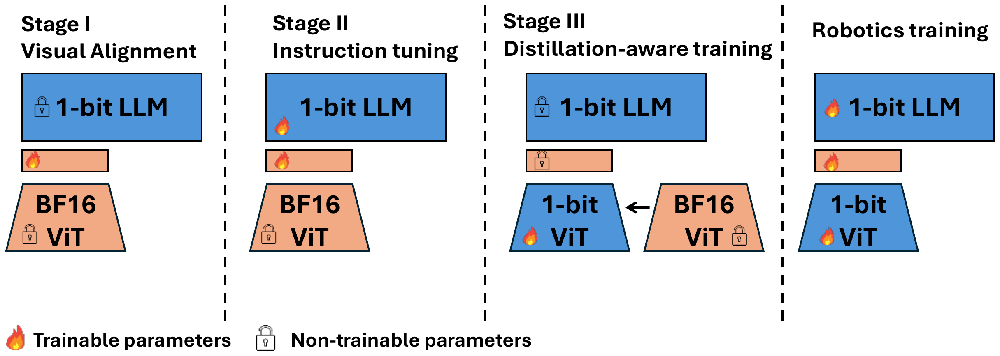

# Quantize-then-Distill

BitNet 主干在语言预训练时就是原生三值，视觉编码器则要从全精度压缩到 1.58-bit。直接把 SigLIP 的权重量化到三值会明显损失表示能力，Quantize-then-Distill 用一个全精度编码器当 teacher，让低比特学生编码器的逐层表示对齐 teacher，把这部分精度补回来。这一阶段高度数据高效，用数十亿 token 就能保持全精度编码器的大部分性能。

## 本节目标

理解低比特视觉编码器为什么需要单独一个蒸馏阶段、teacher 与学生如何设置、对齐损失如何构成，以及这一步在消融里补回多少精度。

<figure>
  
  <figcaption>视觉编码器的分阶段训练。Stage I、II 主干与连接层参与视觉对齐和指令微调，视觉编码器仍是全精度；Stage III 蒸馏感知训练把视觉编码器压缩到 1-bit，只更新学生编码器，主干与连接层冻结；机器人训练阶段再整体接入动作学习。图为论文示意。</figcaption>
</figure>

## 为什么单独一步

低比特化在主干和视觉编码器上的做法不同。BitNet 主干是原生以三值权重从头预训练的，不存在从全精度转换的过程。SigLIP 视觉编码器没有现成的三值版本，只能从全精度初始化后再量化。位宽压缩到 1.58-bit 时，直接量化会让视觉 token 的表示明显退化，需要在量化的同时用蒸馏把表示对齐回 teacher，才能保持下游的视觉-语言性能。这一阶段不需要重训全部数据，用数十亿 token 就能保持全精度编码器的大部分性能（论文报告）。

## teacher 与学生的设置

蒸馏阶段的角色分工是：

- 学生：1.58-bit 视觉编码器，从全精度 SigLIP 初始化，权重压缩到三值、激活压缩到 INT8。
- teacher：原始全精度 SigLIP 编码器，参数固定不更新。
- 只更新学生视觉编码器，1-bit LLM 主干和连接层冻结；量化处用直通估计（STE）反传梯度。

学生和 teacher 结构相同，只有精度不同，因此可以逐层对应地对齐中间表示。

## 对齐损失

总损失由语言损失和表示对齐损失组成：

$$L_{\text{total}} = L_{\text{LM}} + \gamma \cdot L_{\text{aux}}.$$

$L_{\text{LM}}$ 是标准的下一 token 预测损失，只在答案 token 上计算，条件于学生编码器产出的 1.58-bit 视觉 token。$L_{\text{aux}}$ 是逐层表示对齐：对每一层，取 teacher 与学生的隐藏状态求 MSE，再对层求平均，

$$L_{\text{aux}} = \frac{1}{L}\sum_{l=1}^{L}\frac{1}{n}\,\big\lVert h^{l}_{\text{bf16}} - h^{l}_{1.58}\big\rVert_2^2.$$

对齐权重 γ 取 0.1。语言损失约束最终行为，表示对齐损失约束学生内部逐层学到与 teacher 相近的表示，两者一起把低比特编码器的表示对齐回全精度。

## 消融：对齐损失补回多少

在零样本 VQA 上，对齐损失和训练量的收益如下（五个基准的平均分，论文报告）：

| 视觉编码器 | 训练量 | 对齐损失 | 平均分 |
| --- | --- | --- | --- |
| BF16 teacher | — | — | 53.0 |
| 1.58-bit 学生 | 5B token | 无 | 42.4 |
| 1.58-bit 学生 | 5B token | 有 | 50.8 |
| 1.58-bit 学生 | 10B token | 有 | 51.5 |

加上表示对齐损失，平均分从 42.4 升到 50.8，补回约 8.4 个百分点；训练量从 5B 增到 10B token，再升到 51.5，与全精度 teacher 的 53.0 只差约 1.5 个百分点。t-SNE 显示随层加深，学生的表示逐步向 teacher 收敛（论文报告）。

## 代码口径

仓库提供的是已发布的 checkpoint，蒸馏与预训练脚本未随仓库给出（README 标注后续提供），因此这一阶段的 teacher/学生对齐没有对应的可运行代码入口。视觉编码器的 1.58-bit 由 `modeling_siglip.py` 里 `BitLinear` 的 `weight_bits`、`input_bits` 开关在加载低比特配置时启用；蒸馏训练本身发生在未公开的预训练流程里。

## 本页小结

- 视觉编码器没有原生三值版本，从全精度压缩到 1.58-bit 会退化表示，Quantize-then-Distill 用蒸馏把表示补回来；这一步高度数据高效。
- 学生是从全精度初始化的 1.58-bit SigLIP，teacher 是固定的全精度 SigLIP，只更新学生、冻结主干与连接层，量化处用 STE 反传。
- 损失为 $L_{\text{LM}} + \gamma L_{\text{aux}}$（γ=0.1），$L_{\text{aux}}$ 是 teacher 与学生逐层隐藏状态的 MSE 对齐。
- 对齐损失把 VQA 平均分从 42.4 补到 50.8（约 +8.4），10B token 下达 51.5，与全精度 teacher 的 53.0 仅差约 1.5 个百分点（论文报告）。

## 导航

- 上一节：[低比特量化](03-low-bit-quantization.md)
- 返回上级：[BitVLA](../03-bitvla.md)
