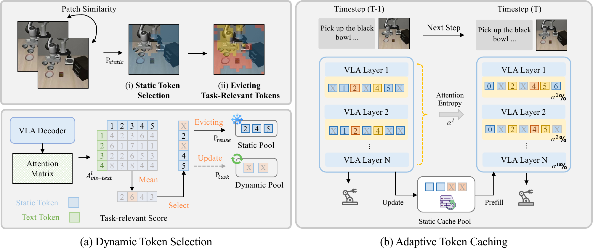

# 整体架构

VLA-Cache 的架构是叠在 OpenVLA 解码流程外的一层选择与复用逻辑，分三个阶段：静态 token 选择按帧间相似度找出没变的视觉 token，任务相关过滤把语义敏感的 token 从复用集里剔除，层自适应复用按每层注意力集中程度决定复用比例。三个阶段共同产出一份逐层的复用 token 集合，注意力前向据此对复用 token 取上一帧缓存的 KV、对其余 token 重算。

## 本节目标

理解静态 token 选择、任务相关过滤、层自适应复用三个阶段各自的判据与输出，KV 复用在注意力里怎么落地，以及一帧动作如何借上一帧的缓存与注意力生成。

<figure>
  
  <figcaption>VLA-Cache 的两部分。左侧 Dynamic Token Selection 先用帧间 patch 相似度选出静态 token（P_static），再从 VLA Decoder 的 text-to-vision 注意力算出任务相关度，把任务相关 token 剔除进 Dynamic Pool、其余静态 token 留在 Static Pool 作为复用集。右侧 Adaptive Token Caching 在相邻时刻之间，用注意力熵得到每层复用比例 α^l，各层按 α^l 从 Static Cache Pool 取上一帧的 KV 复用、其余重算。图为论文框架示意。</figcaption>
</figure>

## 静态 token 选择

第一阶段判定视觉是否静态。把当前帧图像 $I \in \mathbb{R}^{H \times W \times 3}$ 切成 $p \times p$ 的非重叠 patch，对每个 patch 和上一帧同位置的 patch 算余弦相似度：

$$\text{Sim}(\mathbf{P}_t^{i,j}, \mathbf{P}_{t-1}^{i,j}) = \frac{\mathbf{P}_t^{i,j} \cdot \mathbf{P}_{t-1}^{i,j}}{\|\mathbf{P}_t^{i,j}\|_2 \, \|\mathbf{P}_{t-1}^{i,j}\|_2}.$$

相似度超过阈值 τ 的 patch 视为静态，再用 Top-k 保留其中最稳定的一批，得到静态集：

$$\mathcal{P}_{\mathrm{static}} = \mathrm{Top}\text{-}k\big(\{ \mathbf{P}_t^{i,j} \mid \mathrm{Sim}(\mathbf{P}_t^{i,j}, \mathbf{P}_{t-1}^{i,j}) \ge \tau \}\big).$$

相似度直接在原始像素 patch 上算，不经过视觉编码器，因此这一步的开销很低。阈值 τ 决定判定的松紧，Top-k 决定复用集的上限规模。

## 任务相关过滤

第二阶段把语义敏感的 token 从静态集里剔除。夹爪、目标物体这类区域在像素上可能几乎不变，但对动作生成关键，一旦沿用过期 KV 就会让动作偏离当前环境。判据取自解码器已经算出的注意力：对每个解码层 $l$，从注意力张量里取出 text 到 vision 的子块 $\mathbf{A}^l_{\text{vis-text}}$，在多头上取均值得到每个视觉 token 的注意力，再在选定的若干层 $\mathcal{L}$ 上求平均，得到任务相关度 $\mathbf{S}_{\text{task-relevance}}$。按这个分数排序、过阈值 $\tau_{\text{task}}$ 选出任务相关 token，从静态集里减掉：

$$\mathcal{P}_{\mathrm{reuse}} = \mathcal{P}_{\mathrm{static}} \setminus \mathcal{P}_{\text{task-relevant}}.$$

由此复用集是静态且非任务相关的 token。这条过滤补回只按静态复用导致的成功率下降，LIBERO-Spatial 上从 74.2% 恢复到 82.6%（论文报告）。

## 层自适应复用

第三阶段决定每层复用多少。解码器各层的注意力集中程度不同，早期层注意力分散、中间层波动、末层回升，这与 FastV 观察到的注意力流一致。VLA-Cache 用注意力熵度量每层的集中程度：记第 $l$ 层的熵为 $\mathcal{E}^l$，定义熵下降比 $R^l = (\mathcal{E}^{l-1} - \mathcal{E}^l)/\mathcal{E}^{l-1}$，正值表示第 $l$ 层比上一层更集中。把这些比值沿层累积，得到每层的复用比例：

$$\alpha^l = \min\Big(k \sum_{j=1}^l R^j,\ 1\Big).$$

累积熵下降越大的层，注意力越集中，需要重算的 token 越少，复用比例 $\alpha^l$ 越高。$k$ 控制注意力集中程度对复用比例的影响强度。这样每层从复用集 $\mathcal{P}_{\mathrm{reuse}}$ 里按 $\alpha^l$ 取一部分复用，把算力优先分配给注意力更分散、更需要重算的层。加入这一层调度后成功率进一步升到 83.8%，延迟几乎不变（论文报告）。

## KV 复用机制与一帧动作的生成路径

三个阶段的产出汇成逐层的复用集合。注意力里逐层逐 token 判定：复用的 token 取上一帧缓存的 KV，其余 token 用当前隐藏状态重算。

$$\mathbf{K}_t^l(i) = \begin{cases} \mathbf{K}_{t-1}^l(i), & i \in \mathcal{P}_{\mathrm{reuse}} \\ W_K^l \mathbf{H}_t^l(i), & \text{otherwise} \end{cases}, \quad \mathbf{V}_t^l(i) = \begin{cases} \mathbf{V}_{t-1}^l(i), & i \in \mathcal{P}_{\mathrm{reuse}} \\ W_V^l \mathbf{H}_t^l(i), & \text{otherwise} \end{cases}.$$

一帧动作按这条链生成：取上一帧保留下来的 KV cache 与注意力，先用帧间相似度选出静态 patch，再用上一帧的注意力做任务相关过滤得到复用索引，用上一帧的注意力熵算出每层复用比例，把两者写入模型配置；随后前向解码，复用 token 直接读缓存 KV、其余重算，解出约 7 个动作 token；最后把这一帧的 KV cache 裁掉刚生成的动作 token、连同注意力留给下一帧。首帧没有上一帧缓存，走完整前向，从第二帧起才开始复用。

## 本页小结

- 架构分三阶段：静态 token 选择（帧间余弦相似度加 Top-k）、任务相关过滤（text-to-vision 注意力剔除语义敏感 token）、层自适应复用（按注意力熵定每层比例 α^l）。
- 复用集是静态且非任务相关的 token，$\mathcal{P}_{\mathrm{reuse}} = \mathcal{P}_{\mathrm{static}} \setminus \mathcal{P}_{\text{task-relevant}}$；任务相关过滤把只按静态复用的成功率从 74.2% 恢复到 82.6%，层自适应再提升到 83.8%。
- 注意力里逐层逐 token 复用：复用取上一帧 KV，其余用当前隐藏状态重算。
- 一帧动作借上一帧的 KV cache 与注意力完成选择、过滤、定比例，再前向解码并把缓存裁剪后留给下一帧；首帧走完整前向。

## 导航

- 上一节：[VLA-Cache 是什么](01-what-is-vla-cache.md)
- 返回上级：[VLA-Cache](../01-vla-cache.md)
- 下一节：[跨帧 token 缓存](03-token-caching.md)
