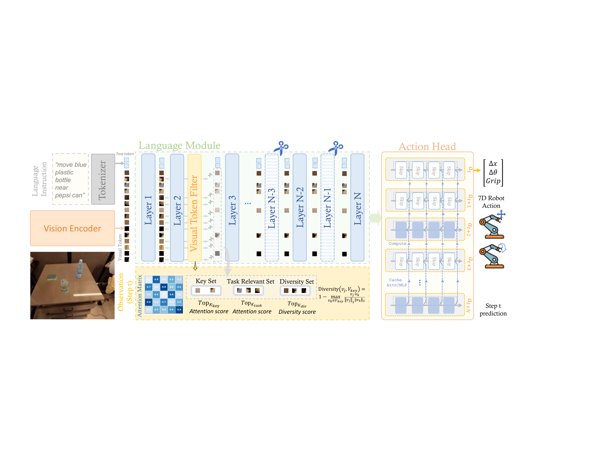
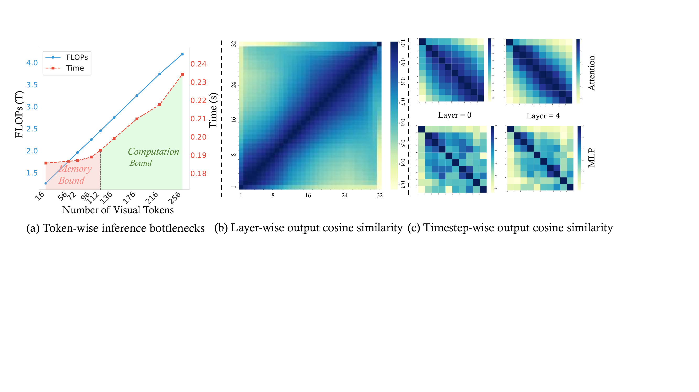

# 整体架构

EfficientVLA 不新增模块，而是在 CogACT 的三段数据流上各插入一处优化：视觉 token 在进入语言模块深层前被筛减，语言模块的部分层被剪除，扩散动作头的去噪步之间复用缓存的中间特征。三处的位置由 CogACT 各模块的瓶颈性质决定。

## 本节目标

理解 CogACT 三模块的数据流与三条策略的插入点，看清模块级瓶颈分处算力受限区和显存受限区，以及为什么必须三处一起优化才能突破单点上限。

<figure>
  
  <figcaption>视觉编码器与文本 token 一起进入语言模块。前几层之后的 Visual Token Filter 把视觉 token 分成 Key Set、Task Relevant Set、Diversity Set 三部分保留，其余丢弃；深层中作用小的层（图中剪刀与斜纹标注）被剪除。语言模块输出送入扩散动作头，图中 Skip 块直接复用缓存的 Attn/MLP 特征，只有 Compute 块重新计算，最终回归 7-DoF 动作。图为论文框架示意。</figcaption>
</figure>

## 组成与数据流

CogACT 由三个模块串联：

- 视觉编码器：DINOv2 加 SigLIP，把 224×224 的图像观测编码成 256 个视觉 token。
- 语言模块：Llama2-7B，把视觉 token 与文本指令 token 拼在一起做多模态融合与推理，输出供动作头使用的条件特征。
- 扩散动作头：一个 DiT，以语言模块的条件特征为引导，经多步去噪回归 7-DoF 的笛卡尔动作。

三条策略沿这条数据流分布。视觉 token 筛减发生在语言模块前段：从第 2 层 Transformer 起，按对文本 token 的注意力打分，把 256 个视觉 token 减到目标数量，后续所有层只处理这个紧凑子集。层剪枝作用在语言模块自身，按层重要度移除若干层，缩短模型深度。特征缓存落在扩散动作头，去噪迭代中按固定间隔复用上一次算出的注意力与 MLP 特征。

## 模块级瓶颈：算力受限区与显存受限区

三条策略的分工来自对 CogACT 单步延迟的拆解。基线各模块的开销如下（CogACT-Base，论文报告）：

| 模块 | 参数量 (M) | 视觉 token | 去噪步 | 单步延迟 (ms) | FLOPs (G) |
| --- | --- | --- | --- | --- | --- |
| 视觉模块 | 802.3 | 256 | - | 24.9 | 405.50 |
| 语言模块 | 6738.9 | 256 | - | 134.5 | 3726.55 |
| 动作模块 | 89.0 | - | 10 | 51.5 | 57.96 |

语言模块占了大部分参数、延迟和 FLOPs，且以 6.7B 参数的权重读写为主，属于显存受限区；动作模块参数不大，但要在每一步去噪里重复自注意力与 MLP，属于算力受限区。

<figure>
  
  <figcaption>(a) 随视觉 token 增加，FLOPs 线性上升，但延迟在 112 token 附近由陡转平：左侧算力受限区里减少 token 能缩短延迟，进入右侧显存受限区后延迟主要由语言模块的权重读写决定，继续减 token 收效有限。(b) 语言模块 32 层输出与输入的余弦相似度，深层普遍偏高，说明层间冗余明显。(c) 扩散动作头相邻去噪步的注意力与 MLP 特征相似度，同样偏高，说明去噪步之间存在重复计算。图为论文分析示意。</figcaption>
</figure>

图 (a) 解释了单点优化的上限：视觉 token 从 256 减到约 112 时延迟随之下降，越过这个点进入显存受限区后，语言模块的权重读写成为主导，再减 token 几乎不缩短延迟。只压缩视觉 token 的方法收益就停在这里。图 (b)、(c) 则给出另外两处可压缩的冗余：语言模块的层间相似度和扩散动作头的去噪步间相似度都偏高。层剪枝直接减少显存受限区的权重量，特征缓存跳过算力受限区的重复计算，两者补上视觉 token 剪枝覆盖不到的部分。

## 一步动作的生成路径

一次控制步里，图像先经视觉编码器得到 256 个视觉 token，与文本 token 一起进入语言模块。经过前两层后，Visual Token Filter 依注意力打分保留紧凑子集，后续层只在这个子集上计算，其间跳过被剪除的若干层。语言模块输出条件特征后交给扩散动作头，动作头从初始噪声开始多步去噪：在设定的重算步上正常计算注意力与 MLP 并刷新缓存，其余步直接读取缓存，最终回归出这一步的 7-DoF 动作。

## 为什么单点优化不够

组件消融把三条策略拆开单独看，落在 pick coke can 任务上（论文报告）：

| 配置 | 层剪枝 + MLP 压缩 | 视觉 token 剪枝 | 特征缓存 | 成功率 | 单步 (s) | 加速 |
| --- | --- | --- | --- | --- | --- | --- |
| 基线 | - | - | - | 91.3% | 0.2342 | 1.00× |
| 仅视觉 token 剪枝 | - | 是 | - | 95.6% | 0.1866 | 1.25× |
| 仅特征缓存 | - | - | 是 | 93.7% | 0.1909 | 1.23× |
| 仅模型压缩 | 是 | - | - | 92.3% | 0.1638 | 1.43× |
| 三处组合 | 是 | 是 | 是 | 93.3% | 0.1213 | 1.93× |

单独用视觉 token 剪枝只有 1.25× 加速，佐证了图 (a) 的判断：视觉 token 减到一定程度后进入显存受限区，加速就饱和了。仅特征缓存、仅模型压缩各自也停在 1.23×、1.43×。三处组合才到 1.93×，且成功率还比基线高 2 个百分点。这说明加速受限于最难压的那一处开销，只有三处一起处理才能把它一并解决。

## 本页小结

- EfficientVLA 不新增模块，只在 CogACT 的视觉 token、语言模块层、扩散去噪步三处各插一处优化。
- 语言模块 memory-bound、动作模块 compute-bound，视觉 token 剪枝越过约 112 token 后进入显存受限区，加速饱和。
- 层剪枝减少显存受限区的权重量，特征缓存跳过算力受限区的重复计算，补上视觉 token 剪枝覆盖不到的部分。
- 组件消融显示单点最多 1.25×–1.43×，三处组合达 1.93× 且成功率反升 2 个百分点（论文报告）。

## 导航

- 返回上级：[EfficientVLA](../02-efficientvla.md)
- 上一节：[EfficientVLA 是什么](01-what-is-efficientvla.md)
- 下一节：[三条加速策略](03-acceleration.md)
