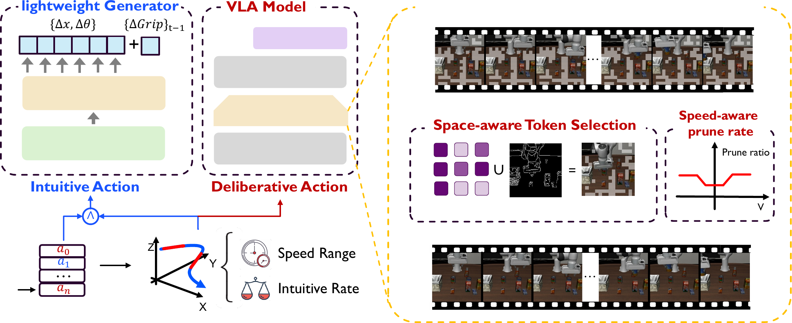

# 整体架构

SP-VLA 由两个模块协作：动作类型感知的模型调度在外层决定这一步跑完整 VLA 还是跑轻量生成器，spatial-semantic 双感知 token 剪枝在 VLA 前向内层减少进语言模型的视觉 token。两者在时间维和空间维分别减开销，且彼此耦合：调度进入完整前向时会把当前动作速度写给剪枝模块，剪枝据此定这一帧剪多少。

## 本节目标

理解模型调度的动作分类判据、轻量生成器触发条件与外推方式，理解 token 剪枝的注意力打分、边缘保留与并集选择，以及剪枝比例如何随速度变化。

<figure>
  
  <figcaption>SP-VLA 的两部分。左侧模型调度从动作缓冲 a_0…a_n 读末端平移，落在 Speed Range 内且 Intuitive Rate 达标时判为 intuitive、走 lightweight Generator 外推平移增量并沿用上一步夹爪状态，否则判为 deliberative、走完整 VLA Model。右侧 Space-aware Token Selection 把注意力重要 token 与 Canny 边缘 token 取并集，再由 Speed-aware prune rate 按速度调整剪枝比例，低速段关闭剪枝。图为论文框架示意。</figcaption>
</figure>

## 动作类型感知的模型调度

调度模块把动作分成 deliberative 和 intuitive 两类。判据取末端平移向量 $\mathbf{a}=\{a_x,a_y,a_z\}$：竖直分量相对水平分量足够小、且竖直绝对位移足够小时，判为 intuitive，对应平滑的水平过渡；否则判为 deliberative，对应抓取、下压、转向这类需要精确控制的步。intuitive 步用轻量生成器外推，deliberative 步跑完整 VLA。

只按当前速度决定还不够。连续外推会累积误差，一旦缓冲里外推动作占比过高，后续外推的参照本身就不可靠。调度因此加一个触发条件：只有动作缓冲里由 VLA 真正生成的动作数 $N_G$ 占总数 $N_A$ 的比例超过阈值 $\tau$ 时，才允许走外推路径：

$$\text{LWM}=1 \iff \text{（动作判为 intuitive）} \ \wedge\ \frac{N_G}{N_A}>\tau .$$

轻量生成器用 Ridge 回归。取动作缓冲里最近 $n$ 步的平移分量 $\mathbf{Y}\in\mathbb{R}^{n\times3}$，以时间下标构造 $\mathbf{X}=[\,\mathbf{t}\ \ \mathbf{1}\,]\in\mathbb{R}^{n\times2}$，解带正则的最小二乘得到系数，再外推到下一时刻：

$$\bm{\beta}=(\mathbf{X}^\top\mathbf{X}+\lambda\mathbf{I})^{-1}\mathbf{X}^\top\mathbf{Y},\qquad \mathbf{a}_t=[\,t\ \ 1\,]\,\bm{\beta}.$$

夹爪是二值开合状态，不适合线性外推，因此生成器只拟合 $x,y,z$ 三维平移，夹爪状态直接沿用上一步。这条设计把外推限制在连续、平滑的平移上，避开了对离散状态的错误插值。

## spatial-semantic 双感知 token 剪枝

剪枝在视觉 token 进语言模型前进行，按两类信号选要保留的 token。

semantic 重要性取自 SigLIP 末层注意力。对 query、key 做缩放点积再 softmax，在多头上取均值得到每个 token 的注意力分布 $\mathbf{Attn}$，把各 token 收到的注意力累积起来得到重要性分数，按分数降序累加到阈值 $t_{k_s}$ 为止，选出这批高注意力 token $\mathbf{T}_{se}$。

spatial 重要性来自边缘。对原图做 Canny 边缘检测，把落在物体轮廓上的 patch 对应的 token 全部保留，记作 $\mathbf{T}_{sp}$。纯注意力打分容易漏掉对比度低但几何上关键的边缘，边缘保留把这部分补回来。

两组 token 取并集，并保持原始 token 顺序：

$$\mathbf{T}_{\text{select}}=U(\mathbf{T}_{se},\ \mathbf{T}_{sp}).$$

保序很关键，VLA 对视觉 token 的相对位置敏感，打乱顺序会显著掉精度。

剪枝比例随动作速度自适应。速度低于下限 $v_{p_{\min}}$ 时不剪，保全 token 服务精细操作；超过下限后，保留比例随速度线性下降，速度越高保留越少：

$$T_r(v)=\begin{cases}1, & v<v_{p_{\min}}\\[4pt] 1-\dfrac{v-v_{p_{\min}}}{v_{p_{\max}}-v_{p_{\min}}}, & v\ge v_{p_{\min}}.\end{cases}$$

高速过渡阶段动作对单帧细节不敏感，可以多剪；低速精细阶段动作依赖完整视觉信息，少剪或不剪。剪枝比例因此和调度共享同一个速度信号：调度进入完整前向时把当前竖直平移写给剪枝模块，两个模块在同一帧上一致地按速度调节强度。

## 本页小结

- 模型调度按末端平移把动作分成 deliberative（跑完整 VLA）和 intuitive（跑轻量生成器），并要求缓冲里 VLA 生成动作占比 $N_G/N_A>\tau$ 才允许外推。
- 轻量生成器用 Ridge 回归 $\bm{\beta}=(\mathbf{X}^\top\mathbf{X}+\lambda\mathbf{I})^{-1}\mathbf{X}^\top\mathbf{Y}$ 只外推 $x,y,z$ 平移，夹爪状态沿用上一步。
- token 剪枝按 SigLIP 注意力选 $\mathbf{T}_{se}$、按 Canny 边缘选 $\mathbf{T}_{sp}$，取并集 $U(\mathbf{T}_{se},\mathbf{T}_{sp})$ 且保序。
- 剪枝比例 $T_r(v)$ 随速度线性下降、低速关闭，与调度共享同一速度信号。

## 导航

- 上一节：[SP-VLA 是什么](01-what-is-sp-vla.md)
- 返回上级：[SP-VLA](../03-sp-vla.md)
- 下一节：[模型调度源码](03-model-scheduling.md)
