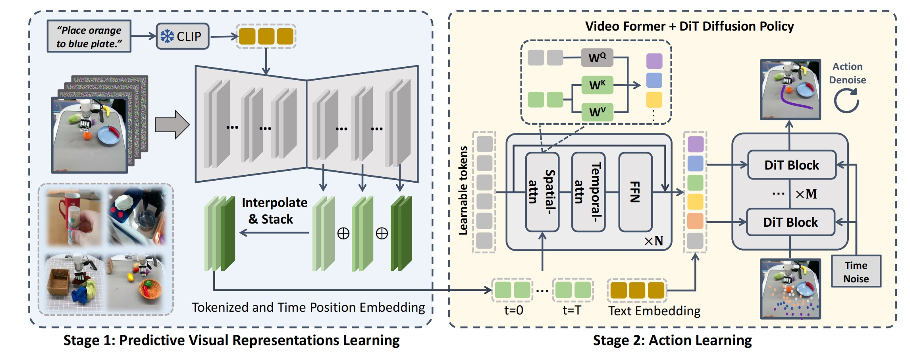

# 项目总览

目标：从论文视角理解 VPP 的问题定义、两阶段架构和关键创新，并把论文中的方法主线对应到仓库中的主要脚本。

这一页优先回答两个问题：

1. 论文到底在做什么。
2. 论文提出的架构到底长什么样。

如果只想先看懂方法，可以先读完这一页，再跳到 [训练视频模型与动作策略](04-training.md) 看“如何复现这篇论文”。



## 论文想解决什么问题

许多机器人策略方法主要依赖当前观测，然后直接输出动作。这类方法在很多场景下有效，但在操作任务里，当前帧往往不足以表达未来接触和时序变化，例如：

- 机械臂接近物体后，下一步更可能从哪个方向完成抓取
- 当前接触是否会把物体推向目标位置，还是推离目标位置
- 一条动作序列是在朝正确的任务未来推进，还是正在偏离

VPP 的核心判断是：如果视觉表征本身包含了“未来会如何演化”的信息，那么动作策略会更容易利用时序和接触线索。

论文在引言里把这一点说得很明确：过去很多视觉编码器主要基于单帧重建或两帧对比学习，因此更擅长提取当前静态信息；而视频扩散模型天然要对整段视频建模，因此其内部特征更有机会同时编码：

- 当前场景状态
- 未来若干步的动态趋势

作者把这类内部特征称为 **predictive visual representations**。

## 论文提出的核心想法

VPP 并不是把“生成未来视频”当作最终目标，而是把视频预测模型当作一种未来表征学习器。论文的关键步骤是：

1. 先训练一个适合机器人任务的视频预测模型。
2. 再从这个视频模型的中间层提取时空特征。
3. 最后用这些特征去训练动作策略。

因此，论文真正强调的是：

- 未来视频模型可以提供比静态图像编码器更有用的动态表征
- 控制阶段不必每次都完整生成未来视频

这里有一个非常关键的论文视角：作者并不是说“先生成一段未来视频，再显式规划动作”，而是说：

- 如果视频模型内部已经隐含了未来轨迹信息
- 那么下游策略就可能把“当前观测到未来表征”的变化，隐式学成一种 inverse dynamics

也就是说，策略不一定要显式计算“下一步应到达哪个状态”，它可以通过追踪预测表征中的机器人和物体变化趋势，直接学出动作。

## 论文架构：两阶段主线

### 第一阶段：视频预测模型

第一阶段的底座是视频扩散模型。它的目标是学习：

- 当前观测是什么
- 语言指令是什么
- 未来画面大概率会如何变化

从论文视角看，这一阶段的显式输出是一段未来视频；但从第二阶段视角看，更重要的是视频模型内部形成的中间时空表征。

更具体地说，论文使用的是一个预训练的 **Stable Video Diffusion（SVD）** 模型作为底座，并做了三项关键改造：

1. 给原本主要依赖首帧图像条件的 SVD 加入 CLIP 文本特征
2. 把输出视频分辨率固定到更适合操控训练的规模
3. 用互联网人类操作视频、互联网机器人视频和下游任务视频共同微调

这一步的目标不是训练一个通用视频生成器，而是得到一个更适合操控场景的 **Manipulation TVP Model**。

### 第二阶段：动作策略

第二阶段冻结或部分复用第一阶段视频模型，然后：

1. 输入当前观测、文本和状态
2. 从视频模型中抽取中间层特征
3. 通过 `Video Former` 聚合这些时空特征
4. 用动作扩散头预测一段动作序列

可以把它理解成：

- 第一阶段负责“看懂未来动态”
- 第二阶段负责“把未来动态变成动作”

论文这里还有一个设计细节值得强调：第二阶段并不要求反复运行完整视频扩散去噪。作者认为，只要视频模型的第一次前向已经给出一个粗糙但有物理趋势的未来表征，动作策略就已经可以从中获益。因此第二阶段真正消费的是：

- 单次前向得到的 predictive features
- 这些 features 经由 `Video Former` 压缩后的 token

## 论文架构可以压缩成一张文字流程图

```text
当前图像 + 文本指令
        │
        ▼
第一阶段视频扩散模型
        │
        ├── 对外可视化结果：预测未来视频
        │
        └── 对第二阶段真正有用的结果：中间时空特征
                          │
                          ▼
                     Video Former
                          │
                          ▼
                     动作扩散策略头
                          │
                          ▼
                       action chunk
```

这也是理解全文最关键的一步：**第二阶段主要消费的是视频模型的中间特征，而不是最终生成的视频文件。**

如果进一步贴近论文第 4 节，可以把这条链再展开一层：

```text
当前图像 s0 + 指令文本
        │
        ▼
Manipulation TVP Model
        │
        ├── 用于可视化：未来视频预测
        │
        └── 用于动作学习：上采样层中的 predictive features
                          │
                          ▼
               插值并堆叠多层时空特征
                          │
                          ▼
                     Video Former
                          │
                          ▼
                DiT-style Diffusion Policy Head
                          │
                          ▼
                       action chunk
```

这条展开后的链条能更好对应论文图 2。

## 它和相邻路线的区别

| 路线 | 主要建模对象 | 推理时直接输出什么 |
|---|---|---|
| BC / Diffusion Policy | 当前观测到动作 | 动作 |
| VLA | 图像与语言到动作 | 动作 token 或连续动作 |
| World Model | 世界如何演化 | 状态、规划或动作 |
| VPP | 未来视频表征如何辅助动作 | 基于未来表征的动作 |

VPP 与 world model 最接近，但它通常不显式规划多条未来轨迹再做选择。更准确地说，它把未来预测能力压缩进策略表征里。

## 为什么它和推理加速有关

VPP 被放在“推理加速”这一章，不是因为它做了量化或蒸馏，而是因为它做了更本质的架构减算：

- 如果在线完整生成未来视频，代价太高，难以进入控制闭环
- VPP 在真正控制时主要提取中间特征，而不是完整生成未来视频
- 再配合 `Video Former` 和 action chunking，把计算量压到策略能承受的范围

所以它体现的是一种“为了控制而裁剪未来生成成本”的设计。

论文里给出的理由更具体：

- 完整去噪整段视频会非常耗时
- 原始像素视频里还包含大量与决策无关的细节
- 单次前向得到的粗粒度未来表征已经足以支持动作学习

因此，VPP 不是在追求“更精细的视频生成”，而是在寻找“对动作学习最有用且代价最低的未来信息形式”。

## 论文中的三个关键创新点

如果要向初学者概括这篇论文，最值得记住的创新可以整理成三条：

### 1. 提出 predictive visual representations 的使用方式

过去很多机器人视觉表征只关心当前观测，而 VPP 明确提出利用视频扩散模型内部同时编码“当前 + 未来”的时空表征。

### 2. 用两阶段训练把视频模型迁移到动作策略

VPP 不是直接把视频生成结果当作目标，而是先训练操控版 TVP，再把其中间特征迁移到动作策略里。这使得视频基础模型中的物理动态知识可以传递到控制任务。

### 3. 在闭环控制里只取一次前向的中间特征

这是论文最重要的工程设计之一。它兼顾了：

- 未来信息的有效性
- 推理速度
- 闭环控制频率

论文报告这一设计使系统在消费级 GPU 上仍能维持可用的控制频率。

## 论文方法如何映射到仓库

初学者第一次看仓库时，容易被 `step1`、`step2`、`step3` 这些名字干扰。更容易理解的映射方式是：

| 论文模块 | 仓库中的典型入口 |
|---|---|
| 第一阶段视频预测 | `step1_train_svd.py`、`make_prediction.py` |
| 第二阶段动作策略 | `step2_train_action_calvin.py`、`step2_train_action_xbot.py` |
| 第二阶段闭环评测 | `policy_evaluation/calvin_evaluate.py` |
| 自定义机器人部署 | `step3_deploy_real_xbot.py` |

也就是说，这个仓库更像“论文复现流水线”，而不是抽象良好的通用库。

## 第一次复现时的推荐理解顺序

如果目标是看懂论文并确认它真的能跑，推荐顺序通常是：

1. 先读这一页，建立方法主线
2. 再跑 [环境准备与第一次视频预测](02-setup-and-first-prediction.md)
3. 再看 [训练视频模型与动作策略](04-training.md) 中的第二阶段评测
4. 最后再回到 [数据组织与 latent 预处理](03-data-and-latent-prep.md)

这个顺序的原因很简单：初学者最先需要确认“论文在做什么”和“主链路能不能跑”，而不是一开始就陷入数据格式和完整训练。

## 补充阅读

如需更细的补充说明，可继续阅读：

- [VPP 是什么](01-overview/01-what-is-vpp.md)
- [两阶段心智模型](01-overview/02-two-stage-mental-model.md)
- [代码与复现地图](01-overview/03-codebase-and-repro-map.md)

## 小结

- VPP 的重点不是生成一段可视化视频，而是学习未来表征。
- 论文的核心架构是“两阶段”：先视频预测，再动作策略。
- 理解这篇论文时，最关键的是分清“可视化输出”和“真正被策略使用的中间特征”。

## 导航

- 返回上级：[Video Prediction Policy](../05-video-prediction-policy.md)
- 下一节：[环境准备与第一次视频预测](02-setup-and-first-prediction.md)
