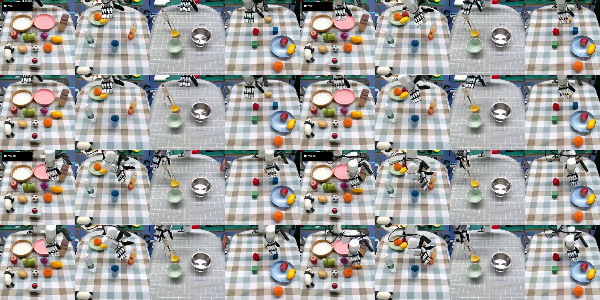
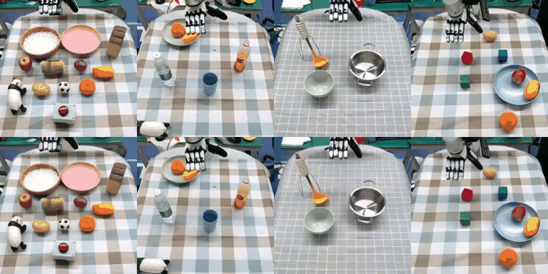

# 怎么读输出视频

目标：看懂 `make_prediction.py` 输出视频里上下两行、左右多列各自表示什么，并分清“预测视频”和“真实执行 rollout”。

## 先分清一件事

`make_prediction.py` 输出的不是机械臂真的执行了一遍任务后的录像，而是：

**模型根据当前画面和文字指令，预测未来视频会怎么发展。**

这一步属于第一阶段视频模型演示，不是第二阶段策略闭环控制。

## 常见输出布局

仓库当前样例输出通常是一个对比视频，常见结构是：

- 横向多列：不同样本
- 纵向两行：
  - 上面：真实未来视频片段
  - 下面：模型预测未来视频片段

如果命令里传了 `--val_idx 0+50+100+150`，那通常就会看到 4 列。

下面这张图展示了一次第一阶段输出的关键帧拼图。可以观察到：

- 每一列对应一个任务样本
- 上半行是真值未来
- 下半行是预测未来

如需查看动态过程，可以参考下面的 gif：

## 上下两行分别是什么

### 上半部分

这是 `Ground Truth`，也就是数据集中真实录下来的未来片段。

### 下半部分

这是 `Prediction`，也就是视频模型根据：

- 当前观测
- 文字指令

“预测”出来的未来画面。

## 为什么下半部分会是清晰视频

因为 `make_prediction.py` 的目标就是展示第一阶段视频预测能力，它会完整运行视频扩散生成过程。

这并不和“VPP 真正控制时不完整生成未来视频”矛盾。二者对应的是不同阶段：

- 演示模式：完整生成未来视频，方便人看
- 控制模式：主要读取中间特征，不要求每次都生成完整视频

## 它是不是仿真环境真的执行动作的录像

不是。

真正“策略输出动作、环境执行 step、再看任务是否成功”的流程在：

- `policy_evaluation/calvin_evaluate.py`

那才属于第二阶段闭环评测。`make_prediction.py` 只是告诉你：

- 视频模型对未来趋势的想象是不是合理

## 怎么判断预测得好不好

第一次观察时，重点看三件事：

1. 机械臂是否朝正确区域运动
2. 目标物体是否有合理的趋势变化
3. 多帧之间是否保持基本时序一致性

不必要求逐像素精确复现。对 VPP 来说，更关键的是：

- 未来动态趋势是否有用

而不是：

- 每一帧是否都和真值长得几乎一样

## 如何解读这一类样例

该示例使用了 4 条 `xhand` 样例，指令分别对应：

1. 移动物体到指定容器
2. 倒液体
3. 勺取液体
4. 堆叠积木

从关键帧和 gif 可以看到，模型已经学到了一些比较明显的趋势：

- 机械臂会朝着目标区域靠近
- 场景的整体拓扑保持稳定
- 物体变化方向大体和任务语义一致

但它并不是逐像素复现真值，这也是正常现象。VPP 第一阶段真正需要的是：

- 对未来动态有用的趋势信息

而不是：

- 完全逼真的视频生成质量

## 为什么这一步值得优先检查

因为它提供了一个非常直接的排障切口。

如果这里的预测已经完全不对，那后面第二阶段动作策略再差，也不能简单归咎于动作头本身。很可能第一阶段视频表征就没有学到对任务有意义的未来感。

## 小结

- `make_prediction.py` 输出的是“真值未来 vs 预测未来”的对比视频。
- 下半部分是 predicted future video，不是 executed rollout video。
- 第一阶段能否预测出合理未来，是第二阶段是否值得继续调的一个先验判断。

## 导航

- 上一节：[怎么跑第一次视频预测](02-run-make-prediction.md)
- 返回上级：[环境准备与第一次视频预测](../02-setup-and-first-prediction.md)
- 下一节：[数据组织与 latent 预处理](../03-data-and-latent-prep.md)
