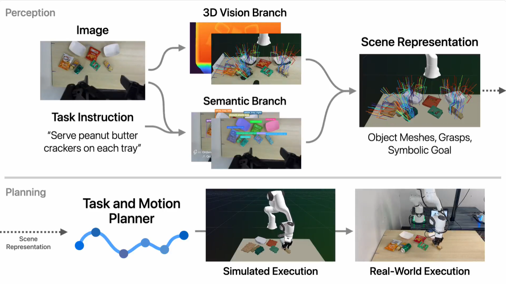
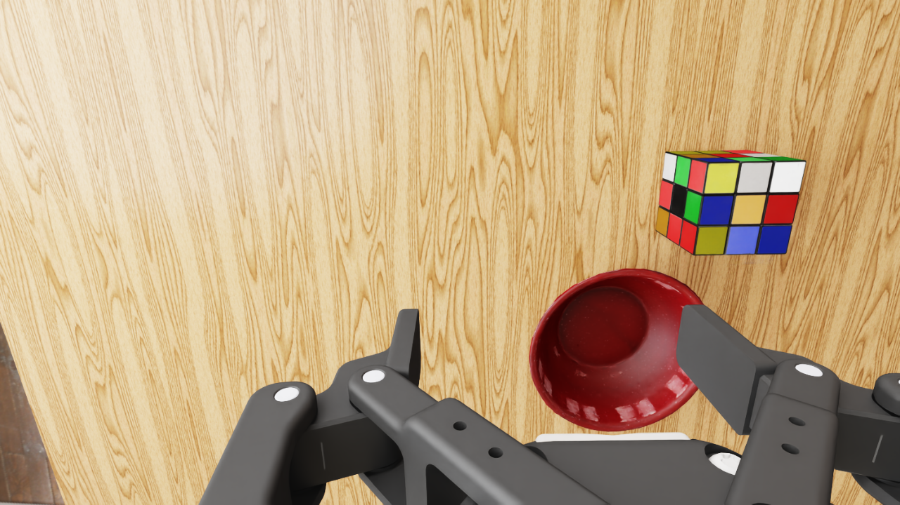
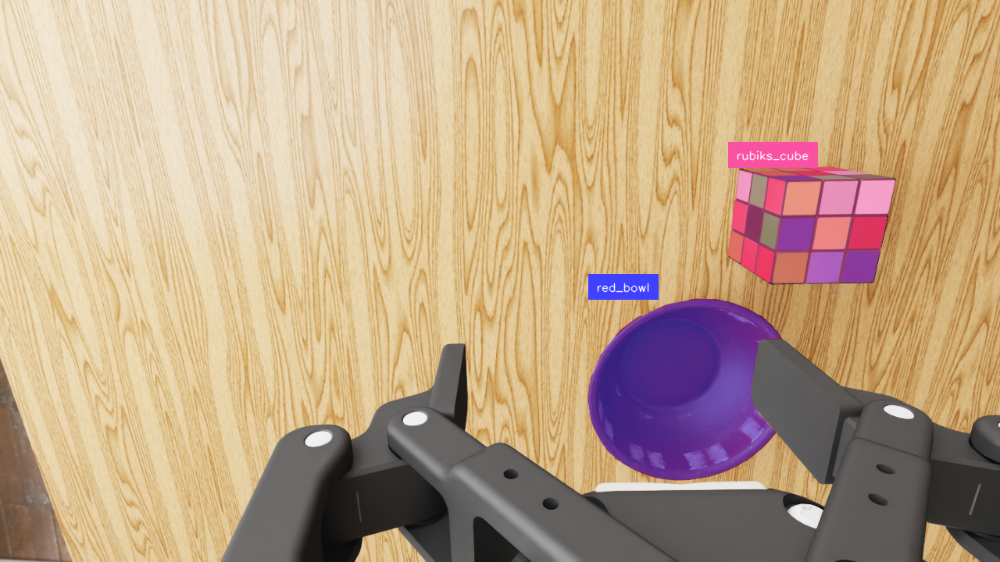

# TiPToP 部署推理案例

> 定位：TiPToP 是**模块化流水线**路线（VLM + 分割 + 抓取检测 + TAMP 拼接），与本组前几节的端到端 VLA 部署互补——读它是为了理解两条路线各自的工程形态。

本小节将介绍 TiPToP 项目：它想解决什么问题，整体流程是什么，如何下载和安装依赖，如何在仿真里按官方流程跑通，最后如何迁移到真机部署。本文重点关注如何把现成的 VLM、分割、抓取检测、任务与运动规划模块接成一条可以执行的机器人操作流水线。

## 项目目的：从图片和语言到机器人操作

TiPToP 的全称是 “TiPToP is a Planner That just works on Pixels”。它的目标是让机器人只依赖图像观测和自然语言任务，就能完成开放词汇的桌面操作。例如用户输入：

```text
put the cube in the bowl
```

系统需要完成这些事情：

```text
1. 看懂桌面上有哪些和任务相关的物体。
2. 把自然语言目标翻译成可规划的符号目标。
3. 从图像和深度中恢复物体的 3D 位置和几何形状。
4. 找到合适的抓取姿态。
5. 规划机械臂从当前姿态到抓取、移动、放置的轨迹。
6. 在仿真或真机中执行轨迹，并保存日志和视频。
```

它和端到端 VLA 的区别在于：TiPToP 不训练一个新的大模型直接输出动作，而是把感知模型、抓取模型和规划器组合起来。这样做的好处是中间结果清楚，失败时可以定位是感知错了、抓取错了、规划错了，还是执行时物体滑动了。

<figure>
  
  <figcaption>图 1：TiPToP 从感知、规划到执行的整体流程。</figcaption>
</figure>

## 整体流程

TiPToP 的部署推理流程可以概括成三段：

```text
图像和语言输入
  -> Perception：识别物体、分割物体、恢复 3D 场景、预测候选抓取
  -> Planning：把语言目标和 3D 场景送入 cuTAMP / cuRobo 生成轨迹
  -> Execution：在仿真 replay 或真机控制器中执行轨迹
```

更具体地说，每个模块负责的事情如下：

| 模块 | 作用 | 输出给谁 |
|---|---|---|
| Gemini API | 根据 RGB 图像和任务指令识别物体 bbox，并生成语言目标 grounding | SAM2 和规划器 |
| SAM2 | 根据 bbox 生成物体 segmentation mask | 3D 场景重建 |
| FoundationStereo 或仿真 depth | 生成深度图 | 点云反投影 |
| M2T2 | 从点云里预测 6-DoF grasp candidates | cuTAMP |
| cuTAMP | 同时做任务规划和运动规划的约束搜索 | cuRobo / 执行接口 |
| cuRobo | 生成连续、无碰撞、带时间参数的机械臂轨迹 | replay 或真机控制器 |
| IsaacLab replay / Bamboo controller | 执行规划轨迹 | 视频、日志、success/failure |

这里体现了部署推理的核心思想：模型不是孤立运行的。Gemini 的输出要能被 SAM2 使用，SAM2 的 mask 要能切出点云，点云要能给 M2T2 找抓取，抓取和目标谓词要能被 cuTAMP 使用，最后轨迹还要能被仿真或真机执行。

## TiPToP 官方目录框架

按 TiPToP 官方 GitHub 页面，主仓库是部署和运行系统的入口，核心目录可以这样理解：

| 目录或文件 | 作用 |
|---|---|
| `tiptop/` | TiPToP 的核心 Python 包，包含感知封装、配置、规划调用、执行入口、H5 离线模式等代码 |
| `docs/` | Read the Docs 文档源码，安装、配置、仿真、命令说明都从这里组织 |
| `install/` | 安装脚本和外部依赖准备脚本，例如规划器、相关模型或系统组件的安装辅助 |
| `tests/` | 项目测试，检查关键模块是否能正常导入和运行 |
| `README.md` | 项目入口说明，介绍 TiPToP 的目标、安装入口和文档链接 |
| `pixi.toml` / `pixi.lock` | Pixi 环境配置，定义 TiPToP 的 Python 环境、依赖和常用命令 |

这个目录结构也说明了 TiPToP 的定位：它不是单独一个模型 checkpoint，而是一个把感知、规划和执行串起来的系统工程仓库。

## 下载项目

建议把 TiPToP 相关仓库统一放到一个目录，例如：

```bash
export TIPTOP_DIR=/data/yuyufei/tiptop_stack
mkdir -p "$TIPTOP_DIR"
```

下载 TiPToP 主仓库：

```bash
cd "$TIPTOP_DIR"
git clone https://github.com/tiptop-robot/tiptop.git
cd tiptop
```

如果要做官方仿真，还会用到 `droid-sim-evals` 仓库。这个仓库负责 IsaacLab/DROID 仿真环境、USD 场景加载、H5 观测保存和轨迹 replay：

```bash
cd "$TIPTOP_DIR"
git clone https://github.com/tiptop-robot/droid-sim-evals.git
cd droid-sim-evals
uv sync
```

这里的 `uv sync` 用来准备 droid-sim-evals 自己的 Python 环境。后面运行 `save_h5_obs.py` 和 `replay_json_traj.py` 时，都会在这个仓库里通过 `uv run` 启动。

TiPToP 使用 `pixi` 管理 Python 环境和依赖。进入主仓库后安装：

```bash
cd "$TIPTOP_DIR/tiptop"
pixi install
```

安装 cuTAMP 和 cuRobo 相关规划依赖：

```bash
pixi run setup-planners
```

安装后先做两个最小检查：

```bash
pixi run cutamp-demo --motion_plan
pixi run tiptop-run -h
```

第一个命令用来确认 cuTAMP / cuRobo 规划器可用，第二个命令用来确认 TiPToP 主入口可以正常启动。

## 需要安装和启动的依赖

TiPToP 的运行依赖不只是一个 Python 包。它需要多个模型服务和规划库一起工作。

### Gemini API

Gemini 用来做开放词汇物体识别和语言目标 grounding。官方流程需要设置 API key：

```bash
export GOOGLE_API_KEY="<your-gemini-api-key>"
```

这里 Gemini 不是直接输出机器人动作，而是输出 bbox、label 和目标关系。例如，检测出图片中的物体同时描述任务：

```json
{
  "bboxes": [
    {"box_2d": [120, 310, 410, 560], "label": "cube"},
    {"box_2d": [430, 600, 760, 900], "label": "bowl"}
  ],
  "predicates": [
    {"name": "on", "args": ["cube", "bowl"]}
  ]
}
```

这些结果会被后续分割和规划模块使用。

### M2T2 抓取服务

M2T2 负责从场景点云中预测候选抓取姿态。

```bash
cd "$TIPTOP_DIR"
git clone https://github.com/williamshen-nz/M2T2.git
cd M2T2

pixi run setup
pixi run download-weights
pixi run server
```

默认端口是 `8123`。在运行 `tiptop-h5` 之前，可以让这个服务保持在一个单独终端里运行。

### FoundationStereo 深度服务

FoundationStereo 负责从双目图像估计深度。

```bash
cd "$TIPTOP_DIR"
git clone https://github.com/williamshen-nz/FoundationStereo.git
cd FoundationStereo

pixi run setup
pixi run download-checkpoints
pixi run server
```

默认端口是 `1234`。Offline H5 mode 通常直接读取 H5 里的仿真 depth，因此这条仿真路径一般不用提前启动 FoundationStereo；如果是真机 stereo camera 流程，才会用到它或者真实相机提供的深度。

### SAM2 分割

SAM2 用来把 Gemini 给出的 bbox 变成物体 mask。bbox 只是矩形框，mask 才能告诉系统哪些像素真正属于目标物体。TiPToP 主环境会调用 SAM2 相关接口，运行时要确认权重和环境已经按项目文档准备好。

## droid-sim-evals 官方目录框架

如果要在仿真里跑 TiPToP，需要使用官方 `droid-sim-evals` 仓库。按官方 GitHub 页面，它的主要目录和文件可以这样理解：

| 目录或文件 | 作用 |
|---|---|
| `src/` | DROID 仿真环境、任务注册、环境配置、相机观测和 replay 相关核心代码 |
| `docs/` | droid-sim-evals 的文档和说明材料 |
| `tiptop_assets/` | TiPToP 仿真示例使用的观测或资源位置，官方 H5 示例也放在这个路径下 |
| `save_h5_obs.py` | 从指定 `scene` 和 `variant` 保存一帧 H5 初始观测 |
| `replay_json_traj.py` | 读取 TiPToP 生成的 `tiptop_plan.json`，在 IsaacLab/DROID 场景里 replay |
| `tiptop_eval.py` | websocket server mode 的仿真评测入口，用于连接 TiPToP server 跑在线评测 |
| `pyproject.toml` / `uv.lock` | 使用 `uv` 管理 droid-sim-evals 的 Python 环境和依赖 |
| `README.md` | 仓库入口说明，介绍场景、资产下载和运行方式 |

仿真资产不是只靠代码仓库就能跑起来，还需要下载官方 sim assets。资产解压后会提供 scene/variant 对应的 USD 场景和相关资源，IsaacLab 才能真正加载桌面、物体和机器人。

## 官方仿真资产

官方仿真还需要下载 assets。文档给出的方式是进入 `droid-sim-evals` 后下载并解压官方资产包：

```bash
cd "$TIPTOP_DIR/droid-sim-evals"
curl -O https://storage.googleapis.com/rail-tpus-datasets-ikea-manip/tiptop-sim-assets.zip
unzip tiptop-sim-assets.zip
```

这些 assets 包含仿真使用的 USD 场景和物体资源。这里的资产有5中不同的场景，每个场景有10中不同的variant。有了这部分资产，IsaacLab 才能加载对应的 scene/variant。

这里有一个容易忽略的细节：H5 和 USD 场景最好保持一致。`tiptop_assets/` 里可能已经带有官方示例 H5，例如 `tiptop_scene1_obs.h5`。这个 H5 可以用来快速测试 `tiptop-h5` 是否能读入观测并做 planning，但它不一定是从你本地刚解压的 `assets/scene1_0.usd` 生成的。如果用这个自带 H5 做 planning，再用本地 `scene 1 variant 0` 去 replay，就可能出现“感知图像里的物体位置”和“视频第一帧里的物体位置”对不上的问题。

所以在做仿真复现实验时，更稳妥的方式是：先解压 assets，然后用当前本地 assets 里的 USD 场景重新生成 H5，并把文件名写清楚 scene 和 variant，例如：

```text
tiptop_scene1_0_local_obs.h5
```

这样后续 `tiptop-h5` 和 `replay_json_traj.py --scene 1 --variant 0` 使用的是同一份本地场景资产，感知、规划和 replay 才能对齐。

## 如果做仿真：从 USD 场景到视频

仿真流程适合作为第一次跑通 TiPToP 的路径，因为它不需要真实机械臂，也方便保存视频和中间结果。官方文档给了两种仿真方式：

- Websocket server mode：启动 TiPToP server，再由 droid-sim-evals 连接 server 在线评测。
- Offline H5 mode：先保存一帧 H5 观测，再用 `tiptop-h5` 离线做感知和规划，最后 replay 生成视频。

部署推理入门更推荐先看 Offline H5 mode，因为它把输入、规划结果和执行视频都落成文件，适合检查。

## 仿真前可以先确认的服务

Offline H5 mode 里，提前保持运行的服务主要是 M2T2。Gemini API 通过环境变量配置，不需要单独启动本地服务；SAM2 在 TiPToP 进程内部被调用；FoundationStereo 通常只在真机 stereo camera 流程中使用，读取仿真 H5 时一般用不到。

一个比较清晰的运行方式是打开两个终端。第一个终端启动 M2T2：

```bash
cd "$TIPTOP_DIR/M2T2"
pixi run server
```

看到服务在 `8123` 端口监听后，可以让这个终端保持运行。第二个终端再进行 H5 生成、`tiptop-h5` planning 和 replay。Gemini API key 可以在第二个终端里设置：

```bash
export GOOGLE_API_KEY="<your-gemini-api-key>"
```

如果使用的是 API 中转服务，可以在本地适配层里把 base URL 和代理配置好；从 TiPToP 的流程角度看，它仍然承担 Gemini 这一环的开放词汇感知功能。

## 仿真里的 USD 和 H5 是什么

在 TiPToP 的仿真流程里，USD 和 H5 是两个很容易混淆、但职责完全不同的文件类型。可以先用一句话区分它们：USD 描述完整仿真世界，H5 保存机器人相机在这个世界里看到的一帧初始观测。

USD 文件可以理解为 IsaacLab/DROID 里的场景文件。它记录桌面、背景、灯光、机器人、物体资产、物体初始摆放，以及材质、尺寸、碰撞和渲染相关配置。在 `droid-sim-evals` 中，`scene` 和 `variant` 会对应具体的仿真任务配置和资产。例如运行：

```bash
--scene 1 --variant 0
```

就是告诉 IsaacLab 加载第 1 类场景的第 0 个变体。TiPToP 的 H5 生成和 replay 最好使用同一个 scene/variant，这样感知看到的初始图像和 replay 时加载的物体位置更容易保持一致。

H5 则不是训练数据集、视频，也不是 USD 场景本身。它是从某个 USD/scene 初始化出来的仿真环境中，用 wrist camera 保存下来的一帧 observation package，用来让 TiPToP 离线重跑 perception 和 planning。二者的关系可以理解为：

```text
USD / IsaacLab scene config：保存完整仿真世界
H5：从这个仿真世界中，用 wrist camera 采集到的一帧观测
```

官方 `save_h5_obs.py` 会从 DROID 环境保存这些字段：

| 字段 | 含义 | 后续用途 |
|---|---|---|
| `rgb` | wrist camera 拍到的 RGB 图像 | 输入 Gemini 做物体检测和任务 grounding，也输入 SAM2 做分割 |
| `depth` | wrist camera 对齐后的深度图 | 反投影成 3D 点云，供 M2T2 和场景重建使用 |
| `intrinsic_matrix` | wrist camera 相机内参矩阵 | 把 depth 像素转换成相机坐标系下的 3D 点 |
| `pos_w` | wrist camera 在世界坐标系中的位置 | 构造 `world_from_cam`，把相机点云变换到世界坐标系 |
| `quat_w_ros` | wrist camera 在世界坐标系中的姿态四元数，格式是 `[w, x, y, z]` | 和 `pos_w` 一起恢复相机外参 |
| `q_init` | 机器人手臂初始关节角 | 作为规划起点，也用于 replay 时还原机器人初始姿态 |

`tiptop-h5` 读取 H5 后，会构造类似真机运行时的观测对象：

```text
Frame(rgb, depth, intrinsics)
world_from_cam
q_init
```

所以 H5 的意义是：把仿真中的“相机看到什么、相机在哪里、机器人当前关节是什么”固定下来。后续 TiPToP 不需要重新打开 GUI，也能用这份观测做感知和规划。

<figure>
  
  <figcaption>图 2：scene 1 variant 0 的 H5 中 RGB 图片。</figcaption>
</figure>

## 官方仿真方式：Offline H5 mode

Offline H5 mode 是最适合初学者检查的方式。官方流程分成三部分。

### 第一步：生成 H5

```bash
cd "$TIPTOP_DIR/droid-sim-evals"
uv run save_h5_obs.py \
  --scene 1 \
  --variant 0 \
  --output tiptop_assets/tiptop_scene1_0_local_obs.h5
```

这一步会产生一个 H5 文件：

```text
$TIPTOP_DIR/droid-sim-evals/tiptop_assets/tiptop_scene1_0_local_obs.h5
```

它保存的是 scene 1 variant 0 的初始 RGB-D 观测、相机参数和机器人初始关节。这个文件是后续 `tiptop-h5` 的输入。

这里重新生成的 H5 更适合作为后续 planning 的输入。一个简单的对应关系是：H5 是由哪个 scene/variant 的 USD 生成的，replay 时就继续加载同一个 scene/variant。

### 第二步：运行 TiPToP 感知和规划

```bash
cd "$TIPTOP_DIR/tiptop"
pixi run tiptop-h5 \
  --h5-path "$TIPTOP_DIR/droid-sim-evals/tiptop_assets/tiptop_scene1_0_local_obs.h5" \
  --task-instruction "put the cube in the bowl" \
  --output-dir "$TIPTOP_DIR/droid-sim-evals/tiptop_outputs"
```

这一步会在 `--output-dir` 下创建一个带时间戳的运行目录，例如：

```text
$TIPTOP_DIR/droid-sim-evals/tiptop_outputs/<timestamp>/
```

里面通常会产生这些文件或目录：

| 输出 | 说明 |
|---|---|
| `tiptop_run.log` | TiPToP 本次运行日志，记录 perception、planning 和失败原因 |
| `metadata.json` | 本次任务、相机位姿、初始关节、planning success、耗时等元信息 |
| `tiptop_plan.json` | 如果规划成功，保存最终可 replay 的轨迹和夹爪命令 |
| perception 可视化或中间文件 | 包括 RGB、bbox、mask、点云、grasp 等调试证据，具体文件名随版本可能变化 |
| `cutamp/` | cuTAMP 规划过程相关输出，用于检查规划器搜索和优化结果 |

这一步内部会完成：读取 H5、调用 Gemini、调用 SAM2、构建点云和物体 mesh、向已经启动的 M2T2 服务请求抓取候选、运行 cuTAMP/cuRobo，最后保存 `tiptop_plan.json`。

```json
{
  "version": "1.0.0",
  "q_init": [
    ...
  ],
  "steps": [
    {
      "type": "trajectory",
      "label": "Pick(rubiks_cube, grasp1, q1)",
      "positions": [
        ...
```

<figure>
  <div style="display:grid;grid-template-columns:repeat(auto-fit,minmax(260px,1fr));gap:16px;align-items:start;">
    <figure style="margin:0;">
      
      <figcaption>图 3：Gemini 框出任务相关物体的 bbox。</figcaption>
    </figure>
    <figure style="margin:0;">
      
      <figcaption>图 4：SAM2 根据 bbox 生成的物体 mask。</figcaption>
    </figure>
  </div>
</figure>

### 第三步：replay 生成仿真结果

```bash
cd "$TIPTOP_DIR/droid-sim-evals"
uv run replay_json_traj.py \
  --json-path "$TIPTOP_DIR/droid-sim-evals/tiptop_outputs/<timestamp>/tiptop_plan.json" \
  --scene 1 \
  --variant 0
```

这一步会重新加载同一个 `scene 1 variant 0`，读取 `tiptop_plan.json` 并执行轨迹。它产生的是仿真执行结果：控制台日志和 replay 视频。视频输出目录由 droid-sim-evals 的运行配置决定，通常会在仓库的运行输出目录下按日期和时间组织。

检查视频时建议看三个阶段：

1. 接近阶段：机械臂是否朝目标物体移动。
2. 抓取阶段：夹爪是否夹住正确物体。
3. 放置阶段：物体是否被放到目标位置。

规划成功不等于任务一定完成。因为 replay 是物理仿真，物体可能滑动、碰撞或抓取失败。视频是最终判断部署推理是否成功的重要证据。

<figure>
  <video controls width="720" style="max-width:100%;display:block;margin:0 auto;border-radius:6px;">
    <source src="videos/tiptop-replay.mp4" type="video/mp4">
    当前浏览器不支持 video 标签。
  </video>
  <figcaption>视频 1：TiPToP 在 IsaacLab/DROID 仿真中 replay 生成的抓取过程。</figcaption>
</figure>


## 部署真机

真机部署的核心方法和仿真相同，区别是输入和执行接口变了。

仿真里：

```text
H5 提供 rgb / depth / intrinsics / camera pose / q_init
replay_json_traj.py 执行 tiptop_plan.json
```

真机里：

```text
真实 wrist camera 提供 rgb / depth 或 stereo 图像
机器人状态接口提供 q_init
手眼标定和正运动学提供 world_from_cam
Bamboo controller 或机器人控制器执行规划轨迹
```

也就是说，真机部署不是换掉 TiPToP 的 perception 和 planning，而是把“离线 H5 观测”替换为“实时相机和机器人状态”，把“仿真 replay”替换为“真实控制器执行”。

## 真机步骤一：配置相机、机器人和服务地址

进入 TiPToP 主仓库：

```bash
cd "$TIPTOP_DIR/tiptop"
pixi shell
tiptop-config
```

需要配置的内容包括：

- 机器人类型和控制器地址。
- wrist camera / external camera 设备信息。
- 相机内参和手眼标定。
- M2T2 server URL。
- FoundationStereo server URL。
- 输出目录、日志和可视化设置。

真机部署中比较容易出问题的是坐标系。RGB、depth、相机内参、相机外参、机器人 base frame、夹爪 frame 最好保持一致，否则可能出现感知看起来正确，但规划轨迹落在错误位置的情况。

## 真机步骤二：dry run，只规划不执行

第一次上真机时，可以先从只规划不执行的 dry run 开始：

```bash
tiptop-run --cutamp-visualize --no-execute-plan
```

这一步会读取真实相机和真实机器人状态，调用 Gemini、SAM2、M2T2、cuTAMP 和 cuRobo，但不会把轨迹发给机器人。

需要重点检查：

- Gemini 是否框到正确物体。
- SAM2 mask 是否干净。
- 物体点云和 mesh 是否贴合真实物体。
- M2T2 抓取是否落在可抓区域。
- cuTAMP 是否找到合理计划。
- cuRobo 轨迹是否穿过障碍或超出工作空间。


## 真机步骤三：执行任务

确认 dry run 合理后，再执行：

```bash
tiptop-run
```

如果需要保存外部相机视频：

```bash
tiptop-run --enable-recording
```

执行前可以先确认：

- 急停可用。
- 工作空间内没有无关障碍物。
- 物体摆放和相机图像一致。
- 控制器状态正常。
- 机器人速度和力矩限制合理。

TiPToP 当前执行主要是 open-loop。也就是说，一旦开始执行，系统不会每一步重新观察和重规划。如果物体被碰偏或抓取滑动，后续动作仍会继续执行。因此真机部署比仿真更依赖安全边界、人工监控和完整日志。

## 仿真和真机的对应关系

| 环节 | 仿真模拟 | 真机部署 |
|---|---|---|
| 场景来源 | IsaacLab / DROID scene + USD assets | 真实桌面和真实物体 |
| 观测来源 | H5 中的 `rgb`、`depth`、相机参数 | wrist camera / RGB-D camera / stereo camera |
| 机器人状态 | H5 中的 `q_init` | 机器人实时 joint state |
| 相机位姿 | H5 中的 `pos_w` 和 `quat_w_ros` | 手眼标定和机器人正运动学 |
| 感知模型 | Gemini、SAM2、M2T2 | Gemini、SAM2、M2T2 |
| 规划器 | cuTAMP、cuRobo | cuTAMP、cuRobo |
| 执行方式 | `replay_json_traj.py` 回放轨迹 | Bamboo controller / joint impedance controller |
| 结果证据 | replay MP4、log、JSON | 外部相机视频、log、JSON、人工 success/failure 标注 |

这个表说明：仿真和真机不是两套完全不同的方法。TiPToP 的核心 perception 和 planning 是共用的，差别主要在观测接口和执行接口。


## 小结

TiPToP 是一个很适合学习部署推理的项目，因为它把具身智能系统拆成了清楚的模块：Gemini 负责语言和开放词汇识别，SAM2 负责分割，depth 和相机参数负责恢复 3D 场景，M2T2 负责抓取候选，cuTAMP/cuRobo 负责规划，最后由仿真 replay 或真机控制器执行。

如果从零开始，一个比较自然的顺序是：先下载项目并安装依赖，再配置 Gemini API，并按运行模式启动 M2T2 或必要的深度服务；如果做仿真，可以先准备 `droid-sim-evals` 和官方 USD assets，生成 H5，运行 `tiptop-h5`，最后 replay 成视频；如果做真机，则把 H5 输入换成真实相机和机器人状态，把 replay 换成真实控制器执行。这样就能从一个可复现的仿真流程，逐步过渡到真实机器人部署。

## References

- TiPToP project website: https://tiptop-robot.github.io/
- TiPToP documentation: https://tiptop-robot.readthedocs.io/en/latest/
- TiPToP installation: https://tiptop-robot.readthedocs.io/en/latest/installation/
- TiPToP simulation guide: https://tiptop-robot.readthedocs.io/en/latest/simulation/
- TiPToP command reference: https://tiptop-robot.readthedocs.io/en/latest/command-reference/
- TiPToP GitHub: https://github.com/tiptop-robot/tiptop
- droid-sim-evals GitHub: https://github.com/tiptop-robot/droid-sim-evals
