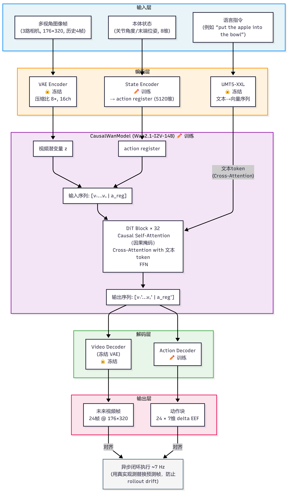
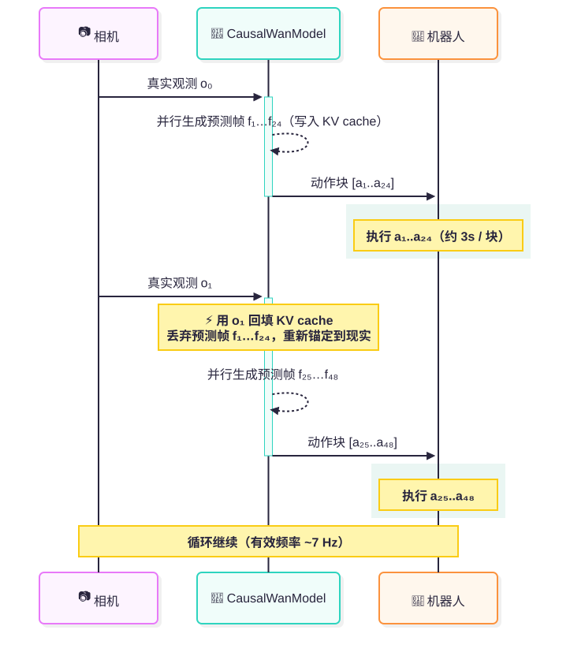

# 8.5.2.1 DreamZero模型原理

难度：**[高级]** | 预计用时：40分钟    
先修：[World Action Model](../02-world-action-models.md) → [动作 Token 化方法对比](../14-action-tokenization.md)

> DreamZero 可以想成"会一边拍未来短片、一边给出动作块"的机器人策略。普通 VLA 常从当前图像和语言直接输出动作；DreamZero 先让同一个模型生成动作后的未来画面，再让动作和画面在时间上对齐。这个未来画面不是给人看的宣传视频，而是给策略用的动作后果锚点。

## 学习目标

读完本页后，你应该能：

- 用一句话解释 DreamZero 和普通 VLA 的本质区别
- 画出 DreamZero 从输入到输出的完整数据流，并说清楚 action register 的作用

动手复现请移步 [DreamZero复现](./02-dreamzero-reproduction.md)。

## 一、为什么需要 DreamZero？

### 普通 VLA 的瓶颈

普通 VLA（如 $\pi_0$、Octo）的训练范式是：

```
当前图像 + 语言指令  ——→  神经网络  ——→  动作
```

这里的监督信号只有**专家动作标注**。模型学的是"专家在此刻会怎么动"，却从不学"动了之后世界会发生什么"。这带来两个核心问题：

| 问题 | 表现 |
|---|---|
| **物理动态盲区** | 模型不知道抓起苹果后苹果会跟着夹爪移动，泛化到新物体时容易失败 |
| **泛化瓶颈** | 对没见过的物体、场景，语义先验不足以产生正确动作，成功率骤降 |

### DreamZero 的回答

DreamZero 的核心思路是：

> **让模型同时预测"未来画面"和"动作块"，用视频动态作为物理监督信号。**

直觉上：如果模型能准确想象出"执行这个动作后，碗里会多一个苹果"，那它对动作的理解就不再停留在"行为克隆"，而是真正理解了物理因果。

实验结果验证了这一思路：DreamZero 在零样本泛化任务上比最强 VLA 基线高出 **2.2 倍**（62.2% vs 27.4%），在完全未见过的任务上达到 39.5%，而 VLA 基线不到 1%。

### 和普通 VLA 的完整对比

| 维度 | 普通 VLA | DreamZero / WAM |
|---|---|---|
| 主要输出 | action 或 action token | future video + action chunk |
| 监督信号 | 专家动作为主 | 视频动态 + 动作对齐 |
| 泛化来源 | VLM 语义先验和机器人数据 | 视频模型的时空先验 + 机器人动作数据 |
| 主要风险 | 语义会了但动作不会 | 视频像但动作错、推理慢、动作接口不匹配 |

## 二、模型原理深度解析

### 2.1 整体架构



图2.1 DreamZero 整体数据流。🔒 表示训练时冻结，✏️ 表示参与训练。


### 2.2 核心组件详解

**背景概念：DiT（Diffusion Transformer）**

DiT 是把扩散模型的噪声预测骨干从 U-Net 换成 Transformer 的架构，由 Peebles & Xie（2023）提出。核心思路是：把图像或视频的潜变量切成小块（patch），展平成 token 序列，送进标准 Transformer block（Self-Attention + FFN）处理，最终预测"去噪方向"或 Flow Matching 的速度场。

| 对比维度 | 传统 U-Net 扩散 | DiT |
|---|---|---|
| 骨干结构 | 卷积 + 跳跃连接 | Transformer block |
| 全局感受野 | 依靠多层卷积逐步扩大 | 每层 Self-Attention 直接全局 |
| 规模扩展 | 参数量增长困难 | 无缝扩展到十亿级（scaling law 适用）|
| 条件注入 | AdaLN、拼接等 | Cross-Attention（文本、时间步等）|

**为什么视频生成模型用 DiT？**   
视频有时间维度，帧间依赖是长程的。Self-Attention 天然能让任意两帧的 token 互相感知，而卷积的感受野有限。Wan2.1、Sora 等现代视频扩散模型都以 DiT 为骨干。

> 如果你已读过 [扩散策略](../../02-behavior-cloning/02-diffusion-policy.md) 并了解 Transformer 注意力机制，DiT block 不会陌生——它本质上就是"以 Transformer 为去噪网络的扩散模型"。

#### 组件 1：VAE（变分自编码器）

- **作用**：把高分辨率图像（176×320）压缩成低维潜变量，大幅降低 DiT 的计算量
- **来自**：Wan2.1 原配，**训练时冻结**，不更新参数
- **压缩比**：空间 8×，通道 16 维
- **类比**：就像把照片压缩成 JPEG，但用神经网络做，保留对物理动态最重要的信息

#### 组件 2：UMT5-XXL 文本编码器

- **作用**：把语言指令（如 "put the apple into the bowl"）编码成向量序列
- **来自**：Google 预训练，**训练时冻结**
- **提示**：这和 CLIP 文本编码器是同一类东西，但参数更多，对细粒度动作描述理解更好

#### 组件 3：State Encoder（状态编码器）

- **作用**：把机器人本体状态（关节角度、末端位姿，约 8 维）编码成 action register 向量
- **训练时更新**：这是 DreamZero 在 Wan2.1 基础上新增的模块
- **尺寸**：每个时间步一个 register 向量，维度与 DiT hidden size 对齐（5120 维）

> **action register 是什么？**   
> 借鉴了 Transformer 里"寄存器 token"的思想：在输入序列末尾追加一个特殊 token，而不修改现有视频 token 的计算路径。它在每层 Self-Attention 中自由"吸收"所有视频 token 的信息。State Encoder 把本体状态映射成它的初始值；经过 32 层 DiT block 后，这个 register 已聚合了完整的视频动态与文本指令；最后由 Action Decoder 从中读出具体动作向量。  
> **关键优势**
> 视频生成和动作生成共享同一组参数、联合训练，信息天然对齐，不需要额外的"视频→动作"转换模块。

#### 组件 4：CausalWanModel（核心 DiT 骨干）

这是 DreamZero 最关键的改造。原始 Wan2.1 的 DiT block 只处理视频 token，DreamZero 在每个 block 的 token 序列末尾拼接了 **action register**：



图 2.2 DiT Block 改造对比。左：原始 Wan2.1 只处理视频 token；右：DreamZero 在序列末尾追加 `a_reg`，经因果注意力和文本条件后，`a_reg'` 已融合视频物理动态。

经过 32 层 DiT block 后，action register 已充分融合视频的物理动态信息，再通过 **Action Decoder** 解码出具体动作。

**因果掩码的意义**：确保预测第 t 步动作时，模型只能看到 t 步及之前的视频帧，不能"偷看"未来。这使得推理时可以做到真正的在线闭环。

#### 组件 5：联合去噪目标（Flow Matching）

训练时，DreamZero 同时对视频和动作两个通道做去噪：  
下面是简化版的 DreamZero 的训练损失的伪代码
```python
def train_step(batch):
    z_video = vae.encode(batch["frames"])    # 视频潜变量
    a = batch["actions"]                      # 动作 chunk，形状 [24, 7]

    t = torch.rand(B)                         # 随机采样噪声时间步 t ∈ [0,1]

    # Flow matching 插值：在干净数据和噪声之间插值
    z_noisy = (1 - t) * z_video + t * torch.randn_like(z_video)
    a_noisy = (1 - t) * a       + t * torch.randn_like(a)

    # 模型预测"速度场"（从噪声指向干净数据的方向）
    v_video_pred, v_action_pred = model(
        z_noisy, a_noisy,
        text_tokens=batch["text"],
        state=batch["state"],
        timestep=t
    )

    # 损失 = 视频预测误差 + 动作预测误差
    loss = F.mse_loss(v_video_pred, z_video - torch.randn_like(z_video)) + \
           F.mse_loss(v_action_pred, a       - torch.randn_like(a))
    return loss
```

**关键约束**：视频 horizon 和动作 horizon **必须相等**（均为 24 步）。训练时视频和动作共享同一个噪声时间步 t。

### 2.3 推理时的闭环控制

这里有一个容易被初学者忽视的细节：**DreamZero 在闭环执行时，用真实相机观测替换预测帧，而不是拿自己生成的视频继续推理。**



图 2.3 DreamZero 闭环控制时序。每轮模型同步输出动作块与预测帧；机器人执行完成后，用真实相机观测回填 KV cache，丢弃预测帧，将下一轮预测锚定到现实，防止 rollout drift。

**为什么这很重要？** 如果用自己生成的视频继续预测，误差会随时间累积（rollout drift）。用真实观测回填，每轮预测都重新锚定到现实，误差不会积累。

> **rollout drift（轨迹漂移）**：自回归模型若把自己预测的输出当作下一步输入，每步的微小预测误差会逐轮叠加、指数级恶化。在语言模型里表现为"幻觉积累"，在视频生成里表现为"时序画面失真"，在机器人策略里后果尤其严重——偏离的状态估计会直接产生错误动作，且随时间越差越远。DreamZero 的解法是每轮用真实相机帧替换 KV cache 中的预测帧，强制将下一轮推理重新锚定到真实世界状态。

### 2.4 关键性能数字

| 指标 | 值 |
|---|---|
| 模型参数量 | 14B |
| 推理延迟（H100） | ~3 秒 / 动作块（有效控制频率 ~7 Hz） |
| 推理延迟（GB200） | ~0.6 秒 / 动作块 |
| 推理加速比（相比原始模型） | 38× |
| 零样本泛化（已见任务） | 62.2% vs VLA 基线 27.4% |
| 零样本泛化（未见任务） | 39.5% vs VLA 基线 <1% |
| 跨本体迁移相对提升 | +42%（仅用视频演示，10–20 分钟数据） |
| 视频 / 动作 horizon | 24 步 |
| 训练步数（DROID） | 100,000 步 |


## 三、代码框架解析

### 3.1 仓库结构

```
dreamzero/
│
├── groot/                           ← 核心模型和训练代码
│   └── vla/
│       ├── models/
│       │   ├── causal_wan.py        ← CausalWanModel：DreamZero 骨干（★ 核心）
│       │   ├── action_decoder.py    ← 从 action register 解码动作
│       │   └── state_encoder.py     ← 编码本体状态为 register
│       ├── data/
│       │   ├── schema/
│       │   │   └── embodiment_tags.py  ← 机器人本体类型枚举
│       │   └── dataset.py           ← GEAR 格式数据集加载
│       └── configs/
│           ├── train/               ← Hydra 训练配置 YAML
│           └── data/dreamzero/      ← 各机器人的数据配置
│
├── scripts/
│   ├── train/
│   │   ├── droid_training.sh        ← DROID 数据集训练脚本（★ 关键）
│   │   └── droid_training_wan22.sh  ← 5B 小模型训练脚本（显存不足时用）
│   └── data/
│       └── convert_lerobot_to_gear.py  ← 数据格式转换
│
├── docs/
│   ├── WAN22_BACKBONE.md            ← 骨干架构详细说明
│   └── DATASET_TO_GEAR_AND_TRAIN.md ← 数据准备和训练指南
│
├── eval_utils/                      ← 评估工具
│
├── socket_test_optimized_AR.py      ← 推理 WebSocket 服务端（★ 关键）
├── test_client_AR.py                ← 推理测试客户端（★ 关键）
└── pyproject.toml                   ← 项目依赖定义
```

### 3.2 关键文件说明

**`groot/vla/models/causal_wan.py`**

DreamZero 的核心改造在这里。它在 Wan2.1 的每个 DiT block 中注入 action register，实现视频和动作的联合建模。关键配置：
- `action_dim`：动作维度（DROID 为 7 = x/y/z/rx/ry/rz/gripper）
- `state_dim`：本体状态维度（DROID 为 8）
- `video_horizon`：视频预测步数（24）

**`socket_test_optimized_AR.py`**

推理服务端，核心功能：
- 加载 DreamZero 权重和 Wan2.1 骨干，分布到多张 GPU
- 启动 WebSocket 服务器，监听机器人端发来的观测数据
- 调用 `CausalWanModel.generate()` 进行自回归推理
- `--enable-dit-cache` 开启 DiT KV cache，推理速度约提升 5×

**`test_client_AR.py`**

模拟机器人端的测试客户端，发送假的图像+状态数据给服务端，验证推理流程是否通畅，不需要真实机器人即可测试。

**`scripts/train/droid_training.sh`**

DROID 训练脚本，核心参数通过环境变量传入。它内部调用 `torchrun` 启动分布式训练：
- 冻结：VAE、text encoder、image encoder
- 训练：32 层 DiT blocks、state encoder、action encoder、action decoder

---

## 四、最小数据规范

下面的代码把 WAM 样本最容易出错的地方先写清楚：未来视频 horizon 必须和动作 horizon 对齐。

```python
# 检查 WAM 样本里的视频 horizon 和动作 horizon 是否对齐
sample = {
    "instruction": "put the apple into the bowl",
    "history_frames": 4,
    "camera_views": ["exterior_1", "exterior_2", "wrist"],
    "future_video_shape": [24, 3, 176, 320, 3],
    "action_shape": [24, 7],
    "state_shape": [8],
}

video_horizon  = sample["future_video_shape"][0]
action_horizon = sample["action_shape"][0]
assert video_horizon == action_horizon
print(
    f"horizon={action_horizon}, "
    f"views={len(sample['camera_views'])}, "
    f"action_dim={sample['action_shape'][1]}"
)
# 预期输出:
# horizon=24, views=3, action_dim=7
```

如果这个规范没对齐，生成的视频再真实也很难变成可执行策略。真实项目里还要继续检查相机顺序、动作坐标系、夹爪维度、控制频率和 chunk smoothing，否则模型输出会在 action adapter 处失真。

---

## 五、阅读卡片

```yaml
dreamzero_reading_card:
  论文: "World Action Models are Zero-shot Policies (arXiv:2602.15922)"
  机构: NVIDIA GEAR Lab
  发表时间: 2026-02
  代码: https://github.com/dreamzero0/dreamzero

  model_type: World Action Model (WAM)
  backbone: Wan2.1-I2V-14B-480P（预训练视频扩散模型）
  参数量: 14B

  inputs:
    - 多视角图像（3 路相机，176×320，历史 4 帧）
    - 语言指令（UMT5-XXL 编码）
    - 本体状态（8 维关节 / 末端信息）
  outputs:
    - 未来视频片段（24 帧）
    - 动作块（24 × 7 维 delta EEF）

  训练数据: DROID（72K 轨迹，131 GB）
  训练目标: Flow Matching，视频 + 动作联合去噪
  冻结模块: VAE, Text Encoder, Image Encoder
  训练模块: DiT blocks (32层), State Encoder, Action Decoder

  zero_shot_seen_tasks:    62.2% vs VLA 基线 27.4%（+2.2×）
  zero_shot_unseen_tasks:  39.5% vs VLA 基线 <1%
  cross_embodiment_transfer: +42% 相对提升（仅用视频演示）
  closed_loop_frequency:   ~7 Hz（H100）
  inference_speedup:       38×

  risks_to_check:
    - video_action_misalignment: 视频和动作 horizon 必须对齐
    - action_adapter: 坐标系和夹爪维度必须匹配机器人
    - rollout_drift: 推理时必须用真实观测回填，不能用预测帧
    - latency_budget: 7 Hz 的控制频率不适合高速操作任务
```

这张卡片故意把能力和风险放在一起。论文报告 DreamZero 通过系统和模型优化达到约 7 Hz 闭环控制，并展示少量数据下的新本体适配；但你要先确认代码、权重、GPU 条件、数据许可和真实评测接口，再决定它能否进入你的实验路线。

---

## 六、自测问题

1. DreamZero 推理时为什么要用真实相机帧替换预测帧？如果直接用预测帧会发生什么？
2. CausalWanModel 中"因果掩码"的作用是什么？去掉它对训练和推理各有什么影响？
3. 如果训练时 `loss_video` 很低但 `loss_action` 居高不下，你会优先检查哪里？
4. 如果未来视频看起来合理，但夹爪动作方向反了，你会优先检查 video model、action decoder、action adapter 还是任务语言？
5. 为什么 DreamZero 用多样性数据训练比用同等时长的重复任务数据效果好？这和 World Model 的训练逻辑有什么关系？

---

Sources:
- [World Action Models are Zero-shot Policies (arXiv:2602.15922)](https://arxiv.org/abs/2602.15922)
- [DreamZero 官网](https://dreamzero0.github.io/)
- [GitHub: dreamzero0/dreamzero](https://github.com/dreamzero0/dreamzero)
- [HuggingFace: GEAR-Dreams/DreamZero-DROID](https://huggingface.co/GEAR-Dreams/DreamZero-DROID)
- [数据集与训练文档](https://github.com/dreamzero0/dreamzero/blob/main/docs/DATASET_TO_GEAR_AND_TRAIN.md)
- [WAN 骨干架构文档](https://github.com/dreamzero0/dreamzero/blob/main/docs/WAN22_BACKBONE.md)
- [环境配置 DeepWiki](https://deepwiki.com/dreamzero0/dreamzero/7.1-environment-setup)
