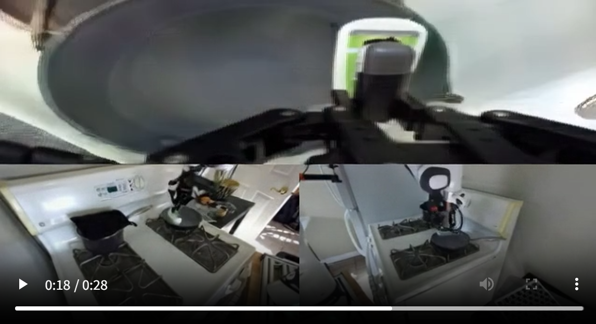
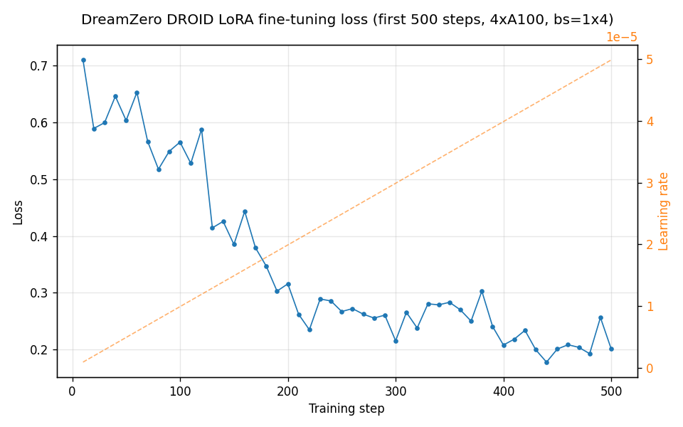
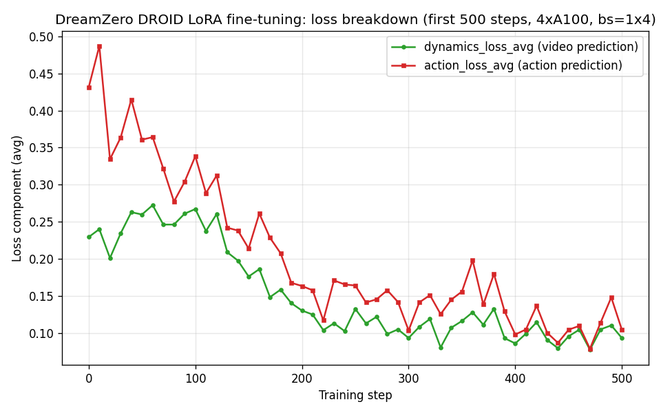

# 8.5.2.2 DreamZero复现

难度：**[高级]** | 预计用时：3~5 小时（含下载）  
先修：[DreamZero模型原理](./01-dreamzero.md)

## 学习目标

读完本页并完成复现后，你应该能：

- 独立完成 conda 环境配置、权重下载、推理服务启动的全流程
- 理解 DreamZero checkpoint 的目录结构，并知道如何修复其中的硬编码路径
- 读懂推理服务日志，判断模型是否正常运行
- 把 DreamZero 迁移到新机器人平台，并知道需要修改哪些接口

## 硬件要求

| 任务 | 最低配置 | 推荐配置 |
|---|---|---|
| 推理（官方权重） | 2× A100 80GB | 2× H100 80GB 或以上 |
| 微调训练（14B，LoRA） | 4× A100 80GB | 8× H100 80GB |
| 微调训练（14B，全量 ZeRO2+offload） | 4× A100 80GB | 8× H100 80GB |
| 微调训练（5B 小模型） | 2× A100 80GB | 4× A100 80GB |
| 权重存储 | 约 80 GB | SSD（更快） |
| DROID 数据集 | 完整约 35 GB；按 chunk 部分下载可低至 1~2 GB | — |

> **没有足够 GPU？**   
> 可以用 `droid_training_wan22.sh` / `droid_training_full_finetune_wan22.sh` 跑 Wan2.2-TI2V-5B 版本，参数量约 5B，两张 A100 即可，但零样本泛化能力弱于 14B 版本。推理验证只需 2 张 GPU。

## Step 1：配置 Conda 环境

```bash
# 1. 创建 Python 3.11 环境（官方要求 3.11，不要用 3.12）
conda create -n dreamzero python=3.11 -y
conda activate dreamzero

# 2. 克隆仓库
git clone https://github.com/dreamzero0/dreamzero
cd dreamzero

# 3. 安装项目依赖（含 PyTorch 2.8.0 + CUDA 12.9）
pip install -e . --extra-index-url https://download.pytorch.org/whl/cu129
```

**单独安装 Flash Attention**（编译耗时 5~15 分钟，不要跳过）：

```bash
# MAX_JOBS=8 防止并行编译时内存不足；仍 OOM 可改为 MAX_JOBS=4
MAX_JOBS=8 pip install flash-attn --no-build-isolation
```

> flash-attn 无法通过普通 pip install 安装，必须在本地编译。编译时会下载约 2GB 的 CUDA 内核源码，请确保网络畅通或提前挂好代理。

**验证环境：**

```bash
python -c "
import torch, flash_attn
print(f'PyTorch 版本   : {torch.__version__}')
print(f'CUDA 可用      : {torch.cuda.is_available()}')
print(f'GPU 数量       : {torch.cuda.device_count()}')
print(f'Flash Attn 版本: {flash_attn.__version__}')
"
```

预期输出：

```
PyTorch 版本   : 2.8.0+cu129
CUDA 可用      : True
GPU 数量       : 8（满足≥2即可）
Flash Attn 版本: 2.8.3（满足≥2.7即可）
```

> **常见报错：**
> - `No matching distribution for torch==2.8.0`：确认已加 `--extra-index-url https://download.pytorch.org/whl/cu129`
> - `flash-attn` 编译报 OOM：把 `MAX_JOBS=8` 改为 `MAX_JOBS=4`
> - `CUDA version mismatch`：用 `nvcc --version` 确认 CUDA ≥ 12.9；GCC 版本需 ≥ 9


## Step 2：下载模型权重

推理验证需要三份文件：DreamZero-DROID 微调权重、Wan2.1-I2V-14B-480P 骨干、umt5-xxl tokenizer。

> 网络较慢时先执行 `export HF_ENDPOINT=https://hf-mirror.com` 切换国内镜像，并在所有 `huggingface-cli` 命令中加 `--resume-download` 支持断点续传。

```bash
mkdir -p checkpoints
```

**2a. 下载 DreamZero-DROID 微调权重（约 20 GB，10 个分片）**

```bash
huggingface-cli download GEAR-Dreams/DreamZero-DROID \
    --repo-type model \
    --local-dir ./checkpoints/DreamZero-DROID \
    --resume-download
```

下载完成后验证：

```bash
ls checkpoints/DreamZero-DROID/
```
预期包含：
```bash
config.json
model.safetensors.index.json
model-00001-of-00010.safetensors  
...
model-00010-of-00010.safetensors
experiment_cfg/conf.yaml        ← 训练时的完整配置，推理时也会读取
```

**2b. 下载 Wan2.1-I2V-14B-480P 骨干（约 86 GB，整个复现中最大的下载）**

DreamZero 的四类权重全部打包在 Wan2.1 仓库里，连同分词器和索引文件一次下完：

```bash
huggingface-cli download Wan-AI/Wan2.1-I2V-14B-480P \
    --local-dir ./checkpoints/Wan2.1-I2V-14B-480P \
    --resume-download
```

下载完成后 `ls checkpoints/Wan2.1-I2V-14B-480P/` 应看到：

```
assets/
config.json
diffusion_pytorch_model-00001-of-00007.safetensors
diffusion_pytorch_model-00002-of-00007.safetensors
diffusion_pytorch_model-00003-of-00007.safetensors
diffusion_pytorch_model-00004-of-00007.safetensors
diffusion_pytorch_model-00005-of-00007.safetensors
diffusion_pytorch_model-00006-of-00007.safetensors
diffusion_pytorch_model-00007-of-00007.safetensors
diffusion_pytorch_model.safetensors.index.json
examples/
google/
LICENSE.txt
models_clip_open-clip-xlm-roberta-large-vit-huge-14.pth
models_t5_umt5-xxl-enc-bf16.pth
README.md
Wan2.1_VAE.pth
xlm-roberta-large/
```

**每个文件/目录的内容与作用：**

| 文件 / 目录 | 大小 | 内容与作用 |
|---|---|---|
| `diffusion_pytorch_model-00001~00007-of-00007.safetensors` | 约 68 GB | **DiT 主干权重**（7 个分片）。Wan2.1 的 Diffusion Transformer 核心，负责在潜变量空间里做视频去噪生成；DreamZero 的动作解码器也嵌在这组权重里 |
| `diffusion_pytorch_model.safetensors.index.json` | <1 MB | **分片索引**。记录每个张量名称对应哪个分片文件，加载时框架先读它再按需读分片 |
| `models_t5_umt5-xxl-enc-bf16.pth` | 11.4 GB | **文本编码器**（UMT5-XXL，BF16）。将自然语言指令（如任务描述）编码为条件向量，送给 DiT 做 cross-attention 条件注入 |
| `models_clip_open-clip-xlm-roberta-large-vit-huge-14.pth` | 4.77 GB | **图像编码器**（OpenCLIP ViT-H/14）。将机器人视角的初始帧/参考图像编码为视觉特征，实现 Image-to-Video 的图像条件 |
| `Wan2.1_VAE.pth` | 约 0.5 GB | **VAE**（变分自编码器）。在像素空间与低维潜变量空间之间编解码视频帧；DiT 在潜变量空间生成，VAE Decoder 再还原为像素帧 |
| `google/` | 约 5 MB | **UMT5 tokenizer**（词表文件）。与 `models_t5_umt5-xxl-enc-bf16.pth` 配套，把文本字符串分词为 token id；已随 Wan2.1 一并下载，**步骤 2c 可能可以跳过**（见下方说明） |
| `xlm-roberta-large/` | 约 1 MB | **XLM-RoBERTa tokenizer**。供 OpenCLIP 图像编码器在文本侧分词用（OpenCLIP 用多语言 RoBERTa 作文本塔） |
| `config.json` | <1 MB | 模型架构超参（层数、注意力头数、隐藏维度等），推理时框架用它重建模型结构 |
| `assets/`、`examples/` | 少量 | 模型卡配图和官方示例（推理不需要） |
| `LICENSE.txt`、`README.md` | 少量 | 许可证（Apache 2.0）和模型说明文档 |

> **关于步骤 2c（tokenizer 单独下载）：** `google/` 目录已随 Wan2.1 一并下载，其中通常包含 `tokenizer.json`、`spiece.model` 等 UMT5 分词文件。如果 `conf.yaml` 里的 `tokenizer_path` 经步骤 3 替换后指向这个目录（而非单独下载的 `./checkpoints/umt5-xxl`），则 2c 可以跳过。如果替换后推理报 `tokenizer` 相关错误，再补执行步骤 2c 即可。

> **下载速度很慢？**   
> 如果你的机器挂了 SOCKS/HTTP 代理隧道（例如通过 SSH 端口转发访问 GitHub），而你又同时想用国内镜像站（`HF_ENDPOINT=https://hf-mirror.com`），两者会相互干扰——请求绕了一圈出境代理再回来，反而比直连慢。解决方法是**在当前终端临时摘掉代理变量**，让下载流量直接走服务器宽带。在同一个终端里依次执行以下命令：

```bash
# 1. 临时清空本终端的代理变量（只影响当前窗口，不影响后台的其他程序）
unset http_proxy https_proxy HTTP_PROXY HTTPS_PROXY

# 2. 确认镜像站变量存在
export HF_ENDPOINT=https://hf-mirror.com

# 3. 重新执行下载，加 HF_HUB_ENABLE_HF_TRANSFER=1 启用 Rust 高速多线程下载器
HF_HUB_ENABLE_HF_TRANSFER=1 huggingface-cli download Wan-AI/Wan2.1-I2V-14B-480P \
    --local-dir ./checkpoints/Wan2.1-I2V-14B-480P \
    --resume-download
```

> `HF_HUB_ENABLE_HF_TRANSFER=1` 会启用 `hf_transfer`（Rust 实现的多线程下载后端），速度通常是默认 Python 下载器的 3–5 倍，并且断点续传极稳定。如提示未安装，先 `pip install hf_transfer`。关闭这个终端后重新连进来，代理会从 `.bashrc` 自动恢复，不受影响。

**2c. 下载 umt5-xxl tokenizer（约 5 MB，仅词表文件）**

tokenizer 只负责把文字分词，不需要完整 10GB 模型，只下载 tokenizer 相关文件：

```bash
huggingface-cli download google/umt5-xxl \
    --include "tokenizer*" "spiece*" "special_tokens_map*" \
    --local-dir ./checkpoints/umt5-xxl
```


## Step 3：修复 checkpoint 中的硬编码路径（关键步骤）

这是一个容易被忽视但会直接导致推理失败的步骤。

**问题**：DreamZero-DROID checkpoint 的 `experiment_cfg/conf.yaml` 里保存了训练时的完整配置，其中 Wan2.1 骨干和 tokenizer 的路径是**原作者训练机器上的绝对路径**，形如：

```
diffusion_model_pretrained_path: /mnt/amlfs-01/home/seonghyeony/ckpts/Wan2.1-I2V-14B-480P
text_encoder_pretrained_path:    /mnt/amlfs-01/.../models_t5_umt5-xxl-enc-bf16.pth
image_encoder_pretrained_path:   /mnt/amlfs-01/.../models_clip_open-clip-xlm-roberta-large-vit-huge-14.pth
vae_pretrained_path:             /mnt/amlfs-01/.../Wan2.1_VAE.pth
tokenizer_path: google/umt5-xxl
```

推理时代码会直接读这个文件加载权重，路径不存在就会报 `FileNotFoundError`。

**解决方法**：用 sed 批量替换为本地路径（以下命令假设你把权重下载到了 `./checkpoints/`，请按实际路径调整）：

```bash
WAN_PATH="$(pwd)/checkpoints/Wan2.1-I2V-14B-480P"
UMT5_PATH="$(pwd)/checkpoints/umt5-xxl"

# 替换 Wan2.1 骨干路径（4 处）
sed -i "s|/mnt/amlfs-01/home/seonghyeony/ckpts/Wan2.1-I2V-14B-480P|${WAN_PATH}|g" \
    checkpoints/DreamZero-DROID/experiment_cfg/conf.yaml

# 替换 tokenizer 路径（多处）
sed -i "s|tokenizer_path: google/umt5-xxl|tokenizer_path: ${UMT5_PATH}|g" \
    checkpoints/DreamZero-DROID/experiment_cfg/conf.yaml
```

验证替换成功（应看到本地路径）：

```bash
grep "pretrained_path\|tokenizer_path" \
    checkpoints/DreamZero-DROID/experiment_cfg/conf.yaml | head -6
```

预期输出（路径替换为你的本地路径）：

```
diffusion_model_pretrained_path: /your/path/checkpoints/Wan2.1-I2V-14B-480P
text_encoder_pretrained_path: /your/path/checkpoints/Wan2.1-I2V-14B-480P/models_t5_umt5-xxl-enc-bf16.pth
image_encoder_pretrained_path: /your/path/checkpoints/Wan2.1-I2V-14B-480P/models_clip_open-clip-xlm-roberta-large-vit-huge-14.pth
vae_pretrained_path: /your/path/checkpoints/Wan2.1-I2V-14B-480P/Wan2.1_VAE.pth
tokenizer_path: /your/path/checkpoints/umt5-xxl
```

> **为什么需要这步？**   
>HuggingFace 上发布的 checkpoint 往往包含训练时生成的完整实验配置。原作者在自己的集群上训练，路径自然是私有挂载。下载到本地后，只有这几个路径需要改；模型权重本身完全可用。


## Step 4：启动推理服务验证（无需训练）

这一步用官方预训练权重验证整个推理流程是否通畅，是复现的第一个里程碑。整个流程需要两个终端并行运行。

### 终端 A：启动推理服务端

```bash
conda activate dreamzero
cd dreamzero

CUDA_VISIBLE_DEVICES=0,1 torchrun \
    --standalone \
    --nproc_per_node=2 \
    socket_test_optimized_AR.py \
    --port 8000 \
    --model-path ./checkpoints/DreamZero-DROID
```

模型加载约需 2–3 分钟（14B 参数权重从磁盘读入 GPU）。加载过程中会打印大量 `Warning: Transformer Engine is not available. Falling back to FA2 backend.`，属正常现象，忽略即可。等待直到日志出现：

```
INFO:websockets.server:server listening on 0.0.0.0:8000
INFO:root:Videos will be saved to: ./checkpoints/real_world_eval_gen_YYYYMMDD_0/DreamZero-DROID
```

**看到这两行日志才说明服务端就绪**，此时再切到终端 B。

> **GPU 数量说明**：  
>`--nproc_per_node=2` 将模型张量并行拆分到 2 张 GPU 上。14B 参数 × bf16 精度 ≈ 28 GB，2 × 40GB 显存可容纳。如果显存不足，改为 `CUDA_VISIBLE_DEVICES=0,1,2,3 --nproc_per_node=4`。
>
> **GPU 被占用？**   
> 先用 `nvidia-smi` 确认哪几张卡空闲，替换 `CUDA_VISIBLE_DEVICES` 中的编号。
>
> **端口被占用？**   
> 若报 `OSError: [Errno 98] address already in use`，换一个端口（如 `--port 8001`），终端 B 的客户端命令也对应修改。

### 终端 B：启动测试客户端

测试客户端读取仓库自带的 `debug_image/` 目录下的三路相机视频（exterior_image_1_left.mp4、exterior_image_2_left.mp4、wrist_image_left.mp4），模拟机器人端发送观测数据，不需要真实机器人。

```bash
conda activate dreamzero
cd dreamzero
python test_client_AR.py --host localhost --port 8000
```

客户端连上后，服务端会继续打印两行连接确认：

```
INFO:root:Connection from ('127.0.0.1', xxxxx) opened
INFO:__main__:New session started: 'xxxxxxxx-xxxx-xxxx-xxxx-xxxxxxxxxxxx'
```

### 推理过程：客户端输出

推理按以下顺序进行：先发送初始帧，再分块发送后续帧。**每次推理耗时约 25–90 秒**（A100 80GB × 2，首次因 torch.compile 较慢，后续逐渐稳定在 60–90s）。

```
2026-06-06 13:35:58 [INFO] === Initial: frame [0] ===
2026-06-06 13:36:35 [INFO]   Action shape: (24, 8), range: [-0.0985, 0.5761], time: 37.07s
2026-06-06 13:36:35 [INFO] === Chunk 0: frames [0, 7, 15, 23] ===
2026-06-06 13:38:48 [INFO]   Action shape: (24, 8), range: [-0.0016, 0.4520], time: 132.68s
2026-06-06 13:38:48 [INFO] === Chunk 1: frames [24, 31, 39, 47] ===
2026-06-06 13:40:21 [INFO]   Action shape: (24, 8), range: [-0.0620, 0.2795], time: 93.16s
...（共 15 个 chunk，总耗时约 20–30 分钟）
2026-06-06 13:57:22 [INFO]   Action shape: (24, 8), range: [-0.2163, 0.8652], time: 87.24s
2026-06-06 13:57:22 [INFO] Sending reset to save video...
2026-06-06 13:57:27 [INFO] Done.
```

**解读输出：**
- `Action shape: (24, 8)`：24 步动作 horizon，每步 8 维（7 个关节位置 + 1 个夹爪开合），符合 DROID 机器人配置
- `range: [min, max]`：动作值范围，每个 chunk 的范围不同，说明模型在感知场景变化并输出相应动作
- `time: Xs`：单次推理延迟。首次约 30–40s（含 torch.compile），后续稳定在 60–90s（A100 × 2）
- 服务端对每次推理也会打印耗时明细，两个 rank 各打印一次（张量并行的正常现象）：

```
Time taken: Total 25.40s, Text Encoder 5.10s, Image Encoder 9.59s,
            VAE 0.00s, KV Cache Creation 1.59s, Diffusion 3.09s, Scheduler 6.03s
```

### 推理成功的标志与产物

客户端打印 `Done.` 即为推理全流程完成。此时服务端已将**生成的预测视频**保存至启动时打印的路径：

```bash
ls ./checkpoints/real_world_eval_gen_YYYYMMDD_0/DreamZero-DROID/
# 000001_HH_MM_SS_nNN.mp4   ← 完整推理会话的视频，约 20–30 秒
```

文件名中 `nNN` 表示本次会话处理的总帧段数（initial + 所有 chunk）。**时长最长的 .mp4 文件即为本次完整推理的输出**（若目录下有多个文件，说明之前有失败会话，时长极短的文件可忽略）。

视频内容是 DreamZero 根据机器人三路相机观测**想象出的未来视频帧**，与同步解码出的关节动作序列一一对应——这正是论文中 World Action Model 的核心能力：视频生成与动作预测联合输出，推理时无需任何奖励函数或环境交互。



> **如果出现连接超时报错**   
> `ConnectionClosedError: keepalive ping timeout`：这是服务端 WebSocket 默认每 20 秒发送一次 keepalive ping，但推理期间 asyncio 事件循环被同步调用阻塞导致的。解决方法：在 `eval_utils/policy_server.py` 的 `websockets.asyncio.server.serve(...)` 调用中加入 `ping_interval=None` 参数，禁用服务端的 keepalive ping。


## Step 5：下载训练数据

仅在需要微调训练时才执行此步。

> **数据集实际大小约 35 GB**：57,774 个 episode，分到 58 个 chunk（每 chunk 1000 episode），但拆成了近 10 万个小文件（`data/` 下 5.78 万个 parquet，`videos/` 下 4.19 万个 mp4，平均每个文件仅几百 KB）。下载瓶颈不在带宽而在**请求数**——HuggingFace 对匿名 IP 有限流，`huggingface-cli download` 整库下载在文件数巨大时容易卡在 ~1 文件/秒，并可能中途报 `We had to rate limit your IP`。

```bash
mkdir -p data

# 先下载 meta/（很小，包含完整数据集的统计信息和 episode 列表）
huggingface-cli download GEAR-Dreams/DreamZero-DROID-Data \
    --repo-type dataset \
    --local-dir ./data/droid_lerobot \
    --include "meta/*" \
    --max-workers 8 \
    --resume-download

# 再按需下载 data/+videos/。下面是 chunk-000 的前 200 个 episode（约 50 万帧的子集，
# parquet ~10MB + 视频 ~550MB），用 glob 精确控制文件数，几十分钟内可下完，
# 足够跑几百步验证训练流程、画出 loss 曲线：
huggingface-cli download GEAR-Dreams/DreamZero-DROID-Data \
    --repo-type dataset \
    --local-dir ./data/droid_lerobot \
    --include "data/chunk-000/episode_0000[0-9][0-9].parquet" \
               "data/chunk-000/episode_0001[0-9][0-9].parquet" \
               "videos/chunk-000/*/episode_0000[0-9][0-9].mp4" \
               "videos/chunk-000/*/episode_0001[0-9][0-9].mp4" \
    --max-workers 8 \
    --resume-download
```

> **被限流 / SSL 报错怎么办？** 这两种错误在大文件数下载里都偶发出现：`We had to rate limit your IP` 或 `requests.exceptions.SSLError: ... UNEXPECTED_EOF_WHILE_READING`。两者都可以直接用同样的命令重新执行（加了 `--resume-download` 会跳过已完成的文件），通常重试 1-2 次就能恢复；也可以申请一个 HuggingFace token 并 `export HF_TOKEN=hf_xxx`，登录用户的限流额度远高于匿名访问。本环境实测 `HF_ENDPOINT=https://hf-mirror.com` 会直接卡死无响应，不推荐。

> **只下载了部分 episode，训练时会报 FileNotFoundError？** 
> `meta/episodes.jsonl` 默认列出完整数据集的全部 57,774 个 episode，但本地只有其中一部分的 `data/`+`videos/` 文件。`LeRobotSingleDataset._get_trajectories()` 会按 `meta/episodes.jsonl` 逐条加载，遇到本地不存在的 episode 就会报错。  
> **解决办法**：按实际下载的 episode 范围裁剪 `meta/episodes.jsonl`（保留对应行即可，每行的 `episode_index` 决定文件路径），并同步更新 `meta/info.json` 里的 `total_episodes`/`total_frames`/`total_chunks`（`total_frames` 可用 Python 对裁剪后 `episodes.jsonl` 里每行的 `length` 求和得到）。例如只保留前 200 个 episode：

```bash
cd data/droid_lerobot/meta
cp episodes.jsonl episodes.jsonl.full.bak
cp info.json info.json.full.bak
head -n 200 episodes.jsonl.full.bak > episodes.jsonl
python3 -c "
import json
info = json.load(open('info.json'))
lines = [json.loads(l) for l in open('episodes.jsonl')]
info['total_episodes'] = len(lines)
info['total_frames'] = sum(l['length'] for l in lines)
info['total_chunks'] = 1
json.dump(info, open('info.json', 'w'), indent=4)
```

> `meta/tasks.jsonl`、`meta/stats.json`、`meta/relative_stats*.json` 不需要裁剪——它们是按全局 `task_index`/归一化统计组织的，裁剪后反而可能让 parquet 里引用的 `task_index` 找不到对应行。

数据集目录结构（下载完成后）：

```
data/droid_lerobot/
├── meta/
│   ├── modality.json       ← 描述各模态的键名和归一化参数（训练前必读）
│   ├── info.json           ← 数据集统计（总轨迹数等）
│   └── episodes.jsonl      ← 每条轨迹的元数据
├── data/
│   └── chunk-000/
│       ├── episode_000000.parquet  ← 动作、状态数据（表格格式）
│       └── ...
└── videos/
    └── chunk-000/
        ├── observation.images.exterior_image_1_left/
        │   └── episode_000000.mp4
        ├── observation.images.exterior_image_2_left/
        └── observation.images.wrist_image_left/
```

**训练前必做：检查数据集统计信息与模态配置**

`meta/modality.json` 描述的是 `state`/`action` 各分量在向量中的切片范围，以及视频/语言标注的字段名——**不包含 horizon 信息**。视频 horizon（`num_frames`/`action_horizon`）是训练脚本的 CLI 超参（详见 Step 6），需要和模型的 `num_frame_per_block`/`num_action_per_block` 配置匹配，而不是从数据集里读出来的。下载完成后建议先跑下面这段脚本，确认数据集规模和动作/状态维度与训练脚本的假设一致：

```python
# 在 dreamzero/ 目录下运行
import json, pathlib

root = pathlib.Path("./data/droid_lerobot")
info = json.loads((root / "meta/info.json").read_text())
modality = json.loads((root / "meta/modality.json").read_text())

print(f"总 episode 数 : {info['total_episodes']}")
print(f"总帧数        : {info['total_frames']}")
print(f"chunk 数      : {info['total_chunks']} (每 chunk {info['chunks_size']} episodes)")
print(f"fps           : {info['fps']}")

action_dims = {k: v["end"] - v["start"] for k, v in modality["action"].items()}
state_dims  = {k: v["end"] - v["start"] for k, v in modality["state"].items()}
print(f"action 各分量维度: {action_dims}")
print(f"action 总维度    : {sum(action_dims.values())}")
print(f"state  各分量维度: {state_dims}")
print(f"视频相机视角     : {list(modality['video'].keys())}")
print(f"语言标注字段     : {list(modality['annotation'].keys())}")
```

预期输出（完整数据集；若只下载了部分 chunk，`total_episodes`/`total_chunks` 仍为完整数据集的统计值，不随本地下载量变化）：

```
总 episode 数 : 57774
总帧数        : 14748517
chunk 数      : 58 (每 chunk 1000 episodes)
fps           : 15
action 各分量维度: {'cartesian_position': 6, 'cartesian_velocity': 6, 'gripper_position': 1, 'gripper_velocity': 1, 'joint_position': 7, 'joint_velocity': 7}
action 总维度    : 28
state  各分量维度: {'cartesian_position': 6, 'gripper_position': 1, 'joint_position': 7}
视频相机视角     : ['exterior_image_1_left', 'exterior_image_2_left', 'wrist_image_left']
语言标注字段     : ['language.language_instruction', 'language.language_instruction_2', 'language.language_instruction_3']
```

> 视频帧分辨率为 `180×320`（height×width），与 `info.json` 的 `features` 字段一致，和 Step 6 训练脚本里 `image_resolution_height/width` 的取值（训练时会再做一次 resize）相互独立。

## Step 6：微调训练

> 注意：仓库里没有 `scripts/train/droid_training.sh` 这个文件（早期版本文档写错了文件名）。`scripts/train/` 下实际是按"骨干模型 × 训练方式"拆分的多个脚本：

| 脚本 | 骨干 | 训练方式 | 默认 GPU 数 | 说明 |
|---|---|---|---|---|
| `droid_training_lora.sh` | Wan2.1-I2V-14B | LoRA | 8 | `train_architecture=lora`，只训练 LoRA adapter，`save_lora_only=true`，显存/磁盘开销小 |
| `droid_training_full_finetune.sh` / `droid_training_full_finetune_wan21.sh` | Wan2.1-I2V-14B | 全量（ZeRO2 + CPU offload） | 8 / 4 | `train_architecture=full`，训练全部 14B 参数，每个 checkpoint 含完整权重+优化器状态 |
| `droid_training_wan22.sh` | Wan2.2-TI2V-5B | LoRA | 8 | 5B 小模型，仍需从 Wan2.1 取 CLIP 图像编码器 |
| `droid_training_full_finetune_wan22.sh` | Wan2.2-TI2V-5B | 全量 | 4 | 5B 全量微调，默认 `max_steps=200000` |

所有脚本里的关键路径/超参都可以用环境变量覆盖（脚本内 `${VAR:-default}` 写法）。下面以 **LoRA 微调 Wan2.1-14B** 为例（4 卡也能跑，适合先验证流程）：

**第一步：设置环境变量**

```bash
export DROID_DATA_ROOT="$(pwd)/data/droid_lerobot"
export OUTPUT_DIR="$(pwd)/checkpoints/dreamzero_droid_lora"
export NUM_GPUS=4
export WAN_CKPT_DIR="$(pwd)/checkpoints/Wan2.1-I2V-14B-480P"
export TOKENIZER_DIR="$(pwd)/checkpoints/umt5-xxl"
export HYDRA_FULL_ERROR=1   # 开启详细错误日志，调试时有用
export CUDA_VISIBLE_DEVICES=4,5,6,7   # 按需选择空闲的 4 张卡
```

**第二步：启动训练**

```bash
bash scripts/train/droid_training_lora.sh
```

> `max_steps` 默认值是 100（冒烟测试），不是完整流程中的 100000。`droid_training_lora.sh` 把 `max_steps=100`、`save_strategy=no` 硬编码在脚本里，是用来快速验证流程通不通的，**真正训练需要自己改这两行**（或复制脚本另存一份）。同理 `learning_rate=1e-4`（LoRA）/ `1e-5`（全量），`save_steps=1000`、`save_total_limit=10` 也是写死的，按需调整。

关键训练超参说明（以 `droid_training_lora.sh` 为准）：

| 参数 | 默认值 | 说明 |
|---|---|---|
| `train_architecture` | `lora` | 只训练 LoRA adapter；切到 `full` 即全量微调 |
| `training_args.learning_rate` | `1e-4`（LoRA）/ `1e-5`（全量） | LoRA 学习率可以更大 |
| `per_device_train_batch_size` | `1` | 每张 GPU 的 batch size（视频+动作联合训练，显存敏感） |
| `max_steps` | `100`（冒烟测试，需手动改大） | 总训练步数 |
| `warmup_ratio` | `0.05` | 前 5% 步数线性升温 |
| `bf16` / `tf32` | `true` | 混合精度 |
| `image_resolution_width/height` | `320 / 176` | 训练时 resize 后的分辨率（数据集原始为 180×320） |
| `report_to` | `none` | 不依赖 wandb；loss 仍会写入 `loss_log.jsonl`（见下） |
| `training_args.deepspeed` | `zero2.json`（LoRA）/ `zero2_offload.json`（全量） | DeepSpeed ZeRO 配置 |

**实时查看 loss：** 无论 `report_to` 是什么，框架的 `LossLoggerCallback` 都会把每个 `logging_steps`（默认 10 步）的 loss 写入 `$OUTPUT_DIR/loss_log.jsonl`，每行形如：

```json
{"step": 10, "loss": 0.5529, "dynamics_loss_avg": 0.3421, "action_loss_avg": 0.2108, "learning_rate": 9.5e-05}
```

可以用这个文件直接画 loss 曲线，无需配置 wandb/tensorboard。

> **显存不足？**     
> 改用 5B 小模型：运行 `bash scripts/train/droid_training_wan22.sh`，Wan2.2-TI2V-5B 骨干，两张 A100 即可，但泛化能力弱于 14B。

**实测结果（4×A100-80GB，GPU 4-7，LoRA，本文配置）**

受限于完整 DROID 数据集下载耗时（5.78 万 episode、近 10 万个文件，匿名 IP 下载约 1 文件/秒且容易被限流），本次实测使用 `data/chunk-000` 中的前 200 个 episode（约 5 万帧，裁剪 `meta/episodes.jsonl`/`info.json` 后得到的子集）跑了 `run_lora_training.sh`（即 `droid_training_lora.sh` 改为 `max_steps=20000`、`save_strategy=steps`、`save_steps=5000`、`save_total_limit=5`），实际只跑了前 500 步用于验证流程与采集 loss 曲线：

- **显存占用**：4 张 GPU 均稳定在 **~74.5 GB / 80 GB**（ZeRO2，未做 CPU offload）
- **单步耗时**：稳定在 **~17.0 秒/step**（前几步因 CUDA kernel 编译/cache 预热略慢），20000 步全部跑完预计 ~95 小时
- **loss 曲线**：前 500 步（每 10 步记录一次，共 50 个点）loss 从 step 10 的 `0.71` 降到 step 500 附近的 `0.18~0.26` 区间，前 5 个点均值 `0.63` → 后 5 个点均值 `0.21`，下降趋势明显，`learning_rate` 按 `warmup_ratio=0.05`（对应 1000 步线性 warmup）从 `9e-7` 线性升至 `4.99e-5`



`loss_log.jsonl` 里每 10 步还会单独记录 `dynamics_loss_avg`（视频/动力学预测分支的损失）和 `action_loss_avg`（动作预测分支的损失），两者都在下降，但起点和速度不同——`action_loss_avg` 从 `~0.43` 降到 `~0.11`（前 5 点均值 → 后 5 点均值），`dynamics_loss_avg` 从 `~0.23` 降到 `~0.10`，500 步后两条曲线已经比较接近，体现了 DreamZero "视频生成 + 动作预测"联合训练中两个分支同步收敛的过程：



> 由于只用了 200 个 episode（远小于完整数据集的 5.78 万），loss 下降速度会比用全量数据更快、更容易过拟合到这一小批轨迹；这里的曲线主要用于验证训练流程（数据加载、DeepSpeed ZeRO2、LoRA adapter、`loss_log.jsonl` 记录）是否跑通，不代表完整数据集上的收敛速度。要复现接近论文的效果，仍需下载全量数据并跑满 `max_steps`。


## Step 7：用自己的 Checkpoint 推理

### LoRA checkpoint 的目录结构

`save_lora_only=true` 时，`CheckpointFormatCallback` 会在每个 `save_steps`（`run_lora_training.sh` 中是 5000）的整数倍 step 生成一个独立目录：

```
checkpoints/dreamzero_droid_lora/
└── checkpoint-5000/
    ├── config.json          # VLAConfig，记录 lora_rank/lora_alpha/lora_target_modules 等结构信息
    ├── model.safetensors    # 只含 LoRA adapter 权重（A/B 矩阵），不含 14B 基座权重，体积仅几十 MB
    └── experiment_cfg/      # 训练时完整的 conf.yaml + metadata.json（由 CheckpointFormatCallback 拷贝）
```

### 不需要重复 Step 3 的路径替换

Step 3 替换的是**官方发布的 DreamZero-DROID checkpoint** 里、原作者训练机器上的硬编码路径。而自己训练产出的 `experiment_cfg/conf.yaml` 是在**这台机器上**、用 `run_lora_training.sh` 里设置的 `WAN_CKPT_DIR`/`TOKENIZER_DIR` 等变量生成的，记录的本来就是本机真实路径，例如：

```yaml
diffusion_model_pretrained_path: /data3/orangeice/checkpoints/Wan2.1-I2V-14B-480P
tokenizer_path: /data3/orangeice/checkpoints/umt5-xxl
```

可以用 `grep` 直接确认（应看到本机绝对路径，无需修改）：

```bash
grep "pretrained_path\|tokenizer_path" \
    checkpoints/dreamzero_droid_lora/checkpoint-5000/experiment_cfg/conf.yaml | head -6
```

只要训练和推理在同一台机器、同一套 `checkpoints/` 目录下进行，**这一步可以跳过**；只有把 checkpoint 拷贝到别的机器、或权重目录搬过位置时，才需要像 Step 3 那样用 `sed` 改路径。

### 启动推理服务

```bash
CUDA_VISIBLE_DEVICES=0,1 torchrun \
    --standalone \
    --nproc_per_node=2 \
    socket_test_optimized_AR.py \
    --port 8000 \
    --model-path ./checkpoints/dreamzero_droid_lora/checkpoint-5000
```

加载流程与 Step 4 基本一致，区别在 `VLA.from_pretrained()`（`groot/vla/model/dreamzero/base_vla.py`）内部多了一步 LoRA 处理：

1. 读取 `config.json`，发现 `train_architecture: lora`，强制把 `defer_lora_injection` 置为 `False`；
2. 用该 config 实例化模型——按 `diffusion_model_pretrained_path` 等路径加载完整的 Wan2.1-14B 基座权重，并按 `lora_target_modules`（`q,k,v,o,ffn.0,ffn.2`）注入初始化的 LoRA adapter；
3. 用 `model.safetensors` 里的 LoRA 权重（A/B 矩阵）覆盖刚注入的 adapter；日志中出现的 `missing_keys`/`unexpected_keys`（基座权重）是预期行为，不代表加载失败。

服务端就绪标志、客户端用法、视频产物路径都与 Step 4 相同，产物会落在 `checkpoints/dreamzero_droid_lora/real_world_eval_gen_YYYYMMDD_0/checkpoint-5000/` 下。

> **本文进度**：Step 6 的实测训练只跑到第 500 步（`save_steps=5000`，尚未触发第一次保存），因此本节流程是基于 `base_vla.py::from_pretrained` 和 `CheckpointFormatCallback` 的代码逻辑推导出的预期步骤，尚未用真实微调出的 checkpoint 跑通。训练跑满到 5000 步后，按上述命令即可验证。

## 九、适配新机器人（进阶）

如果你想把 DreamZero 迁移到 DROID 以外的机器人平台，参考 [DATASET_TO_GEAR_AND_TRAIN.md](https://github.com/dreamzero0/dreamzero/blob/main/docs/DATASET_TO_GEAR_AND_TRAIN.md)，流程如下：

```bash
# 1. 把 LeRobot v2 格式数据集转换为 GEAR 格式
python scripts/data/convert_lerobot_to_gear.py \
    --dataset-path /path/to/your/dataset \
    --embodiment-tag MY_ROBOT \
    --action-keys '{"action": "actions"}' \
    --state-keys  '{"state": "observations/qpos"}'

# 2. 在 groot/vla/data/schema/embodiment_tags.py 注册新机器人
#    在 EmbodimentTag 枚举中添加一行: MY_ROBOT = "my_robot"

# 3. 从 DreamZero-AgiBot 权重开始微调（效果优于从 Wan2.1 原始权重）
huggingface-cli download GEAR-Dreams/DreamZero-AgiBot \
    --repo-type model --local-dir ./checkpoints/DreamZero-AgiBot

DATA_ROOT=/path/to/gear_dataset bash scripts/train/yam_training.sh
```

> 注：仓库里没有通用的 `my_robot_training.sh`，`scripts/train/` 下现有的是按机器人命名的脚本（`yam_training.sh`、`agibot_training.sh`、`droid_training_*.sh`）。迁移新机器人时，复制其中一个最接近的脚本，把 `data=` 覆盖项指向你的新数据集配置即可。

论文报告只需 **30 分钟 play data** 即可完成到新本体的迁移。

## 十、常见问题排查

| 症状 | 可能原因 | 解决方案 |
|---|---|---|
| `FileNotFoundError: /mnt/amlfs-01/...` | conf.yaml 路径未替换 | 执行 Step 3 的 `sed` 替换命令 |
| `No such file: models_t5_umt5-xxl-enc-bf16.pth` | Wan2.1 下载不完整 | 重新执行 Step 2b，加 `--resume-download` |
| `CUDA out of memory` | VRAM 不足 | 增加 `--nproc_per_node` GPU 数量，或改用 5B 小模型 |
| `Connection refused`（客户端） | 服务端还未就绪 | 等日志出现 "Waiting for connections" 后再启动客户端 |
| `flash_attn` 编译失败 | GCC / CUDA 版本不兼容 | 确认 `gcc --version` ≥ 9，`nvcc --version` ≥ 12.9 |
| 视频好看但动作不稳 | action decoder 未收敛 | 单独观察 `loss_action`，不能只看 `loss_video` |
| 训练 loss 不下降 | 学习率过大 | 从 `5e-6` 开始试，确认 warmup 设置正确 |
| `Missing key in modality.json` | 数据配置与数据集不匹配 | 对照 `meta/modality.json` 检查 `state`/`action`/`video`/`annotation` 各字段名是否齐全（参考 Step 5 的检查脚本输出） |
| `bash: scripts/train/droid_training.sh: No such file or directory` | 该脚本不存在，名字记错了 | 用 `ls scripts/train/` 查看实际脚本名（如 `droid_training_lora.sh`、`droid_training_full_finetune_wan22.sh` 等），参考 Step 6 的脚本对照表 |
| 下载途中报 `429 Client Error` 或 `We had to rate limit your IP` | 单 IP 短时间内请求文件数过多（DROID 数据集近 10 万个文件，容易触发限流） | 等待几分钟后用同样的命令 + `--resume-download` 重试；用 `--include` 只下载需要的 chunk 缩小文件数；如有 HuggingFace 账号，`huggingface-cli login` 写入 token 后限流阈值会显著提高 |
| 下载速度极慢（个位数 文件/秒） | 经代理访问 huggingface.co，单文件请求延迟高；`HF_ENDPOINT=https://hf-mirror.com` 在本环境实测会卡住无响应 | 优先用默认 `https://huggingface.co` + 代理，搭配 `--max-workers 8`（过大反而更容易触发限流）；用 `--include` 按 chunk 缩小下载范围；若必须用镜像，先小范围测试是否能正常返回数据 |

---

Sources:
- [World Action Models are Zero-shot Policies (arXiv:2602.15922)](https://arxiv.org/abs/2602.15922)
- [GitHub: dreamzero0/dreamzero](https://github.com/dreamzero0/dreamzero)
- [HuggingFace: GEAR-Dreams/DreamZero-DROID](https://huggingface.co/GEAR-Dreams/DreamZero-DROID)
- [数据集与训练文档](https://github.com/dreamzero0/dreamzero/blob/main/docs/DATASET_TO_GEAR_AND_TRAIN.md)
- [环境配置 DeepWiki](https://deepwiki.com/dreamzero0/dreamzero/7.1-environment-setup)
