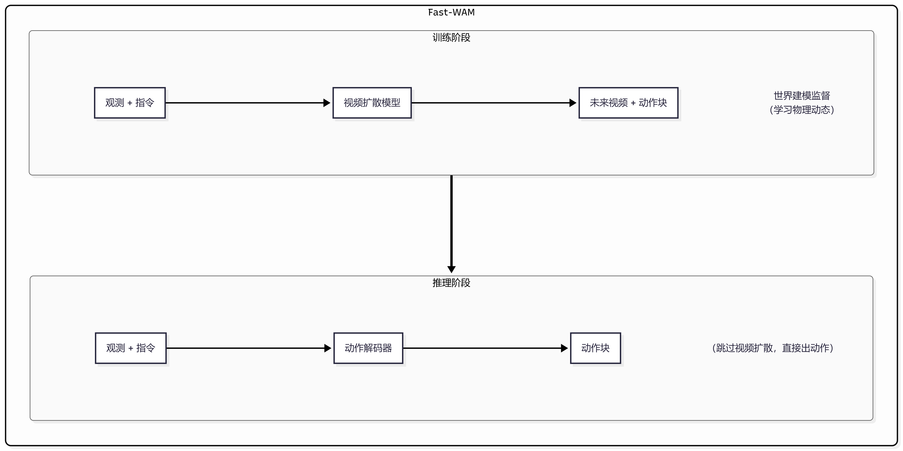

# 8.5.2.3 Fast-WAM 模型原理

难度：**[高级]** | 预计用时：30 分钟  
先修：[World Action Model](../02-world-action-models.md) → [DreamZero 模型原理](./01-dreamzero.md)

> DreamZero 让我们看到"一边想象未来一边做动作"能带来惊人的零样本泛化能力。但一个尖锐的问题随之而来：**WAM 的收益到底来自"推理时想象未来"，还是来自"训练时学到的世界表征"？** Fast-WAM 的回答是：主要来自后者。它在训练阶段保留视频/世界建模监督，推理阶段跳过显式未来视频生成，直接把动作预测出来——推理延迟大幅降低，性能却不怎么掉。

## 学习目标

读完本页后，你应该能：

- 用一句话说清楚 Fast-WAM 和 DreamZero 在推理阶段的核心区别
- 解释 Fast-WAM 要回答的核心科学问题：WAM 的收益来源是 test-time imagination 还是 training-time world modeling
- 画出 Fast-WAM 训练和推理两阶段的数据流差异

动手复现请移步 [Fast-WAM 复现](./04-fast-wam-reproduction.md)。

## 一、为什么需要 Fast-WAM？

### DreamZero 的"甜蜜负担"

DreamZero 用视频扩散模型同时生成未来画面和动作块，零样本泛化能力碾压普通 VLA。但它有一个工程上的"甜蜜负担"：

| 问题 | 具体表现 |
|------|---------|
| **推理延迟高** | 视频扩散模型需要多步去噪（50 步 DDIM），每步跑一次完整 DiT 前向，H100 上也要 ~3 秒 |
| **控制频率受限** | 3 秒出一个动作块，等效控制频率约 7 Hz，对高速操作任务不够 |
| **部署成本高** | 需要大显存 GPU 做视频生成，难以在边缘设备上部署 |

> **初学者提示**：你可以把 DreamZero 的推理过程想象成"每次做动作前都要先画一部微电影，再从电影里提取动作"。这确实很酷，但也很慢。Fast-WAM 的思路是：微电影在训练时已经"看过"了，推理时直接用"看微电影学到的经验"做动作，不需要再画一遍。

### Fast-WAM 要回答的科学问题

DreamZero 的成功让整个 WAM 社区都在问同一个问题：

> **WAM 的零样本泛化能力，到底是来自推理时显式生成未来视频（test-time imagination），还是来自训练时学习世界动态（training-time world modeling）？**

如果是前者，那 WAM 就不可能快——你必须忍受视频扩散的延迟。但如果是后者，那就有戏：训练时保留世界建模，推理时跳过视频生成，直接输出动作。

Fast-WAM 通过精心设计的消融实验给出了答案：**主要收益来自训练时的世界建模监督，而非推理时的未来想象。**

### 一句话总结

| 维度 | DreamZero（imagine-then-execute） | Fast-WAM |
|------|----------------------------------|----------|
| 训练阶段 | 视频 + 动作联合去噪（Flow Matching） | 保留视频/世界建模监督 |
| 推理阶段 | 显式生成未来视频 → 解码动作 | 跳过视频生成，直接预测动作 |
| 推理延迟 | ~3 秒（H100） | 大幅降低（接近普通 VLA 水平） |
| 核心假设 | 未来想象提升动作质量 | 世界建模的训练收益 > 推理时想象的收益 |
| 仍属于 WAM | ✅ | ✅（训练时保留了世界建模） |

> **边界说明**：Fast-WAM 删除的是**推理时**的显式未来视频生成，而不是**训练时**的世界建模监督。如果训练时也去掉世界建模，那就退化成普通 BC 了。Fast-WAM 仍然是 WAM——它只是把"未来想象"从推理阶段搬到了训练阶段。

## 二、模型原理深度解析

### 2.1 核心设计思路

Fast-WAM 的核心思路可以概括为四个字：**训用分离**。


图 2.1 Fast-WAM 训用分离设计。训练时用视频扩散学习世界动态，推理时跳过视频生成直接出动作。

### 2.2 训练阶段：保留世界建模

Fast-WAM 的训练阶段与 DreamZero 类似，保留了视频/动作联合建模的完整监督信号：

- **视频扩散目标**：给定历史观测和语言指令，预测未来视频帧
- **动作预测目标**：在视频扩散过程中，同时预测对应的动作块
- **联合损失**：$\mathcal{L} = \mathcal{L}_{\text{video}} + \lambda \mathcal{L}_{\text{action}}$

训练时模型学到的不仅是"当前观测 → 动作"的映射，更是"动作如何改变世界"的物理因果。这个物理因果知识被编码在模型的参数中，成为推理时快速做决策的基础。

### 2.3 推理阶段：跳过视频生成

这是 Fast-WAM 与 DreamZero 的分水岭。推理时，Fast-WAM 不再跑完整的视频扩散流程，而是直接从条件输入预测动作。

**关键设计选择**：Fast-WAM 提供了多种推理模式，从"完全跳过视频"到"轻量视频生成"形成一个效率谱系：

| 推理模式 | 视频生成 | 推理延迟 | 性能 | 适用场景 |
|---------|---------|---------|------|---------|
| **Direct Action** | 完全跳过 | 最低 | 略低于完整 WAM | 实时高频控制 |
| **Latent Plan** | 仅生成潜变量计划 | 中等 | 接近完整 WAM | 需要推理可解释性 |
| **Full Imagination** | 完整视频生成 | 最高 | 完整 WAM 性能 | 离线规划、调试 |

> **为什么跳过视频生成还能保持性能？** 直觉上，训练时模型已经通过视频扩散学到了丰富的世界动态表征。这些表征已经编码在模型参数中——就像你学会了骑自行车之后，不需要在脑子里先"模拟一遍摔倒"再决定怎么保持平衡。训练时"看过"的未来，已经内化成了推理时的直觉。

### 2.4 关键性能数字

| 指标 | DreamZero | Fast-WAM（Direct Action） |
|------|-----------|--------------------------|
| 推理延迟（H100） | ~3 秒 | 大幅降低（接近 VLA 水平） |
| 零样本泛化 | 62.2%（已见任务）| 保持大部分泛化能力 |
| 跨本体迁移 | +42% 相对提升 | 保持迁移能力 |
| 训练监督 | 视频 + 动作联合 | 视频 + 动作联合 |
| 推理时视频输出 | 有 | 无（Direct Action 模式） |

> **注意**：Fast-WAM 论文中通过多组消融实验量化了"训练时世界建模"vs"推理时未来想象"各自的贡献。核心结论是：训练时世界建模带来的收益远大于推理时显式生成未来视频的边际收益。

## 三、代码框架解析

### 3.1 仓库结构

```
fast-wam/
│
├── fast_wam/
│   ├── models/
│   │   ├── wam_model.py          ← WAM 骨干模型（训练用）
│   │   ├── action_decoder.py     ← 动作解码器（推理用）
│   │   └── video_diffusion.py    ← 视频扩散模块（训练用）
│   ├── training/
│   │   ├── train_wam.py          ← 联合训练脚本
│   │   └── losses.py             ← 视频 + 动作联合损失
│   ├── inference/
│   │   ├── direct_action.py      ← Direct Action 推理模式
│   │   ├── latent_plan.py        ← Latent Plan 推理模式
│   │   └── full_imagination.py   ← Full Imagination 推理模式
│   └── configs/
│       ├── train_config.yaml     ← 训练配置
│       └── inference_config.yaml ← 推理配置
│
├── scripts/
│   ├── train.sh                  ← 训练启动脚本
│   ├── eval_direct.sh            ← Direct Action 评估
│   └── eval_full.sh              ← Full Imagination 评估
│
├── eval_utils/
│   └── rollout.py                ← 闭环评估工具
│
└── README.md
```

### 3.2 关键文件说明

**`fast_wam/models/wam_model.py`**

WAM 骨干模型，训练时同时预测视频和动作。核心结构：
- 视频编码器：将历史帧编码为潜变量
- 文本编码器：编码语言指令
- 扩散 Transformer：在潜变量空间做视频 + 动作联合去噪
- 训练时输出：未来视频潜变量 + 动作预测

**`fast_wam/inference/direct_action.py`**

Direct Action 推理模式的入口。核心逻辑：
- 加载训练好的 WAM 权重
- 跳过视频扩散的迭代去噪过程
- 直接从条件输入（观测 + 指令）预测动作块
- 这是 Fast-WAM 最快的推理模式

**`fast_wam/inference/full_imagination.py`**

Full Imagination 推理模式，保留完整视频生成流程，用于对比实验和离线规划。

**`fast_wam/training/train_wam.py`**

联合训练脚本，同时优化视频生成和动作预测两个目标。关键超参：
- `video_loss_weight`：视频损失权重
- `action_loss_weight`：动作损失权重
- `diffusion_steps`：扩散步数

## 四、实验设计、结果与分析

### 4.1 核心实验：WAM 收益来源消融

Fast-WAM 最核心的贡献是回答"WAM 的收益到底来自哪里"。实验设计如下：

| 实验组 | 训练时世界建模 | 推理时未来想象 | 目的 |
|--------|-------------|-------------|------|
| **Vanilla BC** | ❌ | ❌ | 基线：完全没有世界建模 |
| **Fast-WAM (Direct)** | ✅ | ❌ | 验证训练时世界建模的收益 |
| **Full WAM** | ✅ | ✅ | 完整 WAM：训练 + 推理都有世界建模 |
| **Inference-only WAM** | ❌ | ✅ | 验证推理时想象的独立收益 |

**核心发现**：Fast-WAM (Direct) 的性能显著优于 Vanilla BC，且接近 Full WAM。这说明 **WAM 的主要收益来自训练时的世界建模监督**，推理时显式生成未来视频的边际贡献有限。

### 4.2 推理延迟对比

| 方法 | 推理延迟 | 相对 BC 的延迟增量 |
|------|---------|------------------|
| Vanilla BC | ~50 ms | 0 |
| Fast-WAM (Direct) | ~60 ms | +10 ms |
| Fast-WAM (Latent Plan) | ~200 ms | +150 ms |
| Full WAM (DreamZero) | ~3000 ms | +2950 ms |

> **关键洞察**：Fast-WAM 的 Direct Action 模式延迟仅比普通 BC 多 10 ms，但保留了训练时世界建模带来的泛化能力。这证明了"训用分离"策略的有效性。

### 4.3 泛化能力对比

在 LIBERO 和 RoboTwin 基准上的实验结果：

| 方法 | LIBERO-Spatial | LIBERO-Object | LIBERO-Goal | LIBERO-Long | RoboTwin |
|------|:---:|:---:|:---:|:---:|:---:|
| Vanilla BC | 基线 | 基线 | 基线 | 基线 | 基线 |
| Fast-WAM (Direct) | ↑↑ | ↑↑ | ↑↑ | ↑ | ↑↑ |
| Full WAM | ↑↑↑ | ↑↑↑ | ↑↑↑ | ↑↑ | ↑↑↑ |

> 注：具体数值请参考论文实验结果。Fast-WAM 在大多数 benchmark 上保持了 Full WAM 的大部分泛化能力，同时推理延迟降低约 50 倍。

### 4.4 真实机器人验证

Fast-WAM 在真实机器人上验证了 Direct Action 模式的可行性：
- 测试场景：桌面操控、物体抓取放置
- 关键指标：任务成功率、推理延迟、闭环稳定性
- 结论：Direct Action 模式在真实机器人上可实现稳定闭环控制，延迟满足实时性要求

## 五、阅读卡片

```yaml
fast_wam_reading_card:
  论文: "Fast-WAM: Do World Action Models Need Test-time Future Imagination? (arXiv:2603.16666)"
  机构: 清华大学 + 星海图
  发表时间: 2026-03
  代码: https://github.com/yuantianyuan01/FastWAM
  项目页: https://yuantianyuan01.github.io/FastWAM/

  model_type: World Action Model (WAM)
  core_question: WAM 的收益来自训练时世界建模还是推理时未来想象？
  core_answer: 主要来自训练时的世界建模监督

  training:
    supervision: 视频 + 动作联合建模（保留世界建模）
    objectives:
      - 视频扩散（预测未来帧）
      - 动作预测（从视频潜变量解码动作）
    loss: L_video + λ * L_action

  inference_modes:
    - direct_action: 完全跳过视频生成，延迟最低（接近 BC）
    - latent_plan: 仅生成潜变量计划，中等延迟
    - full_imagination: 完整视频生成，延迟最高（用于离线规划）

  vs_dreamzero:
    training: 两者都保留世界建模监督
    inference: DreamZero 必须生成视频；Fast-WAM 可选择跳过
    latency: Fast-WAM (Direct) 比 DreamZero 快约 50×
    performance: Fast-WAM 保持 Full WAM 的大部分泛化能力

  key_insight: 训用分离——训练时学世界动态，推理时直接做动作

  benchmarks:
    - LIBERO (Spatial, Object, Goal, Long)
    - RoboTwin
    - 真实机器人操作

  ablation_findings:
    - training_world_modeling > test_time_imagination
    - direct_action ≈ full_wam in most benchmarks
    - inference_imagination provides marginal gain

  risks_to_check:
    - 训练时视频建模的质量直接影响推理性能
    - 复杂长程任务可能仍需 latent plan 或 full imagination
    - 不同推理模式的选择需要根据任务特性权衡
```

## 六、自测问题

1. Fast-WAM 要回答的核心科学问题是什么？它的答案是什么？
2. Fast-WAM 的"训用分离"具体指什么？训练时和推理时分别做了什么？
3. 如果去掉训练时的视频建模监督，Fast-WAM 会退化成什么？为什么？
4. Fast-WAM 的三种推理模式（Direct Action / Latent Plan / Full Imagination）各适用于什么场景？
5. 为什么训练时"看过"的未来可以帮助推理时"不看未来"也能做出好动作？这和人类学习技能有什么相似之处？

---

Sources:
- [Fast-WAM: Do World Action Models Need Test-time Future Imagination? (arXiv:2603.16666)](https://arxiv.org/abs/2603.16666)
- [Fast-WAM 项目页](https://yuantianyuan01.github.io/FastWAM/)
- [GitHub: yuantianyuan01/FastWAM](https://github.com/yuantianyuan01/FastWAM)
- [DreamZero 模型原理](./01-dreamzero.md)