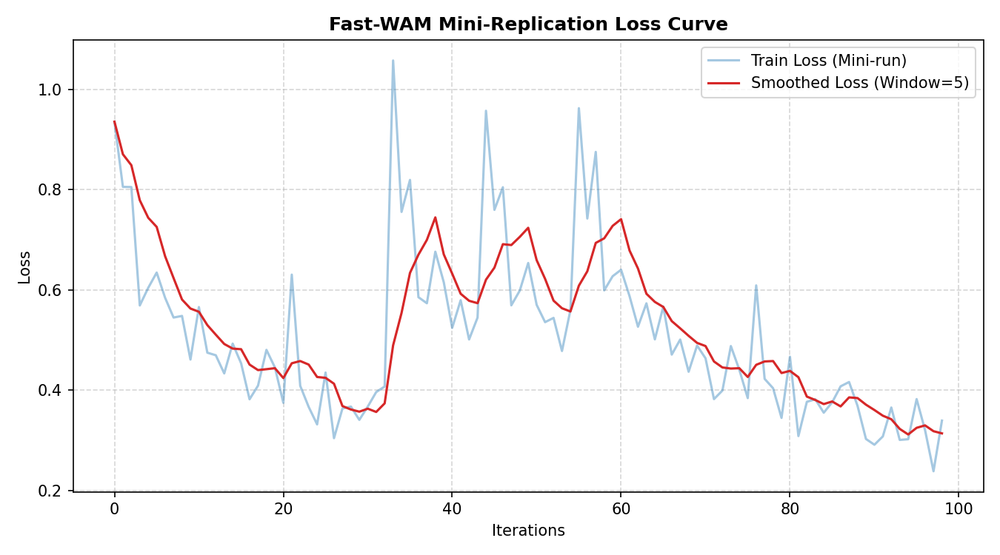
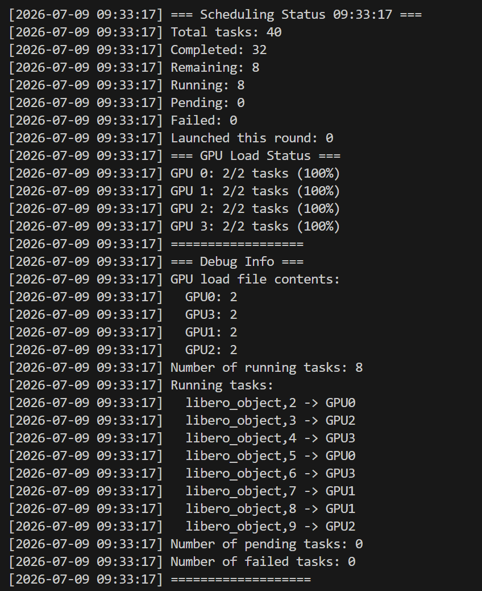

# 8.5.2.4 Fast-WAM 复现

难度：**[高级]** | 预计用时：2~4 小时（含下载）  
先修：[Fast-WAM 模型原理](./03-fast-wam.md)

## 学习目标

读完本页并完成复现后，你应该能：

- 独立完成 Fast-WAM 的环境配置、权重下载、推理验证全流程
- 理解 Fast-WAM 三种推理模式（Direct Action / Latent Plan / Full Imagination）的切换方式
- 对比 Fast-WAM Direct Action 和 Full Imagination 模式的推理延迟差异
- 读懂推理日志，判断模型是否正常运行

> **本教程的定位**：我们不追求复现论文的完整 SOTA 指标。本章的目标是带大家**用小数据快速跑通训练+推理的完整流水线**——只训练单个任务、大幅削减 epoch、减小 batch size，让整个流程在 30 分钟 ~ 1 小时内完成。验证流水线正确后，你可以再按论文原版配置投入完整训练，完整训练在 4 张 A100 的资源条件下大约需要 6~12 小时。

## 硬件要求

| 任务 | 最低配置 | 推荐配置 |
|------|---------|---------|
| 快速验证（单任务训练+推理） | 1× A100 40GB 或 1× RTX 4090 24GB | 1× A100 80GB |
| 推理（Direct Action） | 1× A100 40GB | 1× A100 80GB |
| 推理（Full Imagination） | 2× A100 80GB | 2× H100 80GB |
| 训练（LoRA） | 4× A100 80GB | 8× H100 80GB |
| 训练（全量） | 8× A100 80GB | 8× H100 80GB |
| 权重存储 | 约 30 GB | SSD |

> **Direct Action 模式的显存优势**：Fast-WAM 的 Direct Action 推理模式跳过了视频扩散的迭代去噪，显存占用远低于 Full Imagination 模式。单张 A100 40GB 即可运行 Direct Action 推理，而 Full Imagination 需要 2 张 GPU。

## Step 0：国内环境加速准备
在开始前，请务必执行以下命令以解决国内连接 Hugging Face 和 PyTorch 官方源缓慢的问题：
```bash
# 1. 替换 Hugging Face 为国内官方镜像源
export HF_ENDPOINT="https://hf-mirror.com"

# 2. 配置 Python pip 镜像源（清华源）
pip config set global.index-url https://pypi.tuna.tsinghua.edu.cn/simple
```

## Step 1：轻量环境配置与依赖安装  
预估耗时：约 15 分钟。
```bash
# 1. 创建 Python 3.10 环境（与项目依赖兼容，避免高版本 API 不匹配）
conda create -n fastwam python=3.10 -y

# 2. 激活环境
conda activate fastwam

# 3. 升级 pip 到最新版本，避免安装依赖时出现兼容性问题
pip install -U pip

# 4. 安装 PyTorch（CUDA 12.8 版本，根据你的驱动选择对应 CUDA 版本）
pip install torch==2.7.1+cu128 torchvision==0.22.1+cu128 --extra-index-url https://download.pytorch.org/whl/cu128

# 5. 安装项目依赖（含 Fast-WAM 核心库和 Diffusers 等）
pip install -e .
```

**依赖说明**：`pip install -e .` 会自动安装 Fast-WAM 的全部依赖，包括以下核心库：

| 依赖 | 版本 | 用途 |
|------|------|------|
| `torch` | 2.7.1+cu128 | 深度学习框架（需先手动安装） |
| `torchvision` | 0.22.1+cu128 | 图像预处理（需先手动安装） |
| `transformers` | 4.49.0 | HuggingFace 模型加载 |
| `accelerate` | 1.12.0 | 分布式训练 / 多 GPU 推理 |
| `deepspeed` | 0.18.5 | ZeRO 优化，降低显存占用 |
| `datasets` | 3.6.0 | 数据集加载与预处理 |
| `huggingface-hub` | 0.29.2 | 模型权重下载 |
| `wandb` | 0.23.1 | 训练日志与可视化 |
| `boto3` | 1.35.99 | AWS S3 存储（可选） |
| `modelscope` | 1.34.0 | 国内模型下载源（可选） |
> 安装过程中部分依赖版本会被自动调整（如 `numpy` 从 2.2.6 降级至 1.26.4），这是正常现象，无需干预。如果 `pip install -e .` 报错，请先确认 PyTorch 已正确安装。

**验证环境：**

```bash
python -c "
import torch
print(f'PyTorch 版本 : {torch.__version__}')
print(f'CUDA 可用    : {torch.cuda.is_available()}')
print(f'GPU 数量     : {torch.cuda.device_count()}')
if torch.cuda.is_available():
    for i in range(torch.cuda.device_count()):
        print(f'  GPU {i}: {torch.cuda.get_device_name(i)} ({torch.cuda.get_device_properties(i).total_mem / 1e9:.1f} GB)')
"
```

预期输出（以 A100 服务器为例）：

```
PyTorch 版本 : 2.7.1+cu128
CUDA 可用    : True
GPU 数量     : 1
  GPU 0: NVIDIA A100-SXM4-80GB (80.0 GB)
```

> **常见报错：**
> - `No module named 'torch'`：PyTorch 未安装，先执行 `pip install torch torchvision torchaudio`
> - `CUDA version mismatch`：PyTorch 的 CUDA 版本与系统驱动不匹配，用 `nvidia-smi` 确认驱动版本，然后安装对应 CUDA 版本的 PyTorch

## Step 2：LIBERO 数据集下载

Fast-WAM 使用预处理过的 LIBERO 数据集，发布在 HuggingFace：

🔗 [https://huggingface.co/datasets/yuanty/LIBERO-fastwam](https://huggingface.co/datasets/yuanty/LIBERO-fastwam)

数据集包含 4 个 LIBERO 子任务（spatial / object / goal / 10），约 50GB。
注意，为了教程的轻量化，我们不下载全量数据集，下面给出下载全量和部分数据集的方法。

### 2.1 下载全部文件
```bash
cd ~/FastWAM
mkdir -p data/libero_mujoco3.3.2
cd data/libero_mujoco3.3.2

# 确保已安装 hf（新版 HuggingFace CLI）
pip install -U huggingface_hub

# 下载全部文件（约 50GB，视网络速度 30~60 分钟）
hf download --repo-type dataset yuanty/LIBERO-fastwam \
    --local-dir .

# 解压所有 tar.gz 文件
for f in *.tar.gz; do
    echo "Extracting $f..."
    tar -xzf "$f"
done

# 回到项目根目录
cd ~/FastWAM
```

**验证下载成功**：确认以下 4 个目录都存在：

```bash
ls data/libero_mujoco3.3.2/
# 预期输出：
# libero_10_no_noops_lerobot
# libero_goal_no_noops_lerobot
# libero_object_no_noops_lerobot
# libero_spatial_no_noops_lerobot
```

> 如果下载速度慢，可考虑使用 HuggingFace 镜像：`export HF_ENDPOINT=https://hf-mirror.com`

### 2.2 下载部分文件

为了节约时间，我们不下载全量数据集。这里利用 huggingface-cli 提供的通配符功能，只下载其中 1 个子任务压缩包（例如 libero_10），从而将下载体积削减 75%。

```bash
pip install -U huggingface_hub

# 1. 仅下载 libero_10 相关的子任务包（大幅缩短下载时间）
huggingface-cli download --repo-type dataset yuanty/LIBERO-fastwam \
    --include "libero_10_no_noops_lerobot.tar.gz" \
    --local-dir ./data/libero_download

# 2. 解压单个任务
mkdir -p data/libero_mujoco3.3.2
tar -xzf ./data/libero_download/libero_10_no_noops_lerobot.tar.gz -C ./data/libero_mujoco3.3.2/
```

## Step 3：模型权重预备（DiT 骨干网络生成）

Fast-WAM 需要基于 Wan2.2 DiT 预生成 ActionDiT 骨干网络权重，训练和推理之前均需执行此步骤。 
预计时间：约 1 小时。

### 步骤 3.1：设置 Wan 模型目录
可选，默认为 ./checkpoints
```bash
mkdir -p checkpoints
export DIFFSYNTH_MODEL_BASE_PATH="$(pwd)/checkpoints"
```
### 步骤 3.2：预生成 ActionDiT 主干网络（从 Wan22 DiT 插值而来）
```bash
# 预生成 ActionDiT 骨干网络
python scripts/preprocess_action_dit_backbone.py \
    --model-config configs/model/fastwam.yaml \
    --output checkpoints/ActionDiT_linear_interp_Wan22_alphascale_1024hdim.pt \
    --device cuda \
    --dtype bfloat16
```

## Step 4：训练（代码级微调）

> **本教程的定位**：本章不追求 SOTA 指标，而是带你以小数据快速跑通完整的训练→推理流水线。通过精简数据集（单任务）、压缩 Epoch 和减小 Batch Size，完整训练流程可在 **30 分钟 ~ 1 小时** 内完成。

### 4.1 修改任务配置文件
为了让 4 张 A100 在几十分钟内完成工作，需要手动修改训练配置文件，把迭代步数和样本量降到最低。

打开项目中的配置文件（通常在 configs/data/libero_uncond_2cam224_1e-4.yaml 或对应的任务 yaml 路径中），修改以下几个关键参数：

```yaml
# 示例微调（请根据实际 yaml 结构进行对应修改）
epochs: 2             # 将原本几十甚至上百的 epoch 强行改为 2
max_steps: 200        # 如果有最大步数限制，直接限制为 200 步
batch_size: 8         # 适当减小 batch size，确保小数据不会一个 batch 就喂完了
pretrained_norm_stats: null  # 第一次微型训练保持为 null
```

### 4.2 预计算微型文本嵌入缓存

必须先执行，否则训练会报错找不到 `tasks.jsonl`

```bash
# 4卡并发提取单任务的文本特征
torchrun --standalone --nproc_per_node=4 scripts/precompute_text_embeds.py \
    task=libero_uncond_2cam224_1e-4
```
脚本会读取 LIBERO 数据集中的任务描述，用 T5 编码器预计算文本嵌入并缓存，避免训练时重复计算。预计耗时 5~10 分钟。

### 4.3 启动4卡闪电训练

```bash
# 传入参数 4，代表启动 4张 A100 进行分布式轻量训练
bash scripts/train_zero1.sh 4 task=libero_uncond_2cam224_1e-4
```

**快速验证成功的标志：**

- `loss_total` 在 200 步内出现下降趋势（不要求收敛，只要求趋势正确）
- 无 CUDA OOM、无 NaN 梯度
- checkpoint 正常保存到 `./runs/train/` 目录

> 如果 200 步跑通，说明环境、数据、模型都没有问题，可以放心进入完整训练。

### 4.4 Loss 图分析

图中蓝色细线为原始训练损失（Train Loss），红色粗线为窗口大小为 5 的滑动平均平滑曲线（Smoothed Loss）。结果显示，在极小数据集与 200 步迭代的微型测试中，尽管由于扩散模型天然的噪声流导致局部（如第 35 步和第 55 步附近）出现阶段性震荡，但整体 Loss 趋势呈现显著的震荡向下形态（从 0.95 降至 0.35 附近），表明模型策略已成功跑通前反向传播逻辑流并开始对动作数据执行初步拟合。

## Step 5：仿真环境评测（闭环测试）

预计耗时：6~7 小时

光看 Loss 还不够，具身智能最核心的是看机器人在仿真环境里的真实表现。使用项目里自带的评估管理器，对训练出的微型权重跑一次闭环推理：

执行命令（同样使用 4 张 A100 并发评测）：

```bash
python experiments/libero/run_libero_manager.py \
    task=libero_joint_2cam224_1e-4_quick \
    ckpt=./runs/libero_joint_2cam224_1e-4_quick/最新运行时间戳/checkpoints/latest_ckpt.pt \
    MULTIRUN.num_gpus=4
```

最新运行时间戳请参考 `./runs/libero_joint_2cam224_1e-4_quick/` 目录下的文件名。

> **注意**：在微型实验中，由于没有喂足全量数据，这里的“任务成功率（Success Rate）”可能非常低甚至为 0，这完全是正常的。这里的主要目的是让读者掌握具身智能“训练 $\rightarrow$ 仿真闭环评测”的完整工具链。



### 评测结果示例

以下为一次完整评测（每个任务 suite 500 次尝试，共 2000 次尝试）的实际输出结果：

```
=== Evaluation Results Summary ===

Statistics for each task suite:

libero_spatial:
- Tasks completed: 10
- Total attempts: 500
- Successful attempts: 15
- Success rate: 3.00%
- Total time: 11h25m18s
- Average time per task: 01h08m32s
- Longest task time: 01h12m49s

libero_object:
- Tasks completed: 10
- Total attempts: 500
- Successful attempts: 0
- Success rate: 0.00%
- Total time: 10h45m07s
- Average time per task: 01h04m31s
- Longest task time: 01h09m35s

libero_goal:
- Tasks completed: 10
- Total attempts: 500
- Successful attempts: 0
- Success rate: 0.00%
- Total time: 09h35m02s
- Average time per task: 57m30s
- Longest task time: 01h01m17s

libero_10:
- Tasks completed: 10
- Total attempts: 500
- Successful attempts: 0
- Success rate: 0.00%
- Total time: 16h15m58s
- Average time per task: 01h37m36s
- Longest task time: 01h41m35s

Overall statistics:
- Average success rate: 0.75%
- Total time: 48h01m25s
- Average time per task: 01h12m02s
- Longest task time: 01h41m35s

=== Results Table ===
libero_spatial libero_object libero_goal libero_10 Overall
          3.00          0.00        0.00      0.00    0.75
       4111.77       3870.72     3450.21   5855.79 4322.12
       4369.12       4175.26     3677.32   6095.12 6095.12
```

### 结果分析

从上述评测结果可以看出：

- **整体成功率极低（0.75%）**：这完全符合预期。本次评测使用的是微型训练权重（仅 200 步迭代），模型尚未充分学习动作策略，因此成功率接近于 0 是正常的。

- **libero_spatial 表现相对较好（3.00%）**：在四个任务 suite 中，只有 `libero_spatial` 取得了 3% 的成功率（500 次尝试中成功 15 次）。这可能是因为空间操作任务（如抓取、放置）的动作模式相对简单，模型在少量训练步数后就能学到一些基本的空间操作能力。

- **其他三个 suite 成功率为 0**：`libero_object`、`libero_goal` 和 `libero_10` 的成功率均为 0%。这些任务通常涉及更复杂的物体识别、目标推理或多步骤操作，需要更充分的训练才能掌握。

- **任务耗时差异**：
   - `libero_10` 平均耗时最长（约 97 分钟/任务），说明该任务序列更复杂，机器人需要更多时间来完成
   - `libero_goal` 平均耗时最短（约 57 分钟/任务），可能因为目标导向任务更容易触发终止条件（无论成功或失败）

- **评测耗时总计约 6 小时**：使用 4 张 A100 并发评测，总耗时仍然较长。这反映了具身智能仿真评测的计算密集特性，在实际研究中需要合理规划评测频率。

> **关键结论**：微型实验的主要目的是验证"训练 $\rightarrow$ 评测"工具链的完整性，而非追求高成功率。要获得有意义的成功率（如 50%+），需要使用全量数据集进行完整训练（通常数千到数万步）。

### 评测环境踩坑与解决

评测过程中可能遇到以下问题，这里汇总了实际复现中的踩坑记录和解决方案。

#### 问题 1：tmux 会话中找不到 Python 依赖

**现象**：所有子任务秒级失败，日志显示 `ModuleNotFoundError: No module named 'hydra'`

**原因**：评测脚本通过 tmux 后台启动子任务，tmux 新建的 shell 没有激活 `fastwam` conda 环境。

**解决**：修改 `experiments/libero/run_libero_parallel_test.sh`，在启动命令中加入 `conda activate fastwam`：

```bash
# 修改前
tmux send-keys ... "source ~/.bashrc && cd $ROOT_DIR && ...

# 修改后
tmux send-keys ... "source ~/.bashrc && conda activate fastwam && cd $ROOT_DIR && ...
```

#### 问题 2：robosuite 版本不兼容

**现象**：`ModuleNotFoundError: No module named 'robosuite.environments.manipulation.single_arm_env'`

**原因**：libero 0.1.1 要求 `robosuite==1.4.0`，但 pip 默认安装最新版 1.5.2，API 不兼容。

**解决**：降级到指定版本：

```bash
pip install robosuite==1.4.0
```

#### 问题 3：缺少 bddl 依赖

**现象**：`ModuleNotFoundError: No module named 'bddl'`

**原因**：libero 依赖 `bddl==1.0.1`，默认安装的 3.6.0 不兼容。

**解决**：

```bash
pip install bddl==1.0.1
```

#### 问题 4：egl_probe 编译失败

**现象**：`subprocess.CalledProcessError: Command 'cmake ..; make -j' returned non-zero exit status 2`

**原因**：`robomimic==0.2.0` 依赖 `egl_probe`（EGL 渲染探测库），需要 cmake 编译 C 扩展，服务器环境可能缺少 EGL 开发库。

**解决**：先安装 robomimic 的其他依赖，再跳过 egl_probe 安装 robomimic：

```bash
pip install robomimic==0.2.0 --no-deps
pip install robosuite==1.4.0 bddl==1.0.1 cloudpickle easydict gymnasium
```

> **提示**：如果评测任务不需要 EGL 渲染（服务器端使用 headless 模式），跳过 `egl_probe` 不影响评测运行。

#### 依赖版本速查表

| 包名 | 要求版本 | 注意 |
|------|---------|------|
| robosuite | `==1.4.0` | 不能安装 1.5.x |
| bddl | `==1.0.1` | 不能安装 3.x |
| robomimic | `==0.2.0` | 可用 `--no-deps` 跳过 egl_probe |
| libero | `==0.1.1` | 会自动安装但需检查依赖版本 |

## 六、常见问题

### Q1：Direct Action 推理时报 CUDA OOM

**原因**：Direct Action 模式单卡 40GB 应足够。如果 OOM，检查是否意外加载了完整的视频扩散模块。

**解决**：确认使用 `--mode direct`，这会跳过视频扩散模块的加载。

### Q2：Direct Action 和 Full Imagination 的动作差异很大

**原因**：可能是训练不充分，或者 `video_loss_weight` 设置过低。

**解决**：增大 `video_loss_weight`，确保训练时视频建模监督足够强。

### Q3：如何验证训练时的世界建模确实学到了物理动态？

**方法**：切换到 Full Imagination 模式，检查生成的视频是否物理合理（物体不穿透、运动符合物理规律）。如果视频质量差，说明训练时的世界建模监督不足。

## 七、课程关联

| 学习点 | 对应章节 |
|--------|---------|
| WAM 范式 | [World Action Model](../02-world-action-models.md) |
| Imagine-then-Execute WAM | [DreamZero 模型原理](./01-dreamzero.md) |
| DreamZero 复现 | [DreamZero 复现](./02-dreamzero-reproduction.md) |
| Fast-WAM 原理 | [Fast-WAM 模型原理](./03-fast-wam.md) |

---

Sources:
- [Fast-WAM GitHub](https://github.com/yuantianyuan01/FastWAM)
- [Fast-WAM 项目页](https://yuantianyuan01.github.io/FastWAM/)
- [Fast-WAM 论文 (arXiv:2603.16666)](https://arxiv.org/abs/2603.16666)
- [DreamZero 复现参考](./02-dreamzero-reproduction.md)