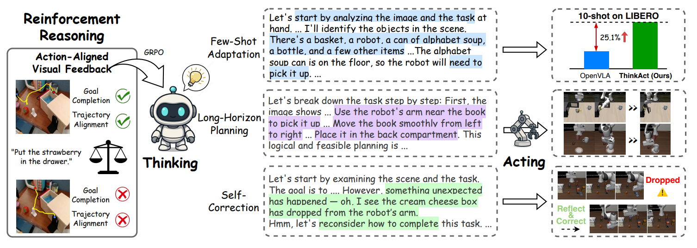
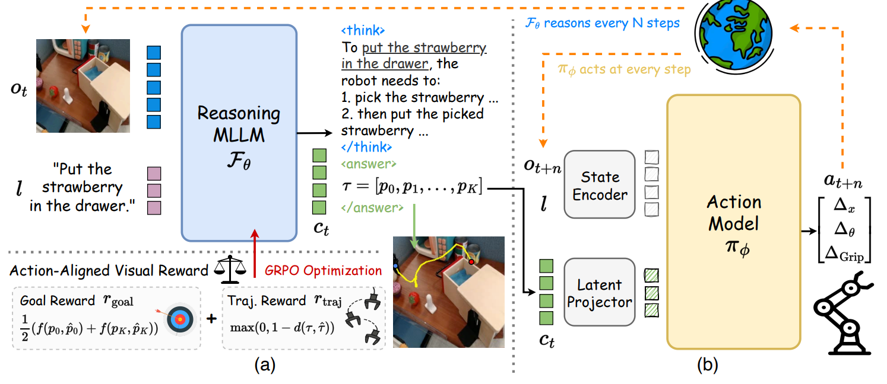

# 8.5.4.1 ThinkAct 模型

难度：**[高级]** | 预计用时：35分钟    
先修：[双系统 VLA](../03-dual-system-vla.md)  → [VLA 的 RL 后训练](../../02-behavior-cloning/06-vla-rl-posttraining.md)

> 传统的机器人往往只有“条件反射”式的肌肉直觉，看到画面就直接输出动作，一旦遇到长路线任务或中途失手等突发状况，就会立刻“大脑宕机”。为了打破这一僵局，英伟达（NVIDIA）等机构提出了全新的 ThinkAct 框架。它创造性地为机器人构建了“慢思考的大脑”与“快控制的肌肉”，让机器人在动手前能像人类一样先在脑海中深度思考、拆解步骤并规划视觉轨迹。这种“先想后做”的机制不仅让机器人能从容应对复杂任务，更让它拥有了在失败后重新思考、自动纠错的惊人智慧。本章将带你揭秘，AI 究竟是如何教会机器人“三思而后行”的。

## 学习目标

读完本页后，你应该能：

- 用一句话解释 ThinkAct 与典型 VLM 双系统（Gemini Robotics / Helix / GR00T）的本质区别
- 画出 ThinkAct 的 System-2 → visual plan latent → System-1 数据流，并说清 RL 奖励信号的作用
- 解释为什么"视觉隐空间计划"比"语言文本计划"更适合作为双系统间接口

## 快速概览
[ThinkAct](https://arxiv.org/abs/2507.16815) 这篇论文提出了一个名为 ThinkAct 的机器人具身智能框架。它的核心思想是让机器人在操作前像人类一样“先思考，后行动”。  
**解决的痛点**：传统的视觉-语言-行动（VLA）模型是“直觉型”的，直接把看到的画面和听到的指令映射成动作。这样的行为类似条件反射，导致它们在面对复杂的长距离任务或突发错误时表现不佳，缺乏多步规划和自我纠错的能力。    
**创新的双系统架构**：
- **思考系统**（Reasoning MLLM）：负责高层规划。论文用强化学习（GRPO算法）训练一个多模态大模型，使其在执行任务前生成长文本的思维链（CoT），并输出由 2D 关键点组成的“视觉规划轨迹”。  
- **行动系统**（Action Model）：负责低层执行。大模型的“思考结果”会被压缩成一个隐空间向量（Visual Plan Latent），传递给下游的动作模型，指导机械臂具体怎么动。  
**带来的突破**：该模型实现了极强的长距离规划能力、少样本适应能力（只看10个视频就能学会新场景），以及让人惊艳的自动检测失败并自我纠错的行为，例如物体从机械臂滑落后，它能自己发现并重新规划去抓取。



图1 ThinkAct 双系统架构总览：Reasoning MLLM（System-2）接收观测与指令，通过 RL 训练产出思维链与视觉规划轨迹（2D 关键点序列）；Action Model（System-1）以 visual plan latent 为条件高频生成动作，驱动机械臂执行。

## 一、为什么需要 ThinkAct？
建议先浏览 [ThinkAct 论文摘要](https://arxiv.org/abs/2507.16815) 获取整体印象，再回到这里对照理解。

> **你可能需要理解的核心术语**
>
> - **reinforced visual latent planning（强化视觉隐空间规划）**：把 System-2 的规划能力当作一个"通过试错来学习"的技能。System-2 每次输出一个 visual plan latent（相当于一张"视觉蓝图"，见后面解释），System-1 按蓝图执行；执行得好就奖励，不好就惩罚。经过反复训练，System-2 学会产出"能让 System-1 成功执行"的蓝图。  
> **核心区别**：传统 VLM 只是"看图说话"，System-2 不会从执行结果中学习；ThinkAct 的 System-2 会从"我出的主意被 System-1 执行得怎么样"中吸取教训。
> - **reinforcing action-aligned visual rewards（动作对齐的视觉奖励）**：给 System-2 的"打分"方式。不是简单的"任务成功 +1 分，失败 0 分"，而是看两个维度：① System-1 执行后离目标更近了吗？（goal completion, 目标完成度）；② System-1 走的路径和 System-2 预期的路径一致吗？（trajectory consistency, 轨迹一致性）。奖励在视觉特征空间中计算，确保 System-2 学到的"蓝图"和 System-1 的实际动作是"对齐"的。
> - **visual plan latent（视觉计划隐向量）**：System-2 和 System-1 之间传递的"视觉蓝图"。它是一个连续的数字向量，编码了"从当前画面到目标画面中间要经过哪些视觉状态"。
> **为什么用它而不是文字？**   
> 文字描述"把杯子从左边拿到右边"信息量有限，而 visual plan latent 可以编码杯子的精确位置、手的姿态、是否被遮挡等空间信息，而且它是连续向量，RL 可以直接对它做梯度优化。
> - **robot manipulation benchmarks（机器人操作基准测试）**：用来给机器人操作能力"打分"的标准考试。常见的有 CALVIN（考验长序列多任务）、LIBERO（考验持续学习新任务）、RLBench（考验多样化任务和随机初始条件）、SIMPLER（考验从仿真学到的技能能否迁移到真实世界）。ThinkAct 在这些"考试"上展现了出色的 few-shot 适应能力（看少量演示就能学会新任务）和长程规划能力（能完成需要多步操作的任务）。

### 典型 VLM 双系统的瓶颈

当前主流的双系统 VLA（如 Gemini Robotics、Helix、GR00T）架构可以概括为：

```
VLM（System-2）生成语言指令/计划  ——→  动作模型（System-1）执行
```

这套方案有两个核心问题：

| 问题 | 表现 |
|---|---|
| **语言瓶颈** | VLM 输出的文本计划信息密度有限，无法精确描述"夹爪旋转 32° 后从侧面滑入"这类细粒度动作意图 |
| **推理与执行脱节** | System-2 的 VLM 只在预训练数据上做语义推理，**没有收到过"我的计划被 System-1 执行得怎么样"的反馈信号**，无法从执行结果中学习改进 |

### ThinkAct 的回答

ThinkAct 的核心思路是：

> **用 RL 训练 System-2，让它学会产出"System-1 能执行成功的视觉隐空间计划"；用 visual plan latent 替代文本作为两系统之间的接口。**

直觉上：如果 System-2 的输出是一个"视觉蓝图"（而不是一段文字），它就能编码更丰富的空间-动作信息；如果这个蓝图的质量通过 RL 以"System-1 最终是否完成任务"来评估，System-2 就能学会"什么样的计划能落地"。

### 和典型 VLM 双系统的完整对比

| 维度 | 典型 VLM 双系统 | ThinkAct |
|---|---|---|
| System-2 训练方式 | 预训练 VLM + 指令微调 | RL（action-aligned visual rewards） |
| System-2 输出 | 语言文本计划 | 视觉隐空间 latent plan |
| 两系统接口 | 语言 token / 文本特征 | visual plan latent（连续向量） |
| 反馈闭环 | 无（开环规划） | 有（RL 奖励来自 System-1 执行结果） |
| 自我纠错 | 依赖 VLM 链式推理 | RL 训练中自然习得"失败→调整计划" |

## 二、模型原理深度解析

### 2.1 整体架构



图2.1 ThinkAct 整体数据流。System-2 以低频异步运行，输出 visual plan latent；System-1 以高频执行，受 latent 条件化；RL 奖励基于任务完成度与轨迹一致性回传至 System-2。

### 2.2 核心组件详解

#### 组件 1：System-2 — RL 推理规划器

- **作用**：接收当前观测与任务指令，用 RL 训练的多模态 LLM 推理出"能驱动 System-1 成功执行"的 visual plan latent
- **训练方式**：RL（action-aligned visual rewards），奖励信号来自 System-1 执行后的任务完成度与轨迹一致性
- **与纯预训练 VLM 的关键区别**：System-2 不是"看图说话"，而是"看图→规划→看执行结果→调整规划"的闭环学习体
- **推理频率**：低频异步运行（仅在需要重新规划时触发），不要求每步都调用

> **什么是 action-aligned visual rewards？**  
> ThinkAct 的 RL 奖励不是简单的"任务完成=1，未完成=0"，而是结合了**目标完成度**（subgoal completion）与**轨迹一致性**（trajectory consistency）：前者衡量 System-1 执行后是否更接近目标，后者衡量执行路径是否与预期规划一致。奖励信号在视觉隐空间中计算，确保 System-2 学到的 latent 与 System-1 的动作语义对齐。

#### 组件 2：Visual Plan Latent — 层间接口

- **作用**：作为 System-2 与 System-1 之间的信息载体，替代传统语言文本计划
- **形式**：连续高维向量，编码了"要达到目标需要经过的视觉中间状态"
- **优势**：
  - 信息密度远高于语言文本（可编码空间位置、姿态、遮挡关系等细粒度信息）
  - 与 System-1 的视觉输入天然对齐（不需要 text→vision 的跨模态翻译）
  - 可通过 RL 直接优化（语言文本不可微，latent 可微）

#### 组件 3：System-1 — Latent 条件化动作模型

- **作用**：被 visual plan latent 条件化，以高频生成机器人动作
- **输入**：当前观测 + visual plan latent
- **输出**：动作（如 delta 末端位姿、关节角度等）
- **训练方式**：行为克隆（BC），以 System-2 提供的 latent 为条件
- **运行频率**：高频闭环（与机器人控制频率匹配）

#### 组件 4：RL 奖励信号设计

- **目标完成奖励**：基于视觉状态变化衡量任务进度
- **轨迹一致性奖励**：System-1 的实际执行轨迹与 System-2 规划的隐式轨迹的匹配度
- **奖励计算在视觉隐空间中进行**，确保 latent 语义与执行动作对齐

### 2.3 异步执行机制：慢推理 / 快执行

ThinkAct 的 System-2 和 System-1 是**异步协作**的：

- System-2 仅在需要重新规划时运行（如任务阶段切换、执行出现偏差、检测到异常）
- System-1 持续高频运行，始终受最新的 visual plan latent 条件化
- 这避免了每步都调用大模型带来的延迟，同时保留了"需要时重新思考"的灵活性

### 2.4 关键能力

| 能力 | 来源 | 说明 |
|---|---|---|
| Few-shot 适应 | RL 训练的 System-2 泛化能力 | 仅需少量新任务演示即可规划出合适 latent |
| 长程规划 | System-2 的视觉隐空间规划 | 在 latent 空间编码多步子目标，System-1 逐步执行 |
| 自我纠错 | RL 闭环训练 | System-2 从失败经验中学到"什么样的 latent 会导致失败"，在推理时主动规避 |

### 2.5 关键性能数字

| 指标 | 值 | 说明 |
|---|---|---|
| System-2 参数量 | 7B（基础版，Qwen2.5-VL 初始化） | 也测试了 3B 小模型版本 |
| System-1 参数量 | 432M（DiT 架构） | 轻量动作模型，保障高频执行 |
| System-2 推理频率 | 每 N 步触发一次 | SimplerEnv 中 N=15，LIBERO 中 N=75，按任务长度动态调整 |
| System-1 控制频率 | 连续异步执行 N 步 | System-2 输出一次 plan，System-1 独立执行 N 步，无需等待 |
| 零样本泛化（OpenEQA） | 56.2% | 衡量零样本具身理解能力的综合得分 |
| Few-shot 适应（10-shot） | 比 OpenVLA 提升 25.1% | 仅用 10 个示范微调后的成功率提升 |
| 对比最强基线 Magma | LIBERO-Goal +7.3%，LIBERO-Spatial +9.5% | 同属 10-shot 设定 |
| 长程任务（LIBERO-Long） | 70.9% | 比端到端 OpenVLA 提升 15.3% |

> **读表提示**：System-2 参数量 7B 意味着"大脑"是一个标准的 7B 多模态大模型，推理一次需要一定时间，因此它不会每步都运行——这就解释了为什么 System-2 是"慢思考"（每 15~75 步才推理一次）。System-1 只有 432M 参数，可以高频运行，负责"快执行"。这种"大模型低频规划 + 小模型高频执行"的搭配，是 ThinkAct 在长程任务上达到 70.9% 成功率的关键。

## 三、代码框架解析

### 3.1 仓库结构

```
thinkact/
│
├── thinkact/
│   ├── system2/
│   │   ├── planner.py              ← System-2 RL 推理规划器（★ 核心）
│   │   ├── reward.py               ← action-aligned visual rewards 计算
│   │   └── rl_trainer.py           ← RL 训练循环
│   ├── system1/
│   │   ├── action_model.py         ← latent 条件化动作模型（★ 核心）
│   │   └── bc_trainer.py           ← System-1 行为克隆训练
│   ├── latent_interface/
│   │   └── visual_plan.py          ← visual plan latent 编码/解码
│   └── env/
│       └── rollout.py              ← 闭环异步执行环境
│
├── configs/
│   ├── system2_rl.yaml             ← System-2 RL 训练配置
│   └── system1_bc.yaml             ← System-1 BC 训练配置
│
├── scripts/
│   ├── train_system2.sh            ← System-2 RL 训练脚本
│   ├── train_system1.sh            ← System-1 BC 训练脚本
│   └── eval_async.sh               ← 异步推理评测脚本
│
└── pyproject.toml
```

### 3.2 关键文件说明

**`thinkact/system2/planner.py`**

System-2 的核心实现。关键设计：
- 基于多模态 LLM，在视觉隐空间中做推理规划
- 输出 visual plan latent 而非文本 token
- RL 训练时接收来自 System-1 执行结果的奖励信号

**`thinkact/system1/action_model.py`**

System-1 的核心实现。关键设计：
- 以 visual plan latent 为条件生成动作
- 行为克隆训练，教师信号来自专家演示
- 动作输出格式对接机器人控制接口

**`thinkact/latent_interface/visual_plan.py`**

两系统之间的接口定义：
- visual plan latent 的编码/解码
- 奖励信号在隐空间中的计算方式
- latent 维度与 System-1 输入接口的对齐

## 四、实验设计、结果与分析

为了验证 ThinkAct 框架的实际效果，论文在**机器人操作（低层控制）**和**具身智能推理（高层规划）**两大核心领域、共计 5 个主流基准测试上进行了全面评估。实验结果表明，“先思考、后行动”的机制在多项指标上均打破了行业纪录。

### 4.1 实验效果总览

以下是 ThinkAct 与当前主流具身智能模型在机器人操作任务（成功率 %）和具身推理任务（综合得分）上的对比数据摘要：

| 任务分类 | 评估基准 / 指标 | OpenVLA (端到端) | Magma (前沿基线) | **ThinkAct (Ours)** | 关键突破分析 |
| :--- | :--- | :---: | :---: | :---: | :--- |
| **机器人操作**（成功率 %） | **SimplerEnv-Google**(视觉匹配组合) | 37.3% | 68.4% | **71.5%** | 面对光照、物体干扰等视觉变体，ThinkAct 表现出极强的鲁棒性。 |
| | **LIBERO-Long**(长程任务规划) | 53.7% | - | **70.9%** | 相比纯直觉模型，成功率大幅提升 **15.3%**，证明了多步规划的威力。 |
| **具身推理**（综合得分） | **EgoPlan-Bench2**(日常长程规划) | - | 29.8% | **48.2%** | 准确率领先第二名 **2.5%**，大模型通过强化学习获得了真正的生活常识规划能力。 |
| | **OpenEQA**(零样本环境理解) | 50.8% | 49.1% | **56.2%** | 在没有经过该环境专属训练的情况下，对空间和物体状态的理解依然最强。 |

### 4.2 核心能力深度剖析

除了基础指标的提升，论文通过严谨的对比实验，揭示了 ThinkAct 涌现出的三大“类人”核心能力：

#### 1. 优秀的少样本适应能力（Few-Shot Generalization）
在实际应用中，我们不可能为每个新场景都录制成千上万个机械臂动作示范。
* **实验设计**：仅给模型提供 **10个操作示范（10-shot）**，直接让它去完全陌生、或者需要全新技能的环境中微调适应。
* **结果分析**：如论文图 5 所示，ThinkAct 的小样本泛化成功率全面碾压对手。在 LIBERO-Spatial（空间变体）和 LIBERO-Goal（新技能适应）上，分别超越前沿基线 Magma 达 **9.5%** 和 **7.3%**。这说明“大脑”里经过强化学习精炼出的高层视觉规划，能极大地帮助“肌肉”快速举一反三。

#### 2. “自我纠错”行为（Self-Correction）
传统机器人一旦失手（如物体滑落），由于没有中间反思机制，机械臂会继续对着空气做接下来的动作。
* **实验设计**：通过在输入端加入一小段历史视频剪辑 $o_{t-N:t}$，给大模型提供时间前后的上下文。
* **结果分析**：在实际测试中（如论文图 6 所示），当机械臂在移动奶油芝士盒子途中意外滑落时，ThinkAct 的推理大脑通过视频敏锐地察觉到了失败，并在心里生成了这样的思考逻辑：“*糟糕，东西掉了……让我重新规划，先回退到盒子掉落的位置重新抓取……*”。随后，动作模型成功接收并执行了这套修正方案，完成了任务。

#### 3. 动作对齐视觉奖励（RL Rewards）的决定性作用
为了探究为什么 ThinkAct 的思考这么好用，论文做了一组消融实验（Ablation Study），逐一拆解他们设计的强化学习奖励机制：

* **完全去掉视觉强化学习奖励**（只用普通的问答数据集做 SFT 预训练）：模型的表现立刻跌入谷底，在各个基准上的成功率降到最低。
* **去掉轨迹奖励 $r_{traj}$ 或目标奖励 $r_{goal}$**：模型性能均出现明显下滑。
* **实验结论**：大模型之所以能像人类一样做出切实可行的肉眼可见规划，正是因为论文引入了**目标奖励（看是否看准终点）**与**轨迹奖励（用DTW算法约束路线要符合物理规律）**，逼着大模型把抽象的文字思考和真实的物理世界绑在了一起。

### 4.3 总结：科学的“性能代价”

> 💡 **给读者的小贴士**
>
> 世界上没有免费的午餐，让机器人“三思而后行”也是有代价的。论文在测试中指出，因为加入了大模型在后台实时吐字思考（Autoregressive Reasoning）的过程，ThinkAct 的平均执行时间比传统的“直觉型”端到端模型 OpenVLA **慢了约 17%**。
> 
> 但这完全是值得的！这 17% 的算力时间延迟，换来的是任务成功率 **15.3% 的断层式提升** 以及机器人**主动发现错误并修正**的智慧。这种“牺牲一点速度，换取绝对成功率”的模式，正是具身智能迈向复杂工业和家庭场景的必经之路。

## 五、阅读卡片

```yaml
thinkact_reading_card:
  论文: "ThinkAct: Reasoning-Enhanced Dual-System VLA (arXiv:2507.16815)"
  机构: NVIDIA Research Taiwan + 台湾大学
  发表: NeurIPS 2025
  项目页: https://jasper0314-huang.github.io/thinkact-vla/

  model_type: Reasoning-Enhanced Dual-System VLA
  system_2_type: RL-trained Multimodal LLM Reasoning Planner
  system_1_type: Visual-Plan-Conditioned Action Model

  key_innovation:
    - "System-2 用 RL 训练，而不是纯预训练 VLM"
    - "层间接口是 visual plan latent，不是语言文本"
    - "两系统异步运行：慢推理 / 快执行"

  inputs:
    - 多视角图像观测
    - 语言任务指令
    - 机器人本体状态
  outputs:
    - System-2: visual plan latent
    - System-1: 动作（如 delta 末端位姿）

  training:
    system_2: RL（action-aligned visual rewards）
    system_1: 行为克隆（BC）
  rewards:
    - 目标完成度（subgoal completion）
    - 轨迹一致性（trajectory consistency）

  capabilities:
    - few_shot_adaptation: 少量演示即可适应新任务
    - long_horizon_planning: 隐空间多步子目标规划
    - self_correction: RL 闭环训练习得的推理纠错

  vs_gemini_robotics:
    - gemini_system2: 预训练 VLM，语言计划
    - thinkact_system2: RL 推理器，视觉隐空间计划
    - gemini_interface: 语言 token
    - thinkact_interface: visual plan latent

  risks_to_check:
    - system2_latency: System-2 推理延迟决定重新规划频率
    - rl_reward_design: 奖励函数设计的质量直接影响 System-2 学习效果
    - latent_interpretability: 隐空间计划不可直接解释，调试困难
    - async_sync_gap: 异步执行时 System-2 规划与 System-1 执行状态可能不一致
```

## 五、自测问题

1. ThinkAct 的 System-2 和 Gemini Robotics 的 System-2 在训练方式和输出上有什么本质区别？这个区别带来了什么优势？
2. 为什么 visual plan latent 比语言文本计划更适合作为双系统 VLA 的层间接口？请从信息密度和可优化性两个角度解释。
3. ThinkAct 的 RL 奖励信号包含"目标完成度"和"轨迹一致性"两个分量，各起什么作用？如果只保留前者会怎样？
4. 异步执行中，System-2 在什么条件下触发重新规划？如果 System-2 推理太慢会发生什么？
5. ThinkAct 的自我纠错能力是如何产生的？这和"RL 闭环训练"有什么关系？

---

Sources:
- [ThinkAct 论文 (arXiv:2507.16815)](https://arxiv.org/abs/2507.16815)
- [ThinkAct 项目页](https://jasper0314-huang.github.io/thinkact-vla/)
- [Fast-ThinkAct 后续工作 (arXiv:2601.09708)](https://arxiv.org/abs/2601.09708)