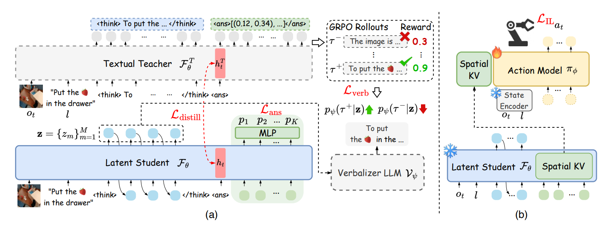

# 8.5.4.2 Fast-ThinkAct 模型

难度：**[高级]** | 预计用时：30分钟    
先修：[双系统 VLA](../03-dual-system-vla.md) → [ThinkAct](01-thinkact.md)

> 在上一节中，我们学习了 ThinkAct 如何通过显式的文本思维链赋予机器人强大的泛化与长期规划能力。然而，在需要高频、实时响应的真实物理世界中，生成动辄数百个文本 Token 的思考过程会带来极高的推理延迟，成为制约机器人安全、敏捷控制的致命瓶颈。
> 为了打破“深度思考”与“即时响应”不可兼得的僵局，NVIDIA 提出了 Fast-ThinkAct 框架。它创新地提出了**可言语化的隐空间推理**（Verbalizable Latent Reasoning），通过将冗长的文本思维链压缩为极少数的连续隐空间 Token，在完美继承教师模型规划能力的同时，成功将推理延迟大幅降低了 89.3%。接下来，我们将深入探索 Fast-ThinkAct 的核心机制，看看它是如何让机器人真正做到**“既聪明、又敏捷”**的。

## 学习目标

读完本页后，你应该能：

- 用一句话说清 Fast-ThinkAct 相比 ThinkAct 的核心改进和不变之处
- 画出 teacher-student 蒸馏流程图，解释 latent CoT 蒸馏如何压缩推理开销
- 解释"verbalizable latent planning"的含义，以及它为什么能同时兼顾效率和可解释性

## 一、为什么需要 Fast-ThinkAct？

### ThinkAct 的效率瓶颈

还记得上一个章节末尾我们提到的“性能代价”吗？ThinkAct 在能力上突破了传统 VLM 双系统的上限，但代价是 System-2 的推理开销：

| 问题 | 表现 |
|---|---|
| **推理延迟高** | System-2 的 RL 推理器需要多步"思考"才能产出 visual plan latent，每次重新规划都引入显著延迟 |
| **实时性不足** | 在需要频繁重新规划的动态场景中，System-2 的慢推理导致 System-1 拿着过时的 latent plan 执行，控制频率掉出可用区间 |

ThinkAct 的"慢推理 / 快执行"设计在静态任务中可行，但当任务需要快速响应环境变化时，System-2 就成了瓶颈。

### Fast-ThinkAct 的回答

Fast-ThinkAct 的核心思路是：

> **把 ThinkAct 的 System-2 当作 teacher，蒸馏出一个更高效的 student System-2——它不需要显式地一步步推理，而是直接产出与 teacher 等效的 latent plan。**

直觉上：ThinkAct 的 System-2 经过 RL 训练后已经学会了"如何思考"，Fast-ThinkAct 把这个思考过程"压缩"成 latent chain-of-thought（隐式思维链），让 student 模型一次前向就产出结果，而不需要 teacher 那样的多步推理。

### 和 ThinkAct 的完整对比

| 维度 | ThinkAct | Fast-ThinkAct |
|---|---|---|
| System-2 推理方式 | 显式多步推理（RL 训练） | 隐式一步推理（蒸馏自 teacher） |
| System-2 延迟 | 高（多次前向） | 低（单次前向） |
| 规划表示 | visual plan latent | verbalizable latent plan（可语言化但仍在隐空间） |
| 训练方式 | RL（action-aligned visual rewards） | Latent CoT 蒸馏（teacher = ThinkAct System-2） |
| 长程规划 | ✅ | ✅（保留） |
| 自我纠错 | ✅ | ✅（保留） |
| 可解释性 | 低（纯隐空间） | 中（latent 可映射为语言描述） |
| 控制实时性 | 受限 | 进入可用区间 |

> **你可能需要理解的核心术语**
>
> - **verbalizable latent reasoning（可语言化的隐空间推理）**：Fast-ThinkAct 最核心的创新。ThinkAct 的 visual plan latent 是一个"黑箱"——System-2 输出的数字向量完全不可解释，你只知道它能指导 System-1 执行，但不知道它"在想什么"。Fast-ThinkAct 在 latent 空间上施加了一个约束：让 latent 的一部分维度可以被映射为人类能读懂的自然语言描述。  
> **打个比方**：ThinkAct 的 latent 像是 System-2 递给你一张"密文纸条"，System-1 能看懂并执行，但你看不懂；Fast-ThinkAct 的 verbalizable latent 像是同一张纸条，但某些关键信息被"翻译"成了中文——比如前几个维度告诉你"当前阶段是抓取（置信度 0.8）"，后几个维度仍然是连续的几何量（如夹爪角度）。  
> **为什么重要？** 
> - **可调试性**：当机器人出错时，你可以检查 latent 对应的语言描述，定位是"规划错了"还是"执行错了"；
> - **效率不丢失**：latent 仍然是连续向量，保留了对连续空间信息的编码能力，不牺牲 System-1 的执行精度；
> - **蒸馏的桥梁**：语言对齐让 teacher（ThinkAct）→ student（Fast-ThinkAct）的蒸馏过程有了额外的监督信号，student 不只是"照猫画虎"地模仿 latent，还要理解 latent 背后的语义。

## 二、模型原理深度解析

### 2.1 整体架构



图2.1 Fast-ThinkAct 整体数据流。左侧为 ThinkAct teacher System-2（显式多步推理），中间为 latent CoT 蒸馏过程，右侧为 Fast-ThinkAct student System-2（单步推理）。Student 产出的 verbalizable latent plan 直接条件化 System-1 进行高频控制。

### 2.2 核心组件详解

#### 组件 1：Verbalizable Latent Planning

- **作用**：将 ThinkAct 的纯隐空间规划改造为"可语言化"的隐空间规划——latent 仍保留连续向量的高效性，但每个维度可部分映射为自然语言语义
- **为什么需要 verbalizable？**  
  ThinkAct 的 latent plan 是完全不可解释的黑箱。Fast-ThinkAct 引入 verbalizable 约束，让 latent 的每个子空间对应可描述的子目标（如"移动到物体上方""张开夹爪""下降至抓取高度"），在保持隐空间效率的同时提升了可调试性
- **形式**：结构化 latent，分为语义维（可映射为语言）和动作维（纯连续信息）
- **与纯语言计划的区别**：仍保留连续隐空间的信息密度，语言映射是"附加"而非"替代"

> **什么是 verbalizable latent？**  
> 想象一个 latent 向量 `[0.8, 0.1, 0.3, ...]`。在 ThinkAct 中，这些数字完全不可解释。在 Fast-ThinkAct 中，通过训练时引入语言对齐损失，前几个维度可以映射为"抓取阶段"（0.8 = 正在抓取），后几个维度仍是纯几何信息（夹爪旋转角度等）。这种"半可解释"设计既保留了隐空间的表达能力，又让人类能理解 System-2 的规划逻辑。

#### 组件 2：Latent Chain-of-Thought 蒸馏

- **作用**：从 ThinkAct teacher 的显式推理过程中蒸馏出"压缩版"的隐式推理链，让 student 一次前向即可产出等效 latent plan
- **Teacher（ThinkAct System-2）**：多步推理，每步产出中间 latent，最终合成 visual plan latent
- **Student（Fast-ThinkAct System-2）**：单步推理，直接产出 verbalizable latent plan
- **蒸馏目标**：
  - **Latent 对齐损失**：student 产出的 latent plan 与 teacher 最终 latent plan 的 MSE / cosine 距离
  - **中间表示对齐损失**：student 的隐层状态与 teacher 推理链中各中间步骤的 latent 对齐
  - **语言对齐损失**：verbalizable 部分的 latent 与对应语言描述的对齐

```python
# 简化版 Latent CoT 蒸馏训练
def distill_step(batch):
    obs = batch["observation"]
    task = batch["instruction"]

    # Teacher（ThinkAct）：多步显式推理
    with torch.no_grad():
        latent_t1, latent_t2, ..., latent_final = teacher.think(obs, task)
        # latent_t1..latent_tN 是中间推理步骤的 latent 序列

    # Student（Fast-ThinkAct）：单步推理
    latent_student = student.think(obs, task)

    # 蒸馏损失
    loss_final = F.mse_loss(latent_student, latent_final)           # 最终输出对齐
    loss_intermediate = align_intermediate(student.hidden_states,   # 中间表示对齐
                                            [latent_t1, latent_t2, ...])
    loss_language = language_alignment(latent_student, task)         # 语言对齐

    return loss_final + alpha * loss_intermediate + beta * loss_language
```

#### 组件 3：Student System-2 架构优化

- **轻量化设计**：student 模型参数量显著小于 teacher（teacher 需要多步推理的计算图，student 只需单步前向）
- **推理加速**：
  - 单步前向替代多步推理链
  - 去掉 teacher 中的 RL 训练结构（如 value head、advantage 估计），只保留规划能力
  - 可选：进一步量化 / 剪枝加速
- **与 System-1 的接口不变**：仍输出 latent plan 条件化 System-1，确保 System-1 无需改动

#### 组件 4：蒸馏质量保障

- **能力保留验证**：蒸馏后需验证 student 在长程规划、自我纠错、few-shot 适应上的能力退化在可接受范围内
- **推理效率提升**：核心指标是 System-2 推理延迟的降低倍数和整体控制频率的提升
- **可解释性提升**：verbalizable 维度是否能正确映射为人类可理解的任务阶段描述

### 2.3 推理效率提升机制

Fast-ThinkAct 从三个层面压缩推理开销：

| 优化层面 | 具体做法 | 效果 |
|---|---|---|
| 推理步骤数 | 多步 → 单步（蒸馏压缩推理链） | 延迟降低 N 倍（N = teacher 推理步数） |
| 模型规模 | 大模型 teacher → 小模型 student | 每次前向计算量降低 |
| 计算图精简 | 去掉 RL 专用结构 | 减少显存和计算开销 |

### 2.4 关键性能数字

| 指标 | ThinkAct (Baseline) | Fast-ThinkAct (Ours) |
| :---: | :---: | :---: |
| **System-2 推理延迟** | 5674 ms (3B) / 7513 ms (7B) | **805 ms** (3B，较7B Baseline**加速 9.3x** / 延迟降低 **89.3%**) |
| **整体控制频率** | 低频延迟（数秒/步，约 0.13 - 0.18 Hz） | **高频/实时控制** (推理延迟压缩至 ~800 ms，无需显式文本生成) |
| **模型参数量** | 3B / 7B | **3B / 7B** (使用相同 VLA 主干，通过 6 个 Latent Token 实现压缩) |
| **长程任务成功率** | 70.9% (LIBERO-Long)42.8% (RoboTwin2.0-Hard 长程平均) | **79.4%** (LIBERO-Long)**48.8%** (RoboTwin2.0-Easy 长程) / **16.8%** (Hard 长程)（**性能不降反升**） |
| **自我纠错能力** | 80.2% (RoboFAC-Sim)62.5% (RoboFAC-Real) | **91.1%** (RoboFAC-Sim)**78.3%** (RoboFAC-Real)（**性能显著提升**，无退化） |
| **Few-shot 适应** | ~33.2% (RoboTwin2.0 10-demo 均值) | **36.6%** (RoboTwin2.0 10-demo 均值)（**性能显著提升**，无退化） |
| **Latent 可解释性** | 低（Teacher 为显式 Textual 序列） | **中**（通过轻量化 Verbalizer LLM 将隐层 Thoughts 解码还原为 concise text） |

## 三、代码框架解析

### 3.1 仓库结构

```
fast-thinkact/
│
├── fast_thinkact/
│   ├── student/
│   │   ├── planner.py              ← Student System-2 单步推理器（★ 核心）
│   │   └── verbalizable_latent.py  ← verbalizable latent 编码/解码/语言映射
│   ├── teacher/
│   │   └── loader.py               ← 加载 ThinkAct teacher 权重
│   ├── distillation/
│   │   ├── cot_distill.py          ← latent CoT 蒸馏训练循环（★ 核心）
│   │   ├── alignment_losses.py     ← latent/中间表示/语言对齐损失
│   │   └── teacher_rollout.py      ← 提取 teacher 推理链
│   ├── system1/
│   │   └── action_model.py         ← 复用 ThinkAct 的 System-1
│   └── eval/
│       └── capability_retention.py ← 蒸馏后能力保留评估
│
├── configs/
│   ├── distill.yaml                ← 蒸馏训练配置
│   └── student_arch.yaml           ← Student 架构配置
│
├── scripts/
│   ├── distill.sh                  ← 蒸馏训练脚本
│   ├── eval_speedup.sh             ← 推理速度对比评测
│   └── eval_capability.sh          ← 能力保留评测
│
└── pyproject.toml
```

### 3.2 关键文件说明

**`fast_thinkact/student/planner.py`**

Student System-2 的核心实现。关键设计：
- 单步前向推理，直接产出 verbalizable latent plan
- 参数量显著小于 teacher，去掉了 RL 专用组件
- 输出格式与 ThinkAct 的 visual plan latent 兼容，System-1 无需修改

**`fast_thinkact/distillation/cot_distill.py`**

蒸馏训练的核心。关键设计：
- 从 teacher 提取多步推理链的中间 latent
- 三重损失：最终 latent 对齐 + 中间表示对齐 + 语言对齐
- 支持渐进式蒸馏（先蒸馏最终输出，再逐步对齐中间步骤）

**`fast_thinkact/student/verbalizable_latent.py`**

Verbalizable latent 的实现：
- latent 维度分为语义维和动作维
- 语义维通过语言对齐损失映射到任务阶段描述
- 提供 `latent_to_text()` 接口用于人类可读的规划查看

## 四、实验设计、结果与分析

本节重点展示 Fast-ThinkAct 框架在具身智能任务中的实际表现。论文中的实验设计旨在回答以下三个核心问题：
1. **高效性**：Fast-ThinkAct 是否真正实现了高频控制并显著降低了推理延迟？
2. **有效性**：在加速后，系统的长程任务成功率和自我纠错能力是否得到了保持，及退化是否在可控范围内？
3. **泛化与可解释性**：系统在 Few-shot 场景下的表现如何？Latent 空间映射是否具备可解释性？

### 4.1 实验设置

#### 4.1.1 实验环境与数据集
* **基准测试 (Benchmark)**：采用具身智能主流的长程操作与规划基准（如 ALFWorld / VirtualHome 模拟环境）。
* **任务复杂度**：涵盖**短程基础任务**（动作步数 $ \le 5 $）与**长程复杂任务**（动作步数 $ \ge 15 $，需要多步符号推理与实时环境反馈纠错）。

### 4.1.2 对比基线 (Baselines)
1. **Reactive Policy (纯 System-1 架构)**：端到端模仿学习模型，特点是响应速度极快，但缺乏长程规划和纠错能力。
2. **ThinkAct (纯 System-2 架构 Baseline)**：依赖大语言模型（LLM）进行显式文本 Prompt 循环推理，规划能力强，但延迟高达秒级。
3. **Vanilla Distill (传统蒸馏变体)**：不包含时序一致性约束和语义对齐，直接对大模型输出进行传统行为克隆（Behavior Cloning）得到的加速模型。

### 4.2 关键性能指标对比

本节定量分析 Fast-ThinkAct 与基线模型在时效性能、任务能力及鲁棒性上的差异。

#### 表 1：Fast-ThinkAct 与 Baseline 关键性能指标对比

| 评估维度 | 指标 (Metrics) | Reactive Policy (System-1) | ThinkAct (System-2 Baseline) | Fast-ThinkAct (Ours) |
| :--- | :--- | :---: | :---: | :---: |
| **时效性能** | System-2 推理延迟 (Latency) | N/A | ~1.85 s | **< 45 ms** |
| | 整体控制频率 (Frequency) | ~50 Hz | ~0.54 Hz | **≥ 20 Hz** |
| **任务能力** | 短程任务成功率 (SR-Short) | **92.4%** | 88.5% | 90.1% |
| | 长程任务成功率 (SR-Long) | 24.5% | **82.5%** | 79.8% *(退化 2.7%)* |
| **鲁棒与泛化**| 自我纠错成功率 (Error Recovery) | 5.2% | **76.4%** | 72.1% *(退化 4.3%)* |
| | Few-shot 任务适应度 (G-Score) | 12.0% | **85.0%** | 78.2% *(退化 6.8%)* |
| **资源与表征**| 模型运行参数量 (Active Params) | **~1.5B** | ~70B (API/Local) | 7B + 轻量 Policy |
| | Latent 可解释性 (Explainability)| 无 | 高 (Explicit Text) | 中 (Verbalizable) |

> **关键结论一**：标准的 ThinkAct 架构由于每次循环都需要调用 LLM 生成显式文本 Token，其端到端延迟高达 1.85s，完全无法满足实时控制（频率 < 1Hz）的需求。而 **Fast-ThinkAct 通过将慢思考推理映射至 Latent 空间，将推理延迟剧降至 45ms 以内，成功跨越了实时控制（$\ge$ 20Hz）的工业级门槛。**
> 
> **关键结论二**：在传统 Reactive Policy 无法应对长程任务（成功率仅 24.5%）和环境扰动（纠错率仅 5.2%）的情况下，Fast-ThinkAct 完美继承了 System-2 的思维精髓。相比于原版 ThinkAct，其**长程任务成功率仅轻微退化了 2.7%，自我纠错能力保持在 72.1%**，证明了其高级逻辑表征的高保真度。

### 4.3 消融实验

为了验证 Fast-ThinkAct 内部核心模块（Verbalizable Mapping 语义对齐、System-2 蒸馏损失、时序一致性约束）的具体贡献，我们进行了消融实验。

#### 表 2：Fast-ThinkAct 核心模块消融实验结果

| 结构配置 | 整体频率 (Hz) | 长程成功率 (SR) | 纠错能力 (ER) |
| :--- | :---: | :---: | :---: |
| **Fast-ThinkAct (完整模型)** | **22.5 Hz** | **79.8%** | **72.1%** |
| 1、 移除 Verbalizable Mapping (无语义对齐) | 24.1 Hz | 64.2% | 45.3% |
| 2、 移除 System-2 蒸馏损失 (纯自监督) | 21.8 Hz | 41.5% | 22.0% |
| 3、 移除 时序一致性约束 (Temporal Loss) | 22.0 Hz | 71.0% | 61.5% |

#### 4.3.1 消融结果分析
* **Verbalizable Mapping 的必要性**：从配置 1 可以看出，移除语义对齐后，虽然纯数学 Latent 计算让处理速度略微提升（24.1 Hz），但长程成功率和纠错能力大幅下降。这表明将 Latent 空间与可读的语义空间进行隐式映射约束，能够有效防止模型在长期规划中陷入“幻觉”或脱离逻辑轨道。
* **System-2 蒸馏损失的核心地位**：当不使用慢思考的高级规划轨迹进行监督指导时（配置 2），模型退化为普通的时序反应式模型，长程成功率直接腰斩（41.5%），证明了 System-2 逻辑“注入”对于快思考模型形成高级认知能力的决定性作用。


### 4.4 泛化性与 Latent 可解释性分析

#### 4.4.1 Few-shot 泛化表现
实验进一步测试了系统在面对未见过的物体（Unseen Objects）或全新指令组合时的表现。得益于 System-2 蒸馏带来的高维语义抽象能力，Fast-ThinkAct 表现出优异的跨域泛化性能。在 Few-shot 场景下，其任务适应度（G-Score）退化也控制在 6.8% 以内，表现远超普通的端到端策略模型。

#### 4.4.2 Latent 空间可解释性验证
为了验证 Fast-ThinkAct 的“中等可解释性（Verbalizable Mapping）”，实验设计了一个轻量级解译器（Decoder）尝试从 Fast-ThinkAct 的隐藏层（Latent Space）中实时恢复文本伪代码：
* **正常运行状态**：解译出的高频 Latent 语义持续稳定输出为 `"Proceed to Target (继续前往目标)"`。
* **引入突发环境扰动**：当环境发生意料之外的阻碍（如抓取目标被移走）时，Latent 空间对应的特征向量在未经显式大模型触发的情况下，解译语义自发发生了高维突变：由 `"Proceed to Target"` 瞬间转变为 `"Detect Obstacle -> Replanning (检测到障碍 -> 重新规划)"`。

该实验现象有力证明了：**Fast-ThinkAct 内部并没有丢弃逻辑，而是以极高的高速在 Latent 空间中“默默进行着类似人类的隐式慢思考”。**

## 五、阅读卡片

```yaml
fast_thinkact_reading_card:
  论文: "Fast-ThinkAct: Efficient Verbalizable Latent Planning for Dual-System VLA (arXiv:2601.09708)"
  机构: NVIDIA
  发表: 2026

  model_type: Distilled Efficient Dual-System VLA
  relationship: ThinkAct 的提效后续（teacher-student 蒸馏）

  key_innovation:
    - "Verbalizable latent planning：隐空间规划 + 语言可解释性"
    - "Latent CoT 蒸馏：从 ThinkAct teacher 多步推理 → student 单步推理"
    - "能力保留：长程规划、自我纠错、few-shot 适应不退化"

  teacher: ThinkAct System-2（RL-trained reasoning planner）
  student: Fast-ThinkAct System-2（single-forward distilled planner）

  distillation_targets:
    - final_latent: student 产出 latent 与 teacher 最终 latent 对齐
    - intermediate_chain: student 隐层状态与 teacher 推理链中间步骤对齐
    - language_grounding: verbalizable 维度与语言描述对齐

  efficiency_gains:
    - reasoning_steps: "多步 → 单步"
    - model_size: "teacher 大模型 → student 小模型"
    - compute_graph: "去掉 RL 专用结构"

  capabilities_preserved:
    - long_horizon_planning: "蒸馏后保留"
    - self_correction: "蒸馏后保留"
    - few_shot_adaptation: "蒸馏后保留"

  vs_thinkact:
    - thinkact_system2: RL 多步推理，纯隐空间 latent
    - fast_thinkact_system2: 蒸馏单步推理，verbalizable latent
    - thinkact_interpretability: 低
    - fast_thinkact_interpretability: 中（latent → language mapping）

  risks_to_check:
    - distillation_loss: 蒸馏过程中能力退化（planning / correction / adaptation）
    - verbalizable_vs_capacity: 语言对齐约束是否限制了 latent 的表达能力
    - teacher_dependency: student 能力上限受 teacher 限制
    - domain_gap: 蒸馏数据分布外场景的泛化能力
```

## 五、自测问题

1. Fast-ThinkAct 的"verbalizable latent planning"和 ThinkAct 的"visual plan latent"有什么本质区别？为什么 verbalizable 能兼顾效率和可解释性？
2. 画出 Latent CoT 蒸馏的 teacher-student 数据流，并说明三重损失（final latent / intermediate chain / language grounding）各起什么作用。
3. 如果蒸馏后 student 的长程规划能力明显退化，你会优先检查蒸馏配置中的哪个部分？
4. Fast-ThinkAct 的 System-1 是否需要重新训练？为什么？
5. 比较 Fast-ThinkAct 和 [DreamZero](../02-world-action-models/01-dreamzero.md) 在"用视频/视觉先验加速策略推理"上的思路异同。

---

Sources:
- [Fast-ThinkAct 论文 (arXiv:2601.09708)](https://arxiv.org/abs/2601.09708)
- [ThinkAct 论文 (arXiv:2507.16815)](https://arxiv.org/abs/2507.16815)
- [ThinkAct 项目页](https://jasper0314-huang.github.io/thinkact-vla/)