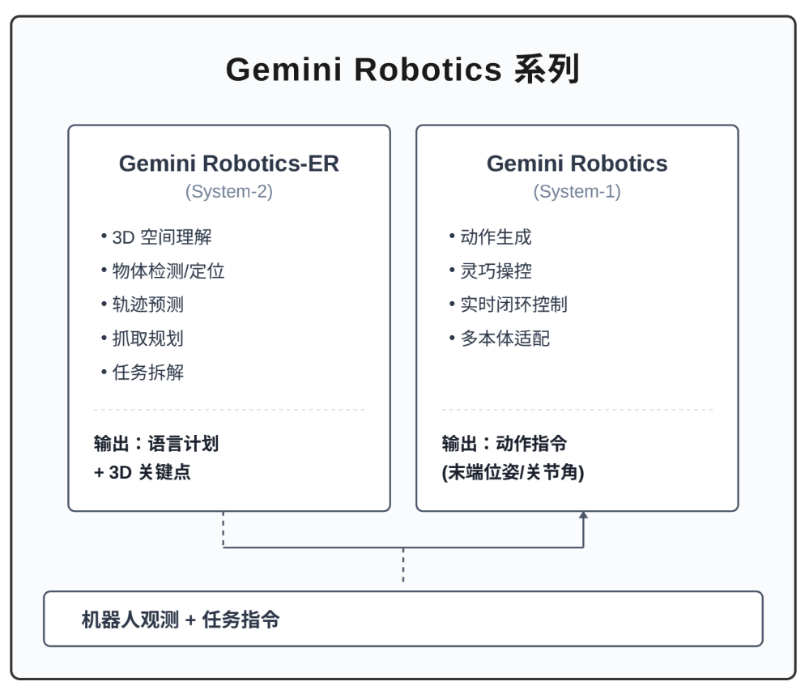

# 8.5.5 Gemini Robotics

难度：**[高级]** | 预计用时：25 分钟  
先修：[双系统 VLA](03-dual-system-vla.md)

> 如果说 2025 年具身智能领域有什么"iPhone 时刻"，那 Google DeepMind 发布的 Gemini Robotics 系列一定是最有力的候选。它是第一个将 Gemini 2.0 的多模态世界知识直接注入机器人动作空间的 VLA 模型家族，也是 2025–2026 闭源具身旗舰的代表样本。本节以阅读卡体例，梳理 Gemini Robotics 系列的双系统架构、三大核心能力、与开源 VLA 的差异，以及公开评测口径与局限。

## 学习目标

读完本页后，你应该能：

- 说清 Gemini Robotics 系列（VLA、ER、On-Device、1.5）各自的定位和分工
- 画出 Gemini Robotics 双系统架构中"思考层"（ER）与"行动层"（Robotics）的数据流
- 用一句话总结 Gemini Robotics 与 OpenVLA / π0 等开源 VLA 在泛化路径上的根本差异

## 一、模型家族全貌

Google DeepMind 于 2025 年 3 月 12 日首次发布 Gemini Robotics 系列，随后在 2025 年 6 月推出 On-Device 版本，2025 年 9 月升级到 1.5 版本。整个家族围绕"将 Gemini 的世界知识带入物理世界"这一核心目标，形成了四个互补的模型：

| 模型 | 发布时间 | 定位 | 核心能力 |
|------|---------|------|---------|
| **Gemini Robotics** | 2025.03 | VLA 行动模型（System-1） | 视觉→动作的直接映射，灵巧操控 |
| **Gemini Robotics-ER** | 2025.03 | VLM 推理模型（System-2） | 具身推理、空间理解、3D 检测、任务规划 |
| **Gemini Robotics On-Device** | 2025.06 | 端侧部署 VLA | 本地低延迟推理，开源 SDK |
| **Gemini Robotics 1.5** | 2025.09 | 全系列升级 | 具身思考（Embodied Thinking）、帧链（Chain-of-Frames） |

> **初学者提示**：不要把 Gemini Robotics 和 Gemini 聊天机器人搞混。Gemini Robotics 是专门为机器人控制设计的 VLA 模型，虽然底层复用了 Gemini 2.0 的多模态理解能力，但输出的是机器人动作而非文本。

## 二、双系统架构：思考层与行动层

Gemini Robotics 系列最核心的设计理念是**思考与行动分离**——这正是双系统 VLA 范式的典型实现。

### 2.1 架构概览




图 2.1 Gemini Robotics 双系统架构。ER 负责"看世界、想问题"，Robotics 负责"动手做"。

### 2.2 System-2：Gemini Robotics-ER（具身推理模型）

ER 的全称是 Embodied Reasoning（具身推理）。它不是一个独立的机器人策略，而是一个**增强版 VLM**，专门针对物理世界的推理能力做了深度优化。

**核心能力：**

| 能力 | 说明 | 典型任务 |
|------|------|---------|
| **3D 空间理解** | 从 2D 图像推断 3D 空间关系，输出 3D 边界框和关键点 | "标记桌面所有可抓取物体" |
| **物体检测与定位** | 在复杂场景中识别、定位物体并理解其功能属性 | "找到水杯并判断是否装满" |
| **轨迹预测** | 预测物体运动轨迹或机器人的合理路径 | "这个杯子倒下后会滚向哪里" |
| **抓取规划** | 分析物体形态，推荐合适的抓取姿态 | "这把剪刀应该从哪里抓" |
| **任务拆解** | 将自然语言指令分解为可执行的子任务序列 | "做一杯咖啡"→ 取杯子→放咖啡粉→倒水... |

**与普通 VLM 的关键区别：** 普通 VLM（如 GPT-4V）能"看图说话"但不懂物理世界。ER 经过了专门的具身数据训练，能回答"这个物体有多重？""从这里能不能够到那个杯子？"这类需要物理常识的问题。

### 2.3 System-1：Gemini Robotics（VLA 行动模型）

Gemini Robotics 是直接输出机器人动作的 VLA 模型。它基于 Gemini 2.0 的多模态骨干，在大量机器人操作数据上训练，将视觉和语言输入直接映射为动作输出。

**三大核心能力：**

| 能力 | 英文 | 含义 |
|------|------|------|
| **通用性** | Generality | 利用 Gemini 的世界知识，泛化到未见过的物体、指令和环境 |
| **灵巧性** | Dexterity | 执行需要精细操控的复杂任务（如折纸、穿线） |
| **交互性** | Interactivity | 根据环境变化实时调整动作，支持自然语言交互式指令修正 |

> **为什么叫"三力合一"？** 传统机器人策略通常只能做好其中一项：要么泛化好但不够灵巧，要么灵巧但只能做固定任务。Gemini Robotics 的突破在于让一个模型同时具备这三项能力。

### 2.4 思考与行动的协作模式

Gemini Robotics 的双系统并非 ThinkAct 那样显式的"先想后做"流水线，而是一种更灵活的**松耦合协作**：

- **ER 可以作为独立模型使用**：开发者调用 ER 做场景理解、任务规划，然后用自己的策略执行；也可以将 ER 的输出作为 Gemini Robotics 的额外条件输入。
- **Robotics 可以独立运行**：对于常规操控任务，Gemini Robotics 可以直接端到端输出动作，不需要 ER 的中间推理。
- **1.5 版本引入 Embodied Thinking**：在生成动作前，模型内部会生成一条自然语言"思考轨迹"（thinking trajectory），将复杂任务拆解为更细致的步骤。这相当于把 System-2 的推理能力内化到了 System-1 的推理过程中。

## 三、与开源 VLA 的对比

Gemini Robotics 作为闭源旗舰，与 OpenVLA、π0 等开源 VLA 在泛化路径上有根本差异：

| 维度 | OpenVLA / π0 系 | Gemini Robotics 系列 |
|------|----------------|---------------------|
| **泛化来源** | 大规模开源机器人数据 + 预训练 VLM | Gemini 2.0 的互联网级世界知识 + 专有机器人数据 |
| **模型规模** | 7B–13B（开源可运行） | 未公开（推测远超开源模型） |
| **可复现性** | 权重开源，可本地部署 | 闭源 API，仅限合作方 |
| **双系统设计** | 多为单系统端到端 | 明确分离 ER（思考）和 Robotics（行动） |
| **多本体支持** | 需针对不同本体做适配 | 原生支持多种机器人形态 |
| **推理能力** | 依赖 VLM 的通用推理 | ER 专门针对具身推理优化，能力更强 |
| **部署灵活度** | 可本地微调、量化 | On-Device 版本支持本地部署，但完整版需云端 |

> **课程中的定位**：Gemini Robotics 是理解双系统 VLA 范式的"最佳案例"，但不是复现目标。它的闭源特性意味着我们只能通过官方报告和演示理解其能力边界。课程中可动手复现的是 ThinkAct / Fast-ThinkAct 等开源或半开源方案。

## 四、关键能力与评测

### 4.1 泛化能力（Generality）

Gemini Robotics 的泛化能力来自 Gemini 2.0 的世界知识迁移。官方演示展示了以下泛化场景：

- **未见物体**：对训练数据中从未出现的物体（如异形玩具、新品牌包装）也能正确操作
- **未见环境**：从实验室桌面迁移到真实厨房、办公室，无需重新训练
- **未见指令**：理解"把那个蓝色的东西放到红色盒子旁边"这类组合式自然语言指令

### 4.2 灵巧操控（Dexterity）

Gemini Robotics 在需要精细动作协调的任务上表现出色：

- 折叠衣物、拉拉链、穿针引线等传统机器人难以完成的任务
- 多指灵巧手的协同控制
- 动态任务中的力控和柔顺性

### 4.3 具身推理（Embodied Reasoning）

Gemini Robotics-ER 在具身推理基准上的表现：

- 3D 空间推理：从单张 RGB 图像推断物体的 3D 位置、朝向和尺寸
- 物理常识：判断物体是否可堆叠、是否会滚动、需要多大的力才能推动
- 任务规划：将"清理桌面"分解为"识别垃圾→抓取→移动到垃圾桶→释放"等子步骤

### 4.4 1.5 版本的突破：Embodied Thinking

Gemini Robotics 1.5 引入了**具身思考**（Embodied Thinking）能力——模型在执行动作前，会生成一条自然语言"思考轨迹"。例如：

```
用户指令："把这个杯子放到洗碗机上层"

模型思考轨迹：
1. 识别目标：白色陶瓷杯，位于桌面右侧
2. 分析路径：桌面→洗碗机，需绕过笔记本电脑
3. 抓取规划：从杯柄侧面抓取，力控避免滑落
4. 放置位置：洗碗机上层右侧空位
5. 执行动作序列...
```

这种"先想后做"的机制与 ThinkAct 的 visual plan latent 思路殊途同归——都是让模型在动手前先"过一遍脑子"，区别在于 Gemini Robotics 1.5 使用自然语言而非隐空间向量作为思考载体。

## 五、局限与风险

作为闭源旗舰模型，Gemini Robotics 在课程讨论中需要特别注意以下几点：

| 局限 | 具体表现 | 对课程的影响 |
|------|---------|------------|
| **闭源不可复现** | 权重、训练数据、架构细节均未公开 | 只能作为概念参考，不能作为复现目标 |
| **API 依赖** | 完整功能需通过 Google Cloud 调用 | 无法离线使用，存在网络延迟和成本问题 |
| **评测不透明** | 官方报告未提供完整的第三方基准对比 | 性能声明需谨慎对待，等待独立评测 |
| **规模不可知** | 模型参数量和推理成本未公开 | 无法评估实际部署条件 |
| **领域偏向** | 训练数据以英文环境和西方场景为主 | 中文场景和多语言泛化能力未知 |

> **给读者的建议**：将 Gemini Robotics 视为理解"双系统 VLA 能做到什么"的上限参考，而非"我要怎么做"的实操指南。动手能力请回到 ThinkAct 和 Fast-ThinkAct 章节。

## 六、课程关联

| 学习点 | 对应章节 |
|--------|---------|
| 双系统 VLA 范式 | [双系统 VLA](03-dual-system-vla.md) |
| System-2 推理增强 | [ThinkAct](03-dual-system-vla/01-thinkact.md) |
| 推理效率优化 | [Fast-ThinkAct](03-dual-system-vla/02-fast-thinkact.md) |
| VLA 动作空间设计 | [动作 Token 化方法对比](../14-action-tokenization.md) |
| 多本体泛化 | [本体感知 VLA 设计](../14-action-tokenization.md) |

## 七、阅读卡片

```yaml
gemini_robotics_reading_card:
  model_family: Gemini Robotics
  organization: Google DeepMind
  release_timeline:
    - 2025-03-12: Gemini Robotics + Gemini Robotics-ER (initial release)
    - 2025-06-24: Gemini Robotics On-Device (local deployment)
    - 2025-09: Gemini Robotics 1.5 (embodied thinking upgrade)

  model_variants:
    - name: Gemini Robotics
      type: VLA (Vision-Language-Action)
      role: System-1 (行动层)
      description: 基于 Gemini 2.0 的端到端机器人控制模型，直接输出动作
    - name: Gemini Robotics-ER
      type: VLM (Vision-Language Model)
      role: System-2 (思考层)
      description: 具身推理专用模型，具备 3D 理解、物体检测、轨迹预测、抓取规划能力
    - name: Gemini Robotics On-Device
      type: VLA (本地部署版)
      role: System-1 (端侧)
      description: 针对机器人硬件优化的本地推理版本，开源 SDK
    - name: Gemini Robotics 1.5
      type: VLA + VLM (升级版)
      role: 全系列升级
      description: 新增 Embodied Thinking 和 Chain-of-Frames 能力

  core_capabilities:
    - generality: 泛化到未见物体、环境、指令
    - dexterity: 精细灵巧操控（折衣、穿线、多指手）
    - interactivity: 实时环境响应、自然语言交互式修正
    - embodied_reasoning: 3D 空间理解、物理常识、任务拆解
    - embodied_thinking: 动作前生成自然语言思考轨迹（1.5 版本）

  dual_system_architecture:
    thinking_layer: Gemini Robotics-ER (VLM, 低频推理)
    acting_layer: Gemini Robotics (VLA, 高频控制)
    collaboration_mode: 松耦合，ER 输出语言计划 + 3D 关键点，Robotics 负责动作执行
    innovation: 1.5 版本将思考能力内化到动作生成流程中

  vs_open_source_vla:
    openvla_pi0:
      openness: 开源权重，可本地部署微调
      scale: 7B–13B
      generality_source: 开源机器人数据 + 预训练 VLM
    gemini_robotics:
      openness: 闭源，API 访问或合作方授权
      scale: 未公开
      generality_source: Gemini 2.0 互联网级世界知识 + 专有数据

  evaluation_highlights:
    - generality: 未见物体/环境/指令的泛化成功率
    - dexterity: 精细操作任务完成率
    - embodied_reasoning: 3D 空间推理、物体检测、抓取规划准确率
    - embodied_thinking: 思考轨迹与执行结果的一致性

  limitations:
    - closed_source: 权重、架构、数据均未公开
    - api_dependency: 完整功能需云端调用
    - evaluation_transparency: 缺乏独立第三方基准对比
    - scale_unknown: 参数量和计算成本未公开
    - domain_bias: 以英文场景为主

  course_relevance:
    - dual_system_vla_paradigm
    - system2_reasoning
    - vla_action_space
    - cross_embodiment
    - benchmark_evaluation

  reproducibility_status: api_dependent_reading_not_course_reproduction
```

## 八、参考资料

- [Gemini Robotics 官方博客](https://deepmind.google/discover/blog/gemini-robotics-brings-ai-into-the-physical-world/)
- [Gemini Robotics-ER 技术报告](https://deepmind.google/)
- [Gemini Robotics 1.5 技术报告](https://deepmind.google/)
- [Gemini Robotics On-Device SDK](https://github.com/google-deepmind/gemini-robotics)
- [双系统 VLA 范式讨论](03-dual-system-vla.md)