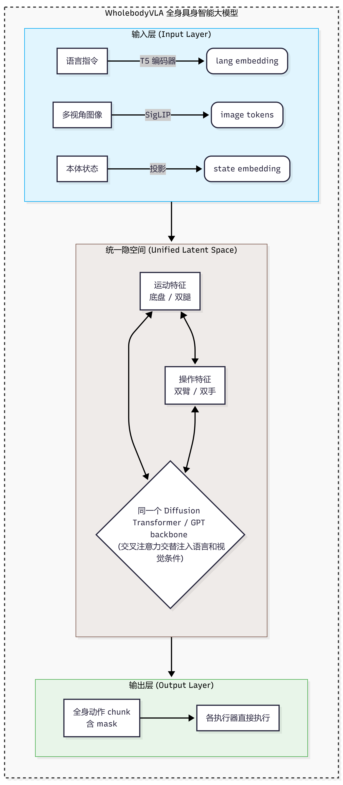

# 7.6.1 全身 loco-manipulation VLA

难度：**[中级]** | 预计用时：30 分钟  
先修：[多具身体训练（8.2.5）](../02-behavior-cloning/05-multi-embodiment-training.md) → [RDT 统一动作空间](../03-common-libraries/03-rdt/01-theory.md)

> 传统机器人把"走过去"和"拿起来"拆成两个独立模块——导航定好位置，操作臂再干活。但真实世界里，你需要边走边开门、俯身时调整重心、推箱子时身体和手臂同时发力。全身 loco-manipulation VLA 的回答是：**让一个模型同时输出底盘/双腿、躯干和双臂的全部动作，运动和操作在同一个隐空间里协同。** 本节以 WholebodyVLA 为主线，讲清楚统一隐空间建模、异构动作空间设计，以及它和多具身体训练的内在关系。

## 学习目标

读完本页后，你应该能：

- 用一句话说清楚分体式和全身联合 loco-manipulation 的本质区别，以及误差累积为什么会成为分体式设计的致命伤
- 解释统一隐空间联合建模的核心原理：mask 机制如何让不同平台共享同一个 backbone
- 画出人形和轮式移动操作平台的动作空间分区，说清两种平台在自由度维度上的差异
- 论证 loco-manipulation 为什么是多具身体训练最重要的特例和应用场景

动手复现请移步 [WholebodyVLA GitHub](https://github.com/OpenDriveLab/WholebodyVLA)。

## 一、为什么需要全身 loco-manipulation VLA？

### 分体式设计的三个致命伤

传统机器人系统把移动操作任务拆成两段独立流水线：

```
导航模块 → 到达目标区域 → 停止 → 操作模块 → 抓取/操作
```

这种设计在静态结构化环境里够用，但一旦任务要求移动和操作同时发生，三个问题就暴露出来：

| 问题 | 具体表现 | 典型场景 |
|------|---------|---------|
| **误差累积** | 导航走偏 5cm → 操作臂够不着 → 任务失败，两个模块之间没有反馈回路 | 走到货架前抓取指定物品 |
| **协同缺失** | 需要边走边推、边转身边操作时，两个模块各自为政，无法协调 | 推开门同时走进房间、搬箱子同时调整步伐 |
| **语义断裂** | 语言指令"走到箱子旁边把它搬过来"是一个完整行为，硬拆成导航+操作破坏了行为的连续性和上下文 | 所有需要移动+操作的复合指令 |

### 全身联合的回答

全身 loco-manipulation VLA 的核心思路是：

> **在同一个视觉-语言-动作策略里，直接从观测和指令输出所有执行器（底盘/双腿 + 躯干 + 双臂 + 夹爪/灵巧手）的动作 chunk，让模型自己学习运动和操作的协同。**

### 和分体式设计的完整对比

| 维度 | 分体式（导航 + 操作） | 全身联合 loco-manipulation VLA |
|------|---------------------|-------------------------------|
| 任务表示 | 两个独立子任务，串行执行 | 一个统一的端到端任务 |
| 规划层级 | 导航规划 → 操作规划，两层 | 单一策略，隐式规划 |
| 误差处理 | 导航误差直接传递给操作，无反馈 | 模型自己学习运动中的补偿和调整 |
| 协同能力 | 无法边走边操作 | 自然支持边移动边操作 |
| 动作空间 | 两个独立动作空间 | 一个统一动作空间（含 mask） |
| 数据需求 | 分别标注导航和操作数据 | 需要全身协同遥操作数据 |

## 二、模型原理深度解析

### 2.1 核心设计思路：统一潜在学习

WholebodyVLA 提出的**统一潜在学习（Unified Latent Learning）**框架，核心思路可以概括为四个字：**统一隐空间**。



图 2.1 WholebodyVLA 统一隐空间架构。运动特征和操作特征在同一个 backbone 中交互，mask 机制处理不同平台缺失的自由度。

### 2.2 统一隐空间的四个核心组件

| 组件 | 作用 | 工程实现 |
|------|------|---------|
| **统一输入** | 视觉 + 语言 + 本体状态全部进入同一个 backbone | 多模态编码器 + 投影层 |
| **统一隐空间** | 运动特征和操作特征在同一个 latent space 里交互 | 共享的 Transformer 层，cross-attention 到语言和视觉条件 |
| **mask 机制** | 不同平台缺失的维度留空，只对有效维度计算损失 | 二值 mask 向量，loss 只统计 mask=True 的维度 |
| **统一输出** | 一次推理输出全身所有关节的动作 chunk | 去噪后按 mask 取出各平台的有效维度 |

### 2.3 mask 机制：让不同平台共享同一个 backbone

mask 机制是 loco-manipulation 工程化最核心的技巧。下面用伪代码展示：

```python
import numpy as np

# 统一动作空间：包含底盘/双腿 + 躯干 + 双臂 + 夹爪的所有可能维度
TOTAL_DIM = 60  # 人形全身关节上限

# 轮式移动操作平台：底盘速度(3) + 单臂关节(7) + 夹爪(1) = 11 维有效
WHEELED_MOBILE_INDICES = list(range(3)) + list(range(20, 28)) + [35]

def format_action(robot_joints: np.ndarray) -> tuple[np.ndarray, np.ndarray]:
    """把机器人原生关节转换到统一动作空间，返回 (action_vec, action_mask)"""
    action_vec = np.zeros(TOTAL_DIM)
    action_mask = np.zeros(TOTAL_DIM, dtype=bool)
    action_vec[WHEELED_MOBILE_INDICES] = robot_joints
    action_mask[WHEELED_MOBILE_INDICES] = True
    return action_vec, action_mask

def compute_loss(pred: np.ndarray, gt: np.ndarray, mask: np.ndarray):
    """只对有效维度计算 MSE 损失"""
    diff = (pred - gt) ** 2
    return np.mean(diff[mask])  # 只对 mask=True 的维度取平均

# 示例：人形数据（60维有效）和轮式移动数据（11维有效）混在一个 batch
action_human = np.random.randn(60)
action_wheeled = np.random.randn(11)

vec_human, mask_human = format_action_full(action_human)   # mask 全 True
vec_wheeled, mask_wheeled = format_action(action_wheeled)  # mask 仅 11 个 True

# 同一个 batch 里，loss 分别只计算各自有效维度
loss_human = compute_loss(pred_human, vec_human, mask_human)
loss_wheeled = compute_loss(pred_wheeled, vec_wheeled, mask_wheeled)
total_loss = (loss_human + loss_wheeled) / 2
```

> **初学者提示**：mask 机制的精妙之处在于——模型在训练时看到的所有 token 维度都是 60 维，但损失只对有效维度计算。这相当于告诉模型："这 60 维里，你只需要对第 0-2、20-27、35 这些维度负责，其他维度随便输出什么都可以，我不惩罚你。" 模型因此学会了在不同 mask 组合下做不同的预测。

### 2.4 预训练数据策略

WholebodyVLA 的一个重要创新是数据来源：**从人类自视角视频中学习 loco-manipulation 先验**。

| 数据来源 | 内容 | 作用 |
|---------|------|------|
| 人类自视角视频 | 大规模人类行走、操作的第一人称视频 | 提供运动和操作协同的视觉先验 |
| 机器人遥操作数据 | 人形机器人全身协同遥操作轨迹 | 提供机器人本体上的动作标注 |
| 仿真数据 | Isaac Sim 等仿真器中的全身控制数据 | 低成本补充，尤其是摔倒等危险场景 |

> **关键洞察**：人类自视角视频中天然包含"边走边拿东西""俯身捡东西"等协同模式。这些模式不需要逐帧标注动作，只需要作为视频预训练数据，让模型学到"运动+操作"的视觉-时序关联。这和第 8 章从人类视频学机器人策略的思路一脉相承。

### 2.5 关键性能数字

| 指标 | 分体式基线 | WholebodyVLA |
|------|-----------|-------------|
| 全身 loco-manipulation 成功率 | 基线 | **+21.3%** |
| 协同任务（边走边操作） | 几乎为 0 | 显著可行 |
| 新场景泛化 | 差 | 从人类视频预训练中获得泛化能力 |
| 推理延迟 | 低（两个小模型） | 中等（一个统一模型） |

## 三、动作空间设计：人形 vs 轮式移动操作平台

### 3.1 人形机器人动作空间

人形全身 loco-manipulation 动作空间按身体部位分区，每个区的物理含义明确：

| 身体部位 | 典型自由度 | 物理含义 |
|---------|:---:|------|
| 左腿 | 6 | 髋关节 3 轴 + 膝关节 + 踝关节 2 轴 |
| 右腿 | 6 | 同上 |
| 躯干腰部 | 3 | 俯仰 / 偏航 / 滚动 |
| 左臂 | 7 | 7 自由度操作臂关节角 |
| 右臂 | 7 | 同上 |
| 左手 | 2~16 | 灵巧手关节（平行夹爪为 1 维） |
| 右手 | 2~16 | 同上 |
| **总计** | **~32~60** | 全身自由度 |

关键设计点：
- 包含平衡控制所需的所有关节，模型输出直接给关节角控制器
- 需要和机器人低层次平衡控制器配合，VLA 输出关节位置目标而非力矩

### 3.2 轮式移动操作平台动作空间

| 部位 | 自由度 | 物理含义 |
|------|:---:|------|
| 移动底盘 | 3 | x 线速度, y 线速度, 角速度 yaw |
| 操作臂 | 6~7 | 关节角 |
| 夹爪 | 1 | 开合 |
| **总计** | **10~11** | |

关键设计点：
- 底盘输出速度指令（差速驱动），不涉及关节角，维度显著少于人形
- 统一空间中占对应槽位，其余维度 mask 掉
- 轮式底盘本身有局部路径规划能力，VLA 只需输出高层速度指令

### 3.3 两种动作表示方式

| 方式 | 优点 | 缺点 | 适用平台 |
|------|------|------|---------|
| 直接关节位置输出 | 统一接口，diffusion 直接生成，不需要逆运动学 | 维度高，关节间相关性强 | 人形 |
| 底盘速度 + 臂关节 | 符合底层控制器接口，维度少 | 混合不同物理量，需要归一化 | 轮式移动操作 |

> **工程实践**：VLA 对动作做归一化后，只要都在 `[-1, 1]` 区间，混合不同量纲是可以训练的。RDT 的 128 维统一动作空间就是这样——既有位置又有速度，既有关节角又有末端位姿，归一化后统一训练（详见 [RDT 理论基础](../03-common-libraries/03-rdt/01-theory.md)）。

## 四、与多具身体训练的关系

### 4.1 loco-manipulation 是多具身体训练的特例

回到 8.2.5 多具身体训练，loco-manipulation 在问题定义、解决方法和工程实现上，和多具身体训练完全同构：

| 维度 | 多具身体训练通用问题 | Loco-manipulation 具体体现 |
|------|---------------------|--------------------------|
| 异构动作空间 | 单臂 / 双臂 / 移动底盘 / 人形自由度不同 | 运动部分 + 操作部分本身就是异构模态 |
| mask 机制 | 缺失维度留空，只计算有效维度损失 | 轮式平台不需要双腿关节，mask 掉 |
| 数据复用 | 不同身体的数据混在一起训练 | 人形、轮式移动操作数据共享 backbone 预训练 |
| 泛化 | 一个模型适配不同身体 | 同一个预训练模型微调适配特定平台 |

### 4.2 一句话总结关系

> **多具身体训练是方法，全身 loco-manipulation 是这个方法最重要的应用场景。** RDT 的 128 维统一动作空间、Octo 的 mask 机制，都是支持 loco-manipulation 的工程基础设施。反过来，loco-manipulation 对协同和实时性的要求，也在推动多具身体训练向更高效的方向演进。

## 五、代表性工作对比

| 工作 | 平台 | 核心思想 | 与 loco-manipulation 的关系 |
|------|------|---------|--------------------------|
| WholebodyVLA (2025) | 智元灵犀 X2 人形 | 统一隐空间 + 人类自视角视频预训练 | 直接面向人形全身 loco-manipulation |
| RDT (2024) | 多机器人（含移动操作） | 128 维统一动作空间 + Diffusion Transformer | 动作空间设计直接支持 loco-manipulation |
| Octo (2024) | 多种操作臂（可扩展底盘） | 多机器人预训练 + mask 机制 | 框架可扩展到底盘自由度 |
| π0.7 (2025) | 人形全身 | 通用人形基础模型 | 支持全身 loco-manipulation 的旗舰模型 |

## 六、阅读卡片

```yaml
loco_manipulation_vla_reading_card:
  核心问题: 如何在一个策略里同时建模移动和操作，而非把两者割裂？
  核心答案: 统一隐空间 + mask 机制 + 统一动作空间

  参考实现: WholebodyVLA
  论文: "WholebodyVLA: Towards Unified Latent VLA For Whole-body Loco-manipulation Control"
  机构: 复旦大学 + 香港大学 + 智元机器人 + 上海创智学院
  发表时间: 2025-12
  平台: 智元灵犀 X2 人形机器人
  代码: https://github.com/OpenDriveLab/WholebodyVLA

  关键设计:
    - unified_latent_learning: 运动和操作特征共享同一个 backbone 隐空间
    - mask_mechanism: 不同平台缺失维度留空，loss 只计算有效维度
    - human_egocentric_pretraining: 从人类自视角视频学习 loco-manipulation 先验
    - unified_output: 一次推理输出全身所有关节动作 chunk

  动作空间:
    humanoid: ~32-60 维（双腿 + 躯干 + 双臂 + 双手）
    wheeled_mobile: ~10-11 维（底盘速度 + 臂关节 + 夹爪）

  与多具身体训练的关系:
    - loco-manipulation 是多具身体训练最重要的特例
    - 共享 mask 机制、统一动作空间、数据复用等基础设施
    - RDT 的 128 维统一空间天然支持 loco-manipulation

  主要挑战:
    - 全身协同遥操作数据采集困难
    - 底盘控制和臂控制频率不匹配（10Hz vs 50-100Hz）
    - 人形平衡与操作精度的权衡
    - sim2real gap 在全身动力学下更大

  benchmarks:
    - AgiBot X2 人形机器人真实世界实验
    - 全身 loco-manipulation 任务套件（边走边操作、开门、搬运等）

  key_insight: 运动和操作不是两个问题，而是同一个问题的两面——统一隐空间让模型自己发现协同模式
```

## 七、自测问题

1. 分体式设计的误差累积问题：如果导航 x 方向误差标准差 σx，操作臂自身误差标准差 σa，总误差标准差是多少？为什么端到端联合建模能减少总误差？
2. 一个训练 batch 里同时有人形数据（60 维有效）和轮式移动操作数据（10 维有效），mask 机制如何分别处理？如果不用 mask 直接把无效维度设为 0，会有什么问题？
3. 在 RDT 的 128 维统一状态空间中，新增轮式底盘速度（x, y, yaw）三个维度，设计它们在 `STATE_VEC_IDX_MAPPING` 中的下标位置，写出 `format_to_state` 和 `unformat_action` 的修改。
4. 为什么说 loco-manipulation 是多具身体训练的特例？它和"单臂 + 双臂跨具身训练"在问题定义上有什么相同和不同？
5. 人类自视角视频预训练为什么能帮助全身 loco-manipulation？它迁移到机器人身上时，哪些信息可以直接复用，哪些需要适配？

---

Sources:
- [WholebodyVLA GitHub](https://github.com/OpenDriveLab/WholebodyVLA)
- [WholebodyVLA: Towards Unified Latent VLA For Whole-body Loco-manipulation Control (2025)](https://opendrivelab.com/WholeBodyVLA)
- [RDT: Robotics Diffusion Transformer](https://rdt-robotics.github.io/rdt-robotics/)
- [Octo: An Open-Source Generalist Robot Policy](https://octo-models.github.io/)
- [π0.7: A Generalist Robot Policy for Humanoids](https://www.pi.website/blog/pi07)