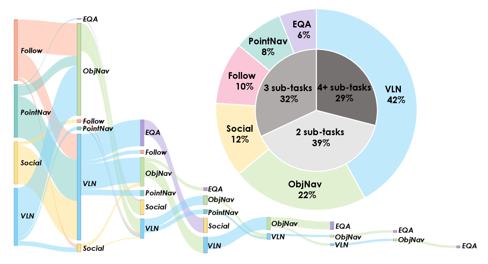

# 1.2 任务类型与组合指令

## 目标

OmniNavBench 的核心特点是将多种导航任务组织到同一个连续 episode 中。理解这些任务类型以及它们之间的组合方式，是阅读后续环境配置、专家轨迹和评测指标的基础。

本节主要介绍 OmniNavBench 中涉及的导航子任务，以及这些子任务如何被组织成组合式导航指令。

## 导航任务的基本划分

OmniNavBench 中的任务不是单一形式，而是由多种导航能力共同组成。整体上可以分为两类：

```text
顺序子任务：
需要按照一定顺序依次完成的导航目标

并行约束：
在执行导航任务时需要同时满足的行为要求
```

顺序子任务关注 agent 要到哪里、找什么、跟随谁；并行约束关注 agent 在执行过程中是否符合交互、社交和认知要求。

可以简单理解为：

```text
顺序子任务决定任务流程
并行约束决定执行质量
```

例如，agent 可能需要先根据语言指令走到某个房间，再寻找指定物体，同时还要避免干扰场景中的人，并在途中回答关于环境的问题。



图中展示了 OmniNavBench 中子指令类型和任务复杂度的统计情况。左侧 Sankey 图体现了不同导航子任务之间的组合关系，右侧环形图展示了 VLN、ObjectNav、SocialNav、Human Following、PointNav 和 EQA 等任务类型的比例。

## 顺序子任务

顺序子任务是组合指令中的主体部分。Agent 需要按照指令顺序逐步完成这些目标。

OmniNavBench 中主要包含下面几类顺序子任务：

| 子任务 | 含义 | 主要考察能力 |
| --- | --- | --- |
| VLN | 根据自然语言指令进行导航 | 语言理解、视觉 grounding、路径规划 |
| ObjectNav | 寻找指定类别或实例的物体 | 语义感知、目标搜索、场景理解 |
| PointNav | 移动到指定坐标或目标点 | 几何定位、空间规划、运动控制 |
| Human Following | 跟随移动的人 | 动态目标跟踪、连续观察、行为预测 |
| Return | 返回起点或指定位置 | 空间记忆、路径回溯、长程一致性 |

这些任务可以单独出现，也可以被组合成更长的任务链。

## VLN：基于语言指令的导航

VLN 是 Vision-and-Language Navigation，即视觉语言导航。它要求 agent 根据自然语言描述，在环境中移动到目标位置。

例如：

```text
Go through the hallway and turn left after passing the sofa.
```

这类任务的难点在于，agent 不能只依赖坐标或地图，而是需要把语言描述和当前看到的视觉场景对应起来。

VLN 主要考察：

```text
理解自然语言指令
识别环境中的视觉地标
判断动作顺序
根据语言描述规划路线
```

在组合式任务中，VLN 常常承担“引导 agent 到达某个区域”的作用。例如，先根据指令进入厨房，再执行后续的物体搜索或问答任务。

## ObjectNav：目标物体导航

ObjectNav 是 Object Navigation，即目标物体导航。它要求 agent 在环境中寻找某个指定类别或实例的物体。

例如：

```text
Find a trash can.
Find the table near the sofa.
Navigate to the microwave.
```

和 PointNav 不同，ObjectNav 通常不会直接给出目标坐标。Agent 需要根据视觉观察和场景常识主动搜索目标。

ObjectNav 主要考察：

```text
物体识别
语义理解
探索策略
目标确认
空间搜索能力
```

例如，agent 如果要寻找垃圾桶，就需要判断垃圾桶可能出现在哪里，并在环境中逐步搜索。它不仅要会移动，还要能理解物体和场景之间的关系。

在组合式指令中，ObjectNav 通常用于连接语言导航和具体目标交互。例如，agent 先进入一个房间，然后寻找房间内的指定物体。

## PointNav：目标点导航

PointNav 是 Point Navigation，即目标点导航。它要求 agent 移动到指定位置，目标通常以坐标、相对位移或空间点的形式给出。

例如：

```text
Move to the point 3 meters ahead.
Navigate to the target coordinate.
Go back to the starting position.
```

PointNav 更强调几何空间理解。Agent 需要知道自己在哪里、目标在哪里，以及如何规划一条可行路径。

PointNav 主要考察：

```text
位置估计
几何路径规划
局部避障
目标到达控制
```

相比 VLN 和 ObjectNav，PointNav 对语言和语义理解的要求较低，但对空间定位和运动执行的要求更直接。

在组合式任务中，PointNav 可以用来表示明确的空间目标，也可以用于返回、移动到中间位置或执行阶段之间的转移。

## Human Following：动态目标跟随

Human Following 是跟随人的导航任务。Agent 需要在环境中跟随一个移动的人，并保持对目标的持续观察。

例如：

```text
Follow the person in front of you.
Keep following the person until they stop near the table.
```

这类任务和静态目标导航不同，因为目标本身会移动。Agent 不能只规划一次路径，而是要持续更新自己的行动。

Human Following 主要考察：

```text
动态目标检测
目标持续跟踪
视线保持
速度调整
路径实时修正
```

如果人改变方向、被物体遮挡或进入复杂区域，agent 需要及时调整自己的运动策略。

在组合式指令中，Human Following 常常与 SocialNav 结合出现。Agent 不仅要跟上目标，还要避免靠得过近或干扰他人活动。

## Return：返回任务

Return 可以理解为返回起点或返回某个指定位置的子任务。它通常出现在任务链的后段，用于考察 agent 是否保留了对历史路径和空间结构的记忆。

例如：

```text
Return to the starting point.
Go back to the room where you started.
```

Return 任务主要考察：

```text
空间记忆
路径回溯
长期状态保持
目标切换后的重新定位
```

在长程任务中，agent 可能已经完成多个子目标，位置和视角都发生了较大变化。此时再要求它返回起点，就需要它保留对环境结构和历史移动过程的理解。

因此，Return 不只是简单的“往回走”，而是对长程导航稳定性的进一步检验。

## 并行约束

除了顺序子任务，OmniNavBench 还包含并行约束。并行约束不是单独的导航阶段，而是贯穿任务执行过程的额外要求。

主要包括：

| 约束 | 含义 | 主要考察能力 |
| --- | --- | --- |
| SocialNav | 在有人活动的场景中保持合理行为 | 社交距离、避让、安全性 |
| EQA | 通过观察环境回答问题 | 视觉理解、信息收集、环境问答 |

这些约束可以叠加到不同导航子任务上。例如，agent 在寻找目标物体时，可能同时需要避开场景中的人；在跟随人的过程中，也可能需要观察周围并回答问题。

## SocialNav：社会合规导航

SocialNav 是 Social Navigation，即社会合规导航。它要求 agent 在有人的环境中移动时，尽量减少对人类活动的干扰。

例如：

```text
Do not get too close to the person.
Avoid blocking the walking path.
Pass behind the person when possible.
```

SocialNav 主要考察：

```text
人与机器人距离控制
动态避让
运动安全性
社交空间理解
```

这类任务和普通避障不同。普通避障只要求 agent 不撞到障碍物，而 SocialNav 还要求 agent 的行为符合人类社交习惯。

例如，agent 即使没有发生碰撞，如果从人面前突然穿过、长时间贴近行人，或者挡住人的路线，也可能被认为是不合适的导航行为。

在真实机器人应用中，SocialNav 非常重要。机器人不仅要能到达目标，还要以可接受的方式到达目标。

## EQA：具身问答

EQA 是 Embodied Question Answering，即具身问答。它要求 agent 通过在环境中移动和观察，回答关于场景的问题。

例如：

```text
What color is the chair in the room?
Is there a trash can near the table?
How many people are in the hallway?
```

EQA 主要考察：

```text
主动观察
视觉理解
信息收集
问题推理
答案生成
```

和普通视觉问答不同，EQA 中的 agent 不一定一开始就能看到答案。它可能需要先移动到合适位置，观察目标区域，再根据视觉信息回答问题。

因此，EQA 把导航和认知推理连接起来。Agent 不只是为了到达某个位置而移动，而是为了获取完成问答所需的信息而移动。

## 组合式导航指令的结构

OmniNavBench 中的一条指令通常不是单个任务，而是由多个子任务按顺序组成。

可以抽象成：

```text
Instruction = [
  sub_task_1,
  sub_task_2,
  sub_task_3,
  ...
]
```

每个子任务包含三个核心信息：

```text
自然语言描述
任务类型
目标对象或目标位置
```

例如：

```text
sub_task = {
  instruction: "Go to the living room",
  type: "VLN",
  target: "living room"
}
```

组合起来后，一条完整任务可以表示为：

```text
VLN -> ObjectNav -> Human Following -> EQA
```

也可以表示为：

```text
PointNav -> ObjectNav -> Return
```

这种结构让 agent 在一个 episode 中连续面对不同类型的目标，而不是每次只处理一种任务。

## 组合指令示例

下面是一个简化的组合指令示例：

```text
Go through the hallway and enter the living room.
Find the trash can near the table.
Follow the person walking toward the sofa.
Then answer whether there is a lamp beside the sofa.
```

它可以拆解为：

| 阶段 | 子任务类型 | 目标 |
| --- | --- | --- |
| 1 | VLN | 根据语言指令进入 living room |
| 2 | ObjectNav | 寻找 table 附近的 trash can |
| 3 | Human Following | 跟随走向 sofa 的人 |
| 4 | EQA | 判断 sofa 旁边是否有 lamp |

这个例子体现了组合式导航的特点：

```text
先按语言指令移动
再搜索目标物体
再处理动态目标
最后基于场景观察回答问题
```

整个过程不是多个任务的简单拼接，而是在同一个连续环境状态中依次完成多个目标。

## 子任务之间的切换

组合式导航的难点之一是子任务切换。Agent 需要判断当前任务是否已经完成，并决定是否进入下一个阶段。

例如：

```text
VLN 阶段：
是否已经到达指定房间？

ObjectNav 阶段：
是否已经找到目标物体？

Human Following 阶段：
是否还需要继续跟随目标？

EQA 阶段：
是否已经收集到足够信息回答问题？
```

如果切换判断错误，即使单个子任务能力不错，整条任务也可能失败。

常见失败情况包括：

```text
还没有到达目标区域就提前切换
已经找到目标物体但没有停止搜索
跟随目标时丢失目标对象
没有观察到关键信息就直接回答问题
完成前几个阶段后忘记最终目标
```

因此，组合式导航不仅考察低层运动控制，也考察高层任务状态管理。

## 连续执行中的状态保持

在组合式任务中，agent 需要持续维护当前任务状态。它要知道自己正在执行哪个子任务、已经完成哪些目标、还有哪些目标没有完成。

可以理解为：

```text
当前子任务
已完成子任务
未完成子任务
当前位置
历史路径
观察到的目标物体
动态目标的位置
需要回答的问题
```

这些信息共同决定 agent 下一步应该怎么行动。

例如，在执行：

```text
进入客厅 -> 找到垃圾桶 -> 返回起点
```

这个任务时，agent 不仅要记住垃圾桶在哪里，还要记住起点大致在哪里。如果没有长期状态保持能力，Return 阶段就很容易失败。

所以，组合式导航对 memory 和 planning 的要求明显高于单一任务导航。

## 指令表达的多样性

同一个任务目标可以有不同的语言表达方式。为了评估 agent 对自然语言变化的鲁棒性，OmniNavBench 中的指令可以被改写成不同风格。

例如，一个任务可以有下面几种表达：

```text
Concise:
Go to the kitchen and find the trash can.

Verbose:
Please move forward through the hallway, enter the kitchen area, and look for the trash can near the counter.

First Person:
I need to go to the kitchen and find the trash can.
```

这些表达的任务目标基本一致，但语言形式不同。

指令表达变化主要考察：

```text
agent 是否只记住固定模板
agent 是否能理解更长的自然语言描述
agent 是否能处理第一人称表达
agent 是否能在语义不变的情况下保持稳定行为
```

这对通用导航非常重要。真实用户不会总是使用固定格式的指令，因此 agent 需要对不同说法保持鲁棒。

## 组合任务带来的主要挑战

组合式导航会显著提高任务难度，主要体现在下面几个方面。

### 任务长度增加

单一导航任务通常只需要完成一个目标，而组合任务可能包含多个连续目标。任务越长，累积错误越明显。

```text
前面一步错误
-> 当前位置偏离
-> 后续观察变化
-> 后续子任务更难完成
```

### 能力类型不同

不同子任务需要不同能力。VLN 更依赖语言 grounding，ObjectNav 更依赖语义搜索，Human Following 更依赖动态跟踪，EQA 更依赖观察和推理。

Agent 需要根据任务阶段切换策略，而不是使用同一种固定行为模式。

### 目标终止条件不同

不同任务的完成标准不同。

```text
PointNav：是否到达指定位置
ObjectNav：是否找到目标物体
Human Following：是否持续跟随目标
EQA：是否得到正确答案
```

Agent 需要理解每类任务的终止条件，否则就可能提前停止或过度执行。

### 动态因素增加

当任务中出现人类或移动目标时，环境不再是完全静态的。Agent 需要根据动态变化实时调整路径和行为。

### 语言理解更复杂

组合指令通常比单一指令更长，并且包含多个目标、空间关系和动作顺序。Agent 需要正确解析这些信息，否则后续执行就会出错。

## 子任务与能力关系

可以把不同任务和能力之间的关系整理如下：

| 能力 | 相关任务 | 说明 |
| --- | --- | --- |
| 语言理解 | VLN、EQA | 理解自然语言指令和问题 |
| 语义感知 | ObjectNav、EQA | 识别物体、场景和属性 |
| 几何导航 | PointNav、Return | 根据空间位置规划路径 |
| 动态跟踪 | Human Following | 跟随移动目标并保持观察 |
| 社交避让 | SocialNav | 保持合理距离和安全行为 |
| 长程规划 | 组合任务 | 在多个阶段中保持目标一致 |
| 状态记忆 | Return、组合任务 | 记录历史路径和已完成目标 |

这个表可以帮助理解：OmniNavBench 中的组合任务不是单纯增加任务数量，而是把多种能力放到同一个连续执行过程中。


## 本节小结

OmniNavBench 通过多种导航子任务和组合式指令，评估 agent 在连续任务中的通用导航能力。VLN、ObjectNav、PointNav 和 Human Following 构成了主要的顺序任务流程，SocialNav 和 EQA 则进一步引入社交约束和环境问答能力。
