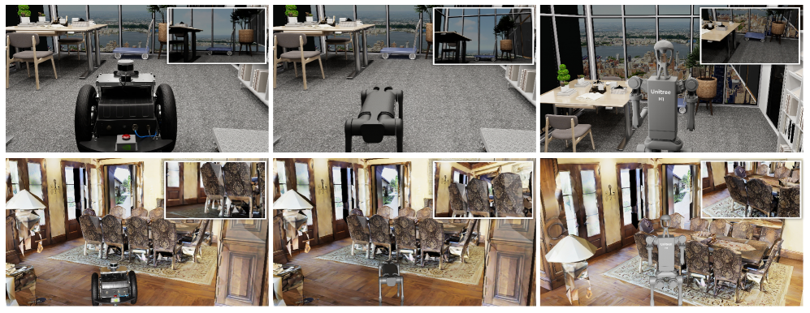

# 1.3 环境、机器人与传感器

## 目标

导航任务不是只由指令决定的。Agent 能否完成任务，还取决于它所在的三维环境、使用的机器人身体，以及能够获得哪些观测输入。

本节主要介绍 OmniNavBench 中的环境来源、机器人形态和传感器设置。理解这些内容后，可以更清楚地看出：同一条导航指令在不同环境和不同机器人上，为什么会呈现出不同难度。

## 三维环境在导航任务中的作用

在具身导航中，环境不是静态背景，而是任务执行的一部分。Agent 的每一步移动都会发生在具体的三维空间中，受到房间布局、通道结构、障碍物、家具和动态对象的影响。

例如，同样是“找到垃圾桶”，在不同环境中的难度可能完全不同：

```text
小房间：
目标物体可能很快出现在视野中

复杂住宅：
需要穿过多个房间并判断物体可能出现的位置

商业空间：
布局更开放，路径更长，目标位置更不确定

有行人的场景：
导航时还要考虑避让和社交距离
```

因此，导航 benchmark 中的环境设计会直接影响评测结果。一个方法如果只在简单场景中表现良好，并不一定能适应更复杂、更真实的室内空间。

OmniNavBench 使用多种环境来源，目的就是让任务不局限在单一类型的场景中，而是覆盖不同空间结构、视觉风格和交互难度。

## 场景来源与环境类型

OmniNavBench 的环境可以理解为由两类场景共同构成：

```text
合成场景
真实扫描场景
```

两类场景的特点不同。

| 场景类型 | 特点 | 主要作用 |
| --- | --- | --- |
| 合成场景 | 由人工构建或程序化整理，物体和布局更可控 | 适合系统性评估不同任务难度 |
| 真实扫描场景 | 来自真实建筑的三维扫描，视觉细节和布局更接近现实 | 适合考察模型对真实空间的泛化能力 |

合成场景通常更容易控制变量，例如可以有意识地调整房间数量、物体密度、障碍物分布和路径长度。真实扫描场景则更接近现实环境，其中可能存在更复杂的纹理、遮挡、布局和视觉噪声。

可以简单理解为：

```text
合成场景：
更可控，适合构造任务和分析变量

真实扫描场景：
更接近现实，适合检验泛化能力
```

这种混合场景设计使 OmniNavBench 不只考察 agent 在理想环境中的表现，也考察它面对真实空间复杂性时是否仍然稳定。

## 室内布局对任务难度的影响

导航任务的难度并不只取决于目标距离，还取决于环境结构。

几个常见影响因素包括：

```text
房间数量
走廊长度
门和通道位置
家具密度
目标物体是否被遮挡
是否存在动态人类
是否需要跨房间移动
```

例如，一个目标物体即使距离 agent 不远，如果被桌子、沙发或墙面遮挡，agent 也可能需要先移动到合适视角才能发现它。

相反，一个目标点即使距离较远，如果路径开阔、没有遮挡，导航难度可能并不高。

因此，阅读导航结果时不能只看路径长度，还需要考虑场景布局本身。

可以用下面方式理解：

```text
短距离 + 高遮挡
-> 可能仍然很难

长距离 + 清晰路径
-> 可能更容易规划

多房间 + 多目标
-> 对长期记忆和任务切换要求更高

动态对象 + 人类活动
-> 对实时感知和避让能力要求更高
```

环境复杂度会影响 agent 的探索策略、路径规划、目标识别和任务完成稳定性。

## 机器人形态

OmniNavBench 的另一个重要设计是支持多种机器人形态。不同机器人有不同的运动方式、视角高度、动作约束和稳定性。

可以把机器人形态理解为 agent 的“身体”。同一个导航策略换到不同身体上，可能会遇到完全不同的问题。

常见形态包括：

| 机器人形态 | 特点 | 可能影响 |
| --- | --- | --- |
| 轮式机器人 | 移动平稳，控制相对简单 | 对平坦地面友好，但复杂地形适应性有限 |
| 四足机器人 | 更适合处理复杂地形 | 运动控制更复杂，视角和步态会影响观测 |
| 类人机器人 | 更接近人类高度和视角 | 动作空间复杂，对平衡和控制要求更高 |

在导航任务中，机器人形态会影响很多因素：

```text
相机高度
可见区域
转向方式
移动速度
可通过区域
碰撞风险
路径选择
动作执行稳定性
```

因此，跨机器人形态评测不是简单地换一个模型外观，而是在考察导航方法是否能适应不同身体条件。

## 轮式机器人

轮式机器人通常是导航任务中较常见的形态。它的移动方式相对稳定，控制也比较直接。

在导航 benchmark 中，轮式机器人适合用于评估基础导航能力，例如：

```text
能否根据指令移动到目标区域
能否避开障碍物
能否在室内环境中规划路径
能否稳定执行转向和前进动作
```

轮式机器人的优势是运动稳定、控制简单，缺点是对复杂地形和台阶等结构较敏感。

可以简单理解为：

```text
轮式机器人：
适合平面导航
控制稳定
但对地形变化较敏感
```

因此，如果一个方法在轮式机器人上表现好，说明它具备一定导航能力，但还不能直接说明它适合所有机器人平台。

## 四足机器人

四足机器人具有更强的地形适应能力。相比轮式机器人，它可以在更复杂的地面结构中移动，也更接近真实机器人部署中的移动平台。

四足机器人带来的挑战包括：

```text
运动轨迹更不平滑
视角可能随步态产生变化
局部控制更复杂
动作执行和导航规划之间耦合更强
```

这会影响 agent 的视觉观测和动作执行。例如，机器人移动时视角发生波动，可能导致目标物体短暂离开视野；如果局部运动控制不稳定，也可能影响高层导航策略的执行效果。

可以简单理解为：

```text
四足机器人：
更适合复杂地形
但感知和控制更不稳定
```

因此，四足形态可以用来检验导航策略在更复杂运动条件下的鲁棒性。

## 类人机器人

类人机器人具有更接近人类的视角高度和身体结构，但控制难度也更高。它不仅要完成导航，还要保持身体稳定，并处理更复杂的动作空间。

在导航任务中，类人机器人可能带来几个特点：

```text
第一人称视角更接近人类观察方式
相机高度更高，看到的区域不同
身体尺寸和碰撞边界不同
运动控制更加复杂
```

同一条指令在类人机器人上执行时，agent 看到的场景可能和轮式机器人完全不同。例如，较高的视角可能更容易看到远处物体，但也可能忽略低处障碍物。

可以简单理解为：

```text
类人机器人：
视角更接近人类
但控制和稳定性要求更高
```

类人形态能够进一步检验导航方法是否真正适应不同 embodiment，而不是只适配某一种固定机器人平台。



图中展示了 OmniNavBench 中不同机器人形态在不同环境中的导航示例。每一行对应不同环境来源，每一列对应不同机器人形态，能够直观看到 wheeled、quadrupedal 和 humanoid 机器人在视角、高度和场景观测上的差异。

## 机器人形态对观测的影响

不同机器人形态不仅影响动作，也会影响观测。

即使在同一个位置，不同机器人看到的画面也可能不同：

```text
相机高度不同
视野范围不同
遮挡关系不同
目标物体在画面中的尺度不同
地面和障碍物的可见程度不同
```

例如：

```text
低视角机器人：
更容易看到近处地面和障碍物

高视角机器人：
更容易看到远处布局和桌面物体

四足机器人：
移动过程中视角可能更容易发生波动

类人机器人：
视角更接近人类，但身体运动带来的变化更复杂
```

这说明跨形态评测不仅是在比较不同机器人动作，也是在比较不同感知条件下的导航能力。

一个好的导航策略需要尽量减少对固定相机高度、固定视角和固定机器人形态的依赖。

## 传感器与观测输入

Agent 在环境中不能直接获得完整世界状态，而是通过传感器获得观测。传感器决定了 agent 能看到什么、能测量什么，以及能用什么信息做决策。

OmniNavBench 中常见的观测类型可以包括：

| 观测类型 | 含义 | 作用 |
| --- | --- | --- |
| RGB 图像 | 第一人称或多视角彩色图像 | 用于识别物体、房间、地标和人类 |
| Depth 图 | 每个像素对应的距离信息 | 用于判断空间结构和障碍物距离 |
| RGB-D | RGB 与深度信息结合 | 同时提供语义外观和几何距离 |
| LiDAR | 激光雷达距离扫描 | 用于局部避障和空间建图 |
| Panoramic Vision | 全景视觉观测 | 提供更大视野范围，减少盲区 |
| Pose / Odometry | 位姿或里程计信息 | 用于定位、路径规划和回溯 |

不同方法可能使用不同传感器组合。例如，一些视觉语言导航方法更依赖 RGB 或 RGB-D 图像；一些几何导航方法更依赖深度、LiDAR 或位姿信息。

可以简单理解为：

```text
RGB：
看清物体和场景语义

Depth / LiDAR：
理解距离和空间结构

Pose / Odometry：
知道自己在哪里、走了多远

Panoramic Vision：
获得更完整的周围视野
```

传感器配置不同，任务难度也会不同。

## 第一人称观测

具身导航中的观测通常是第一人称的。Agent 不是从上帝视角看到完整地图，而是只能看到当前位置附近的局部环境。

这和很多静态视觉任务不同。静态视觉任务通常给定完整图像，而导航任务中的图像会随着 agent 移动不断变化。

可以表示为：

```text
当前视角看到一部分环境
-> 执行动作
-> 位置变化
-> 视角变化
-> 获得新的局部观测
```

第一人称观测带来的主要挑战包括：

```text
视野有限
目标可能暂时不可见
物体可能被遮挡
需要主动移动寻找信息
需要记住之前看到过的区域
```

因此，导航 agent 不仅要会“看”，还要会通过移动来获得新的信息。

这也是 embodied navigation 和普通图像识别的重要区别：

```text
图像识别：
输入通常是固定图像

具身导航：
输入随着动作不断变化
agent 可以主动改变自己看到的内容
```

## 观测输入与任务能力的关系

不同任务对观测输入的需求不同。

| 任务能力 | 依赖的观测信息 | 说明 |
| --- | --- | --- |
| VLN | RGB / RGB-D / 语言指令 | 需要将语言描述和视觉地标对应起来 |
| ObjectNav | RGB / RGB-D / 语义信息 | 需要识别目标物体并进行搜索 |
| PointNav | Depth / LiDAR / Pose | 更依赖空间定位和几何路径规划 |
| Human Following | RGB / Depth / 动态目标检测 | 需要持续观察和跟踪移动的人 |
| SocialNav | RGB-D / LiDAR / 人类位置 | 需要判断人和机器人之间的距离关系 |
| EQA | RGB / RGB-D / 历史观测 | 需要通过观察收集回答问题所需的信息 |

这说明传感器不是越多越简单。更多传感器可以提供更丰富信息，但也会带来更复杂的数据处理问题。

例如：

```text
只使用 RGB：
输入简单，但空间距离判断更困难

使用 RGB-D：
语义和几何信息更完整，但数据量更大

使用 LiDAR：
局部避障更方便，但语义理解不足

使用全景视觉：
视野更大，但图像处理和目标定位更复杂
```

因此，在阅读实验结果时，需要注意不同方法使用的观测输入是否一致。传感器配置不同，结果并不一定可以直接比较。

## 模块化传感器接口

OmniNavBench 支持不同传感器配置，这使得研究者可以根据方法需求选择合适的输入。

这种模块化设计有两个作用。

第一，它可以支持不同类型的方法。例如，视觉语言模型可能更需要 RGB 图像，而传统导航策略可能更需要深度图、LiDAR 和位姿信息。

第二，它可以用于分析不同传感器对性能的影响。例如，可以比较：

```text
只使用 RGB 的结果
使用 RGB-D 的结果
加入 LiDAR 后的结果
使用全景视觉后的结果
```

这样可以回答一个重要问题：

```text
性能提升是来自更好的导航策略，
还是来自更强的传感器输入？
```

因此，传感器接口不仅是工程配置，也会影响 benchmark 的公平性和可解释性。

## 环境、机器人与传感器的共同影响

在实际评测中，环境、机器人形态和传感器不是独立影响任务的，而是相互耦合。

例如：

```text
复杂环境
-> 需要更强的空间理解和搜索能力

低视角机器人
-> 目标物体可能更容易被遮挡

动态人类场景
-> 需要更频繁地更新观测和动作

只使用 RGB
-> 需要从图像中推断距离和空间结构

使用 LiDAR
-> 避障更直接，但语义信息不足
```

同一条任务指令，在不同组合下难度可能不同：

```text
简单环境 + 轮式机器人 + RGB-D
-> 任务相对容易分析

复杂环境 + 四足机器人 + 第一人称 RGB
-> 运动和感知都更不稳定

真实扫描场景 + 类人机器人 + 多传感器输入
-> 更接近真实部署，但系统复杂度更高
```

因此，理解 OmniNavBench 时，需要把三者一起看：

```text
任务在哪里发生？
由什么机器人执行？
agent 能看到什么？
```

这三个问题共同决定了一次导航 episode 的实际难度。

## 对复现实验的影响

环境、机器人和传感器设置也会影响复现实验。

复现时需要特别注意：

```text
使用的是哪类场景
机器人形态是否一致
传感器配置是否一致
相机位置和视角是否一致
是否使用相同的初始位置
是否使用相同的任务指令和目标
```

如果这些设置不同，即使使用同一个 policy，结果也可能发生明显变化。

例如：

```text
同一个模型
-> 换成不同机器人
-> 相机高度变化
-> 视觉输入分布变化
-> 导航表现可能下降
```

或者：

```text
同一个任务
-> 从合成场景换到真实扫描场景
-> 纹理、遮挡和布局变复杂
-> 目标识别和路径规划难度上升
```

因此，复现实验时不能只关注模型代码，还要确认环境、机器人和传感器配置是否与原实验一致。


## 本节小结

OmniNavBench 的环境、机器人和传感器共同决定了导航任务的实际执行条件。环境提供任务空间，机器人形态决定运动和视角约束，传感器决定 agent 能获得哪些观测信息。
