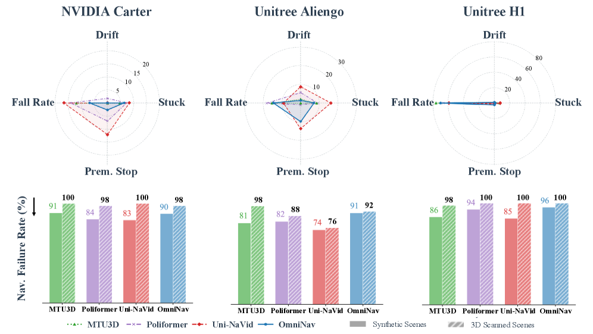

# 1.6 实验结果与分析讨论

## 目标

OmniNavBench 的实验结果不仅用于比较不同方法的数值高低，更重要的是揭示当前通用具身导航方法在组合式任务中的能力边界。

本节不再重复介绍具体指标含义，而是从实验现象出发，分析现有方法在长程任务执行、跨技能协调、跨机器人形态泛化、动态交互和复现设置中的主要困难。

## 从结果中观察模型能力边界

在 OmniNavBench 中，实验结果通常会呈现出一个明显特点：现有方法可以在部分子任务上取得一定进展，但很难稳定完成完整的组合式任务。

这说明当前模型并不是完全缺乏导航能力，而是难以把多种能力稳定连接起来。

可以从三个层次理解实验结果：

```text
局部能力：
模型能否完成某一类单独子任务

连续执行能力：
模型能否把多个子任务按顺序完成

泛化能力：
模型能否在不同场景、不同机器人形态和不同指令风格下保持稳定
```

如果一个方法只在局部能力上表现较好，但在完整 episode 中失败，说明它可能具备基础导航能力，但缺少长程规划、状态保持或任务切换能力。

因此，OmniNavBench 的实验结果更适合用来分析模型短板，而不是只做简单排名。

## 长程组合任务中的失败模式

组合式导航的主要困难来自任务链条变长。Agent 在一个 episode 中需要连续完成多个阶段，每个阶段都会影响后续状态。

一个典型失败过程可能是：

```text
语言导航阶段出现偏差
-> 进入了错误区域
-> 后续目标物体不可见
-> 跟随或问答阶段无法正常开始
-> 整个 episode 失败
```

这类失败说明，组合式任务中的错误不是孤立的。早期的小偏差可能会在后续阶段不断放大，最终导致整条任务失败。

在结果分析中，如果发现模型能够完成部分中间目标，但很难完成完整任务，就可以说明模型的问题主要出现在长程稳定性上，而不是完全不会导航。

这种现象体现了 OmniNavBench 的核心难点：它考察的不是单步决策，而是多阶段任务中的持续执行能力。

## 子任务衔接与状态管理

组合式导航中的另一个关键问题是子任务衔接。Agent 不仅要完成当前目标，还要判断当前目标是否完成，并进入下一个阶段。

例如：

```text
已经到达指定房间后，是否应该开始寻找目标物体？
已经看到目标物体后，是否应该停止搜索？
跟随目标人时，是否应该继续保持距离还是切换到下一阶段？
回答问题前，是否已经观察到足够信息？
```

这些判断都属于高层任务状态管理。

如果模型缺少明确的任务状态表示，就容易出现下面的问题：

```text
提前切换任务
长时间停留在已经完成的阶段
错过后续目标
到达目标附近但没有结束
完成前半段任务后忘记最终目标
```

因此，实验结果中暴露出的不仅是导航误差，也包括任务管理误差。对于通用导航模型来说，理解“当前正在做什么”和“下一步应该做什么”与底层移动能力同样重要。

## 跨技能协调的困难

OmniNavBench 将多种导航能力放入同一个任务流程中。不同子任务依赖的能力并不相同：

```text
VLN 更依赖语言理解和视觉 grounding
ObjectNav 更依赖目标识别和主动搜索
PointNav 更依赖几何定位和路径规划
Human Following 更依赖动态目标跟踪
SocialNav 更依赖安全距离和交互约束
EQA 更依赖主动观察和信息收集
```

这意味着 agent 不能用一种固定策略处理所有阶段。

例如，寻找目标物体时，agent 需要主动探索；跟随人时，agent 需要持续观察动态目标；回答问题时，agent 需要移动到能看到关键信息的位置。

如果实验中模型在某些任务类型上明显更弱，说明它的能力分布并不均衡。一个方法可能擅长几何导航，但不擅长语义搜索；也可能擅长视觉语言理解，但不擅长动态人类交互。

因此，OmniNavBench 的结果可以帮助研究者判断：模型到底是整体导航能力不足，还是只在某几类技能上存在瓶颈。

## 机器人形态对结果的影响

OmniNavBench 中包含不同机器人形态，这使实验结果不仅反映模型能力，也反映模型对 embodiment 的适应能力。

同一条任务在不同机器人上执行时，难度可能不同。原因包括：

```text
相机高度不同
第一人称视角不同
运动方式不同
可通过区域不同
控制稳定性不同
碰撞边界不同
```

例如，轮式机器人通常运动更平稳，但对地形变化更敏感；四足机器人更适合复杂地形，但视觉输入可能受到步态影响；类人机器人视角更接近人类，但动作空间和稳定性要求更高。

如果一个方法在某种机器人上表现较好，但换到另一种形态后明显下降，就说明它可能依赖固定视角、固定运动模式或固定控制接口。

这类结果提醒我们：通用具身导航不能只在单一机器人身体上验证。真正通用的导航策略应该尽量学习更高层的空间、语义和任务表示，而不是过度绑定某一种机器人形态。



图中展示了不同机器人形态下的 failure mode analysis。结果表明，不同 embodiment 会导致不同类型的失败模式，例如目标漂移、停止判断失败、提前终止或机器人跌倒等。这说明组合式导航中的失败不仅来自任务理解，也与机器人形态和控制稳定性密切相关。

## 场景差异与泛化能力

导航结果还会受到场景复杂度影响。

在简单环境中，agent 可能很快看到目标，路径也比较直接。但在复杂室内场景中，目标可能被遮挡，房间之间连接复杂，动态人类也可能改变可行路径。

场景变化会影响多个环节：

```text
目标是否容易被看到
路径是否容易规划
物体是否容易识别
是否需要跨房间搜索
是否需要记住历史路线
是否存在动态障碍或人类活动
```

如果一个方法在简单场景中表现较好，但在复杂场景或真实扫描场景中下降明显，说明它可能没有形成稳定的空间泛化能力。

这类结果对于具身智能非常重要。真实部署时，机器人面对的环境通常不会和训练环境完全一致。因此，能否跨场景泛化，是导航模型能否走向真实应用的重要条件。

## 动态交互任务的特殊难度

Human Following 和 SocialNav 相关任务通常比静态目标导航更难，因为场景中存在移动的人类。

动态交互任务会带来几个额外挑战：

```text
目标位置持续变化
人类可能改变移动方向
目标可能被遮挡
机器人需要控制跟随距离
机器人不能干扰人的正常移动
```

这类任务不能只依赖静态路径规划。Agent 需要根据实时观测不断调整策略。

例如，在跟随任务中，agent 不能只朝目标当前位置移动，而要持续判断目标的移动方向和速度。在社交导航中，agent 即使能到达目标，也需要避免过度靠近人类或阻挡人类路径。

因此，动态交互任务能暴露出模型在实时感知、安全约束和行为自然性方面的不足。

## EQA 对主动观察能力的要求

EQA 任务把导航和问答结合起来。Agent 不是直接看到问题答案，而是需要通过移动获得信息。

一个完整的 EQA 过程通常包括：

```text
理解问题
判断需要观察的区域
移动到合适位置
获取视觉信息
根据观察结果回答问题
```

如果模型回答错误，原因可能不只是语言理解失败，也可能是前面的导航和观察过程失败。

例如：

```text
没有进入正确房间
没有看到目标物体
观察角度不合适
被遮挡物挡住关键信息
还没有收集到足够信息就回答
```

因此，EQA 相关结果体现的是一种更高级的能力：agent 是否能够为了完成认知任务而主动改变自己的位置和视角。

这说明通用具身导航不只是“走到目标点”，还包括“为了获得信息而移动”。

## 复现设置与环境依赖

OmniNavBench 的复现难度主要来自仿真平台、场景资源、机器人模型和传感器配置。与静态数据集不同，具身导航实验需要在三维仿真环境中运行 agent，因此环境配置本身就是实验设置的一部分。

复现实验时，需要特别注意：

| 设置 | 影响 |
| --- | --- |
| 仿真平台版本 | 可能影响物理行为、渲染效果和传感器输出 |
| 场景资源 | 不同场景划分会影响任务难度 |
| 机器人形态 | 会改变视角、动作空间和可达区域 |
| 传感器配置 | RGB、Depth、LiDAR 等输入不同，结果不可直接混合比较 |
| 初始位置和任务指令 | 会影响 episode 的起点、目标和执行难度 |
| 评测脚本 | 指标计算方式需要保持一致 |

因此，在阅读或复现结果时，不能只关注模型结构，还要确认实验条件是否一致。

例如，同一个模型如果换了机器人形态，相机高度和视野都会变化，视觉输入分布也会变化；如果换了场景划分，目标位置、遮挡关系和路径结构也会变化。这些因素都可能导致最终指标变化。

对于入门学习来说，不一定需要一开始就完整搭建所有环境。更合理的学习顺序是先理解任务设计、数据组成和评测逻辑，再根据需要查看代码和运行说明。这样可以避免把主要精力放在复杂环境配置上，而忽略 benchmark 本身想评测的导航能力。

## 对后续研究的启发

OmniNavBench 的实验结果说明，当前通用导航方法仍然需要在多个方面改进。

### 任务状态建模

组合式任务要求模型持续维护当前阶段、已完成目标和剩余目标。如果没有明确的任务状态表示，模型很容易在长程执行中丢失上下文。

后续方法可以考虑显式建模：

```text
当前子任务
已完成子目标
未完成子目标
历史路径
观察到的关键物体
动态目标状态
```

这有助于减少任务切换错误和长程执行失败。

### 分层规划与执行

组合式导航可以自然拆成高层规划和低层执行。

```text
高层规划：
理解指令、分解任务、预测下一个目标

低层执行：
避障、移动、跟随、控制机器人到达目标
```

这种分层结构能够让模型更清楚地区分“要完成什么”和“如何移动过去”。

对于跨机器人形态任务来说，高层规划尤其重要。不同机器人可以共享相似的高层目标，再由各自的低层控制器执行。

### 跨形态表示学习

跨机器人形态结果说明，模型不能过度依赖固定相机高度和固定动作形式。

更通用的导航表示可以包括：

```text
目标区域
相对位置
语义地图
waypoint
可行路径
局部障碍结构
```

这些表示比具体动作更抽象，也更容易在不同机器人之间迁移。

### 社交约束与安全规划

动态人类场景说明，导航模型不能只优化成功率和路径长度，还需要考虑安全性和行为自然性。

模型需要在规划时考虑：

```text
人与机器人之间的距离
人的移动方向
是否阻挡人的路径
是否从不合适的位置穿过
是否过度贴近目标人
```

这些因素对于真实机器人部署非常关键。

### 主动信息收集

ObjectNav 和 EQA 都要求 agent 主动寻找信息。模型不能只被动执行动作，而应该判断当前观察是否足够，以及是否需要移动到更有信息的位置。

例如：

```text
目标物体是否可能被遮挡？
当前视角能否回答问题？
是否需要进入另一个房间？
是否需要绕到物体另一侧观察？
```

主动信息收集能力是从普通导航走向具身智能的重要一步。

## 本节内容回顾

OmniNavBench 的实验结果展示了当前通用具身导航方法在组合式任务中的能力边界。现有方法通常已经具备一定局部导航能力，但在长程任务衔接、跨技能协调、动态交互和跨机器人形态泛化方面仍然存在明显不足。