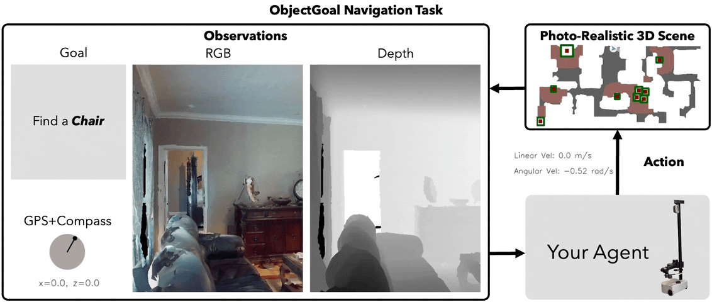
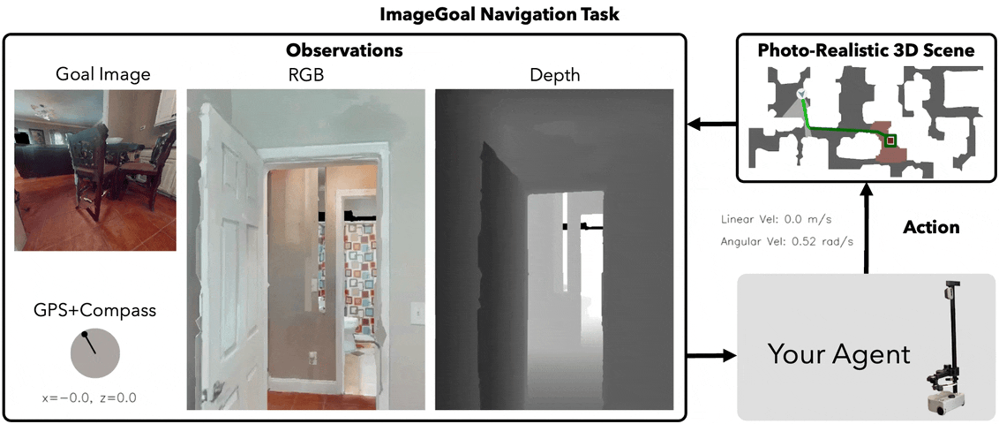
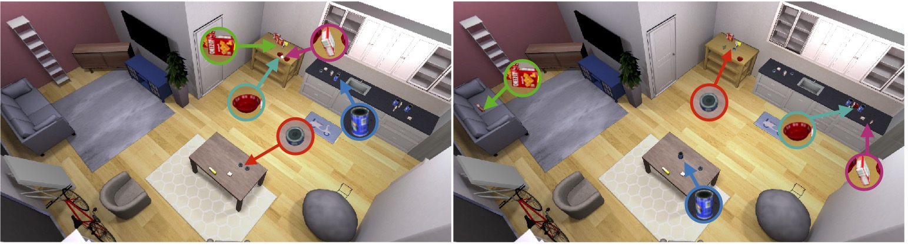

# 2.2 导航与重排任务

## 目标

Habitat Challenge 涵盖多种具身智能任务，其中最典型的是导航任务和重排任务。导航任务主要关注 agent 如何在环境中移动到目标位置或目标物体附近；重排任务则进一步要求 agent 与物体交互，把环境改变成目标状态。

本节主要介绍 ObjectNav、ImageNav、PointNav 和 Rearrangement 等代表任务。

## ObjectNav：目标物体导航

ObjectNav 是 Object Navigation，即目标物体导航。Agent 被初始化在一个未见过的环境中，并被要求寻找某一类别的目标物体。

例如：

```text
find a chair
find a bed
find a toilet
find a tv
```

ObjectNav 的输入通常不是目标坐标，而是一个物体类别。Agent 需要通过第一人称视觉观察环境，并根据场景常识主动搜索目标。

ObjectNav 主要考察：

```text
物体识别
语义理解
空间搜索
路径规划
停止判断
```

它比 PointNav 更难，因为目标位置不是直接给出的。Agent 需要判断目标物体可能出现在哪些区域，例如床通常在卧室，电视可能在客厅，马桶通常在卫生间。



图中展示了 ObjectNav 任务的基本形式。Agent 从随机初始位置出发，根据目标类别在室内环境中搜索目标物体。任务的关键不是沿着已知路线移动，而是在未知环境中逐步探索并确认目标位置。

## ImageNav：图像目标导航

ImageNav 是 Image Navigation，即图像目标导航。Agent 不再接收物体类别，而是接收一张目标图像，并需要导航到图像中对应的具体物体实例附近。

ObjectNav 的目标是类别：

```text
find a chair
```

ImageNav 的目标更具体：

```text
find the chair shown in this goal image
```

这意味着 agent 不仅要识别“椅子”这个类别，还要判断当前看到的椅子是不是目标图片中的同一个实例。

ImageNav 主要考察：

```text
视觉匹配
实例区分
目标图像理解
场景搜索
视角变化鲁棒性
```

例如，一个房间里可能有多把椅子。ObjectNav 只需要找到任意一把符合类别的椅子，而 ImageNav 需要找到目标图像中对应的那一把。



图中展示了 ImageNav 的基本形式。Agent 需要根据目标图像进行实例级导航，这比单纯类别导航更强调视觉细节匹配和目标区分能力。

## PointNav：目标点导航

PointNav 是 Point Navigation，即目标点导航。它要求 agent 移动到给定的目标位置，目标通常以相对坐标或方向距离的形式给出。

例如：

```text
go 5 meters north and 3 meters west
```

PointNav 更强调几何导航能力。Agent 不需要识别具体物体，也不需要理解复杂语言，而是需要根据空间信息移动到目标点。

PointNav 主要考察：

```text
定位能力
路径规划
避障能力
运动控制
到达判断
```

PointNav 在 Habitat Challenge 早期任务中非常重要，因为它可以作为最基础的导航能力测试。模型如果不能稳定完成 PointNav，就很难进一步完成 ObjectNav、ImageNav 或更复杂任务。

## Rearrangement：物体重排任务

Rearrangement 是物体重排任务。它不只是要求 agent 移动到某个地方，而是要求 agent 改变环境状态，把物体从初始位置移动到目标位置。

例如：

```text
把苹果从冰箱里拿出来
-> 移动到桌子附近
-> 将苹果放到指定位置
```

这类任务需要导航和操作结合起来。Agent 既要找到目标物体，又要接近物体、抓取物体、移动到目标位置并完成放置。

Rearrangement 主要考察：

```text
移动导航
目标物体定位
抓取与放置
容器开关
任务规划
低层控制
```

和 ObjectNav、ImageNav 相比，Rearrangement 更接近移动操作任务。它要求 agent 不只是“找到目标”，而是通过动作改变环境。

<video src="assets/habitat-rearrangement.mp4" controls width="100%"></video>

视频展示了 Habitat Rearrangement 中物体重排任务的执行过程。Agent 不仅需要在环境中移动，还需要完成抓取、放置以及与容器或家具相关的交互操作。



图中展示了 Rearrangement 任务中的目标状态示意。重排任务关注的是环境状态变化，即物体是否被移动到了指定位置，而不只是 agent 是否到达了某个导航终点。

## 导航任务与重排任务的关系

可以把 Habitat Challenge 中的任务难度理解为逐步增加：

```text
PointNav：
知道目标点，主要考察几何导航

ObjectNav：
知道目标类别，需要主动搜索物体

ImageNav：
知道目标图像，需要实例级视觉匹配

Rearrangement：
不仅要导航，还要操作物体并改变环境状态
```

它们之间不是完全独立的。Rearrangement 往往需要先完成导航，再完成移动操作；ImageNav 和 ObjectNav 也依赖基础路径规划和避障能力。

因此，Habitat Challenge 可以帮助读者理解具身智能任务从基础导航到移动操作的扩展过程。

## 本节小结

Habitat Challenge 中的任务覆盖了从导航到操作的多个层次。PointNav 关注几何移动，ObjectNav 关注语义目标搜索，ImageNav 关注实例级视觉导航，Rearrangement 则进一步要求 agent 改变环境状态。

这些任务共同体现了具身智能的核心特点：agent 需要在三维环境中连续观察、移动、判断并执行动作，而不是只对静态输入做一次预测。
