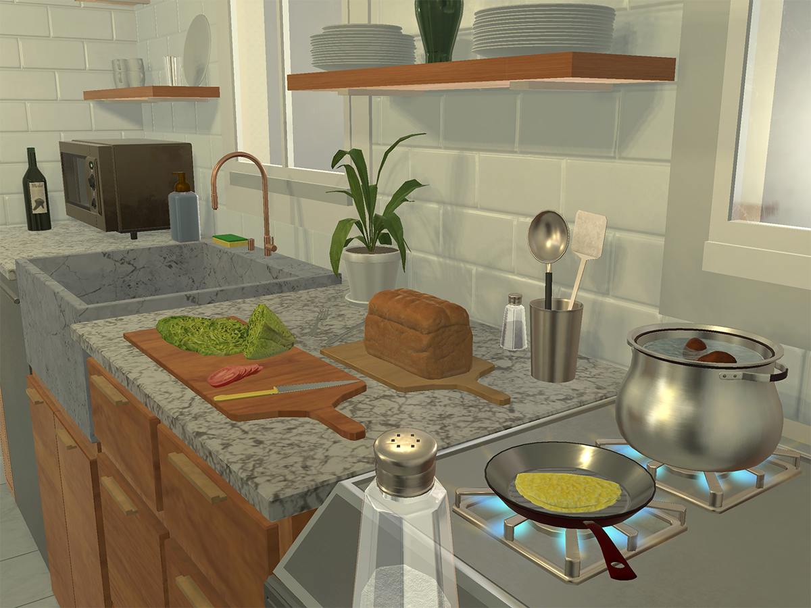

# 3.1 概览与框架定位

## 目标

AI2-THOR 是 embodied AI 中非常常用的室内交互式仿真环境。它不仅提供三维房间和第一人称视觉观测，还支持物体状态变化、导航动作、物体交互、metadata 查询以及不同类型的 agent 任务。

本节主要介绍 AI2-THOR 的基本定位，以及 iTHOR、ManipulaTHOR、RoboTHOR 之间的关系。

## AI2-THOR 的基本定位

AI2-THOR 的全称可以理解为 The House Of inteRactions。它的核心目标是为视觉智能体提供一个可以观察、移动和交互的三维室内环境。

在普通视觉任务中，模型通常只接收一张静态图像，然后输出分类、检测或分割结果。而在 AI2-THOR 中，agent 处在一个可以交互的房间里，需要通过连续动作改变自己的位置和视角。

基本流程可以写成：

```text
初始化场景
-> agent 接收第一人称观测
-> agent 执行动作
-> 环境状态更新
-> 返回新的图像和 metadata
-> agent 继续决策
```

这和真实机器人更接近。机器人不是一次性看到完整环境，而是需要在环境中移动，通过连续观察逐步理解周围空间。

## iTHOR、ManipulaTHOR 与 RoboTHOR

AI2-THOR 不是单一任务，而是一个平台生态。常见的三个部分是 iTHOR、ManipulaTHOR 和 RoboTHOR。

| 名称           | 主要定位           | 适合学习                          |
| ------------ | -------------- | ----------------------------- |
| iTHOR        | 室内交互式家庭环境      | 视觉导航、物体交互、ObjectNav、PointNav  |
| ManipulaTHOR | 带机械臂的视觉操作环境    | ArmPointNav、抓取、移动操作、移动机械臂     |
| RoboTHOR     | 仿真与真实场景配对的导航环境 | ObjectNav、sim-to-real、真实机器人泛化 |

可以简单理解为：

```text
iTHOR：
先学会在室内场景中看、走、找物体、操作物体

ManipulaTHOR：
进一步加入机械臂，让 agent 不只是走，还能操作

RoboTHOR：
进一步考虑仿真到真实，让 agent 在真实对应场景中测试泛化
```

这三个部分共同构成了 AI2-THOR 在 embodied AI 中的代表性：它既有室内交互环境，也有移动操作任务，还提供了 sim-to-real 研究入口。

## 平台总览图



图中展示了 AI2-THOR 中的一个室内厨房场景。可以看到，环境中包含大量日常物体，例如锅、盘子、植物、面包、刀具和厨具等。对于 embodied agent 来说，这些物体不是普通背景，而是可以被识别、导航到达或交互的环境元素。


## AI2-THOR 适合研究的问题

AI2-THOR 支持的任务比较丰富，常见方向包括：

```text
ObjectNav：根据目标物体类别导航到目标附近
PointNav：根据目标点或相对位置移动
Object Interaction：打开、关闭、拾取、放置、切换状态
Embodied QA：通过移动和观察回答环境问题
Rearrangement：改变物体摆放状态
Manipulation：使用机械臂接近或操作物体
Sim-to-Real：从仿真泛化到真实场景
```

这些方向共同体现了 embodied AI 的核心特点：agent 需要在具体环境中感知、行动和交互，而不是只在静态数据上做预测。

## 场景与物体交互

AI2-THOR 的一个重要特点是物体具有状态和交互属性。

例如，一个普通物体可以有下面这些状态：

```text
是否可见
是否可拾取
是否可打开
是否已经打开
是否可切换开关
是否被加热
是否被冷却
是否破碎
是否装有液体
是否被清洁
```

这使得 AI2-THOR 不只是一个视觉导航环境，也可以用于研究物体状态变化和动作结果。

例如：

```text
打开冰箱
-> 放入苹果
-> 关闭冰箱
-> 苹果状态发生变化

打开微波炉
-> 放入杯子
-> 开启微波炉
-> 杯子温度状态变化
```

这种状态变化对 embodied reasoning 很重要。Agent 不仅要知道物体在哪里，还要理解动作会怎样改变环境。

## 本节小结

AI2-THOR 是一个面向室内具身智能的交互式仿真平台。它通过 iTHOR 提供室内交互场景，通过 ManipulaTHOR 支持视觉操作，通过 RoboTHOR 连接仿真与真实环境。

理解 AI2-THOR 时，最重要的是把它看成一个可交互的闭环环境。Agent 每一步动作都会改变自身位置、视角或物体状态，从而影响下一步观测和后续决策。
