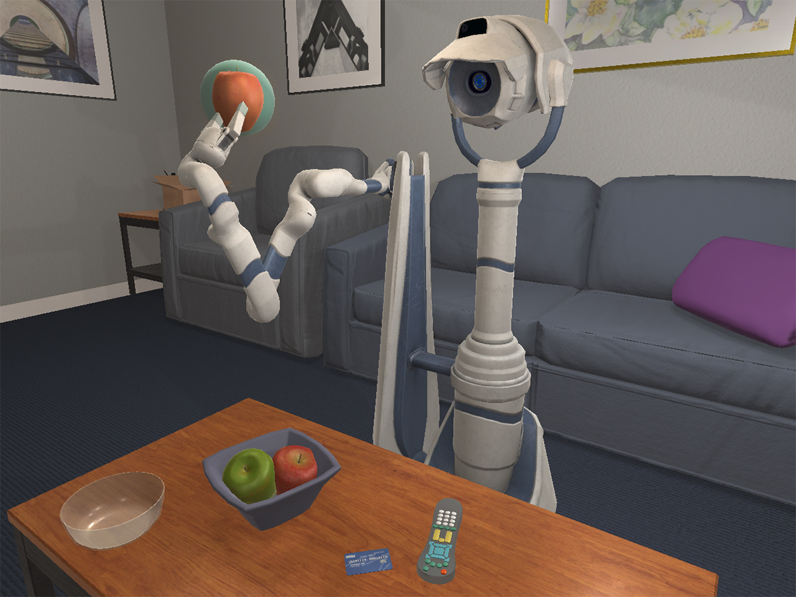
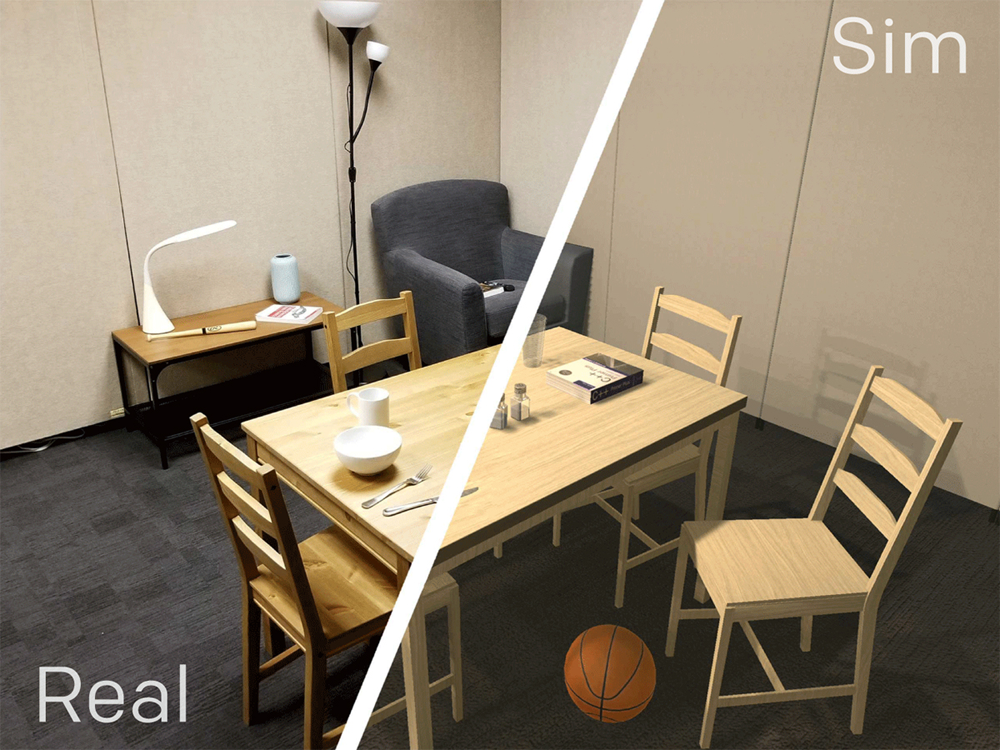

# 3.4 ManipulaTHOR、RoboTHOR 与评测分析

## 目标

AI2-THOR 不只支持普通室内导航，也扩展出了 ManipulaTHOR 和 RoboTHOR。ManipulaTHOR 关注视觉操作和机械臂控制，RoboTHOR 关注仿真到真实的导航泛化。

本节主要介绍 ManipulaTHOR、RoboTHOR 的任务特点，以及阅读相关实验结果时需要注意的指标和设置。

## ManipulaTHOR：从导航到移动操作

ManipulaTHOR 是 AI2-THOR 中面向视觉操作的环境。它在室内场景中加入机械臂，使 agent 不仅能移动，还能通过机械臂接近和操作物体。



图中展示了 ManipulaTHOR 中的机械臂操作场景。和普通导航任务相比，ManipulaTHOR 要求 agent 同时考虑相机视角、机械臂位置、目标物体可达性和操作动作，因此更接近移动操作任务。

ManipulaTHOR 的典型特点包括：

```text
移动 agent
机械臂控制
第一人称 RGB-D 观测
触觉或接触相关信息
目标物体定位
抓取和接近动作
```

它比普通 ObjectNav 更难，因为 agent 不只是找到目标，还需要把机械臂移动到合适位置。

## ArmPointNav

ManipulaTHOR 中一个代表性任务是 ArmPointNav。它可以理解为 PointNav 的机械臂版本。

普通 PointNav 的目标是让 agent 移动到某个目标点附近；ArmPointNav 则要求机械臂末端移动到目标位置附近。

可以简单理解为：

```text
PointNav：
移动 agent 身体到目标点

ArmPointNav：
移动机械臂末端到目标点
```

ArmPointNav 的难点包括：

```text
目标点可能被遮挡
机械臂需要避开障碍物
末端执行器运动空间有限
相机视角和机械臂状态需要共同考虑
不同物体附近的可达性不同
```

这种任务连接了视觉导航和机器人操作。它既需要视觉感知，也需要几何控制和动作规划。

## RoboTHOR：面向 sim-to-real 的导航

RoboTHOR 是 AI2-THOR 中面向 simulation-to-real 的环境。它包含仿真场景和对应的真实物理场景，用于研究模型从仿真迁移到真实环境时的表现。



图中展示了 RoboTHOR 中仿真场景与真实场景的配对关系。左侧是真实物理环境，右侧是对应的模拟环境。通过这种设计，可以研究在仿真中训练的 agent 是否能够迁移到真实场景。

RoboTHOR 的核心问题是：

```text
模型在仿真中表现好，到了真实场景还是否有效？
```

这比普通仿真 benchmark 更接近真实机器人部署问题。因为真实环境中会出现仿真中难以完全匹配的因素，例如光照、纹理、相机噪声、控制误差和物体细节差异。

## RoboTHOR ObjectNav

RoboTHOR Challenge 中的典型任务是 ObjectNav。Agent 从随机位置出发，目标是导航到某个指定类别物体附近。

任务流程可以理解为：

```text
初始化 RoboTHOR 公寓场景
-> 给定目标物体类别
-> agent 接收第一人称观测
-> agent 连续执行导航动作
-> 接近目标后停止
-> 根据 success 和路径效率计算结果
```

RoboTHOR ObjectNav 的特点是目标是语义类别，而不是坐标。Agent 需要根据视觉输入和场景常识主动搜索。

例如：

```text
目标是 television：
agent 可能需要搜索客厅区域

目标是 bed：
agent 可能需要进入卧室

目标是 toilet：
agent 可能需要找到卫生间
```

这类任务能够考察模型是否真正理解室内场景和物体分布。

## Sim-to-Real 难点

RoboTHOR 的关键价值在于 sim-to-real。仿真和真实场景虽然配对，但它们不可能完全一致。

常见差异包括：

```text
视觉纹理差异
光照条件差异
相机噪声
物体外观细节差异
机器人运动误差
真实地面摩擦和碰撞差异
传感器延迟
```

这些差异会导致模型在仿真中学到的策略，在真实环境中表现下降。

例如，模型可能在仿真中依赖某种墙面纹理或物体外观，但真实场景中纹理不同，导致识别失败；也可能在仿真中认为一步 MoveAhead 总是精确移动固定距离，但真实机器人执行时会有误差。

因此，RoboTHOR 适合用来研究：

```text
领域随机化
视觉鲁棒性
真实机器人泛化
控制误差适应
sim-to-real transfer
```

## 评测指标

AI2-THOR / RoboTHOR 相关任务常用指标包括：

| 指标                   | 含义                 | 适用任务                           |
| -------------------- | ------------------ | ------------------------------ |
| Success              | 是否成功完成任务           | PointNav、ObjectNav、ArmPointNav |
| SPL                  | 成功率加权路径效率          | PointNav、ObjectNav             |
| Episode Length       | 完成任务所用步数           | Navigation                     |
| Distance to Goal     | agent 或机械臂末端到目标的距离 | PointNav、ArmPointNav           |
| Object Visibility    | 目标物体是否进入视野         | ObjectNav                      |
| Manipulation Success | 是否成功到达或操作目标        | ManipulaTHOR                   |

对于 ObjectNav，Success 和 SPL 是常见指标。Success 说明是否找到目标，SPL 说明是否高效找到目标。

对于 ManipulaTHOR，除了是否成功外，还需要关注机械臂末端距离目标、是否发生碰撞、是否达到可操作位置等信息。

## 结果阅读方式

阅读 AI2-THOR / RoboTHOR 的实验结果时，需要先确认任务类型。

如果是 ObjectNav，重点看：

```text
是否找到目标物体
是否在目标附近正确停止
路径是否高效
是否能泛化到未见场景
```

如果是 PointNav，重点看：

```text
是否到达目标点
定位是否准确
路径是否短
是否受碰撞和局部规划影响
```

如果是 ManipulaTHOR，重点看：

```text
机械臂是否到达目标
是否避开障碍物
是否能在遮挡下操作
是否能处理不同物体位置
```

如果是 RoboTHOR sim-to-real，重点看：

```text
仿真结果和真实结果差距多大
模型是否依赖仿真纹理
真实机器人控制误差是否影响结果
领域随机化是否提升真实表现
```

这种分析方式比只看单个分数更有用。

## 本节小结

ManipulaTHOR 和 RoboTHOR 分别代表了 AI2-THOR 的两个重要扩展方向。ManipulaTHOR 将任务从导航推进到移动操作，RoboTHOR 则将评测从纯仿真推进到 sim-to-real。

理解这两个扩展后，可以更清楚地看到 AI2-THOR 的价值：它不是单纯的室内渲染环境，而是一个覆盖导航、交互、操作和真实迁移的 embodied AI 平台。

