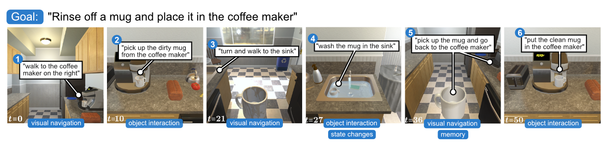

# 4.1 概览与评测协议

## 目标

ALFRED 是 Action Learning From Realistic Environments and Directives 的缩写。它是一个面向家庭场景的语言指令跟随 benchmark，要求 agent 根据自然语言指令和第一人称视觉观测，完成一系列导航和物体交互动作。

本节主要介绍 ALFRED 的基本定位、任务执行流程、数据组成和评测方式。

## ALFRED 的基本定位

ALFRED 关注的是语言驱动的长程家庭任务。它不是只让 agent 到达某个位置，也不是只让 agent 对静态图像做分类，而是要求 agent 在三维室内环境中连续观察、移动和操作物体。

一个典型 ALFRED 任务可能是：

```text
Rinse off a mug and place it in the coffee maker.
```

这条指令可以拆成多个步骤：

```text
走到咖啡机附近
-> 找到脏杯子
-> 拿起杯子
-> 走到水槽
-> 清洗杯子
-> 返回咖啡机
-> 放下杯子
```

这个过程包含多种能力：

```text
语言理解
视觉导航
物体识别
物体交互
状态变化
长程记忆
任务完成判断
```

因此，ALFRED 更接近真实家庭机器人任务，而不是单一导航或单一操作 benchmark。

## 长程任务与状态变化

ALFRED 的一个重要特点是 long composition rollouts。任务往往由多个子目标组成，并且包含不可逆或难以恢复的状态变化。

例如：

```text
拿起物体
打开容器
清洗物体
加热物体
冷却物体
把物体放到指定位置
```

这些动作会改变环境状态。Agent 如果在前面阶段出错，后续任务可能会受到影响。

例如：

```text
拿错杯子
-> 清洗了错误物体
-> 即使走到咖啡机旁边，也无法完成正确任务
```

这种设定使 ALFRED 比普通导航任务更难。它不仅考察 agent 是否能到达目标位置，也考察 agent 是否能持续维护任务目标和物体状态。

## ALFRED 与 AI2-THOR 的关系

ALFRED 的底层环境基于 AI2-THOR。AI2-THOR 提供室内三维场景、第一人称视觉观测、物体状态和可交互动作用；ALFRED 在此基础上构建语言指令、专家轨迹和评测协议。

可以理解为：

```text
AI2-THOR：
提供环境、物体、动作和视觉观测

ALFRED：
在 AI2-THOR 上定义语言任务、专家示范和评测目标
```

在 ALFRED 中，agent 接收第一人称 RGB 图像和语言指令，然后输出低层动作。环境执行动作后返回新的视觉观测和状态信息。

这个循环可以写成：

```text
observation + instruction
-> policy
-> action
-> environment update
-> new observation
```

## Benchmark 的基本组成

ALFRED 可以拆成几个核心组成部分：

| 组成                        | 含义                                              |
| ------------------------- | ----------------------------------------------- |
| Goal Instruction          | 高层目标指令，例如“清洗杯子并放到咖啡机中”                          |
| Step-by-Step Instructions | 分步语言指令，描述完成任务的关键阶段                              |
| Expert Trajectory         | 专家完成任务时的动作序列和观测记录                               |
| Low-level Actions         | MoveAhead、RotateLeft、PickupObject、PutObject 等动作 |
| Visual Observations       | 第一人称 RGB 图像，以及可选的深度、mask 或特征                    |
| Task Type                 | Pick & Place、Clean & Place、Heat & Place 等任务类型   |
| Evaluation Metrics        | 任务成功率、子目标成功率、路径长度加权指标等                          |

这些组成共同决定了 ALFRED 的任务形式：agent 需要把语言指令映射成一段可执行动作序列。

## 任务示意图



图中展示了 ALFRED 中一条典型家庭任务的分步执行过程。整条任务由高层目标和多个低层步骤组成，agent 需要在视觉导航和物体交互之间不断切换，才能完成最终目标。

## 示例任务视频

<video src="assets/alfred-clean-and-place-demo.mp4" controls width="100%"></video>

如果视频无法播放，可以点击查看：[ALFRED clean and place demo](assets/alfred-clean-and-place-demo.mp4)

视频展示了一段 ALFRED 风格的家庭任务执行过程。可以看到，agent 的观测不是静态图像，而是随着导航和物体交互不断变化；任务也不是一步完成，而是由多个连续动作组成。

## ALFRED 的评测流程

ALFRED 的评测通常围绕完整任务执行展开。

可以抽象为：

```text
加载测试任务
-> 初始化 AI2-THOR 场景
-> 输入目标指令和分步指令
-> agent 根据视觉观测输出动作
-> 环境执行动作并更新状态
-> 判断任务是否完成
-> 统计成功率和路径效率
```

和静态数据集不同，ALFRED 的输出不是一个标签，而是一段动作序列。Agent 的每一步动作都会影响后续视觉输入和任务状态。

如果 agent 早期走错方向、拿错物体或错过目标容器，后续即使继续执行动作，也可能无法完成任务。

## 训练和测试划分

ALFRED 关注模型是否能泛化到新场景和新任务组合。常见划分包括：

```text
train
valid seen
valid unseen
test seen
test unseen
```

其中 seen / unseen 的区别在于测试环境是否在训练中出现过。

```text
seen：
场景或任务类型更接近训练分布

unseen：
需要在未见过的环境中完成任务
```

Unseen split 更能反映模型泛化能力。一个方法如果只在 seen 上表现好，但在 unseen 上明显下降，说明它可能过度依赖训练场景或固定物体布局。

## 本节小结

ALFRED 的核心是将语言理解、视觉导航和物体交互组合成完整家庭任务。它通过 AI2-THOR 提供可交互环境，通过自然语言指令定义任务，通过专家轨迹提供监督信号，并通过完整 episode 的执行结果评估 agent 能力。

理解 ALFRED 时，需要始终关注一个核心问题：agent 能否把自然语言指令转化为连续、正确、可执行的环境动作。
