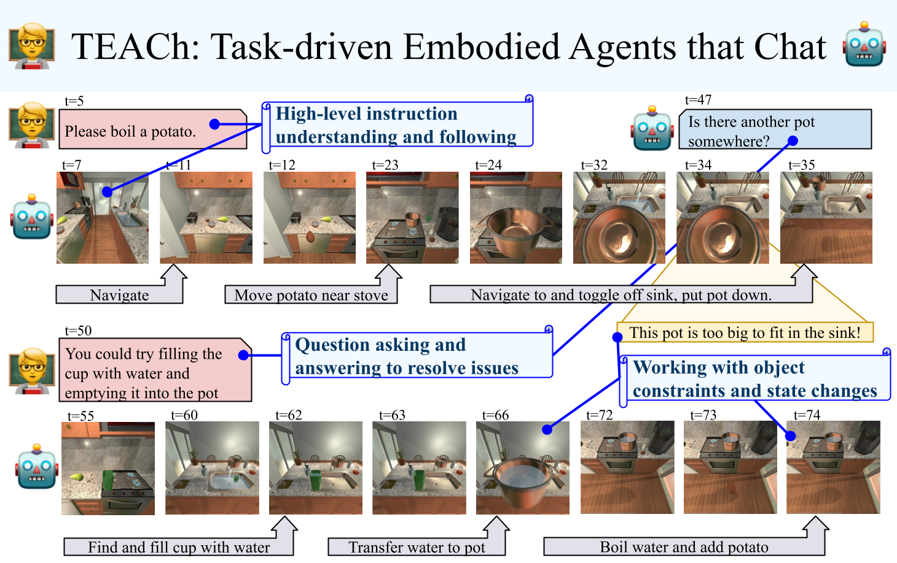

# 5.1 概览与对话协议

## 目标

TEACh 是 Task-driven Embodied Agents that Chat 的缩写。它关注的是对话式具身任务执行：agent 不仅要在模拟家庭环境中移动和操作物体，还要通过自然语言对话与人类协作者交换信息。

本节主要介绍 TEACh 的基本定位、Commander / Follower 协作形式、对话在任务执行中的作用，以及它和普通语言指令跟随任务的区别。

## TEACh 的基本定位

在很多具身智能 benchmark 中，agent 只接收一条固定指令，然后独立完成任务。例如：

```text
Put the apple on the table.
```

这类设置假设任务信息在一开始就足够完整。但真实家庭任务中，用户指令经常不完整、含糊或需要动态澄清。

例如：

```text
把土豆煮一下。
```

这条指令可能没有说明：

```text
土豆在哪里？
锅在哪里？
水从哪里来？
炉灶是否可用？
如果找不到锅怎么办？
```

TEACh 的核心思想是把这种不确定性放进 benchmark 中。它让一个 Commander 和一个 Follower 通过自然语言协作完成任务。Commander 知道任务目标和部分环境线索，Follower 控制虚拟 agent，在第一人称视角下导航和操作物体。

可以简单理解为：

```text
普通指令跟随：
用户给一句指令
-> agent 自己执行

TEACh：
Commander 和 Follower 持续对话
-> Follower 根据对话和视觉环境执行任务
```

这种设置更接近真实机器人应用。机器人不一定一开始就知道所有信息，而是可以通过对话获得帮助。

## Commander 与 Follower

TEACh 的交互由两个角色组成：

| 角色 | 作用 |
| --- | --- |
| Commander | 知道任务目标和环境信息，通过自然语言指导 Follower |
| Follower | 控制虚拟 agent，在环境中移动、观察、操作物体，并通过对话请求帮助 |

Commander 不直接控制 agent，而是通过语言告诉 Follower 应该做什么。Follower 则需要根据自己的第一人称视觉观察和 Commander 的语言提示完成任务。

例如，一个任务可能包含这样的对话：

```text
Follower:
Hello, what shall I do today?

Commander:
Please boil a potato.

Follower:
Is there another pot somewhere?

Commander:
You could try filling a cup with water and emptying it into the pot.

Follower:
Good thinking. Thank you.
```

这段对话体现了 TEACh 的特点：Follower 在执行过程中可能遇到问题，并通过提问获得新的策略或线索。

## 对话在任务执行中的作用

TEACh 中的对话不是附加文本，而是任务执行的一部分。它可以承担多种功能：

| 对话功能 | 示例 | 作用 |
| --- | --- | --- |
| 给出目标 | Please boil a potato. | 指定最终任务 |
| 提供位置线索 | The potato is on the counter. | 缩小搜索范围 |
| 纠正错误 | Not that mug, use the one near the sink. | 修正目标选择 |
| 解释替代方案 | Fill a cup with water and pour it into the pot. | 帮助解决物体约束 |
| 确认完成 | Done. / All done. | 标记任务阶段或最终完成 |

对话使 agent 能够在任务执行过程中动态补充信息。特别是在目标不可见、物体约束复杂或任务步骤不清楚时，对话能帮助 Follower 继续推进任务。

## 对话式任务与静态指令任务的区别

TEACh 和静态指令任务的区别主要体现在三个方面。

### 信息不是一次性给完

在静态指令任务中，所有关键信息通常都在任务开始时给出。TEACh 中的信息可能分散在整个对话历史中。

```text
早期对话：
告诉任务目标

中间对话：
提供位置线索或纠错

后期对话：
确认状态或给出替代方案
```

这要求模型持续维护 dialogue history，而不是只理解当前一句话。

### 语言和视觉状态相互影响

Follower 的问题往往来自当前视觉状态。例如，Follower 找不到锅，才会问是否有其他 pot；Commander 的回答又会影响后续动作。

可以写成：

```text
当前视觉状态
-> Follower 提问
-> Commander 回答
-> Follower 更新计划
-> 继续执行动作
```

因此，TEACh 的语言理解不是脱离环境的，而是和具身状态绑定。

### 错误可以通过对话恢复

在普通任务中，agent 一旦拿错物体或走错方向，可能只能继续失败。TEACh 中，Commander 可以纠正 Follower，也可以提供替代方案。

这使得 TEACh 更适合研究：

```text
任务恢复
错误纠正
主动提问
合作式规划
对话历史建模
```

## 项目总览图



图中展示了 TEACh 中 Commander 和 Follower 协作完成任务的过程。Follower 在第一人称环境中导航和操作，Commander 通过语言提供任务目标、位置线索和解决方案。相比单向指令跟随任务，TEACh 更强调对话、状态变化和任务恢复。

## 示例 episode 视频

下面的视频来自 TEACh 项目页，用于直观看到 Follower 在第一人称环境中执行任务的过程：

<video src="assets/teach-example-episode.mp4" controls width="100%"></video>

如果浏览器不直接播放，也可以点击查看：[TEACh example episode](assets/teach-example-episode.mp4)。

完整 episode 也可以通过 `teach_replay --create_video` 从本地 game session 生成。由于不同数据文件和运行环境不同，本章在环境配置部分会介绍如何用官方工具生成本地 episode 视频。

## 一次 TEACh episode 的执行流程

一次 TEACh episode 可以理解为：

```text
初始化 AI2-THOR 场景
-> Follower 看到第一人称画面
-> Commander 给出任务目标或线索
-> Follower 执行动作
-> 环境状态变化
-> Follower 根据需要继续对话
-> Commander 提供帮助或确认
-> Follower 完成任务
-> 根据最终环境状态计算指标
```

和只看最终动作序列不同，TEACh 需要同时关注 dialogue、visual observation、action sequence 和 final state。一个模型如果忽略其中任何一部分，都可能在长程任务中失败。

## 本节小结

TEACh 的核心价值在于把自然语言协作放进具身任务执行中。它要求模型不只会“看图行动”，也要能理解对话历史、追踪任务阶段、请求帮助和利用纠错信息。

如果说 AI2-THOR 提供了可交互的家庭环境，ALFRED 强调从语言指令到长程动作，那么 TEACh 更进一步：它研究人类协作者如何通过对话帮助 agent 在动态任务中完成目标。

