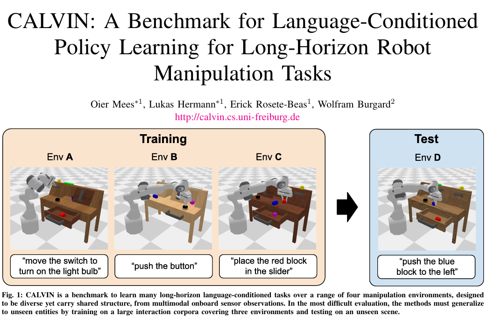

# 9.1.4.1 整体介绍

CALVIN 是一个用于长期语言条件连续控制策略学习的基准测试，旨在评估机器人在多种环境和任务中执行复杂操作的能力。它覆盖多模态感知、动态交互、语言理解、连续控制与任务泛化能力，是 embodied AI 和 robot learning 中常用的 simulation benchmark。

[论文](https://arxiv.org/pdf/2112.03227)

## CALVIN 要评估什么

CALVIN 的核心问题是：给定机器人当前观测和一条自然语言指令，策略需要输出连续动作，让机器人在桌面环境中完成对应操作。

与只评估单步任务的 benchmark 不同，CALVIN 更关注长时序执行能力。评估时，机器人通常需要连续完成 5 个子任务，例如：

```text
open the drawer
pick up the blue block
push the block into the drawer
turn on the lightbulb
move the sliding door
```

这意味着策略不仅要能完成单个指令，还要在多个子任务之间保持稳定的闭环控制能力。

## 环境组成

CALVIN 具有四种不同但结构相关的环境：A、B、C、D。每个环境都包含：

- 一个带平行夹具的 7 自由度 Franka 机器人；
- 一张带滑动门、可开合抽屉的桌子；
- 一个黑色按钮，用于切换绿灯；
- 一个上下滑动开关，用于控制灯泡；
- 三种不同颜色和形状的矩形块。

为了评估语言条件策略的泛化能力，四个环境具有不同纹理，并且滑动门、抽屉、按钮、开关等静态元素的位置不同。桌子、机器人和静态相机的位置保持一致，从而把挑战集中在视觉外观、物体布局、语言任务和控制策略泛化上。

四个环境总计约 24 小时遥操作 play data，每个环境约 6 小时，对应约 240 万个交互 step，语言侧包含约 20K language directives。

## 三种挑战设置

CALVIN 常用三种 benchmark 设置：

| 设置 | 含义 | 主要考查点 |
|---|---|---|
| D-D | 在 D 环境中训练，并在 D 环境中评估 | 单一环境内的语言条件操作能力 |
| ABCD-D | 在 A、B、C、D 四个环境中训练，并在 D 环境中评估 | 多环境训练下的鲁棒性与数据收益 |
| ABC-D | 在 A、B、C 三个环境中训练，并在未见过的 D 环境中评估 | 零样本跨环境泛化能力 |

其中 `ABC-D` 是更具挑战性的零样本评估：策略训练时没有见过 D 环境，但评估全部在 D 环境上进行。


## 项目结构预览


```text
calvin/
├── calvin_env/        # 仿真环境：机器人、桌面场景、相机、触觉、任务判定
├── calvin_models/     # baseline 模型、训练入口、评估入口和 Hydra 配置
├── dataset/           # 数据集下载脚本和数据说明
├── scripts/           # 数据可视化脚本
├── slurm_scripts/     # Slurm 集群训练和评估脚本
└── install.sh         # 配置环境
```

训练和评估时进入的目录是：

```bash
cd /path/to/calvin_models/calvin_agent
```

关键入口：

| 文件 | 作用 |
|---|---|
| `training.py` | baseline 训练入口 |
| `evaluation/evaluate_policy.py` | 长时序策略评估入口 |
| `evaluation/evaluate_policy_singlestep.py` | 单步任务评估入口 |
| `conf/` | Hydra 配置目录 |


