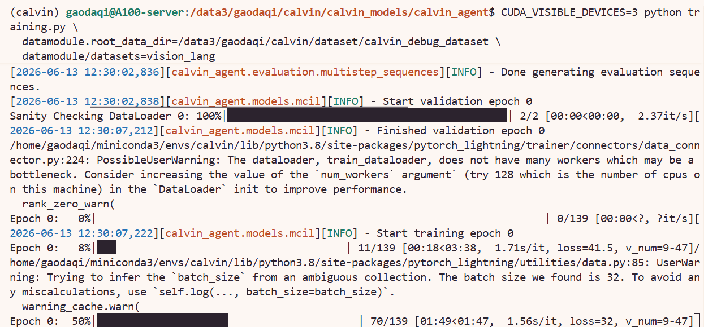
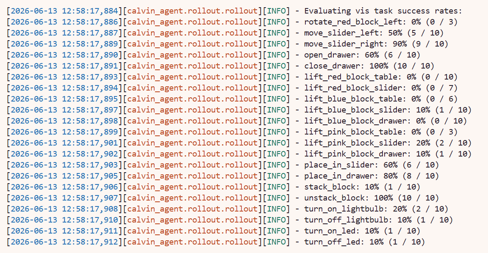
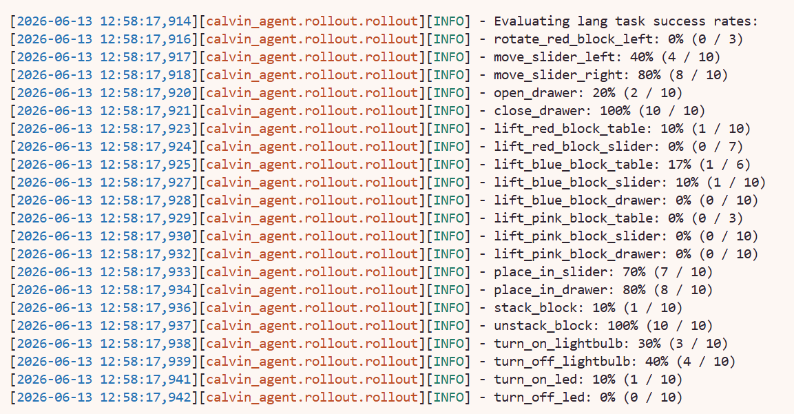

# 9.1.4.4 训练与评估

本节介绍如何用 CALVIN 官方 baseline 进行训练和评估。由于正式数据集过大，所以先用 debug 数据集进行测试，后续切换到正式数据集。

## 官方 baseline 训练入口

官方 README 中的基本训练命令是：

```bash
cd /path/to/calvin/calvin_models/calvin_agent

python training.py \
  datamodule.root_data_dir=/path/to/dataset/ \
  datamodule/datasets=vision_lang_shm
```

其中：

| 参数 | 含义 |
|---|---|
| `datamodule.root_data_dir` | 数据集根目录，应包含 `training/` 和 `validation/` |
| `datamodule/datasets=vision_lang_shm` | 使用 shared memory dataloader，加速正式训练 |
| `datamodule/datasets=vision_lang` | 使用普通磁盘 dataloader，更适合 debug |

## 默认 config 说明

`training.py` 使用 Hydra 加载配置，默认配置入口是：

```text
calvin_models/conf/config.yaml
```

这个默认配置会组合多个子配置：

| 配置项 | 默认值 | 作用 |
|---|---|---|
| `callbacks` | `default` | 训练过程中的 checkpoint、rollout、long-horizon rollout 等 callback |
| `datamodule` | `default` | 数据集路径、观测空间、动作空间、dataloader 设置 |
| `model` | `default` | 默认模型结构，即 MCIL baseline |
| `loss` | `default` | KL loss 等损失权重 |
| `training` | `default_training` | 学习率等训练超参数 |
| `trainer` | `play_trainer` | PyTorch Lightning 的 trainer 设置 |
| `logger` | `wandb` | 默认使用 wandb 记录日志 |

默认模型是 CALVIN 官方的 MCIL baseline：

```yaml
model:
  _target_: calvin_agent.models.mcil.MCIL
```


默认 datamodule 会使用 `vision_lang_shm`，即 shared memory 数据读取方式：

```yaml
datamodule:
  datasets: vision_lang_shm
  root_data_dir: dataset/task_D_D
```

在实际运行时显式覆盖数据路径即可：

```bash
python training.py \
  datamodule.root_data_dir=/path/to/dataset/ \
  datamodule/datasets=vision_lang_shm
```


## GPU 指定方式

CALVIN 默认配置中：

```yaml
trainer:
  devices: 1
  accelerator: gpu
  precision: 16
  max_epochs: 100
```

默认使用 1 张 GPU。可以通过 `CUDA_VISIBLE_DEVICES` 指定 GPU，例如使用0、1 号卡：

```bash
CUDA_VISIBLE_DEVICES=0,1 \
python training.py \
  datamodule.root_data_dir=/path/to/dataset/ \
  datamodule/datasets=vision_lang_shm
```

## 用 debug 数据集进行验证
 

```bash
cd /path/to/calvin/calvin_models/calvin_agent

CUDA_VISIBLE_DEVICES=3 python training.py \
  datamodule.root_data_dir=/path/to/dataset/ \
  datamodule/datasets=vision_lang_shm
```

成功进行训练截图：


在训练过程中也会同时进行eval：



## 正式训练

正式训练可以参考 README，数据集需要手动更换`datamodule.root_data_dir`，默认训练 100 个 epoch：

```bash
cd /path/to/calvin/calvin_models/calvin_agent

CUDA_VISIBLE_DEVICES=3 python training.py \
  datamodule.root_data_dir=/path/to/calvin/dataset/task_D_D \
  datamodule/datasets=vision_lang_shm
```


训练输出默认会保存在 Hydra run 目录中，例如：

```text
/path/to/calvin/calvin_models/runs/YYYY-MM-DD/HH-MM-SS/
```


## 评估

评估入口是：

```bash
cd /path/to/calvin/calvin_models/calvin_agent

python evaluation/evaluate_policy.py \
  --dataset_path /path/to/calvin/dataset/task_D_D \
  --train_folder /path/to/training/log/folder
```

可指定 checkpoint：

```bash
python evaluation/evaluate_policy.py \
  --dataset_path /path/to/calvin/dataset/task_D_D \
  --train_folder /path/to/training/log/folder \
  --checkpoint /path/to/checkpoint.ckpt
```


MTLC 对 34 个任务做单任务测试，每个任务 10 次 rollout；LH-MTLC 使用 1000 条五任务指令链，并报告连续完成 1、2、3、4、5 个 instruction 的比例。也需要 `Avg. Len.`，即平均连续完成任务长度。

