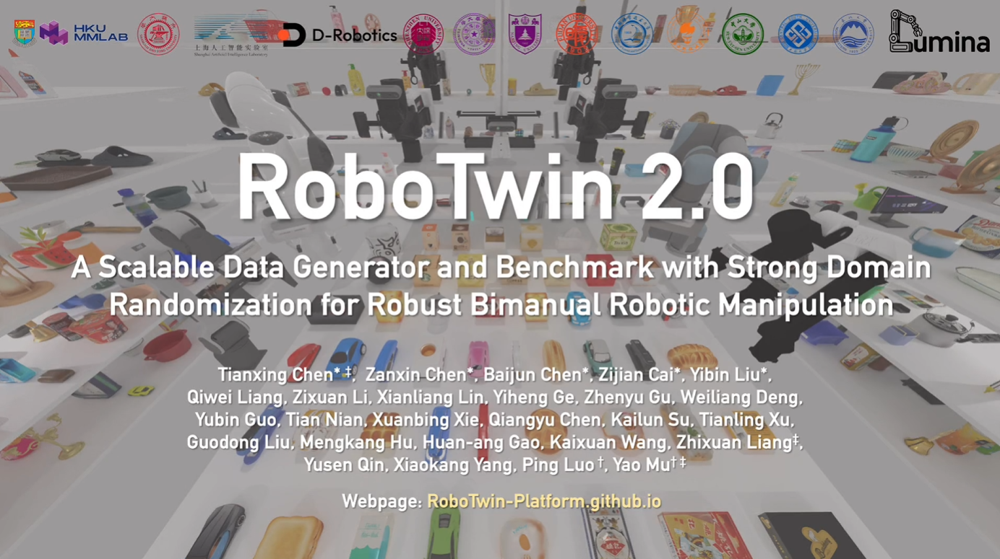

# 9.1.5.1 整体介绍
- [官方网站](https://robotwin-platform.github.io/)
- [论文](https://arxiv.org/pdf/2506.18088)
- [GitHub](https://github.com/robotwin-Platform/RoboTwin)
- [文档](https://robotwin-platform.github.io/doc/)

## RoboTwin 2.0 是什么

RoboTwin 2.0 是一个面向双臂机器人操作的数据生成与 benchmark 平台，它的重点是用统一的仿真环境、任务定义、数据采集脚本和 policy 评测脚本，评估模型在双臂操作任务上的成功率与鲁棒性。


## RoboTwin任务介绍

RoboTwin 2.0 提供 50 个双臂 manipulation 任务，大致可以划分成以下几种。

| 类型 | 代表任务 | 主要考察能力 |
|---|---|---|
| 双臂交接 | `handover_block` | 左右臂角色分工、交接时机和抓取稳定性 |
| 双臂同步搬运 | `move_can_pot` | 两只手协同移动物体，保持姿态稳定 |
| 多物体排序/堆叠 | `blocks_ranking_rgb` | 根据颜色、大小或顺序完成多物体操作 |
| 工具使用 | `beat_block_hammer` | 抓取工具并让工具端与目标发生精确接触 |
| 精确按压/开关 | `click_alarmclock` | 小目标定位、末端精度和接触控制 |
| 容器与放置 | `place_can_basket` | 将物体放入目标容器或指定区域 |
| 铰接物体操作 | `open_microwave` | 处理门、盖子等带关节约束的物体 |
| 视觉识别与扫描 | `scan_object` | 对目标物体进行定位、朝向调整或扫描类操作 |

这些任务共同构成了一个比单臂抓放更复杂的评测场景。

## Easy 与 Hard 设置

RoboTwin 2.0 的常用任务配置有两个：

```text
task_config/demo_clean.yml
task_config/demo_randomized.yml
```

可以把它们理解为 benchmark 的两个难度设置：

| 设置 | 含义 |
|---|---|---|
| `demo_clean` | 背景、光照、桌面等随机化关闭 | 
| `demo_randomized` | 开启背景、杂物、光照、桌面高度等随机化 |

两个配置的关键差异来自项目中的 YAML，后续我们会重点介绍：

| 字段 | `demo_clean` | `demo_randomized` |
|---|---:|---:|
| `random_background` | `false` | `true` |
| `cluttered_table` | `false` | `true` |
| `clean_background_rate` | `1` | `0.02` |
| `random_table_height` | `0` | `0.03` |
| `random_light` | `false` | `true` |
| `crazy_random_light_rate` | `0` | `0.02` |
| `random_head_camera_dis` | `0` | `0` |


## 核心指标

RoboTwin 2.0 的核心评测指标是 success rate。我们需要计算单个任务的成功率，也需要统计50个任务的平均成功率，需要分为clean与randomized分别统计：

```text
task_success_rate = successful_episodes / evaluated_episodes
average_success_rate = mean(task_success_rate_1, ..., task_success_rate_50)
```

## 与其他 benchmark 的区别

| Benchmark | 更适合回答的问题 | RoboTwin 2.0 的区别 |
|---|---|---|
| LIBERO | 语言条件桌面操作与 task suite 平均成功率 | RoboTwin 2.0 更强调双臂操作和强随机化 |
| CALVIN | 长程语言链式任务能连续完成多远 | RoboTwin 2.0 更强调双臂物理协同和闭环成功率 |
| Meta-World | 多任务控制基线 | RoboTwin 2.0 使用更复杂的视觉、资产、双臂和 SAPIEN 物理环境 |
| RoboCasa-GR1-Tabletop | household tabletop 与 GR-1 embodiment | RoboTwin 2.0 的默认场景更聚焦双臂 manipulation 数据生成与随机化 |


