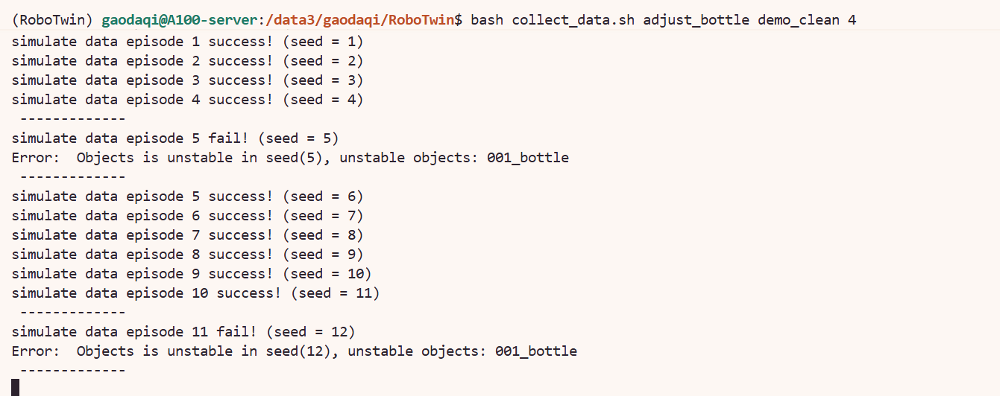
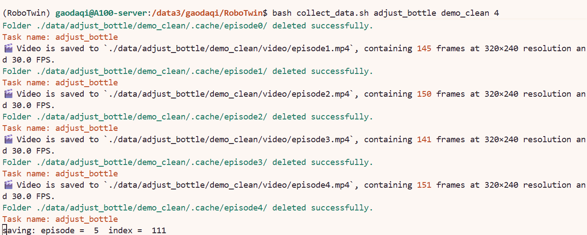

# 9.1.5.4 数据采集、任务体系与域随机化

目标：使用官方 `collect_data.sh` 生成 RoboTwin 2.0 episode 数据，理解 seed 搜索、HDF5/video 输出、task config、50 个任务以及 `demo_clean` / `demo_randomized` 对任务难度的影响。

## 本章对应项目文件

| 内容 | 文件 |
|---|---|
| 数据采集入口 | `collect_data.sh` |
| 数据采集逻辑 | `script/collect_data.py` |
| HDF5/video 合并 | `envs/_base_task.py`、`envs/utils/pkl2hdf5.py` |
| episode instruction 生成 | `description/gen_episode_instructions.sh` |
| 任务配置 | `task_config/demo_clean.yml`、`task_config/demo_randomized.yml` |
| 相机配置 | `task_config/_camera_config.yml` |

## 数据采集命令

项目根目录下的 `collect_data.sh` 是官方数据采集入口：

```bash
bash collect_data.sh ${task_name} ${task_config} ${gpu_id}
```

最小示例：

```bash
cd /path/to/RoboTwin
bash collect_data.sh beat_block_hammer demo_randomized 0
```

参数含义：

| 参数 | 示例 | 含义 |
|---|---|---|
| `task_name` | `beat_block_hammer` | `envs/` 下的任务文件名，共50个 |
| `task_config` | `demo_clean` / `demo_randomized` | `task_config/` 下不带 `.yml` 的配置名 |
| `gpu_id` | `0` | 传给 `CUDA_VISIBLE_DEVICES` 的 GPU 编号 |


## 数据采集的两阶段流程

`script/collect_data.py` 的流程可以分为两段。

第一段是 seed 与预运动轨迹收集：

```text
setup_demo(seed)
play_once()
plan_success and check_success()
save_traj_data()
```

当 `use_seed: false` 时，脚本会不断尝试 seed，直到收集到 `episode_num` 个可成功执行的 episode，并把 seed 写入：

```text
data/${task_name}/${task_config}/seed.txt
```



第二段是正式数据采集：

```text
读取 seed.txt
读取 _traj_data/episode*.pkl
重新执行 play_once()
保存 HDF5 与视频
生成 episode instruction
```



## 输出目录

默认 `save_path: ./data`，因此一次采集会写到：

```text
data/${task_name}/${task_config}/
```

主要输出包括：

```text
seed.txt
_traj_data/episode${idx}.pkl
data/episode${idx}.hdf5
video/episode${idx}.mp4
scene_info.json
```

其中 HDF5 和视频由 `envs/_base_task.py` 中的 `merge_pkl_to_hdf5_video()` 调用 `envs/utils/pkl2hdf5.py` 生成。

## Config 怎么看

RoboTwin 2.0 默认提供两个常用采集配置：

```text
task_config/demo_clean.yml
task_config/demo_randomized.yml
```

这两个文件的整体结构完全一致，区别主要集中在 `domain_randomization`。因此阅读 config 时可以按三步来理解：

```text
1. 先看共同字段：决定采多少、用什么机器人、采哪些观测、存到哪里。
2. 再看差异字段：决定 clean 还是 randomized，也就是数据分布难度。
3. 最后看采集重点：实际运行时优先调整哪些参数。
```

如果需要修改配置，建议复制一份新文件，而不是直接覆盖官方默认配置，避免混在一起。


## Task Config：demo_clean vs demo_randomized

两个配置文件位于 `task_config/` 下，结构完全相同，唯一区别在 `domain_randomization` 段的取值。下面先列出公共配置：

```yaml
# ========== 公共配置（两个文件一致） ==========
render_freq: 0              # 0=无渲染（最快），1=实时渲染
episode_num: 50             # 采集的 episode 数量
use_seed: false             # 是否复用已有 seed.txt
save_freq: 15               # scripted trajectory 的保存间隔
embodiment: [aloha-agilex]  # 机器人型号
language_num: 100           # 语言指令的变体数量

camera:
  head_camera_type: D435    # 头部相机型号
  wrist_camera_type: D435   # 腕部相机型号
  collect_head_camera: true # 是否采集头部相机数据
  collect_wrist_camera: true

data_type:
  rgb: true                 # 采集 RGB 图像
  depth: false              # 是否采集深度图
  pointcloud: false         # 是否采集点云
  endpose: true             # 是否记录末端位姿
  qpos: true                # 是否记录关节角度
```

`domain_randomization` 段对照：

| 配置项 | demo_clean | demo_randomized | 说明 |
|---|---|---|---|
| `random_background` | `false` | `true` | 随机替换桌面背景纹理 |
| `cluttered_table` | `false` | `true` | 桌面随机放置干扰物 |
| `clean_background_rate` | `1` | `0.02` | clean 背景的出现概率，`1` 表示始终干净，`0.02` 表示 2% |
| `random_table_height` | `0` | `0.03` | 桌面高度随机偏移量，单位是米，`0` 表示不偏移 |
| `random_light` | `false` | `true` | 随机光照方向和强度 |
| `crazy_random_light_rate` | `0` | `0.02` | 极端光照的概率，`0` 表示无，`0.02` 表示 2% |
| `random_head_camera_dis` | `0` | `0` | 头部相机位姿微扰，两个默认配置都关闭 |

- `demo_clean`：所有随机化关闭，环境更确定，任务较简单。
- `demo_randomized`：开启背景、杂物、光照、桌面高度四项随机化，用于采集更鲁棒的训练数据，任务难度也更 Hard。

## 重点配置调整

采集数据时，最常需要调整的是 `episode_num` 和 `use_seed`。其他字段通常先保持默认，只有在明确要改变数据分布或观测模态时再改。

### episode_num：控制采集数量

`episode_num` 决定要采集多少条成功 episode。脚本会先搜索足够数量的成功 seed，再正式保存 HDF5 和视频。默认50条，可根据需求调整。


```yaml
episode_num: 50
```

### use_seed：控制重新采还是复现采

`use_seed` 决定是否复用已有的 `seed.txt`。

第一次采集，或者想重新找一批初始状态时：

```yaml
use_seed: false
```

这时脚本会重新搜索成功 seed，并生成新的 `seed.txt` 和 `_traj_data/`。

如果已经有 `seed.txt` 和 `_traj_data/`，只是想用同一批 seed 重新生成 HDF5/video：

```yaml
use_seed: true
collect_data: true
```

这种方式适合复现实验、补采视频，或者上次采集中断后继续生成数据。

## 任务体系与 Domain Randomization

完成数据采集配置后，还需要知道 `task_name` 对应哪些任务，以及 `demo_clean` / `demo_randomized` 如何影响任务难度。

### 50 个任务

在 `./RoboTwin/envs/` 下，排除 `_base_task.py`、`_GLOBAL_CONFIGS.py`、`__init__.py` 后，共有 50 个任务文件：

| 任务名 | 任务名 | 任务名 |
|---|---|---|
| `adjust_bottle` | `beat_block_hammer` | `blocks_ranking_rgb` |
| `blocks_ranking_size` | `click_alarmclock` | `click_bell` |
| `dump_bin_bigbin` | `grab_roller` | `handover_block` |
| `handover_mic` | `hanging_mug` | `lift_pot` |
| `move_can_pot` | `move_pillbottle_pad` | `move_playingcard_away` |
| `move_stapler_pad` | `open_laptop` | `open_microwave` |
| `pick_diverse_bottles` | `pick_dual_bottles` | `place_a2b_left` |
| `place_a2b_right` | `place_bread_basket` | `place_bread_skillet` |
| `place_burger_fries` | `place_can_basket` | `place_cans_plasticbox` |
| `place_container_plate` | `place_dual_shoes` | `place_empty_cup` |
| `place_fan` | `place_mouse_pad` | `place_object_basket` |
| `place_object_scale` | `place_object_stand` | `place_phone_stand` |
| `place_shoe` | `press_stapler` | `put_bottles_dustbin` |
| `put_object_cabinet` | `rotate_qrcode` | `scan_object` |
| `shake_bottle` | `shake_bottle_horizontally` | `stack_blocks_three` |
| `stack_blocks_two` | `stack_bowls_three` | `stack_bowls_two` |
| `stamp_seal` | `turn_switch` |  |

有关具体每个任务的详细介绍可以查看官方文档：https://robotwin-platform.github.io/doc/tasks

### Step Limit

正式评测时，`script/eval_policy.py` 会让环境进入 `eval_mode`，`Base_Task` 从 `task_config/_eval_step_limit.yml` 读取每个任务的步数上限。例如 `beat_block_hammer` 的 step limit 为 400，`handover_block` 为 800，`open_microwave` 为 1500。步数上限本身也是协议的一部分，不同 step limit 下的结果不能直接混报。

### Domain Randomization

`demo_clean` 和 `demo_randomized` 的具体配置已经在上文 `Task Config` 中说明，这里只强调它们在任务理解中的作用：

- `demo_clean`：随机化基本关闭，适合观察基础动作，难度较低。
- `demo_randomized`：开启背景、杂物、光照、桌面高度等随机化，更适合作为 Hard setting 和鲁棒性数据来源。

下面两个视频展示同一类任务在 clean 与 randomized 场景下的视觉差异。

`demo_clean`：

<video width="600" controls><source src="assets/clean.mp4" type="video/mp4"></video>

`demo_randomized`：

<video width="600" controls><source src="assets/random.mp4" type="video/mp4"></video>
