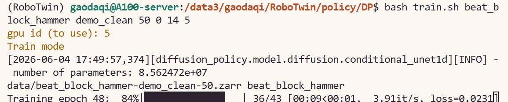

# 9.1.5.5.3 DP：训练与评测

DP 的训练与评测入口位于：

```text
/path/RoboTwin/policy/DP/
```


## 1. 环境安装

```bash
cd policy/DP

pip install zarr==2.12.0 wandb ipdb gpustat dm_control omegaconf hydra-core==1.2.0 dill==0.3.5.1 einops==0.4.1 diffusers==0.11.1 numba==0.56.4 moviepy imageio av matplotlib termcolor sympy

pip install -e .
```

## 2. 训练数据准备

这一步把原始 RoboTwin 2.0 数据转换成 DP 训练需要的 Zarr 格式。`expert_data_num` 表示使用多少条 expert trajectory 作为训练数据。

```bash
bash process_data.sh ${task_name} ${task_config} ${expert_data_num}
# bash process_data.sh beat_block_hammer demo_clean 50
# bash process_data.sh beat_block_hammer demo_randomized 50
```


## 3. 启动训练

这一步启动 DP 训练。当前项目默认训练 600 step。`action_dim` 表示机器人动作维度，例如 `aloha-agilex` 对应 14。

```bash
bash train.sh ${task_name} ${task_config} ${expert_data_num} ${seed} ${action_dim} ${gpu_id}
# bash train.sh beat_block_hammer demo_clean 50 0 14 0
# For `aloha-agilex` embodiment, the action_dim is 14
```

## 4. 评测

`task_config` 表示评测环境配置，`ckpt_setting` 表示训练 checkpoint 对应的数据配置。

```bash
bash eval.sh ${task_name} ${task_config} ${ckpt_setting} ${expert_data_num} ${seed} ${gpu_id}
# bash eval.sh beat_block_hammer demo_clean demo_clean 50 0 0
```

上面的命令表示：使用 `demo_clean` 训练得到的 checkpoint，并在 `demo_clean` 环境中评测。

如果要评测一个在 `demo_clean` 上训练、但在 `demo_randomized` 中测试的 policy：

```bash
bash eval.sh beat_block_hammer demo_randomized demo_clean 50 0 0
```

评测结果和视频会保存在项目根目录下的 `eval_result/` 中：

## 实操

```bash
cd policy/DP

pip install zarr==2.12.0 wandb ipdb gpustat dm_control omegaconf hydra-core==1.2.0 dill==0.3.5.1 einops==0.4.1 diffusers==0.11.1 numba==0.56.4 moviepy imageio av matplotlib termcolor sympy
pip install -e .

bash process_data.sh beat_block_hammer demo_clean 50
bash train.sh beat_block_hammer demo_clean 50 0 14 4
bash eval.sh beat_block_hammer demo_clean demo_clean 50 0 4
```
