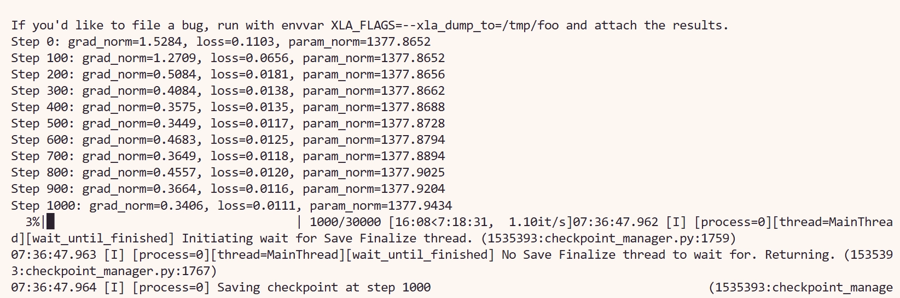

# 9.1.5.5.4 Pi0：训练与评测

Pi0 的训练与评测入口位于：

```text
/path/RoboTwin/policy/pi0/
```


## 1. 环境安装

Pi0 使用 `uv` 管理 Python 依赖。

```bash
conda activate RoboTwin
pip install uv

cd policy/pi0
GIT_LFS_SKIP_SMUDGE=1 uv sync
```

如果要在 RoboTwin 中评测 Pi0，还需要在 uv 环境中安装 curobo：

```bash
conda deactivate
source .venv/bin/activate

cd ../../envs
git clone https://github.com/NVlabs/curobo.git
cd curobo
pip install -e . --no-build-isolation

cd ../../policy/pi0/
bash
```

## 2. 训练数据准备

先按照前文的数据采集流程生成 RoboTwin 原始数据，例如：

```bash
bash collect_data.sh beat_block_hammer demo_clean 0
```


## 3. 创建数据目录

先在 `policy/pi0` 下创建数据目录：

```bash
mkdir processed_data && mkdir training_data
```

将 RoboTwin 数据转换为 Pi0 使用的 HDF5 格式：

```bash
bash process_data_pi0.sh ${task_name} ${task_config} ${expert_data_num}
# bash process_data_pi0.sh beat_block_hammer demo_clean 50
# bash process_data_pi0.sh beat_block_hammer demo_randomized 50
```

生成 LerobotDataset 前，确认 `~/.cache` 空间足够；如果空间不足，可以改缓存目录：

```bash
export XDG_CACHE_HOME=/path/to/your/cache
```

生成 LerobotDataset：

```bash
bash generate.sh ${hdf5_path} ${repo_id}
# bash generate.sh ./training_data/demo_clean/ demo_clean_repo
```

实际操作时，也可以直接使用 `processed_data` 下的数据路径：

```bash
bash generate.sh ./processed_data/beat_block_hammer-demo_clean-50/ demo_clean_repo
```

生成后的数据会写入：

```text
${XDG_CACHE_HOME}/huggingface/lerobot/${repo_id}
```

## 4. 修改训练Config

可使用：

```text
pi0_base_aloha_robotwin_full
```

在 `src/openpi/training/config.py` 的 `_CONFIGS` 中，当前项目已经提供了下面几个 Pi0 配置：

```text
pi0_base_aloha_robotwin_lora
pi0_fast_aloha_robotwin_lora
pi0_base_aloha_robotwin_full
pi0_fast_aloha_robotwin_full
```

需要把配置中的 `repo_id` 改成上一步生成的数据集名称，例如从 `your_repo_id` 改成 `demo_clean_repo`。如果显存不足，可以调整 `fsdp_devices` 或降低 `batch_size`。

## 5. 启动训练

先计算数据集的 norm stats：

```bash
uv run scripts/compute_norm_stats.py --config-name ${train_config_name}
# uv run scripts/compute_norm_stats.py --config-name pi0_base_aloha_robotwin_full
```

启动 finetune：

```bash
bash finetune.sh ${train_config_name} ${model_name} ${gpu_use}
# bash finetune.sh pi0_base_aloha_robotwin_full demo_clean 0,1,2,3
```

`gpu_use` 可以写成单卡 `0`，也可以写成多卡 `0,1,2,3`。

## 6. 评测

可以在 `deploy_policy.yml` 中修改要评测的 `checkpoint_id`。

```bash
bash eval.sh ${task_name} ${task_config} ${train_config_name} ${model_name} ${seed} ${gpu_id}
# bash eval.sh beat_block_hammer demo_clean pi0_base_aloha_robotwin_full demo_clean 0 0
```

上面的命令表示：使用 `demo_clean` 训练得到的 Pi0 policy，并在 `demo_clean` 环境中评测。

如果要评测一个在 `demo_clean` 上训练、但在 `demo_randomized` 中测试的 policy：

```bash
bash eval.sh beat_block_hammer demo_randomized pi0_base_aloha_robotwin_full demo_clean 0 0
```

评测结果和视频会保存在项目根目录下的 `eval_result/` 中：


## 实操

```bash
conda activate RoboTwin
pip install uv

cd policy/pi0
GIT_LFS_SKIP_SMUDGE=1 uv sync

conda deactivate
source .venv/bin/activate

cd ../../envs
git clone https://github.com/NVlabs/curobo.git
cd curobo
pip install -e . --no-build-isolation
cd ../../policy/pi0/
bash

mkdir processed_data && mkdir training_data

bash process_data_pi0.sh beat_block_hammer demo_clean 50

bash generate.sh ./processed_data/beat_block_hammer-demo_clean-50/ demo_clean_repo

CUDA_VISIBLE_DEVICES=4,5,6,7 uv run scripts/compute_norm_stats.py --config-name pi0_base_aloha_robotwin_full

bash finetune.sh pi0_base_aloha_robotwin_full demo_clean 4,5,6,7

bash eval.sh beat_block_hammer demo_clean pi0_base_aloha_robotwin_full demo_clean 0 4
```
