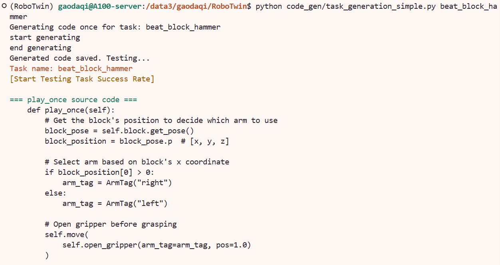
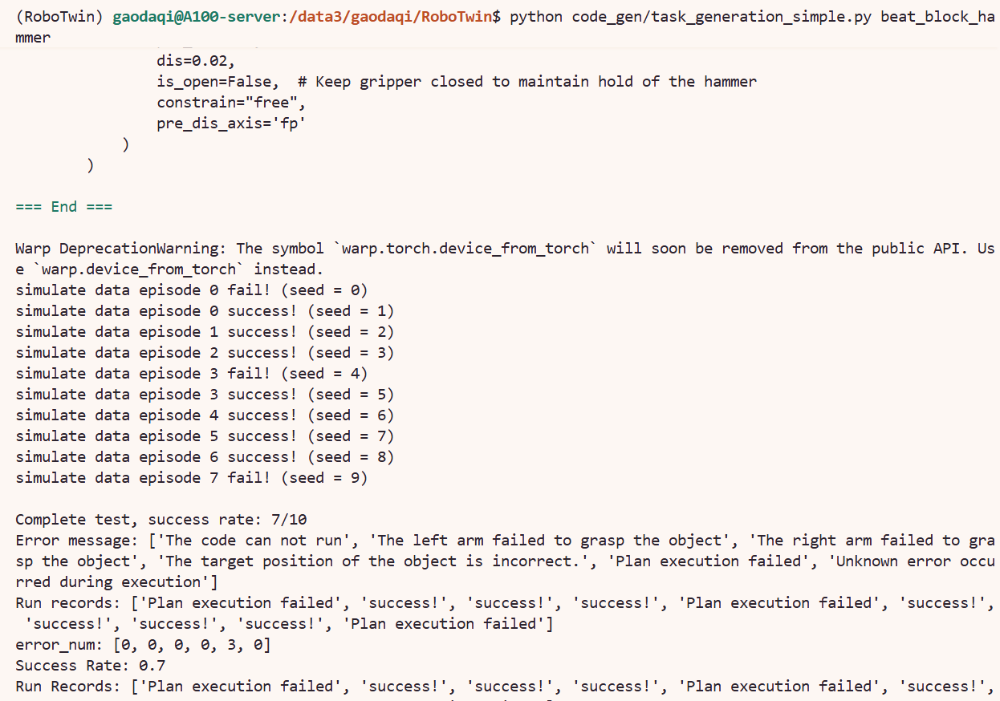

# 9.1.5.6.2 跑通最小示例 beat_block_hammer

本节目标是跑通最小闭环：

```text
DeepSeek 生成 play_once()
        ↓
保存 envs_gen/gpt_beat_block_hammer.py
        ↓
自动测试 10 个 seed
        ↓
输出 success rate
```

## 进入项目目录

在服务器上进入 RoboTwin 项目：

```bash
cd /path/to/RoboTwin
```

第一次运行 code agent 前，创建输出目录：

```bash
mkdir -p envs_gen/logs camera_images
```

这三个目录的作用是：

| 目录 | 作用 |
|---|---|
| `envs_gen/` | 保存 LLM 生成的 `gpt_<task_name>.py` |
| `envs_gen/logs/` | 保存迭代生成日志 |
| `camera_images/` | 保存多模态反馈版本的观察图片 |

## 配置 DeepSeek API

需要修改文件：

```text
code_gen/gpt_agent.py
```

在文件开头找到：

```python
kimi_api = "Your key"
openai_api = "Your key"
deep_seek_api = "Your key"
```

把 `deep_seek_api` 改成自己的 DeepSeek API key：

```python
deep_seek_api = "sk-xxxxxxxxxxxxxxxxxxxxxxxx"
```

同时确认 `generate()` 函数中 DeepSeek 分支如下：

```python
if gpt == "deepseek":
    MODEL = "deepseek-chat"
    OPENAI_API_BASE = "https://api.deepseek.com"
    OPENAI_API_KEY = deep_seek_api
    client = OpenAI(api_key=OPENAI_API_KEY, base_url=OPENAI_API_BASE)
```

其中，`MODEL = "deepseek-chat"`可根据自己需求进行修改，具体可参考deepseek官网。https://api-docs.deepseek.com/zh-cn/

## 准备 beat_block_hammer 配置
确认 `task_info.py` 中已有任务描述， code_gen/task_info.py 中已经默认包含了beat_block_hammer的任务描述，所以这里不需要进行添加。

由于`code_gen/test_gen_code.py` 会读取：

```text
task_config/<task_name>.yml
```
所以需要准备：

```text
task_config/beat_block_hammer.yml
```

最简单的方式就是从 clean/randomized 配置复制一份，这里以clean为例：

```bash
cp task_config/demo_clean.yml task_config/beat_block_hammer.yml
```

然后需要修改文件：

```text
task_config/beat_block_hammer.yml
```

在文件开头添加：

```yaml
task_name: beat_block_hammer
```

## 运行最小复现

运行单次生成版本：

```bash
python code_gen/task_generation_simple.py beat_block_hammer
```

下面的图片展示了 code agent 生成 `play_once()` 的过程：



生成的代码文件位于：

```text
envs_gen/gpt_beat_block_hammer.py
```

## 判断是否复现成功

生成代码后，脚本会自动进行仿真测试。一次成功输出示例，下面的图片展示了最小复现结束后的成功率输出：



输出含义如下：

| 输出 | 含义 |
|---|---|
| `start generating` | 开始调用 DeepSeek |
| `end generating` | LLM 返回成功 |
| `play_once source code` | 已加载生成的 `play_once()` |
| `success rate: 8/10` | 10 个 seed 中成功 8 个 |
| `Plan execution failed` | 生成代码能运行，但某些 seed 下运动规划失败 |

`task_generation_simple.py` 只是单次生成，出现少量 `Plan execution failed` 是正常现象。只要成功率超过默认阈值 `0.5`，就可以认为最小复现已经跑通。

如果已经生成过代码，只想重新测试当前结果，可以运行：

```bash
python code_gen/run_code.py beat_block_hammer
```

这个命令不会重新调用 DeepSeek，而是直接测试。
