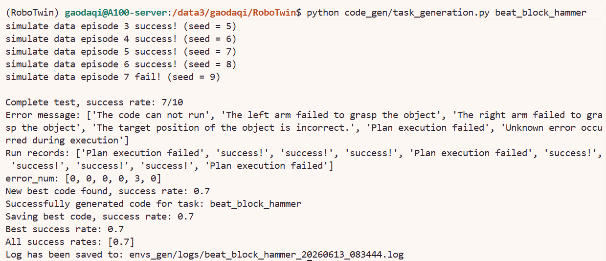
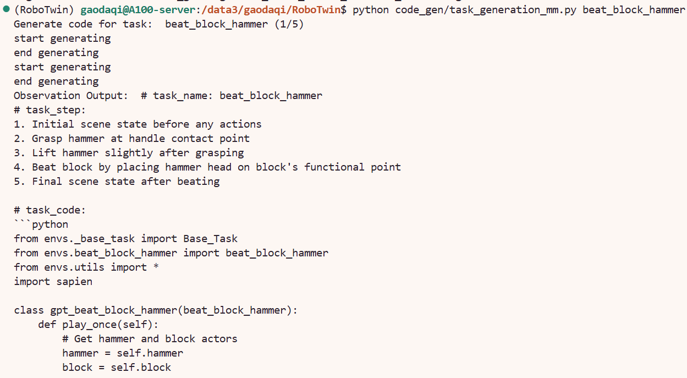

# 9.1.5.6.3 调试与测试

前一节的最小复现已经使用过：

```bash
python code_gen/task_generation_simple.py beat_block_hammer
```

这就是官网中的 **Basic Code Generation**。它的作用是快速生成一次 `play_once()`，并测试当前生成代码的成功率。但它只生成一次，不会根据失败结果继续修改代码。

所以本节关注的问题是成功率不达标时，接下来应该用哪些代码继续调试来提高成功率。

## 四个入口的关系

| 命令 | 作用 | 什么时候用 |
|---|---|---|
| `task_generation_simple.py` | 单次生成并测试 | 最小复现，上一节已经使用 |
| `task_generation.py` | 错误文本反馈迭代生成 | simple 成功率不达标时优先使用 |
| `task_generation_mm.py` | 错误文本 + 多模态观察反馈迭代生成 | 错误文本仍不足以修正时使用 |
| `run_code.py` | 只测试已有生成代码 | 不想重新调用 LLM，只想复测成功率 |

生成出来的代码都会保存到：

```text
envs_gen/gpt_<task_name>.py
```

例如：

```text
envs_gen/gpt_beat_block_hammer.py
```

## 1. 先复测当前生成代码

如果已经运行过最小复现，可以先不重新生成代码，直接测试当前结果：

```bash
python code_gen/run_code.py beat_block_hammer
```

这个只会加载当前生成代码并输出成功率。

它适合用于复查当前 `play_once()` 的成功率。

## 2. 成功率不达标：使用错误反馈版本

如果 `task_generation_simple.py` 或 `run_code.py` 的结果不理想，可以运行官网中的 **Code Generation with Error Feedback**：

```bash
python code_gen/task_generation.py beat_block_hammer
```

它会自动执行：

```text
生成 play_once()
        ↓
测试 success rate
        ↓
记录 error_message 和 run_records
        ↓
把错误反馈加入下一轮 prompt
        ↓
再次生成
        ↓
保存当前 best_code
```

这里可以把 `task_generation.py` 理解成多轮 simple 生成。第一轮和 `task_generation_simple.py` 类似，都会先生成一份 `play_once()`；不同点在于，如果测试失败，它不会立刻结束，而是把这次测试得到的主要错误信息继续放回 prompt，让 LLM 在上一版代码的基础上修改。脚本会保存历史轮次中表现最好的一版。

日志会保存到：

```text
envs_gen/logs/
```

这段代码默认运行5次，当成功率高于50%时直接停止，运行结束后，可以再次复测：

```bash
python code_gen/run_code.py beat_block_hammer
```



## 3. 多模态观察版本

如果错误文本反馈之后成功率仍然不够，可以运行官网中的 **Advanced Code Generation with Multi-Modal Observations**：

```bash
python code_gen/task_generation_mm.py beat_block_hammer
```

它比 `task_generation.py` 多了一步视觉观察反馈，运行速度会慢很多：

```text
选择失败 episode
        ↓
保存执行过程中的相机图像
        ↓
code_gen/observation_agent.py 分析失败画面
        ↓
把视觉反馈加入下一轮 prompt
        ↓
继续生成修正版 play_once()
```

 `task_generation_mm.py` 是在错误反馈版上加入视觉信息。文本反馈只能告诉模型失败类型，多模态反馈会进一步把失败过程中的观察图片交给 `observation_agent.py`，让它从画面里判断问题更可能出在哪里。


由于要额外保存图片、分析图片、再把视觉反馈送回下一轮 prompt，所以运行速度会明显慢于 `task_generation.py`。建议先跑错误反馈版，如果成功率仍然不理想，再使用多模态观察版本。

相关文件是：

```text
code_gen/task_generation_mm.py
code_gen/observation_agent.py
```

观察图片会保存到：

```text
camera_images/
```




## 推荐调试顺序

最小复现之后，推荐按下面顺序测试：

```bash
# 1. 复测当前 simple 生成结果
python code_gen/run_code.py beat_block_hammer

# 2. 如果成功率不达标，用错误反馈迭代
python code_gen/task_generation.py beat_block_hammer

# 3. 再次复测
python code_gen/run_code.py beat_block_hammer

# 4. 如果仍然不稳定，用多模态观察反馈
python code_gen/task_generation_mm.py beat_block_hammer
```
