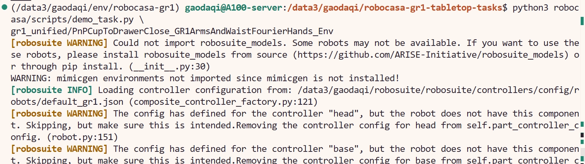

# 9.1.6.3 Demo 与 Demonstration 回放


环境安装完成后，提供了两个轻量运行入口：`demo_task.py` 和 `playback_dataset.py`。可以用于简单测试当前环境是否安装成功。

## 随机动作 Demo


```bash
cd robocasa-gr1-tabletop-tasks
python3 robocasa/scripts/demo_task.py <TASK_NAME>
```

这个脚本会创建指定任务，向机器人发送随机动作，并保存 egocentric video。因为动作是随机的，所以任务失败是正常的；它的意义是验证环境能不能运行。

示例：
```bash
python3 robocasa/scripts/demo_task.py gr1_unified/PnPCupToDrawerClose_GR1ArmsAndWaistFourierHands_Env
```

成功后视频在：

```text
/path/to/robocasa-gr1-tabletop-tasks/video/
```

成功运行截图：




## Demonstration Trajectory 回放


```bash
cd robocasa-gr1-tabletop-tasks
python3 robocasa/scripts/playback_dataset.py --dataset <HDF5_FILE> --n 1
```

HDF5 文件来自 Hugging Face 数据集 [nvidia/PhysicalAI-Robotics-GR00T-Teleop-Sim](https://huggingface.co/datasets/nvidia/PhysicalAI-Robotics-GR00T-Teleop-Sim)。官方说明该数据集覆盖全部 24 个 tabletop tasks，每个任务有 1000 条 human-collected demos。

下载一个任务示例：

```bash
mkdir -p /path/to/datasets/PhysicalAI-Robotics-GR00T-Teleop-Sim

huggingface-cli download \
  nvidia/PhysicalAI-Robotics-GR00T-Teleop-Sim \
  HDF5/PnPCupToDrawerClose.hdf5 \
  --repo-type dataset \
  --local-dir /path/to/datasets/PhysicalAI-Robotics-GR00T-Teleop-Sim
```

回放一条轨迹：

```bash
cd /path/to/robocasa-gr1-tabletop-tasks

python3 robocasa/scripts/playback_dataset.py \
  --dataset /path/to/datasets/PhysicalAI-Robotics-GR00T-Teleop-Sim/HDF5/PnPCupToDrawerClose.hdf5 \
  --n 1
```

## Playback 的作用

Playback 用于数据检查，检查以下内容：
1. HDF5 文件是否下载完整。
2. 数据中的动作和当前任务环境是否匹配。
3. 相机观测、机器人动作和任务进度是否同步。
4. 后续训练或分析前，数据格式是否可用。
