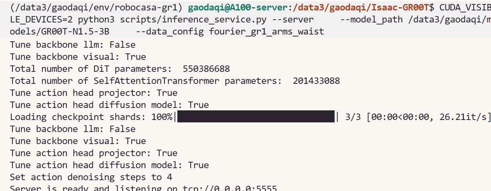
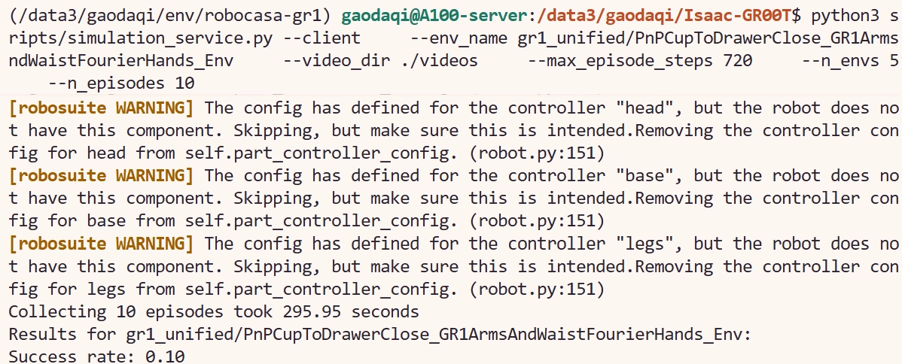

# 9.1.6.4 GR00T 闭环仿真评估


Simulation-based evaluation 是 README 中最核心的部分。它把 GR00T-N1.5-3B 放进 RoboCasa-GR1 仿真环境中，逐步接收观测、输出动作、执行动作，并统计任务成功率。

## 两个进程

评估需要两个进程配合：

| 进程 | 仓库 | 作用 |
|---|---|---|
| inference server | Isaac-GR00T | 加载模型，根据 observation 返回 action |
| simulation client | Isaac-GR00T + RoboCasa-GR1 env | 创建任务环境，向 server 请求动作，执行并统计结果 |


## 下载并准备模型目录

评估前需要先准备 GR00T-N1.5-3B checkpoint：

如果服务器尚未登录 Hugging Face，先执行：

```bash
huggingface-cli login
```

然后下载模型：

```bash

huggingface-cli download \
  nvidia/GR00T-N1.5-3B \
  --local-dir /path/to/models/GR00T-N1.5-3B
```

后续启动模型服务时，`--model_path` 就填写这个本地目录。

## 终端 1：启动 inference server

```bash
conda activate /path/to/env/robocasa-gr1
cd /path/to/Isaac-GR00T

python3 scripts/inference_service.py --server \
  --model_path /path/to/models/GR00T-N1.5-3B \
  --data_config fourier_gr1_arms_waist
```

如果要指定 GPU，例如物理 4 号卡：

```bash
CUDA_VISIBLE_DEVICES=4 python3 scripts/inference_service.py --server \
  --model_path /path/to/models/GR00T-N1.5-3B \
  --data_config fourier_gr1_arms_waist
```

这个终端启动后不要关闭。它会等待 simulation client 的请求。

启动成功后，终端会显示 checkpoint shards 加载完成，并提示 server 正在监听端口：



## 终端 2：启动 simulation client

README 默认设置是单任务 10 episodes，5 个并行环境：

```bash
conda activate /path/to/env/robocasa-gr1
cd /path/to/Isaac-GR00T

export MUJOCO_GL=egl
export PYOPENGL_PLATFORM=egl

python3 scripts/simulation_service.py --client \
  --env_name gr1_unified/PnPCupToDrawerClose_GR1ArmsAndWaistFourierHands_Env \
  --video_dir ./videos \
  --max_episode_steps 720 \
  --n_envs 5 \
  --n_episodes 10
```

参数含义：

| 参数 | 含义 |
|---|---|
| `--env_name` | 要评估的任务名 |
| `--video_dir` | 保存 rollout 视频的位置 |
| `--max_episode_steps` | 每个 episode 的最大步数 |
| `--n_envs` | 并行环境数量 |
| `--n_episodes` | 总 episode 数 |


## 本次复现结果

本文按 README 默认设置对 `PnPCupToDrawerClose` 做了一次评估：

```text
Running 10 episodes for gr1_unified/PnPCupToDrawerClose_GR1ArmsAndWaistFourierHands_Env with 5 environments
Collecting 10 episodes took 295.95 seconds
Results for gr1_unified/PnPCupToDrawerClose_GR1ArmsAndWaistFourierHands_Env:
Success rate: 0.10
```

对应的终端输出如下：



可以解读为：10 个 episodes 中成功 1 个，success rate 为 0.10。该结果主要用于证明评估链路跑通，不应用作正式性能结论。正式报告需要更大的 episode 数、更多任务和固定随机种子。

## 更换任务

要评估其他任务，只需要替换 `--env_name`：

```bash
python3 scripts/simulation_service.py --client \
  --env_name gr1_unified/PnPPotatoToMicrowaveClose_GR1ArmsAndWaistFourierHands_Env \
  --video_dir ./videos \
  --max_episode_steps 720 \
  --n_envs 5 \
  --n_episodes 10
```
