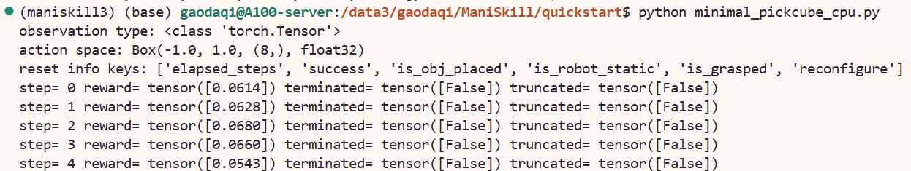
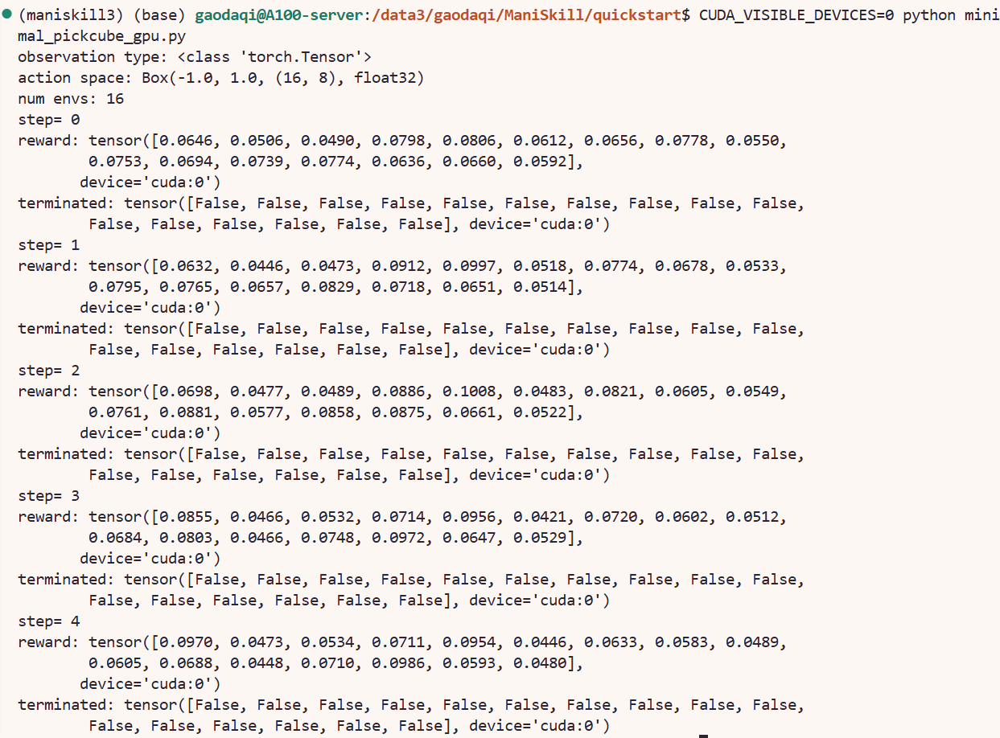

# 用 Gymnasium 创建任务

目标：参考 ManiSkill 官方 Quickstart，在 `/path/to/ManiSkill` 项目中复现 `PickCube-v1` 的最小 Gymnasium 交互，并理解 GPU 并行环境返回的 batched tensor。

本节按以下顺序复现：
用 Gymnasium 接口创建任务并执行随机动作；
把 `num_envs` 设为大于 1 后运行 GPU 并行任务；
通过 `obs_mode`、`control_mode` 等参数控制任务实例化方式。

## 准备

所有操作都在 ManiSkill 项目中完成：

```bash
source /path/to/env/maniskill3/bin/activate
export MS_ASSET_DIR=/path/to/env/maniskill_data
export CUDA_VISIBLE_DEVICES=0
cd /path/to/ManiSkill
```

创建本节复现目录，后续代码创建放到这里：

```bash
mkdir -p /path/to/ManiSkill/quickstart
cd /path/to/ManiSkill/quickstart
```

## Quickstart 1：最小 Gymnasium 接口

官方 Quickstart 的基本模式是：

```text
gym.make -> reset -> sample action -> step -> close
```

创建 `minimal_pickcube_cpu.py`：

```python
import gymnasium as gym
import mani_skill.envs


env = gym.make(
    "PickCube-v1",
    obs_mode="state",
    control_mode="pd_ee_delta_pose",
    render_mode=None,
    sim_backend="cpu",
    render_backend="none",
)

print("Observation space:", env.observation_space)
print("Action space:", env.action_space)

obs, info = env.reset(seed=0)

for step in range(5):
    action = env.action_space.sample()
    obs, reward, terminated, truncated, info = env.step(action)
    print("step=", step)
    print("reward:", reward)
    print("terminated:", terminated)
    print("truncated:", truncated)

env.close()
```

运行：

```bash
python minimal_pickcube_cpu.py
```

运行结果如下：



这一步复现的是 Quickstart 的 Interface 部分。
`terminated` 表示任务自然结束，例如成功或失败；`truncated` 表示因为最大步数等限制被截断。现在使用的是随机动作，所以任务没有成功是正常的。

## Quickstart 2：GPU 并行任务

把 `num_envs` 设为大于 1，就可以运行并行任务。现在创建 `minimal_pickcube_gpu.py`：

```python
import gymnasium as gym
import mani_skill.envs


env = gym.make(
    "PickCube-v1",
    obs_mode="state",
    control_mode="pd_ee_delta_pose",
    render_mode=None,
    sim_backend="gpu",
    render_backend="none",
    num_envs=16,
)

print("observation type:", type(env.reset(seed=0)[0]))
print("action space:", env.action_space)
print("num envs:", env.unwrapped.num_envs)

for step in range(5):
    action = env.action_space.sample()
    obs, reward, terminated, truncated, info = env.step(action)
    print("step=", step)
    print("reward:", reward)
    print("terminated:", terminated)

env.close()
```

运行：

```bash
CUDA_VISIBLE_DEVICES=0 python minimal_pickcube_gpu.py
```

运行结果如下：



你运行后看到的结果类似：

```text
observation type: <class 'torch.Tensor'>
action space: Box(-1.0, 1.0, (16, 8), float32)
num envs: 16
reward: tensor([... 16 个数 ...], device='cuda:0')
terminated: tensor([False, ... 16 个 False ...], device='cuda:0')
```

这说明 GPU 并行任务已经复现成功。

## 输出结果

### CPU 单环境输出

`observation type: <class 'torch.Tensor'>` 表示 ManiSkill 返回的是 PyTorch tensor。官方 Quickstart 也强调，ManiSkill 默认返回 batched torch tensor，便于和 RL/IL 训练代码衔接。

CPU 版本中的动作空间通常是：

```text
action space: Box(-1.0, 1.0, (8,), float32)
```

这里的 `(8,)` 表示单个 `PickCube-v1` 环境每一步接收一个 8 维动作，动作范围是 `[-1, 1]`。因为 CPU 脚本没有设置 `num_envs=16`，所以它是单环境复现。

`reset info keys` 中的字段是任务诊断信息。例如：

| 字段 | 含义 |
|---|---|
| `elapsed_steps` | 当前 episode 已经执行的步数 |
| `success` | 任务是否成功 |
| `is_obj_placed` | 方块是否被放到目标位置 |
| `is_robot_static` | 机器人是否处于静止状态 |
| `is_grasped` | 夹爪是否抓住物体 |
| `reconfigure` | 当前 reset 是否重新配置场景 |

CPU 输出里的 reward、terminated、truncated 仍然是 tensor，例如：

```text
reward= tensor([0.0614])
terminated= tensor([False])
truncated= tensor([False])
```

虽然这里只有一个环境，ManiSkill3 仍然用 batch 形式组织返回值，所以这里是长度为 1 的 tensor。`terminated=False` 和 `truncated=False` 表示前 5 步中任务没有自然结束，也没有因为时间上限等原因被截断。由于动作是随机采样的，短时间内没有完成抓取是正常的。

### GPU 并行环境输出

`action space: Box(-1.0, 1.0, (16, 8), float32)` 表示：

```text
16：并行环境数量，也就是 num_envs=16
8：每个环境的动作维度
[-1, 1]：动作取值范围
```

因此动作不是单个 `(8,)`，而是 batched action：

```text
(16, 8)
```

`reward: tensor([...], device='cuda:0')` 表示每个并行环境都有一个 reward。你看到 16 个 reward，是因为同时运行了 16 个 `PickCube-v1`。

`terminated: tensor([False, ...], device='cuda:0')` 表示 16 个环境当前都没有自然结束。随机动作只跑 5 步时没有成功或终止，这是正常现象。

## Quickstart 3：任务实例化选项

最后介绍常见的环境实例化参数。复现时需要记录这些：

| 参数 | 示例 | 作用 |
|---|---|---|
| `env_id` | `"PickCube-v1"` | 任务名称 |
| `num_envs` | `1`、`16`、`1024` | 并行环境数量 |
| `obs_mode` | `"state"`、`"rgbd"` | 观测类型 |
| `control_mode` | `"pd_ee_delta_pose"`、`"pd_joint_delta_pos"` | 控制方式 |
| `sim_backend` | `"cpu"`、`"gpu"` | 仿真后端 |
| `render_backend` | `"none"`、`"gpu"` | 渲染后端 |
| `render_mode` | `None`、`"human"`、`"rgb_array"` | 渲染输出方式 |

本节使用：

```text
env_id = PickCube-v1
obs_mode = state
control_mode = pd_ee_delta_pose
sim_backend = gpu
render_backend = none
num_envs = 16
```

## 简单理解 observation、action、reward、done

在 ManiSkill3 中，一次环境交互可以理解成：

```text
observation -> action -> reward / done
```

对应代码是：

```python
obs, info = env.reset(seed=0)
obs, reward, terminated, truncated, info = env.step(action)
```

`observation` 是环境给策略看的信息。本节使用 `obs_mode="state"`，所以观测是低维状态；如果换成 `rgbd` 或 `pointcloud`，观测就会变成视觉或点云数据。

`action` 是策略发给机器人的控制量。CPU 单环境中 action space 是 `(8,)`，表示一个环境接收 8 维动作；GPU 并行环境中 action space 是 `(16, 8)`，表示 16 个环境各接收一个 8 维动作。

`reward` 是环境对动作的反馈。CPU 单环境会返回长度为 1 的 tensor；GPU 并行环境会返回长度为 16 的 tensor，对应 16 个并行环境各自的奖励。

Gymnasium 中过去常说的 `done` 被拆成了两个量：

| 字段 | 含义 |
|---|---|
| `terminated` | 任务自然结束，例如成功或失败 |
| `truncated` | 因最大步数等外部限制被截断 |

如果只想得到传统意义上的 `done`，可以理解为：

```python
done = terminated | truncated
```

随机动作只运行几步时，`terminated=False` 和 `truncated=False` 是正常现象，说明任务还没有结束，也没有被时间限制截断。


## 导航

- 上一节：[安装与渲染依赖](03-installation-and-rendering-deps.md)
- 返回上级：[ManiSkill3](../08-maniskill3-benchmark.md)
- 下一节：[随机动作 demo](05-random-action-demo.md)
