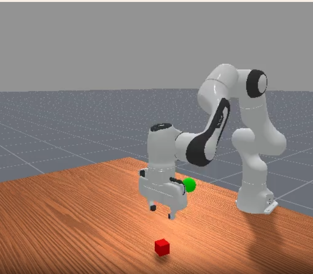

# 随机动作 demo

目标：运行 ManiSkill3 官方 `demo_random_action` 示例，复现随机动作策略在 `PickCube-v1` 上的 CPU/GPU 运行流程，并理解脚本参数和输出结果。

1. 使用 `python -m mani_skill.examples.demo_random_action` 运行官方随机动作示例。
2. 通过 `-e`、`-o`、`--sim-backend`、`--render-backend`、`-n` 等参数切换任务和运行方式。
3. 区分 CPU 单环境运行、GPU 并行运行和 GPU 渲染运行。

## 进入 ManiSkill 项目

本节仍然在 ManiSkill 源码项目中操作：

```bash
source /path/to/env/maniskill3/bin/activate
export MS_ASSET_DIR=/path/to/env/maniskill_data
export CUDA_VISIBLE_DEVICES=0
cd /path/to/ManiSkill
```

## 查看官方 demo 参数


重点参数如下：

| 参数 | 作用 |
|---|---|
| `-e, --env-id` | 指定任务，例如 `PickCube-v1` |
| `-o, --obs-mode` | 指定观测模式，例如 `state`、`rgbd`、`none` |
| `-b, --sim-backend` | 指定仿真后端，常用 `cpu` 或 `gpu` |
| `-rb, --render-backend` | 指定渲染后端，常用 `none` 或 `gpu` |
| `-n, --num-envs` | 指定并行环境数量 |
| `-c, --control-mode` | 指定控制模式 |
| `--render-mode` | 指定渲染输出，例如 `human`、`rgb_array` |
| `--record-dir` | 指定视频或轨迹记录目录 |
| `--quiet` | 减少终端输出 |
| `-s, --seed` | 指定随机种子 |

官方脚本默认任务是 `PushCube-v1`。本节显式使用 `PickCube-v1`，和上一节保持一致。

## 复现 CPU 随机动作

先运行 CPU 版本：

```bash
python -m mani_skill.examples.demo_random_action \
  -e PickCube-v1 \
  -o state \
  --sim-backend cpu \
  --render-backend none \
  --quiet \
  --seed 0
```

这里的设置含义是：

```text
PickCube-v1：机械臂抓取方块任务
obs_mode=state：使用低维状态观测
sim_backend=cpu：使用 CPU 仿真
render_backend=none：不启用渲染
seed=0：固定随机种子，便于复现
```

CPU 版本适合先理解脚本流程和参数含义。因为没有开启渲染，这条命令不会弹出窗口，也不会保存视频。

## 复现 GPU 随机动作

再运行 GPU 并行版本：

```bash
CUDA_VISIBLE_DEVICES=0 python -m mani_skill.examples.demo_random_action \
  -e PickCube-v1 \
  -o state \
  --sim-backend gpu \
  --render-backend none \
  --render-mode sensors \
  -n 16 \
  --quiet \
  --seed 0
```

这里和 CPU 版本相比，多了两个关键点：

```text
sim_backend=gpu：使用 GPU simulation
num_envs=16：一次并行运行 16 个环境
```


## 可选：开启 GPU 渲染

如果服务器的 Vulkan/GPU 渲染链路可用，可以运行：

```bash
CUDA_VISIBLE_DEVICES=0 python -m mani_skill.examples.demo_random_action \
  -e PickCube-v1 \
  -o state \
  --sim-backend gpu \
  --render-backend gpu \
  --render-mode rgb_array \
  -n 1 \
  --quiet \
  --seed 0
```

如果希望保存视频或渲染结果，可以使用指定 --record-dir 记录目录：

```bash
CUDA_VISIBLE_DEVICES=0 python -m mani_skill.examples.demo_random_action \
  -e PickCube-v1 \
  -o state \
  --sim-backend gpu \
  --render-backend gpu \
  --render-mode rgb_array \
  --record-dir /path/to/ManiSkill/quickstart/random_action_records \
  -n 1 \
  --quiet \
  --seed 0
```

## 输出结果解释

随机动作 demo 的输出通常比上一节的手写脚本少，因为加了 `--quiet`。判断复现是否完成，主要看三件事：

```text
命令是否正常结束
是否出现 Python exception
是否生成 record-dir 中的文件（如果指定了 --record-dir）
```

如果不加 `--quiet`，脚本会打印更多环境创建和运行信息。对于 GPU 并行版本，重点理解：

```text
num_envs=16 表示 16 个 PickCube-v1 同时运行
随机动作会分别作用到每个环境
随机策略失败是正常现象
GPU simulation 主要用于提高多环境采样吞吐
```

如果指定 `obs_mode=state`，当前运行不依赖视觉渲染；如果切换到 `rgb`、`rgbd` 或 `pointcloud`，就需要正常的渲染后端。



## 导航

- 上一节：[用 Gymnasium 创建任务](04-gymnasium-create-task.md)
- 返回上级：[ManiSkill3](../08-maniskill3-benchmark.md)
- 下一节：[下载任务、资产与演示数据](06-download-demonstrations.md)
