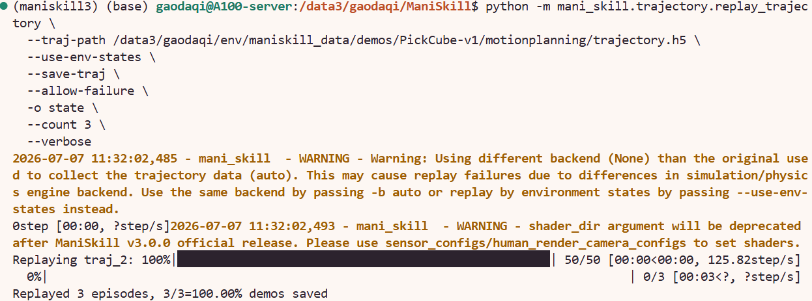
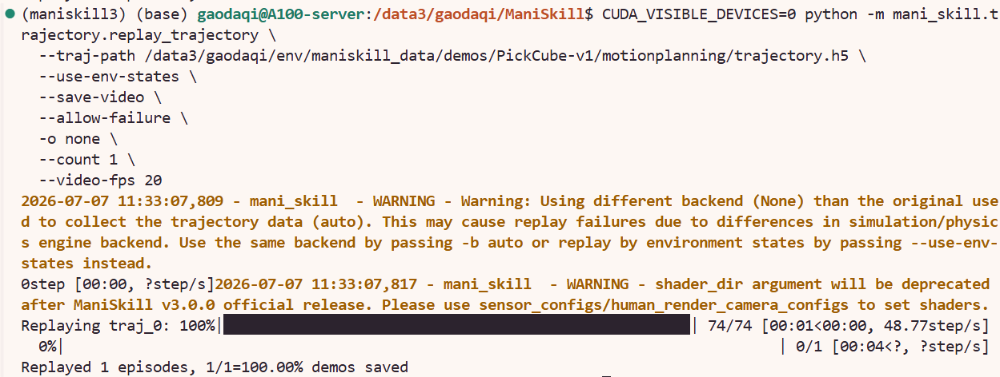
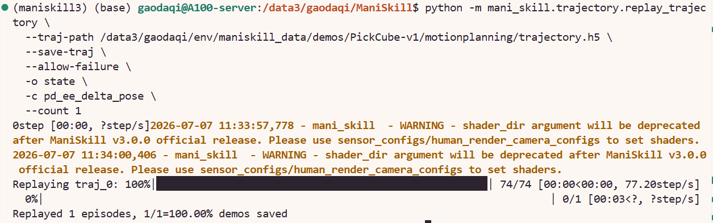

# Replay 与 Convert Trajectory

本节基于上一节下载好的 `PickCube-v1` demonstration，学习 ManiSkill3 中 `replay_trajectory` 工具的使用方法。这个工具的作用不是重新训练模型，而是把已有轨迹重新播放、转换和保存，常用于 imitation learning 数据准备、轨迹质量检查，以及把同一份 demonstration 转成不同观测模式或控制模式。

本节会完成三件事：

```text
1. replay 轨迹，并保存为 state 观测数据
2. replay 轨迹，并保存视频用于检查动作质量
3. 将轨迹转换到新的控制模式 pd_ee_delta_pose
```

## 1. 生成 state 观测轨迹

首先把 motion planning 轨迹 replay 成 `state` 观测，并只处理前 3 条轨迹：

```bash
python -m mani_skill.trajectory.replay_trajectory \
  --traj-path /path/to/env/maniskill_data/demos/PickCube-v1/motionplanning/trajectory.h5 \
  --use-env-states \
  --save-traj \
  --allow-failure \
  -o state \
  --count 3 \
  --verbose
```

实际运行输出：




生成的文件是：

```text
/path/to/env/maniskill_data/demos/PickCube-v1/motionplanning/trajectory.state.pd_joint_pos.physx_cpu.h5
/path/to/env/maniskill_data/demos/PickCube-v1/motionplanning/trajectory.state.pd_joint_pos.physx_cpu.json
```


## 2. 保存 replay 视频

如果想检查 demonstration 的动作是否自然，可以把 replay 过程保存成视频。这里只保存第 1 条轨迹：

```bash
CUDA_VISIBLE_DEVICES=0 python -m mani_skill.trajectory.replay_trajectory \
  --traj-path /path/to/env/maniskill_data/demos/PickCube-v1/motionplanning/trajectory.h5 \
  --use-env-states \
  --save-video \
  --allow-failure \
  -o none \
  --count 1 \
  --video-fps 20
```

实际运行输出：



生成的视频文件是：

```text
/path/to/env/maniskill_data/demos/PickCube-v1/motionplanning/0.mp4
```


## 3. 转换控制模式

`replay_trajectory` 还可以把轨迹转换到另一个控制模式。下面把原始轨迹转换成 `pd_ee_delta_pose`：

```bash
python -m mani_skill.trajectory.replay_trajectory \
  --traj-path /path/to/env/maniskill_data/demos/PickCube-v1/motionplanning/trajectory.h5 \
  --save-traj \
  --allow-failure \
  -o state \
  -c pd_ee_delta_pose \
  --count 1
```

实际运行输出：




生成的文件是：

```text
/path/to/env/maniskill_data/demos/PickCube-v1/motionplanning/trajectory.state.pd_ee_delta_pose.physx_cpu.h5
/path/to/env/maniskill_data/demos/PickCube-v1/motionplanning/trajectory.state.pd_ee_delta_pose.physx_cpu.json
```

## 4. 参数调整

上面的三条命令可以看成模板，下面这些参数可进行调整：

| 参数 | 含义 | 可以换成什么 |
|---|---|---|
| `--traj-path` | 指定要 replay 或 convert 的轨迹文件 | 可以换成其他任务或来源的 `.h5`，例如 `PushCube-v1/motionplanning/trajectory.h5`、`StackCube-v1/motionplanning/trajectory.h5`、`teleop/trajectory.h5` |
| `-o, --obs-mode` | 指定输出轨迹中保存什么观测 | 可以换成 `state`、`rgb`、`rgbd`、`pointcloud`、`none`。如果做状态输入的 BC，常用 `state`；如果只保存视频，可以用 `none` |
| `-c, --target-control-mode` | 指定要转换到的控制模式 | 可以换成任务支持的控制模式，例如 `pd_joint_pos`、`pd_joint_delta_pos`、`pd_ee_delta_pose`。是否可用取决于具体任务和机器人 |
| `--count` | 限制 replay 的 episode 数量 | 可以换成任意正整数，例如 `1`、`3`、`20`；正式转换完整数据时可以去掉 |
| `--save-traj` | 保存 replay 或 convert 后的新轨迹 | 如果只是测试命令能否运行，可以去掉；如果要生成训练数据，需要保留 |
| `--save-video` | 保存 replay 过程的视频 | 如果只想生成 `.h5` 轨迹，可以去掉；如果要检查动作是否自然，需要保留 |
| `--video-fps` | 指定保存视频的帧率 | 可以换成 `10`、`20`、`30` 等数值，数值越大视频播放越快、越流畅 |
| `--allow-failure` | 允许失败轨迹也被保存 | 如果只希望保留成功轨迹，可以去掉；如果是调试或复现实验，建议保留 |
| `--use-env-states` | 使用轨迹中保存的环境状态来回放 | replay 原轨迹或保存视频时可以使用；做控制模式转换时必须去掉 |
| `CUDA_VISIBLE_DEVICES` | 指定使用哪张 GPU | 可以换成 `0`、`1`、`2` 等 GPU 编号；如果使用 CPU 或不想指定 GPU，可以去掉 |

几个常见改法如下。

如果想处理更多轨迹：

```bash
python -m mani_skill.trajectory.replay_trajectory \
  --traj-path /path/to/env/maniskill_data/demos/PickCube-v1/motionplanning/trajectory.h5 \
  --use-env-states \
  --save-traj \
  --allow-failure \
  -o state \
  --count 20
```

如果想生成视觉观测数据，可以把 `-o state` 换成 `-o rgbd`：

```bash
CUDA_VISIBLE_DEVICES=0 python -m mani_skill.trajectory.replay_trajectory \
  --traj-path /path/to/env/maniskill_data/demos/PickCube-v1/motionplanning/trajectory.h5 \
  --use-env-states \
  --save-traj \
  --allow-failure \
  -o rgbd \
  --count 3
```

如果要转换另一个任务的数据，主要改 `--traj-path`：

```bash
python -m mani_skill.trajectory.replay_trajectory \
  --traj-path /path/to/env/maniskill_data/demos/PushCube-v1/motionplanning/trajectory.h5 \
  --use-env-states \
  --save-traj \
  --allow-failure \
  -o state \
  --count 3
```

如果要转换控制模式，保留 `-c`，但不要使用 `--use-env-states`：

```bash
python -m mani_skill.trajectory.replay_trajectory \
  --traj-path /path/to/env/maniskill_data/demos/PickCube-v1/motionplanning/trajectory.h5 \
  --save-traj \
  --allow-failure \
  -o state \
  -c pd_ee_delta_pose \
  --count 10
```

## 导航

| 上一节 | 下一节 |
|---|---|
| [下载任务、资产与演示数据](06-download-demonstrations.md) | [进一步运行 RL、IL、VLA Baselines](08-baselines-rl-il-vla.md) |
