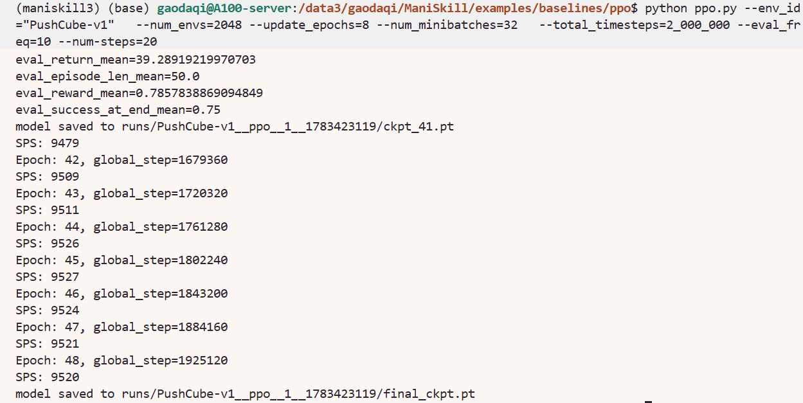
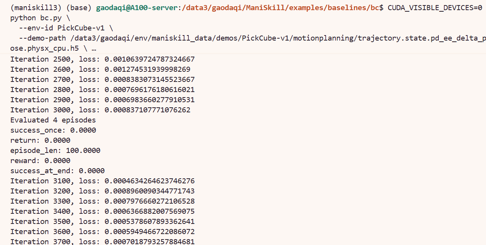

# RL、IL、VLA Baselines

本节开始进入 baseline 复现。复现路线如下：

```text
RL baseline：复现 PPO
IL baseline：复现 BC
Diffusion Policy / ACT：了解入口
VLA：了解 ManiSkill 的 VLA 扩展方向
```

## 1. Baseline 环境配置

ManiSkill 的 baseline 示例位于：

```bash
/path/to/ManiSkill/examples/baselines
```

先进入服务器上的 ManiSkill 环境：

```bash
source /path/to/env/maniskill3/bin/activate
export MS_ASSET_DIR=/path/to/env/maniskill_data
cd /path/to/ManiSkill
```

PPO 脚本会用到 TensorBoard。再激活环境后安装：

```bash
pip install tensorboard
```

不同 baseline 子目录有自己的 `setup.py`。运行某个 baseline 前，建议先在对应目录执行一次 `pip install -e .`。例如 BC：

```bash
cd /path/to/ManiSkill/examples/baselines/bc
pip install -e .
```

Diffusion Policy 和 ACT 也需要单独安装依赖，否则直接运行 `train.py` 可能会出现缺包错误，例如 `No module named 'diffusers'` 或 `No module named 'torchvision'`。


## 2. RL Baseline：PPO

PPO 是 ManiSkill 官方提供的在线强化学习 baseline。这里使用 `PushCube-v1`为例。
进入 PPO 目录：

```bash
source /path/to/env/maniskill3/bin/activate
export MS_ASSET_DIR=/path/to/env/maniskill_data
cd /path/to/ManiSkill/examples/baselines/ppo
```

运行命令：

```bash
python ppo.py --env_id="PushCube-v1" \
  --num_envs=2048 --update_epochs=8 --num_minibatches=32 \
  --total_timesteps=2_000_000 --eval_freq=10 --num-steps=20
```


训练过程中每隔一定 epoch 会进行评估，并保存 checkpoint。最终保存：

```text
runs/PushCube-v1__ppo__1__1783423119/final_ckpt.pt
```



如果后续想单独评估 checkpoint，可以参考官方的形式：

```bash
python ppo.py --env_id="PushCube-v1" \
  --evaluate \
  --checkpoint=runs/PushCube-v1__ppo__1__1783423119/final_ckpt.pt \
  --num_eval_envs=1 \
  --num-eval-steps=1000
```


## 3. IL Baseline：BC

BC 是 Behavior Cloning，即行为克隆。它不通过环境交互学习，而是直接从 demonstration 中学习动作分布。

BC 的核心链路是：

```text
下载 demonstration
replay / convert trajectory
得到 state + control mode 对齐的 h5 数据
运行 bc.py 训练策略
评估 success 指标
```

这里使用前面已经下载的 `PickCube-v1` motion planning demonstration。注意，BC 的 `--control-mode` 必须和 demonstration 文件名中的控制模式一致。

### 3.1 准备 BC 轨迹

上一节我们已经演示过把轨迹转换为 `pd_ee_delta_pose`，建议重新转换 50 条：

```bash
source /path/to/env/maniskill3/bin/activate
export MS_ASSET_DIR=/path/to/env/maniskill_data
cd /path/to/ManiSkill

python -m mani_skill.trajectory.replay_trajectory \
  --traj-path /path/to/env/maniskill_data/demos/PickCube-v1/motionplanning/trajectory.h5 \
  --save-traj \
  --allow-failure \
  -o state \
  -c pd_ee_delta_pose \
  --count 50
```

生成文件：

```text
/path/to/env/maniskill_data/demos/PickCube-v1/motionplanning/trajectory.state.pd_ee_delta_pose.physx_cpu.h5
/path/to/env/maniskill_data/demos/PickCube-v1/motionplanning/trajectory.state.pd_ee_delta_pose.physx_cpu.json
```


### 3.2 安装并运行 BC

进入 BC baseline 目录：

```bash
cd /path/to/ManiSkill/examples/baselines/bc
pip install -e .
```

先运行一个较小规模的 BC 复现：

```bash
python bc.py \
  --env-id PickCube-v1 \
  --demo-path /path/to/env/maniskill_data/demos/PickCube-v1/motionplanning/trajectory.state.pd_ee_delta_pose.physx_cpu.h5 \
  --control-mode pd_ee_delta_pose \
  --sim-backend cpu \
  --num-demos 50 \
  --max-episode-steps 100 \
  --total-iters 5000 \
  --batch-size 1024 \
  --eval-freq 1000 \
  --log-freq 100 \
  --num-eval-episodes 20 \
  --num-eval-envs 5
```



### 3.3 BC 参数含义

| 参数 | 含义 | 可以换成什么 |
|---|---|---|
| `--env-id` | 训练和评估的任务名 | 可以换成 `PushCube-v1`、`StackCube-v1` 等，但必须有对应 demo |
| `--demo-path` | BC 使用的 demonstration h5 文件 | 可以换成其他任务或其他控制模式的转换轨迹 |
| `--control-mode` | 评估环境使用的控制模式 | 必须和 demo 文件对应，例如 `pd_ee_delta_pose` |
| `--sim-backend` | 评估环境的仿真后端 | 可以用 `cpu`；如果脚本和显存允许，也可以尝试 `gpu` |
| `--num-demos` | 使用多少条 demonstration | 可以换成 `10`、`50`、`100`；数据越多训练通常越稳 |
| `--max-episode-steps` | 评估时最大 episode 长度 | 可以根据 demonstration 平均长度调整，通常设为 demo 平均长度的 2 倍左右 |
| `--total-iters` | 训练迭代次数 | 可以换成 `1000`、`5000`、`10000` 等 |
| `--batch-size` | 每次训练采样的 batch 大小 | 显存不足时调小，例如 `512` |
| `--eval-freq` | 每隔多少 iter 评估一次 | 可以换成 `500`、`1000`、`5000` |
| `--num-eval-episodes` | 每次评估跑多少个 episode | 越大越稳定，但耗时更久 |

## 4. Diffusion Policy 与 ACT

Diffusion Policy 和 ACT 也是 imitation learning baseline。它们和 BC 使用同一类 demonstration 数据，但模型更复杂、训练更慢。因此建议先用较小的 `--total-iters` 跑通流程，再逐步增加训练轮数。

本节继续使用前面生成的 `PickCube-v1` state 轨迹。

注意：DP / ACT 和 BC 一样，也会检查 `--control-mode` 是否与 demo 文件中的 metadata 一致。这里 demo 文件是 `pd_ee_delta_pose`，所以训练命令中也必须写：

```bash
--control-mode pd_ee_delta_pose
```

### 4.1 Diffusion Policy 操作流程

Diffusion Policy 使用扩散模型预测动作序列，它适合做 imitation learning。

进入环境并安装依赖：

```bash
source /path/to/env/maniskill3/bin/activate
export MS_ASSET_DIR=/path/to/env/maniskill_data
cd /path/to/ManiSkill/examples/baselines/diffusion_policy
pip install -e .
```


运行一个小规模 state-based 复现：

```bash
CUDA_VISIBLE_DEVICES=0 python train.py \
  --env-id PickCube-v1 \
  --demo-path /path/to/env/maniskill_data/demos/PickCube-v1/motionplanning/trajectory.state.pd_ee_delta_pose.physx_cpu.h5 \
  --control-mode pd_ee_delta_pose \
  --sim-backend physx_cpu \
  --num-demos 50 \
  --max-episode-steps 100 \
  --total-iters 5000 \
  --batch-size 1024 \
  --eval-freq 1000 \
  --log-freq 100 \
  --num-eval-episodes 20 \
  --num-eval-envs 5 \
  --exp-name diffusion_policy-PickCube-v1-state-50demos
```

训练输出会保存在当前目录的 `runs/` 下，通常包括日志、评估视频和 checkpoint。

### 4.2 ACT 操作流程

ACT 是 Action Chunking with Transformers。它会一次预测一段动作序列，适合处理连续控制任务。ACT 的依赖中包含 `torchvision` 和 `diffusers`，所以也需要先安装当前 baseline。

进入环境并安装依赖：

```bash
source /path/to/env/maniskill3/bin/activate
export MS_ASSET_DIR=/path/to/env/maniskill_data
cd /path/to/ManiSkill/examples/baselines/act
pip install -e .
```


运行一个小规模 state-based 复现：

```bash
CUDA_VISIBLE_DEVICES=0 python train.py \
  --env-id PickCube-v1 \
  --demo-path /path/to/env/maniskill_data/demos/PickCube-v1/motionplanning/trajectory.state.pd_ee_delta_pose.physx_cpu.h5 \
  --control-mode pd_ee_delta_pose \
  --sim-backend physx_cpu \
  --num-demos 50 \
  --max-episode-steps 100 \
  --total-iters 5000 \
  --batch-size 1024 \
  --eval-freq 1000 \
  --log-freq 100 \
  --num-eval-episodes 20 \
  --num-eval-envs 5 \
  --num-queries 30 \
  --exp-name act-PickCube-v1-state-50demos
```

训练结果同样会保存在 `runs/` 下：


### 4.3 DP / ACT 参数含义

| 参数 | 含义 | 可以换成什么 |
|---|---|---|
| `--env-id` | 训练和评估任务 | 可以换成其他有 demonstration 的 ManiSkill 任务 |
| `--demo-path` | imitation learning 使用的 h5 数据 | 可以换成其他 replay / convert 后的轨迹文件 |
| `--control-mode` | 评估环境使用的控制模式 | 必须和 demo metadata 一致，例如本节使用 `pd_ee_delta_pose` |
| `--sim-backend` | 评估环境后端 | state-based 复现建议先用 `physx_cpu` |
| `--num-demos` | 使用多少条 demonstration | 快速验证用 `10`，正式复现可用 `50`、`100` 或更多 |
| `--max-episode-steps` | 评估 episode 最大步数 | 通常设置为 demonstration 平均长度的 2 倍左右 |
| `--total-iters` | 训练迭代次数 | 快速验证用 `1000`，更正式的训练可用 `30000` 或更多 |
| `--batch-size` | batch 大小 | 显存不足时调小，例如 `512` |
| `--eval-freq` | 评估频率 | 可以换成 `500`、`1000`、`5000` |
| `--num-eval-episodes` | 每次评估 episode 数 | 越大越稳定，但耗时更长 |
| `--num-queries` | ACT 一次预测的动作 chunk 长度 | ACT 专用参数，常用 `30`，可根据任务长度调整 |


## 5. VLA 入口

ManiSkill 文档中有 VLA user guide 入口，可自行查阅：

```text
docs/source/user_guide/vision_language_action_models/index.md
```


## 导航

| 上一节 | 下一节 |
|---|---|
| [Replay 与 Convert Trajectory](07-replay-and-convert-trajectory.md) | [VLABench](../12-vlabench-benchmark.md) |
