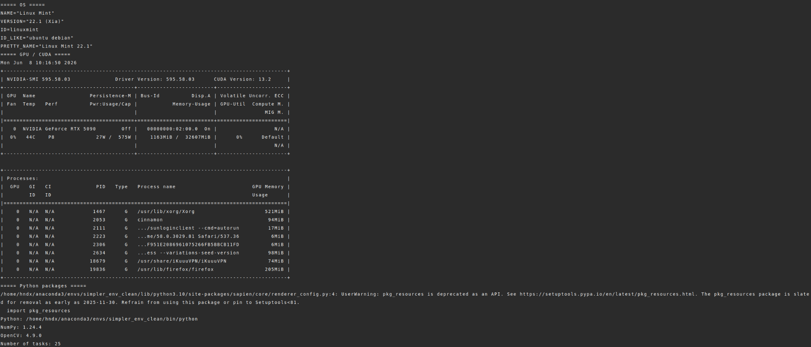

# SimplerEnv

> 难度：[基础] | 预计用时：60–90 分钟  
> 先修：[仿真 Benchmark](../../01-simulation-benchmarks.md)、[SAPIEN 生态](../../../05-simulation-and-task-modeling/05-sapien-ecosystem.md)

这一节不把 SimplerEnv 当成一个"又一个机械臂仿真器"来讲，而是把它放回原来的位置：**用仿真环境评估真实机器人策略**。它更像评测链路里的第一块测试板。先确认环境能启动、观测能拿到、动作能执行、视频和结果能保存，再接入 RT-1、Octo 或自己的策略。

本节以 `google_robot_pick_coke_can` 为例。我们会从安装开始，跑通 `reset → step → render → video/json` 的完整闭环，并把每一步的输出保存下来。示例中的动作不是学习到的策略，所以不会完成抓取任务；它的作用是让初学者先把 SimplerEnv 的接口和证据产物跑通。

## 本节目标

读完并跑完本节后，你应该能做到：

1. 解释 SimplerEnv 在具身智能评测中的定位：它不是训练框架，而是面向真实机器人策略的 real-to-sim 评测环境。
2. 正确安装 SimplerEnv，并知道为什么要固定 `numpy<2.0`。
3. 列出当前可用任务，创建 `google_robot_pick_coke_can` 环境。
4. 看懂 `reset_info`、语言指令、观测键和 7 维动作空间。
5. 运行一次单步调试，再运行多步 rollout，保存图片、视频和 `result.json`。
6. 区分"环境闭环跑通"和"策略完成任务"这两件事。

## 本单元边界

本单元聚焦 SimplerEnv 的环境链路验证和 smoke test。以下内容不在本单元展开：

- **RT-1、Octo 等策略模型的加载与推理**：本节只说明如何替换动作来源，不展开模型细节。VLA 模型见 [10 强化学习](../../../09-reinforcement-learning-for-robotics/README.md)。
- **Visual Matching 与 Variant Aggregation 的完整评测**：本节只解释概念，完整流程见 [SimplerEnv 官方仓库](https://github.com/simpler-env/SimplerEnv)。
- **ManiSkill2 任务开发**：本节只使用现有任务，自定义任务开发见 [SAPIEN 生态](../../../05-simulation-and-task-modeling/05-sapien-ecosystem.md)。

配套脚本放在 `labs/11-eval/`，运行输出在 `runs/11-eval/`。

## 运行环境

下面是本节示例实际跑通时使用的环境。版本不必完全相同，但建议先按这个组合安装，尤其要注意 NumPy 版本。

| 项目 | 版本 / 配置 |
|---|---|
| OS | Linux Mint 22.1 |
| GPU | NVIDIA GeForce RTX 5090 |
| NVIDIA Driver | 595.58.03 |
| CUDA | 13.2 |
| Python | 3.10，conda 环境 `simpler_env_clean` |
| NumPy | 1.24.4 |
| OpenCV | 4.9.0 |
| 任务数量 | 25 |

实验环境截图如下，后面文档中的图片和视频都来自同一台机器。

## 学习路径

本节按"先理解，再跑通，再看结果，最后复盘易错点"的顺序组织：

| 小节 | 读完能回答 | 重点 |
|---|---|---|
| [SimplerEnv 是什么](09-simplerenv-benchmark/01-what-is-simplerenv.md) | 它在具身智能评测中的定位？为什么不是训练框架？ | Visual Matching、Variant Aggregation、real-to-sim 评测 |
| [安装与版本检查](09-simplerenv-benchmark/02-installation.md) | 怎么正确安装？为什么必须固定 numpy<2.0？ | conda 环境、pip 依赖、NumPy 版本锁定与修复 |
| [代码架构](09-simplerenv-benchmark/03-architecture.md) | 仓库怎么组织？最小运行链路是什么？ | 目录结构、make→reset→step→save 主线 |
| [第一个环境](09-simplerenv-benchmark/04-first-environment.md) | 怎么列出任务、创建环境、拿到观测？ | ENVIRONMENTS、make、reset、obs keys、action space |
| [单步调试](09-simplerenv-benchmark/05-step-debug.md) | 怎么确认 env.step 能正常执行？ | 零动作 step、reset/step 帧对比、result.json |
| [多步 rollout 与视频](09-simplerenv-benchmark/06-rollout-and-video.md) | 怎么连续跑多步并保存视频？ | 三组实验（zero/small-random 0.02/0.08）、MP4、帧保存 |
| [结果解读与下一步](09-simplerenv-benchmark/07-result-and-next.md) | result.json 怎么读？怎么走向正式评测？ | 字段解释、实验汇总、策略接入、官方入口 |
| [动手练习](09-simplerenv-benchmark/08-practice.md) | 自己怎么从头跑通、换任务、排错？ | 文件放置、易错点、自查问题、三个动手练习 |

## 怎么读这一节

第 1、2 小节是基础，最好按顺序读完；第 3、4 小节建立对代码和接口的理解；第 5、6 小节是实战，跑通单步和多步 rollout；第 7 小节教你怎么读结果、怎么走向正式评测；第 8 小节是练习和排错，建议全部完成。

如果时间有限，也可以挑一条路线走：

- **完整通读**（初次学习推荐）：按目录顺序从第 1 小节读到第 8 小节。
- **快速跑通**（只想验证环境）：第 2 小节（安装）→ 第 4 小节（创建环境）→ 第 5 小节（单步调试）→ 第 6 小节（rollout）。
- **准备正式评测**（已跑通 smoke test）：第 7 小节（结果解读）→ 第 8 小节（练习 3 换任务）。

## 导航

- 上一节：[RoboCasa](06-robocasa-benchmark.md)
- 返回分类：[操作](../02-manipulation.md)
- 下一节：[SimplerEnv 是什么](09-simplerenv-benchmark/01-what-is-simplerenv.md)
