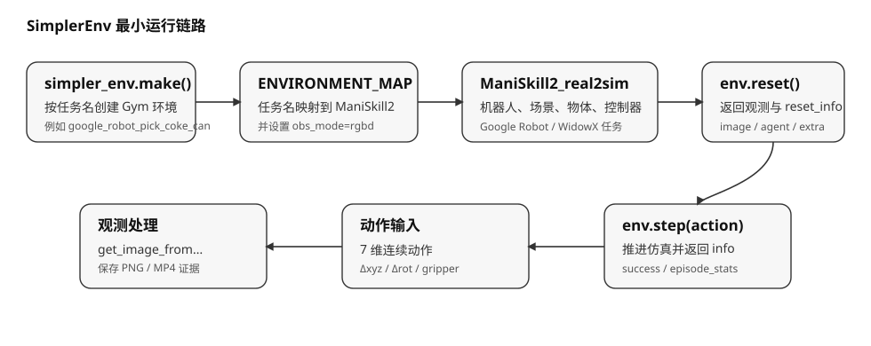

# 代码架构

装完环境后，先别急着写代码。花几分钟把仓库的目录结构和最小运行链路理清楚，后面调试时能更快定位问题出在哪一层。

## 前置概念

读这一节前，建议先理解（详见 [安装与版本检查](02-installation.md)）：

- **SimplerEnv 仓库已在本地克隆完成**，并且 `simpler_env` 可以正常导入。
- **`ManiSkill2_real2sim/`** 子模块也已克隆，它是底层任务环境的来源。

## 本节目标

读完本节后，你应该能回答：

1. SimplerEnv 仓库的目录结构分哪几块，每块负责什么？
2. 最小运行链路 `make → reset → get_image → step → save` 每一步做什么？
3. 为什么初学者应该先走这条最小链路，而不是直接跑官方完整评测脚本？

## 仓库结构

官方仓库的结构可以先按下面几块理解：

| 路径 | 作用 |
|---|---|
| `simpler_env/__init__.py` | 维护任务列表和 `simpler_env.make(task_name)` 入口 |
| `ManiSkill2_real2sim/` | 真实到仿真的环境主体，包括机器人、对象、场景和控制器 |
| `simpler_env/utils/env/` | 环境创建、观测处理、图像提取等工具 |
| `simpler_env/evaluation/` | 更正式的评测流程、日志和环境参数 sweep |
| `simpler_env/policies/` | RT-1、Octo 等策略适配代码 |
| `scripts/` | 官方评测脚本，用于跑 visual matching / variant aggregation |
| `tools/` | 指标计算、视频合并、系统辨识、可视化等工具 |

可以把它理解成两层：

- **上层 `simpler_env/`**：提供任务入口（`make`）、观测工具、评测流程和策略适配。你写的脚本主要和这一层交互。
- **下层 `ManiSkill2_real2sim/`**：提供底层任务环境——机器人模型、物体、场景、控制器和物理仿真。这一层你通常不需要直接改代码，但排错时可能需要看它的控制器代码（如 `pd_ee_pose.py`）。

## 最小链路

最小链路如下图所示：



对初学者来说，先抓住一条线即可：

```text
simpler_env.make(task)
  -> env.reset()
  -> get_image_from_maniskill2_obs_dict(env, obs)
  -> env.step(action)
  -> 保存 frame / video / result.json
```

这条线就是本节实验要跑通的内容。每一步的含义：

1. **`simpler_env.make(task)`**：从任务注册表中找到任务名对应的环境类，创建 Gym 风格的 env 对象。
2. **`env.reset()`**：初始化或重置场景——加载物体、设置初始姿态、渲染第一帧。返回 `(obs, reset_info)`。
3. **`get_image_from_maniskill2_obs_dict(env, obs)`**：从观测字典中提取 RGB 图像（numpy 数组），后续保存图片或视频用。
4. **`env.step(action)`**：执行一步动作——IK 求解 → 物理推进 → 渲染新一帧 → 返回新的 obs、reward、终止标志和 info。
5. **保存**：把图像逐帧存成 PNG、合成 MP4，并把 episode 统计信息写入 `result.json`。

这条链路比直接读官方完整评测脚本更容易定位问题。如果某一步出错，你可以确定是 `make` 阶段（任务注册）、`reset` 阶段（场景初始化/渲染）、`step` 阶段（IK/物理）还是保存阶段出了问题。

## 小结

- 初学者可以先把 SimplerEnv 仓库理解成两层：`simpler_env` 提供任务入口和评测工具，`ManiSkill2_real2sim` 提供底层任务环境、机器人、场景和控制器。
- 本节最小链路是 `make → reset → get image → step → save`，比直接读官方完整评测脚本更容易定位问题。
- 后续接入策略时，主要替换动作来源；环境创建、观测提取和结果保存流程可以复用。

## 导航

- 上一节：[安装与版本检查](02-installation.md)
- 返回上级：[SimplerEnv](../09-simplerenv-benchmark.md)
- 下一节：[第一个环境](04-first-environment.md)
