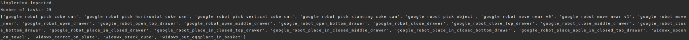

# 第一个环境

理解了架构和链路之后，接下来动手创建第一个 SimplerEnv 环境。这一节只做两件事：列出所有可用任务，然后创建 `google_robot_pick_coke_can` 并查看它的基本信息。

## 前置概念

读这一节前，建议先理解（详见 [代码架构](03-architecture.md)）：

- **`simpler_env.make(task)`** 是创建环境的入口。
- **最小链路的第一步** 就是 `make` 和 `reset`。
- **观测字典** 包含 `agent`、`extra`、`camera_param`、`image` 四个键。

## 本节目标

读完并跑完本节后，你应该能做到：

1. 列出 SimplerEnv 当前所有可用任务。
2. 用 `simpler_env.make("google_robot_pick_coke_can")` 创建环境。
3. 看懂 `reset_info`、语言指令、观测键和 7 维动作空间。
4. 从观测字典中提取 RGB 图像，确认图像尺寸和数据类型。

## 列出可用任务

先列出 SimplerEnv 当前可用任务：

```bash
python - <<'PY'
import simpler_env
print("SimplerEnv imported.")
print("Number of tasks:", len(simpler_env.ENVIRONMENTS))
print(simpler_env.ENVIRONMENTS)
PY
```

输出中可以看到 Google Robot 和 WidowX 两类任务，例如 `google_robot_pick_coke_can`、`google_robot_open_drawer`、`widowx_spoon_on_towel` 等。



本节选择 `google_robot_pick_coke_can`。这是一个 Google Robot 抓取可乐罐的任务，视觉上比较直观，适合做第一组 smoke test。

## 创建环境并查看基本信息

接着创建环境并查看 `reset()` 的返回值：

```bash
python - <<'PY'
import simpler_env
from simpler_env.utils.env.observation_utils import get_image_from_maniskill2_obs_dict

env = simpler_env.make("google_robot_pick_coke_can")
obs, reset_info = env.reset()

print("Reset info:", reset_info)
print("Instruction:", env.unwrapped.get_language_instruction())
print("Action space:", env.action_space)
print("Observation keys:", obs.keys())

image = get_image_from_maniskill2_obs_dict(env, obs)
print("Image shape:", image.shape, image.dtype)
env.close()
PY
```

关键输出如下：

```text
Instruction: pick coke can
Action space: Box([-1. ... -1.], [1. ... 1.], (7,), float32)
Observation keys: odict_keys(['agent', 'extra', 'camera_param', 'image'])
Image shape: (512, 640, 3) uint8
```

## 逐项解读

这里有几个信息值得停下来解释：

- **`Instruction: pick coke can`** 是当前任务的语言指令。后面接入 VLA 或语言条件策略时，这个字段就是策略输入的一部分。
- **`Action space`** 是 7 维连续动作。前三维通常对应末端位置增量，后三维对应轴角形式的旋转增量，最后一维对应夹爪控制。
- **`Observation keys`** 里有 `agent`、`extra`、`camera_param`、`image`。本节主要用 `image` 做截图和视频。
- **`Image shape: (512, 640, 3)`** 表示拿到的是一张 RGB 图像，数据类型为 `uint8`。这说明场景加载、相机渲染和观测提取都已正常工作。

## 小结

- `simpler_env.ENVIRONMENTS` 用来确认任务注册是否成功，任务列表截图可以作为安装成功证据。
- `google_robot_pick_coke_can` 的语言指令是 `pick coke can`，适合说明语言条件任务的基本输入。
- 该任务返回 7 维连续动作空间和包含 `agent`、`extra`、`camera_param`、`image` 的观测字典。
- `(512, 640, 3) uint8` 图像说明场景加载、相机渲染和观测提取都已正常工作。

## 导航

- 上一节：[代码架构](03-architecture.md)
- 返回上级：[SimplerEnv](../09-simplerenv-benchmark.md)
- 下一节：[单步调试](05-step-debug.md)
