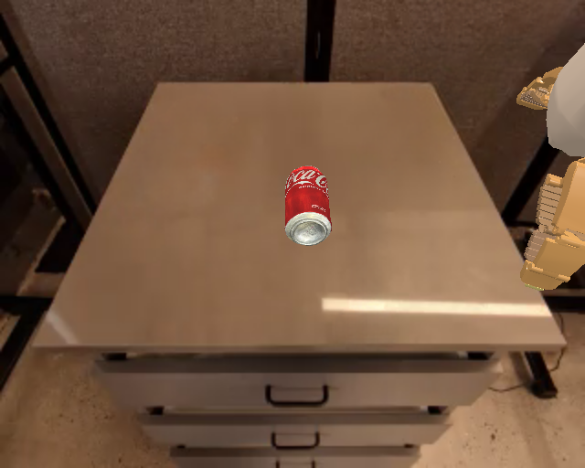

# 单步调试

环境能 `reset` 只是第一步。在正式跑多步 rollout 和保存视频之前，先跑最小的一步：`reset → step → 保存`。这样做的好处是：如果出错，可以判断问题发生在 `reset`、`step`、图像提取还是视频保存中的哪一环。

## 前置概念

读这一节前，建议先理解（详见 [第一个环境](04-first-environment.md)）：

- **`env.reset()`** 返回 `(obs, reset_info)`。
- **`get_image_from_maniskill2_obs_dict(env, obs)`** 从观测字典提取 RGB 图像。
- **`env.step(action)`** 执行一步动作，返回 `(obs, reward, terminated, truncated, info)`。

## 本节目标

读完并跑完本节后，你应该能做到：

1. 用零动作执行一次 `env.step()`，确认环境不会崩溃。
2. 保存 reset 帧和 step 后帧，通过对比确认环境正在渲染新画面。
3. 保存 `result.json`，确认 episode 基本信息被正确记录。
4. 理解为什么零动作不会让机器人抓取物体，以及为什么 `success=false` 是正常的。

## 脚本与运行

脚本放在：

```text
labs/11-eval/simplerenv_step_debug.py
```

运行：

```bash
PYTHONFAULTHANDLER=1 python -u labs/11-eval/simplerenv_step_debug.py
```

脚本做了下面几件事：

1. 创建 `google_robot_pick_coke_can` 环境。
2. 调用 `env.reset()`。
3. 保存 reset 后第一帧：`step_000_reset.png`。
4. 使用零动作执行一次 `env.step(action)`。
5. 保存 step 后图像：`step_001_after_zero_action.png`。
6. 保存结构化结果：`result.json`。

## 画面对比

reset 后第一帧如下。画面中可以看到桌面、抽屉、中心的可乐罐，以及右侧的 Google Robot 机械臂局部。


执行一步零动作后的图像如下：



## 结果文件

单步结果文件的核心内容：

```json
{
  "task": "google_robot_pick_coke_can",
  "instruction": "pick coke can",
  "observation_keys": ["agent", "extra", "camera_param", "image"],
  "reward_after_one_step": 0.0,
  "terminated": false,
  "truncated": false
}
```

这一步的重点不是奖励，而是确认 `env.step(action)` 可以正常执行。零动作不会让机器人抓取物体，所以 `success` 为 `False` 是正常结果。

如果这一页能正常跑通，说明最核心的 `reset → step → render → save` 链路已经打通。接下来就可以放心跑多步 rollout 了。

## 小结

- 单步调试的目标是把问题缩小到 `reset`、`step`、图像提取或视频保存中的某一环。
- `step_000_reset.png` 与 `step_001_after_zero_action.png` 可以证明环境不只完成了 reset，也成功执行过一次 `env.step()`。
- 零动作不会产生抓取行为，因此 reward 为 0、`success=false` 都是正常现象。

## 导航

- 上一节：[第一个环境](04-first-environment.md)
- 返回上级：[SimplerEnv](../09-simplerenv-benchmark.md)
- 下一节：[多步 rollout 与视频](06-rollout-and-video.md)
