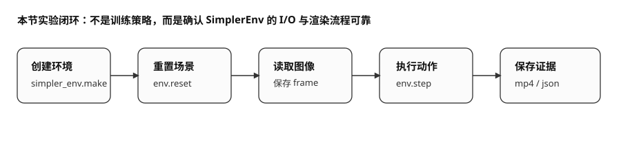
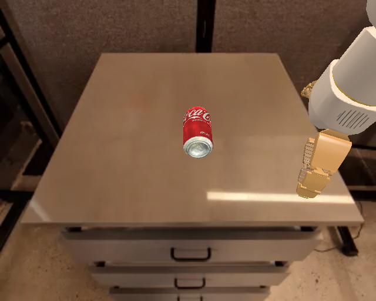
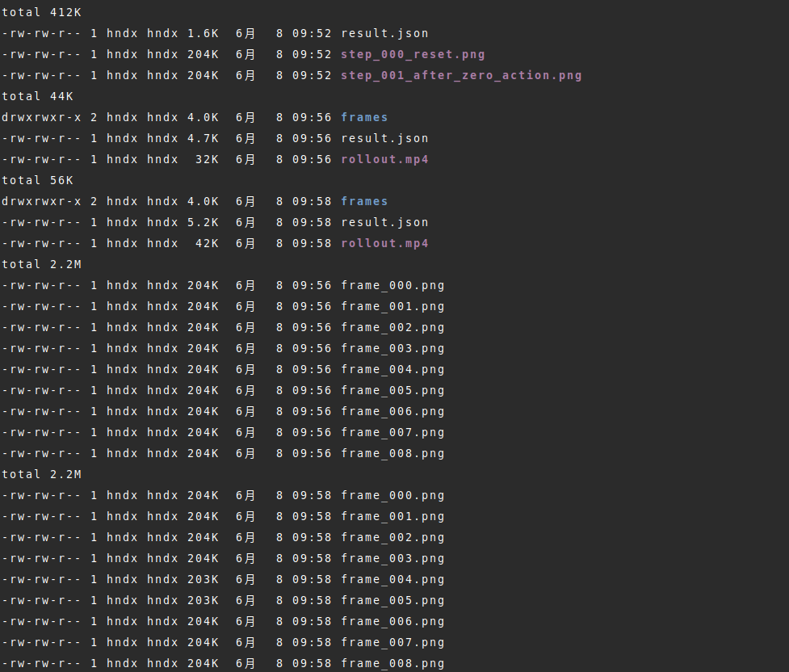

# 多步 rollout 与视频

单步没问题后，再跑多步 rollout。这一节的目的是验证连续 `step`、连续渲染、视频编码和 JSON 记录能否稳定工作，而不是完成任务。

## 前置概念

读这一节前，建议先理解（详见 [单步调试](05-step-debug.md)）：

- **`env.step(action)`** 已经能单步正常执行。
- **零动作** 是最稳定的接口测试输入。
- **`PYTHONFAULTHANDLER=1`** 用于在 C 扩展崩溃时打印 Python 层调用栈，方便定位问题。

## 本节目标

读完并跑完本节后，你应该能做到：

1. 用三种动作模式（零动作、小随机 0.02、小随机 0.08）跑多步 rollout。
2. 保存每帧 PNG 和完整的 MP4 视频。
3. 理解三种模式的各自作用：零动作测试闭环稳定性、小随机测试非零动作接口、更大振幅用于展示画面变化。
4. 对比不同模式的视觉差异，确认机械臂在小随机动作下确实发生了移动。

## 三组实验

| 组别 | 动作 | 步数 | 作用 |
|---|---|---:|---|
| zero | 全 0 动作 | 10 | 最稳定的环境闭环测试 |
| small-random 0.02 | 仅扰动末端位置，幅度 0.02 | 10 | 测试非零动作输入 |
| small-random 0.08 | 仅扰动末端位置，幅度 0.08 | 20 | 让画面变化更明显，作为展示版 |

运行脚本：

```text
labs/11-eval/simplerenv_rollout_video.py
```

## 零动作版本

最稳定的闭环测试——如果这个都跑不通，说明环境链路本身有问题。

```bash
PYTHONFAULTHANDLER=1 python -u labs/11-eval/simplerenv_rollout_video.py \
  --task google_robot_pick_coke_can \
  --steps 10 \
  --seed 0 \
  --action-mode zero \
  --out-dir runs/11-eval/simplerenv_rollout_video_zero
```

## 小随机动作 0.02 版本

在零动作基础上加入幅度 0.02 的末端位置扰动，验证非零动作接口。

```bash
PYTHONFAULTHANDLER=1 python -u labs/11-eval/simplerenv_rollout_video.py \
  --task google_robot_pick_coke_can \
  --steps 10 \
  --seed 0 \
  --action-mode small-random \
  --action-scale 0.02 \
  --out-dir runs/11-eval/simplerenv_rollout_video_small
```

## 小随机动作 0.08 版本

如果想让视频中机械臂移动更明显，可以跑 0.08 版本：

```bash
PYTHONFAULTHANDLER=1 python -u labs/11-eval/simplerenv_rollout_video.py \
  --task google_robot_pick_coke_can \
  --steps 20 \
  --seed 0 \
  --action-mode small-random \
  --action-scale 0.08 \
  --out-dir runs/11-eval/simplerenv_rollout_video_small_008
```

## rollout 闭环

rollout 的过程可以理解成下面这个闭环：



## 视频产物

零动作版本生成的视频：

<video src="../../assets/simplerenv-rollout-zero.mp4" controls muted loop playsinline style="max-width:100%;height:auto;display:block;margin:0.75em 0"></video>

0.02 小随机动作版本生成的视频：

<video src="../../assets/simplerenv-rollout-small-002.mp4" controls muted loop playsinline style="max-width:100%;height:auto;display:block;margin:0.75em 0"></video>

0.08 小随机动作版本生成的视频：

<video src="../../assets/simplerenv-rollout-small-008.mp4" controls muted loop playsinline style="max-width:100%;height:auto;display:block;margin:0.75em 0"></video>

## 帧对比

0.08 版本的首帧与第 10 帧如下。相比零动作，右侧机械臂位置有更明显的变化，因此更适合在课堂或报告里展示"动作确实被环境执行了"。




## 输出文件

生成文件检查如下：



## 小结

- 多步 rollout 的目标是验证连续 `step`、连续渲染、视频编码和 JSON 记录，而不是完成任务。
- `zero` 是最稳定的闭环测试；`small-random 0.02` 用于验证非零动作接口；`small-random 0.08` 更适合展示画面变化。
- MP4、逐帧 PNG 和 `result.json` 三类产物结合起来，才能形成"图文并茂、可复现"的运行证据。

## 导航

- 上一节：[单步调试](05-step-debug.md)
- 返回上级：[SimplerEnv](../09-simplerenv-benchmark.md)
- 下一节：[结果解读与下一步](07-result-and-next.md)
