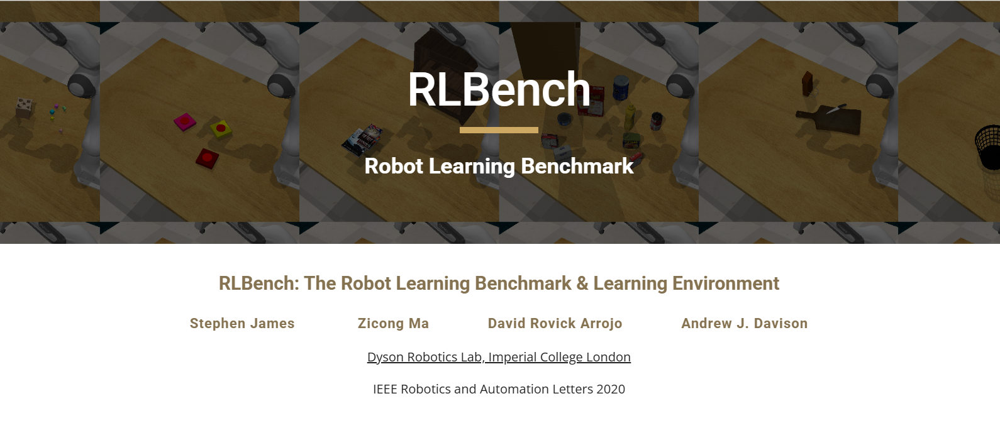

# 11.1 概览与评测协议



## 官方资源

| 资源 | 作用 |
| --- | --- |
| [RLBench Official Website](https://sites.google.com/view/rlbench) | 官方项目页，包含 benchmark 简介、论文和代码入口 |
| [RLBench GitHub](https://github.com/stepjam/RLBench) | 官方代码仓库，包含安装说明、任务接口和示例脚本 |
| [RLBench Paper](https://arxiv.org/abs/1909.12271) | 原始论文，介绍任务设计、观测空间、演示数据和评测设置 |

## 目标

本节先从整体上理解 RLBench：它是什么、评测什么，以及为什么经常被用于机器人操作任务研究。

读完本节后，你应该能够回答下面几个问题：

```text
RLBench 是什么？
它为什么常用于视觉引导机器人操作研究？
RLBench 的任务、演示数据和评测指标大致如何组织？
RLBench 的 success rate 一般怎么计算？
它和 LIBERO、RoboTwin、Meta-World 这类 benchmark 有什么区别？
```

简单来说，RLBench 是一个基于 CoppeliaSim / PyRep 的机器人操作 benchmark。它提供了大量手工设计的视觉引导操作任务，例如拿取物体、开关门、放置物体、按按钮、整理物品等。研究者可以在其中训练 imitation learning、reinforcement learning、多任务学习、few-shot learning 或视觉操作策略。

这一节只建立总体框架；更具体的 `Task`、`Variation`、`ObservationConfig`、`ActionMode` 和 `reset / step` 交互流程，会在后面的“任务结构与观测空间”一节中展开。


## RLBench 是什么

RLBench 全称可以理解为 Robot Learning Benchmark。它的目标是提供一个可扩展的机器人学习环境，让研究者能够在统一的仿真平台上比较不同策略的表现。

它有几个核心特点：

| 特点 | 说明 |
| --- | --- |
| 大规模任务集合 | 包含大量手工设计的 manipulation tasks，覆盖从简单到长时序的多种操作 |
| 视觉引导操作 | 任务通常依赖图像、深度、mask、机械臂状态等观测，而不是只给低维状态 |
| 支持演示数据 | 可以通过 motion planner 和 waypoints 生成专家 demonstration |
| 支持多种学习范式 | 可用于 imitation learning、reinforcement learning、multi-task learning 和 few-shot learning |
| 可扩展任务 | 用户可以自定义新的 task class、success condition 和 variation |

和只提供少量 toy tasks 的环境不同，RLBench 更强调“多任务操作能力”。它不是让模型只学会一个简单动作，而是希望测试模型能否在多种视觉场景和任务变化中完成实际操作。


## RLBench 的基本组成

RLBench 中的一个实验通常围绕下面几个概念展开：

| 概念 | 含义 |
| --- | --- |
| `Task` | 任务类型，例如 reach target、open drawer、push button |
| `Variation` | 同一任务下的目标变化，例如目标颜色、位置或物体不同 |
| `Episode` | 一次完整执行，从环境 reset 到任务完成或失败 |
| `Demonstration` | 专家演示轨迹，常用于 imitation learning |
| `Observation` | 环境返回的图像、深度、mask 和机器人状态 |
| `Action` | 策略输出的机械臂和夹爪控制指令 |
| `Success condition` | 判断任务是否完成的条件 |
| `Success rate` | 衡量 policy 表现的核心指标 |

这张表只需要先建立概念。后续章节会分别展开：

```text
任务结构与观测空间：讲 Task、Variation、ObservationConfig、ActionMode
演示数据生成与数据集：讲 demonstrations 如何生成和保存
Policy 训练与评测：讲 policy 如何读取数据、输出动作并统计成功率
```


## Demonstration 与学习范式

RLBench 的一个重要特点是可以生成专家 demonstration。所谓 demonstration，就是一条完整的专家轨迹：

```text
初始状态
-> observation 和 action 序列
-> 成功完成任务
```

这些 demonstration 常用于 imitation learning，也就是让 policy 模仿专家动作。后续很多机器人操作方法会把 RLBench demonstration 整理成训练数据：

```text
图像 observation
任务描述
机械臂状态
专家 action
```

然后训练一个 policy：

```text
policy(observation, instruction) -> action
```

需要注意的是，RLBench 的 demonstration 不等于真实机器人数据。它是在仿真环境中通过任务 waypoints 和 motion planner 生成的专家轨迹。因此它非常适合快速实验和大规模数据生成，但如果要部署到真实机器人，还需要考虑 sim-to-real gap。


## 评测协议：RLBench 通常怎么评估

RLBench 评测的核心指标通常是 success rate，也就是成功率。

一次 episode 的结果可以简单记为：

```text
success = 1  表示任务成功
success = 0  表示任务失败
```

如果一个任务测试了 N 次，其中成功了 S 次，那么成功率就是：

```text
success rate = S / N
```

在多任务评测中，通常会对多个任务分别计算 success rate，再取平均：

```text
Task A success rate
Task B success rate
Task C success rate
...
Average success rate
```

所以读论文或实验表格时，看到 RLBench 的结果，一般要注意三件事：

| 需要确认的点 | 为什么重要 |
| --- | --- |
| 测试了哪些 tasks | 不同任务难度差异很大 |
| 每个任务测试多少 episodes | 测试次数太少可能不稳定 |
| 是否使用相同 observation / action 设置 | 不同输入输出设置会影响公平性 |


## 常见实验设置

在 RLBench 相关实验中，常见设置可以分成三类。

### 单任务学习

单任务学习只训练和评估一个任务，例如只做 `open drawer`。这种设置适合入门，因为数据处理和评估逻辑最简单。

```text
训练：一个 task 的 demonstrations
评估：同一个 task 的多个 test episodes
指标：该 task 的 success rate
```

### 多任务学习

多任务学习会同时训练多个任务。模型需要区分不同任务目标，并在不同场景下输出合适动作。

```text
训练：多个 tasks 的 demonstrations
评估：多个 tasks 的 success rate
指标：average success rate
```

这更接近通用机器人策略的目标，但也更难，因为模型要同时处理任务差异、视觉差异和动作差异。

### Few-shot learning

RLBench 也常用于 few-shot manipulation。这里关注的是：模型能否只看少量 demonstration，就快速适应新任务或新 variation。

```text
给少量 demos
-> 适应新任务 / 新 variation
-> 测试 success rate
```

这个方向和大模型中的 in-context learning 有些相似，都是希望模型利用少量示例快速泛化。


## RLBench 和其他 benchmark 的区别

为了避免混淆，可以把 RLBench 和前面常见 benchmark 做一个简单对比。

| Benchmark | 重点 | 适合理解什么 |
| --- | --- | --- |
| Meta-World | 多任务机械臂控制，偏低维控制和强化学习 | 经典 RL 多任务控制 |
| LIBERO | 语言引导、lifelong learning、任务泛化 | VLA / continual learning / language-conditioned manipulation |
| RoboTwin 2.0 | 双臂操作、复杂资产、domain randomization、sim-to-real | 现代双臂 VLA / policy 评测 |
| RLBench | 大规模视觉引导操作任务、demo 生成、task API | manipulation benchmark 的基础接口和多任务操作 |

RLBench 的优势在于它比较经典、任务数量多、API 清晰，而且 demonstration 机制很适合模仿学习实验。它不一定是最新的双臂大模型 benchmark，但非常适合作为理解机器人操作 benchmark 的基础章节。

## 本节小结

RLBench 是一个经典的视觉引导机器人操作 benchmark。它的核心不是某一个固定任务，而是一套完整的任务组织和评测方式：

```text
Task 定义任务类型
Variation 提供任务变化
Demonstration 提供专家轨迹
Observation 提供视觉和机器人状态
Action 控制机械臂
Success condition 判断任务是否完成
Success rate 衡量 policy 表现
```
