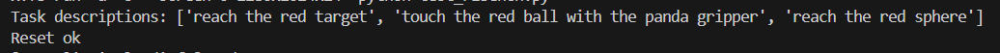

# 11.2 环境配置

## 目标

这一节介绍如何配置 RLBench 的运行环境。和普通 Python benchmark 不同，RLBench 不是只安装一个 pip 包就能运行，它依赖三层组件：

```text
CoppeliaSim  ->     PyRep      ->      RLBench
底层仿真器       Python 控制接口   benchmark 和任务 API
```

简单来说，CoppeliaSim 负责仿真机器人和场景，PyRep 负责让 Python 程序控制 CoppeliaSim，RLBench 则在 PyRep 之上封装任务、观测、演示数据和评测接口。

这一节的目标是先把 RLBench 环境配置的整体流程讲清楚。后续章节中，我们再基于这个环境读取任务、生成 demonstrations，并进行 policy 训练与评测。


## 官方资源

配置 RLBench 环境时，建议优先参考下面几个官方入口：

| 资源 | 作用 |
| --- | --- |
| [RLBench GitHub](https://github.com/stepjam/RLBench) | 官方代码仓库，包含安装说明、任务接口和示例脚本 |
| [PyRep GitHub](https://github.com/stepjam/PyRep) | RLBench 底层 Python 控制接口 |
| [CoppeliaSim Downloads](https://www.coppeliarobotics.com/downloads) | CoppeliaSim 仿真器下载页面 |

需要注意，RLBench 和 PyRep 对 CoppeliaSim 版本比较敏感。如果版本不匹配，可能出现无法启动仿真、找不到动态库、headless 渲染失败等问题。因此后面的命令尽量固定版本，而不是直接使用最新版本。


## 推荐目录结构

建议把 CoppeliaSim、PyRep、RLBench 和后续数据都放在同一个工作目录下，便于管理：

```text
rlbench_stack/
├── CoppeliaSim/
├── PyRep/
├── RLBench/
├── data/
│   └── demos/
└── scripts/
```

后面假设工作目录为：

```bash
export RLBENCH_ROOT=$HOME/rlbench_stack
mkdir -p $RLBENCH_ROOT
```


## 创建 Python 环境

建议为 RLBench 单独创建 conda 环境，避免和其他机器人项目混在一起：

```bash
conda create -n rlbench python=3.8 -y
conda activate rlbench
```

安装基础依赖：

```bash
pip install numpy scipy pillow matplotlib opencv-python imageio
pip install cffi wheel pyquaternion natsort gymnasium
```

这里建议使用独立环境，因为 PyRep 和 CoppeliaSim 对系统库、Python 版本和动态链接路径比较敏感。如果和其他项目共用环境，后续排查问题会比较麻烦。


## 安装 CoppeliaSim

RLBench 官方安装说明中使用的是 CoppeliaSim 4.1.0。可以先下载对应的 Ubuntu 版本：

```bash
cd $RLBENCH_ROOT

wget https://downloads.coppeliarobotics.com/V4_1_0/CoppeliaSim_Edu_V4_1_0_Ubuntu20_04.tar.xz

mkdir -p $RLBENCH_ROOT/CoppeliaSim
tar -xf CoppeliaSim_Edu_V4_1_0_Ubuntu20_04.tar.xz \
  -C $RLBENCH_ROOT/CoppeliaSim \
  --strip-components 1
```

然后配置环境变量：

```bash
export COPPELIASIM_ROOT=$RLBENCH_ROOT/CoppeliaSim
export LD_LIBRARY_PATH=$LD_LIBRARY_PATH:$COPPELIASIM_ROOT
export QT_QPA_PLATFORM_PLUGIN_PATH=$COPPELIASIM_ROOT
```

为了每次打开终端都自动生效，可以写入 `~/.bashrc`：

```bash
cat >> ~/.bashrc <<EOF
export RLBENCH_ROOT=$RLBENCH_ROOT
export COPPELIASIM_ROOT=$RLBENCH_ROOT/CoppeliaSim
export LD_LIBRARY_PATH=\$LD_LIBRARY_PATH:\$COPPELIASIM_ROOT
export QT_QPA_PLATFORM_PLUGIN_PATH=\$COPPELIASIM_ROOT
EOF

source ~/.bashrc
```

检查目录是否正常：

```bash
ls $COPPELIASIM_ROOT
```

如果能看到 CoppeliaSim 的可执行文件、动态库和资源目录，说明解压路径基本正确。


## 安装 PyRep

PyRep 是 RLBench 与 CoppeliaSim 之间的 Python 控制层。它负责从 Python 启动仿真环境、加载场景、控制机械臂和推进 simulation step。

安装 PyRep：

```bash
cd $RLBENCH_ROOT
git clone https://github.com/stepjam/PyRep.git
cd PyRep
pip install -e .
```

安装完成后，可以做一个简单检查：

```bash
python - <<'PY'
import pyrep
print("PyRep import ok")
PY
```

如果这里能正常打印 `PyRep import ok`，说明 Python 层可以找到 PyRep 包。但这还不代表 CoppeliaSim 一定能成功启动，真正的仿真启动会在后面的 RLBench 示例中测试。


## 安装 RLBench

继续安装 RLBench：

```bash
cd $RLBENCH_ROOT
git clone https://github.com/stepjam/RLBench.git
cd RLBench
pip install -e .
```


## 最小运行测试

安装完成后，可以先跑一个最小测试，确认 RLBench 能创建环境、加载任务并 reset。

创建测试脚本：

```bash
cat > test_rlbench.py <<'PY'
from rlbench.environment import Environment
from rlbench.action_modes.action_mode import MoveArmThenGripper
from rlbench.action_modes.arm_action_modes import JointVelocity
from rlbench.action_modes.gripper_action_modes import Discrete
from rlbench.tasks import ReachTarget

action_mode = MoveArmThenGripper(
    arm_action_mode=JointVelocity(),
    gripper_action_mode=Discrete()
)

env = Environment(
    action_mode=action_mode,
    obs_config=None,
    headless=True
)

env.launch()

task = env.get_task(ReachTarget)
descriptions, obs = task.reset()

print("Task descriptions:", descriptions)
print("Reset ok")

env.shutdown()
PY
```

运行：

```bash
python test_rlbench.py
```

如果程序能够打印任务描述并正常退出，说明 CoppeliaSim、PyRep 和 RLBench 三层已经基本连通。




## headless 运行说明

在服务器上运行 RLBench 时，通常没有显示器，因此需要 headless 模式：

```python
env = Environment(
    action_mode=action_mode,
    obs_config=obs_config,
    headless=True
)
```

如果仍然出现 OpenGL、Qt 或 display 相关错误，可以尝试使用虚拟显示：

```bash
sudo apt-get install -y xvfb
xvfb-run -a python test_rlbench.py
```

常见问题可以先按下面方向排查：

| 问题 | 可能原因 |
| --- | --- |
| 找不到 CoppeliaSim 动态库 | `COPPELIASIM_ROOT` 或 `LD_LIBRARY_PATH` 没配好 |
| Qt platform plugin 报错 | `QT_QPA_PLATFORM_PLUGIN_PATH` 没指向 CoppeliaSim |
| headless 下无法渲染 | 服务器 OpenGL / EGL / Xvfb 环境不完整 |
| Python 能 import，但 `env.launch()` 失败 | PyRep 能导入，但 CoppeliaSim 没有被正确找到或无法启动 |

如果只是本地学习 RLBench 的 API，可以先在有图形界面的 Linux 机器上测试；如果要在服务器批量生成数据或评测 policy，则需要重点处理 headless 渲染问题。


## 安装完成后的目录

完成安装后，目录大致应该是：

```text
rlbench_stack/
├── CoppeliaSim/
├── PyRep/
├── RLBench/
└── data/
```

其中：

| 目录 | 作用 |
| --- | --- |
| `CoppeliaSim/` | 底层仿真器 |
| `PyRep/` | Python 控制 CoppeliaSim 的接口 |
| `RLBench/` | benchmark、task class、examples |
| `data/` | 后续保存 demonstrations 或评测结果 |

后面几节会继续使用这个结构。


## 本节小结

RLBench 的环境配置可以压缩成三步：

```text
安装 CoppeliaSim
-> 安装 PyRep
-> 安装 RLBench
```

三者的关系是：

```text
CoppeliaSim 负责仿真
PyRep 负责 Python 控制仿真
RLBench 负责封装任务、观测、演示数据和评测接口
```
