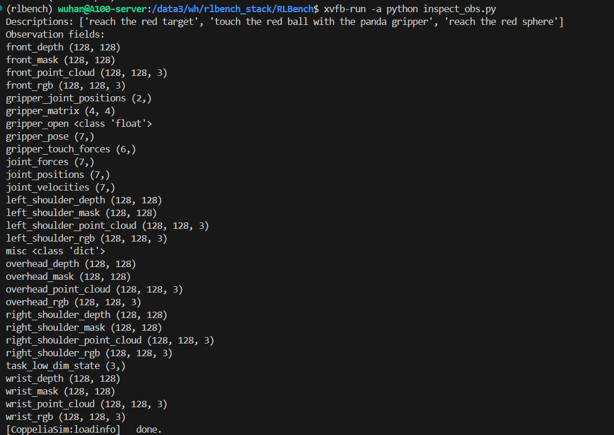

# 11.3 任务结构与观测空间

## 目标

前一节已经完成了 RLBench 的环境配置。接下来要理解的是：RLBench 中一个任务到底是怎么组织的，以及策略模型在环境中能看到什么。

读完本节后，你应该能够回答下面几个问题：

```text
RLBench 中的 Task 是什么？
Variation 是什么？
reset() 后为什么会返回 descriptions 和 obs？
Observation 里包含哪些图像、深度、mask 和机器人状态？
这些信息后面如何变成 policy 的输入？
```

这一节重点关注两个问题：

```text
任务结构：RLBench 如何定义一个 manipulation task
观测空间：policy 每一步能从环境中拿到什么信息
```


## 从一个最小任务开始

在 RLBench 中，使用任务的一般流程是：

```python
action_mode = MoveArmThenGripper(
    arm_action_mode=JointVelocity(),
    gripper_action_mode=Discrete()
)

obs_config = ObservationConfig()
obs_config.set_all(True)

env = Environment(
    action_mode=action_mode,
    obs_config=obs_config,
    headless=True
)

env.launch()

task = env.get_task(ReachTarget)
descriptions, obs = task.reset()

print(descriptions)
print(type(obs))

env.shutdown()
```

这段代码里最关键的是：

```python
task = env.get_task(ReachTarget)
descriptions, obs = task.reset()
```

它表示：

```text
从环境中取出 ReachTarget 这个任务
-> 重置任务场景
-> 得到语言描述 descriptions
-> 得到初始观测 obs
```

所以 RLBench 的任务使用方式可以压缩成：

```text
Environment
-> get_task(TaskClass)
-> reset()
-> step(action)
-> success / terminate
```

## Task：一个任务类型

`Task` 表示一个具体的操作任务类型。比如：

```text
ReachTarget
OpenDrawer
PushButton
PutItemInDrawer
StackBlocks
```

每个 task 都对应一个 Python 类。这个类会描述：

| 内容 | 作用 |
| --- | --- |
| 场景中有哪些物体 | 例如按钮、抽屉、目标球、积木 |
| 任务有哪些 variation | 例如不同目标颜色、不同目标位置 |
| episode 开始时如何初始化 | 例如随机放置目标物体 |
| 成功条件是什么 | 例如按钮被按下、物体进入容器 |
| demonstration 如何生成 | 通过 waypoints 和 motion planner 生成专家轨迹 |

可以把 `Task` 理解成一个任务模板。它规定了“这类任务要做什么”，但每次 reset 时，具体场景可能会有变化。


## Variation：同一个任务下的变化

RLBench 中的 `variation` 表示同一个任务内部的不同版本。

例如一个按钮任务可能有多个 variation：

```text
Variation 0: press the red button
Variation 1: press the green button
Variation 2: press the blue button
```

这几个 variation 都属于同一个 task，但目标不同。模型需要根据当前任务描述和图像，判断这次到底要操作哪个对象。

可以这样理解：

```text
Task = 任务类型
Variation = 这次任务的具体目标变化
```

在代码里，一个 task 通常会有类似下面的逻辑：

```python
task.set_variation(0)
descriptions, obs = task.reset()
```

或者在 reset 时由环境自动采样 variation。

variation 的意义在于增加泛化难度。如果没有 variation，模型可能只要记住一条固定轨迹；有了 variation，模型必须根据语言、视觉和状态信息做出判断。


## descriptions：任务语言描述

`task.reset()` 返回的第一个结果是 `descriptions`：

```python
descriptions, obs = task.reset()
```

`descriptions` 通常是一个字符串列表，例如：

```text
["reach the red target"]
```

或者：

```text
["open the bottom drawer"]
```

这些描述告诉模型当前任务目标是什么。

对于传统 RL 方法来说，可能只使用低维状态，不一定用语言描述。但对于 VLA 或语言条件策略来说，`descriptions` 很重要，因为它提供了任务指令：

```text
视觉输入：当前场景图像
语言输入：任务描述 descriptions
状态输入：机械臂状态
输出：机器人动作 action
```

这和后面的大模型式机器人策略是一致的：policy 不只是看图像，还要理解“现在要做什么”。


## Observation：每一步能看到什么

`task.reset()` 返回的第二个结果是 `obs`，也就是 observation。

RLBench 的 observation 比较丰富，通常包含：

| 类型 | 示例字段 | 含义 |
| --- | --- | --- |
| RGB 图像 | `front_rgb`、`wrist_rgb` | 相机看到的彩色图像 |
| 深度图 | `front_depth`、`wrist_depth` | 每个像素到相机的距离 |
| Mask / segmentation | `front_mask`、`wrist_mask` | 物体或区域分割信息 |
| 机器人状态 | `joint_positions`、`gripper_open` | 机械臂关节和夹爪状态 |
| 末端状态 | `gripper_pose` | 夹爪或末端执行器的位置与姿态 |
| 低维状态 | `task_low_dim_state` | 和任务相关的低维状态 |

不同版本和配置下字段可能略有差异，但整体可以分成两类：

```text
视觉观测：RGB / depth / mask
机器人状态：joint / gripper / pose / low-dimensional state
```

对于视觉策略来说，最常用的是 RGB 图像和机器人自身状态；对于一些传统控制或强化学习方法，也可能只使用低维状态。


## ObservationConfig：控制要返回哪些观测

RLBench 不一定每次都返回所有观测。返回哪些内容由 `ObservationConfig` 控制。

最简单的写法是：

```python
from rlbench.observation_config import ObservationConfig

obs_config = ObservationConfig()
obs_config.set_all(True)
```

这表示尽量打开所有 observation。

但实际训练时，通常不会全部使用，因为图像、深度和 mask 会占用大量内存。更常见的是只打开需要的相机和状态字段。

例如只使用 RGB 图像和部分低维状态，可以写成类似：

```python
from rlbench.observation_config import ObservationConfig

obs_config = ObservationConfig()
obs_config.set_all(False)

obs_config.front_camera.rgb = True
obs_config.wrist_camera.rgb = True

obs_config.joint_positions = True
obs_config.gripper_open = True
obs_config.gripper_pose = True
```

这表示：

```text
只返回 front camera 和 wrist camera 的 RGB 图像
同时返回机械臂关节、夹爪开合和夹爪位姿
```

这样可以减少数据量，也更贴近很多 imitation learning policy 的输入格式。


## 多视角相机

RLBench 支持多视角相机。常见视角包括：

```text
front camera
left shoulder camera
right shoulder camera
wrist camera
overhead camera
```

不同视角的作用不同：

| 相机 | 作用 |
| --- | --- |
| front camera | 从正面观察桌面和物体，常用于整体场景理解 |
| shoulder cameras | 从两侧观察机械臂和物体，减少遮挡 |
| wrist camera | 安装在机械臂末端附近，适合观察抓取细节 |
| overhead camera | 从上方观察桌面布局，适合空间定位 |

多视角观测的好处是信息更完整，但代价是数据量更大、模型输入更复杂。

在学习阶段，可以先使用一个或两个视角，例如：

```text
front_rgb
wrist_rgb
```

等理解流程后，再扩展到多视角输入。


## 打印 observation 字段

为了理解 RLBench 的 observation，最直接的方法是打印 `obs` 里有哪些字段。

可以写一个检查脚本：

```bash
cat > inspect_obs.py <<'PY'
from rlbench.environment import Environment
from rlbench.action_modes.action_mode import MoveArmThenGripper
from rlbench.action_modes.arm_action_modes import JointVelocity
from rlbench.action_modes.gripper_action_modes import Discrete
from rlbench.observation_config import ObservationConfig
from rlbench.tasks import ReachTarget

action_mode = MoveArmThenGripper(
    arm_action_mode=JointVelocity(),
    gripper_action_mode=Discrete()
)

obs_config = ObservationConfig()
obs_config.set_all(True)

env = Environment(
    action_mode=action_mode,
    obs_config=obs_config,
    headless=True
)

env.launch()

task = env.get_task(ReachTarget)
descriptions, obs = task.reset()

print("Descriptions:", descriptions)
print("Observation fields:")

for name in dir(obs):
    if name.startswith("_"):
        continue
    value = getattr(obs, name)
    if callable(value):
        continue

    if hasattr(value, "shape"):
        print(name, value.shape)
    else:
        print(name, type(value), value)

env.shutdown()
PY
```

运行：

```bash
python inspect_obs.py
```

你会看到类似：



图中展示了 `ReachTarget` 任务在 `reset()` 后返回的 observation 字段。可以看到，RLBench 不仅提供多视角 RGB 图像，还提供深度图、mask、point cloud，以及关节状态、夹爪状态和末端位姿等低维信息。这说明 RLBench 的观测是一个典型的“视觉 + 机器人状态”组合输入。


## Action Mode：任务如何接收动作

除了 observation，RLBench 还需要指定 action mode，也就是 policy 输出动作的控制方式。

前面例子中使用的是：

```python
action_mode = MoveArmThenGripper(
    arm_action_mode=JointVelocity(),
    gripper_action_mode=Discrete()
)
```

它可以理解成：

```text
机械臂部分：用 JointVelocity 控制
夹爪部分：用 Discrete 控制开合
```

也就是说，policy 每一步输出的 action 会被拆成两部分：

```text
arm action
gripper action
```

其中 arm action 控制机械臂运动，gripper action 控制夹爪开合。

不同算法可能选择不同 action mode：

| Action mode | 适合情况 |
| --- | --- |
| joint velocity | 强化学习中常见，控制关节速度 |
| joint position | 模仿学习中常见，动作比较平滑 |
| end-effector pose | 更接近任务空间控制 |
| gripper discrete | 简单控制夹爪开 / 关 |

初学阶段不需要一次理解所有 action mode，只需要知道：RLBench 的 environment 不是随便接收一个 action，它会根据 action mode 解释这个 action 的含义。


## reset 和 step 的闭环

理解了 task、observation 和 action 后，RLBench 的基本交互闭环就是：

```text
reset task
-> 得到 descriptions 和 obs
-> policy 根据 obs 输出 action
-> env.step(action)
-> 得到 next_obs、reward、terminate
-> 重复直到成功或超时
```

伪代码如下：

```python
descriptions, obs = task.reset()

for t in range(max_steps):
    action = policy(obs, descriptions)
    obs, reward, terminate = task.step(action)

    if terminate:
        break
```

其中：

| 变量 | 含义 |
| --- | --- |
| `obs` | 当前观测，包括图像和机器人状态 |
| `action` | policy 输出的机械臂控制指令 |
| `reward` | 当前 step 的奖励 |
| `terminate` | episode 是否结束 |

对于 imitation learning，policy 学的是 demonstration 中的专家动作；对于 reinforcement learning，policy 通过多次 step 和 reward 来优化。


## Task class 里一般有什么

如果打开 RLBench 的任务代码，会看到每个任务通常继承自 `Task`。一个任务类一般包含：

```text
init_task()
init_episode(index)
variation_count()
success conditions
waypoints
```

可以简单理解为：

| 组成 | 作用 |
| --- | --- |
| `init_task()` | 初始化任务中的物体、传感器、success condition |
| `init_episode(index)` | 根据 variation index 初始化当前 episode，并返回语言描述 |
| `variation_count()` | 返回这个任务有多少种 variation |
| success condition | 判断任务是否成功 |
| waypoints | 用于生成专家 demonstration 的关键路径点 |

例如一个任务可能在 `init_episode()` 中根据 index 选择目标颜色：

```text
index = 0 -> red target
index = 1 -> green target
index = 2 -> blue target
```

然后返回对应语言描述：

```text
"press the red button"
"press the green button"
"press the blue button"
```

这样就把 variation、语言描述和场景目标联系起来了。


## 从 benchmark 到 policy 输入

RLBench 的 task 和 observation 最终会变成 policy 训练数据。

可以把数据流理解成：

```text
Task / Variation
-> reset 得到 descriptions 和初始 obs
-> step 产生 observation-action 序列
-> 保存成 demonstration 或 rollout
-> 训练 policy
```

对于一个视觉策略来说，常见输入输出形式是：

```text
输入：
  - RGB image
  - robot state
  - task description

输出：
  - action
```

对应到 RLBench：

| Policy 需要的东西 | RLBench 中的来源 |
| --- | --- |
| 任务语言 | `descriptions` |
| 图像输入 | `front_rgb`、`wrist_rgb` 等 |
| 机器人状态 | `joint_positions`、`gripper_pose`、`gripper_open` |
| 专家动作 | demonstration 中的 action |
| 评测结果 | success condition / reward / terminate |

所以 RLBench 不只是一个仿真器，而是提供了完整的机器人学习数据接口。


## 本节小结

RLBench 中一个任务可以理解为：

```text
Task 定义任务类型
Variation 提供任务变化
reset() 返回 descriptions 和 observation
observation 提供图像、深度、mask 和机器人状态
action mode 决定 policy 输出动作如何被环境解释
step(action) 推动环境进入下一步
success condition 判断任务是否完成
```

如果用一句话总结：

```text
RLBench 用 Task 和 Variation 组织任务，
用 ObservationConfig 控制观测，
用 ActionMode 解释动作，
用 success condition 评估任务是否完成。
```
