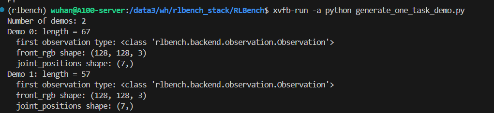
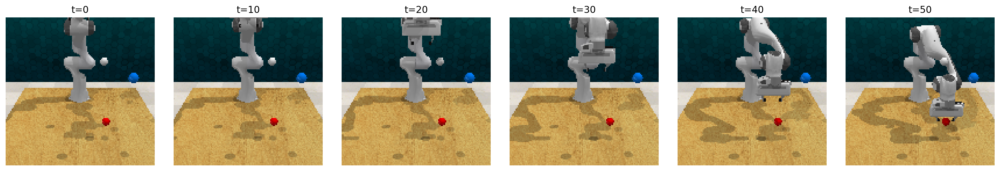

# 11.4 演示数据生成与数据集

## 目标

前面已经理解了 RLBench 的任务结构和观测空间。接下来要看的是：RLBench 如何生成 expert demonstration，以及这些 demonstration 后续如何变成 policy 训练数据。

读完本节后，你应该能够回答下面几个问题：

```text
RLBench 中的 demonstration 是什么？
live_demos=True 和 live_demos=False 有什么区别？
如何为一个任务生成少量 demonstrations？
生成的数据一般包含哪些 observation 和 action？
demonstration 后续如何用于 imitation learning？
```

## Demonstration 是什么

在 RLBench 中，一个 demonstration 是一条完整的专家演示轨迹。它通常包含：

```text
初始状态
-> 第 1 步 observation 和 action
-> 第 2 步 observation 和 action
-> ...
-> 成功完成任务
```

从 imitation learning 的角度看，demonstration 就是监督学习数据：

```text
输入：observation
标签：expert action
```

策略模型要学习的是：

```text
policy(observation, task_description) -> action
```

其中 observation 可以包含 RGB 图像、深度图、mask、机械臂状态和夹爪状态等；action 则表示专家在当前时刻采取的机器人控制指令。


## live demos 和 saved demos

RLBench 中获取 demonstrations 通常有两种方式：

| 方式 | 含义 | 适合场景 |
| --- | --- | --- |
| `live_demos=True` | 现场调用 motion planner 生成新的专家轨迹 | 调试任务、快速检查环境是否正常 |
| `live_demos=False` | 从已经保存好的数据集中读取 demonstrations | 训练 policy、复现实验、批量读取数据 |

可以简单理解为：

```text
live demos = 现在让仿真器现场演示一遍
saved demos = 从硬盘里读取之前生成好的演示数据
```

调试阶段可以先用 `live_demos=True` 生成一两条轨迹，确认任务、仿真和观测配置都正常。正式训练时通常会先批量生成 demonstrations 并保存到磁盘，然后训练脚本再从磁盘读取。


## 生成一个任务的 demonstrations

下面以 `ReachTarget` 为例，生成少量 live demonstrations。

```bash
cat > generate_one_task_demo.py <<'PY'
from rlbench.environment import Environment
from rlbench.action_modes.action_mode import MoveArmThenGripper
from rlbench.action_modes.arm_action_modes import JointVelocity
from rlbench.action_modes.gripper_action_modes import Discrete
from rlbench.observation_config import ObservationConfig
from rlbench.tasks import ReachTarget

action_mode = MoveArmThenGripper(
    arm_action_mode=JointVelocity(),
    gripper_action_mode=Discrete()
)

obs_config = ObservationConfig()
obs_config.set_all(True)

env = Environment(
    action_mode=action_mode,
    obs_config=obs_config,
    headless=True
)

env.launch()

task = env.get_task(ReachTarget)

# live_demos=True 表示现场生成专家演示轨迹
demos = task.get_demos(
    amount=2,
    live_demos=True
)

print("Number of demos:", len(demos))

for i, demo in enumerate(demos):
    print(f"Demo {i}: length = {len(demo)}")
    first_obs = demo[0]
    print("  first observation type:", type(first_obs))

    if hasattr(first_obs, "front_rgb") and first_obs.front_rgb is not None:
        print("  front_rgb shape:", first_obs.front_rgb.shape)

    if hasattr(first_obs, "joint_positions") and first_obs.joint_positions is not None:
        print("  joint_positions shape:", first_obs.joint_positions.shape)

env.shutdown()
PY
```

运行：

```bash
python generate_one_task_demo.py
```

如果环境正常，程序会打印 demonstration 数量、每条轨迹长度，以及 observation 中部分字段的形状。



图中展示了 `task.get_demos(amount=2, live_demos=True)` 的运行结果。程序成功生成了两条 expert demonstrations，每条 demo 都是一段 observation 序列。输出中的 `front_rgb shape` 和 `joint_positions shape` 说明一条 demo 不只包含图像观测，也包含机械臂关节状态等低维信息。

注意在服务器上运行 RLBench 时，通常没有显示器，因此需要 headless 模式，图中即为服务器运行结果。



这里同时展示了一条 `ReachTarget` expert demonstration 的关键帧序列。可以看到，示范轨迹从初始状态开始，机械臂逐步接近目标并完成任务。相比单纯打印 demo 长度和 observation shape，关键帧序列更直观地展示了 demonstration 作为 imitation learning 训练数据的含义。


## 一条 Demo 里面有什么

`task.get_demos()` 返回的是一个 demos 列表。可以简单理解成：

```text
demos = [
  demo_0,
  demo_1,
  demo_2,
  ...
]
```

其中每个 `demo` 又是一串 observation：

```text
demo_0 = [
  obs_0,
  obs_1,
  obs_2,
  ...
]
```

每个 `obs` 里可能包含：

| 字段 | 含义 |
| --- | --- |
| `front_rgb` | 正面相机 RGB 图像 |
| `wrist_rgb` | 腕部相机 RGB 图像 |
| `front_depth` | 正面相机深度图 |
| `front_mask` | 正面相机分割 mask |
| `joint_positions` | 机械臂关节位置 |
| `joint_velocities` | 机械臂关节速度 |
| `gripper_pose` | 夹爪末端位姿 |
| `gripper_open` | 夹爪开合状态 |
| `task_low_dim_state` | 和任务相关的低维状态 |

具体返回哪些字段取决于 `ObservationConfig`。如果只需要 RGB 图像和机械臂状态，就不必打开所有字段，否则保存和训练时数据量会非常大。


## 控制 observation 保存内容

前面的例子用了：

```python
obs_config = ObservationConfig()
obs_config.set_all(True)
```

这会尽量打开所有 observation，适合理解字段结构，但不一定适合大规模生成数据。

如果只想保留常用字段，可以写成：

```python
from rlbench.observation_config import ObservationConfig

obs_config = ObservationConfig()
obs_config.set_all(False)

obs_config.front_camera.rgb = True
obs_config.wrist_camera.rgb = True

obs_config.joint_positions = True
obs_config.gripper_open = True
obs_config.gripper_pose = True
```

这样保存的数据会更轻量。

可以把不同配置理解成：

| 配置方式 | 优点 | 缺点 |
| --- | --- | --- |
| `set_all(True)` | 信息完整，适合调试和理解 RLBench | 数据量大，训练读取慢 |
| 只开 RGB + robot state | 更接近常见 imitation learning 输入 | 缺少 depth / mask 等额外信息 |
| 只开 low_dim_state | 速度快，适合传统 RL 调试 | 不适合视觉策略 |


## 批量生成 saved demos

如果要训练 policy，通常不应该每次训练时都现场生成 demonstration，而是先批量生成并保存。

RLBench 官方仓库中通常提供数据生成脚本。不同版本脚本参数可能略有差异，建议先查看帮助：

```bash
cd $RLBENCH_ROOT/RLBench
python tools/dataset_generator.py --help
```

常见的生成逻辑是：

```text
指定保存目录
-> 指定任务名称
-> 指定每个任务生成多少 episodes
-> 指定图像大小、variation 数量和渲染方式
-> 生成并保存 demonstrations
```

示例命令可以写成：

```bash
cd $RLBENCH_ROOT/RLBench

python tools/dataset_generator.py \
  --save_path $RLBENCH_ROOT/data/demos \
  --tasks reach_target \
  --image_size 128,128 \
  --episodes_per_task 10 \
  --variations 1 \
  --processes 1
```

如果你使用的 RLBench 版本参数名称不同，以 `python tools/dataset_generator.py --help` 输出为准。


## 保存后的数据目录

生成 saved demos 后，数据目录通常会按照任务和 variation 组织。大致结构可以理解成：

```text
data/demos/
└── reach_target/
    ├── variation0/
    │   ├── episodes/
    │   │   ├── episode0/
    │   │   ├── episode1/
    │   │   └── ...
    │   └── variation_descriptions.pkl
    └── all_variations/
```

不同版本的 RLBench 保存结构可能略有差异，但核心思想是一致的：

```text
task name
-> variation
-> episode
-> observation sequence
```

其中每个 episode 保存一条完整 demonstration，包含多步 observation 和 action 相关信息。


## 读取 saved demos

如果已经生成了 saved demos，可以在创建 Environment 时指定 `dataset_root`，然后用 `live_demos=False` 读取：

```bash
cat > load_saved_demo.py <<'PY'
from rlbench.environment import Environment
from rlbench.action_modes.action_mode import MoveArmThenGripper
from rlbench.action_modes.arm_action_modes import JointVelocity
from rlbench.action_modes.gripper_action_modes import Discrete
from rlbench.observation_config import ObservationConfig
from rlbench.tasks import ReachTarget

DATASET_ROOT = "data/demos"

action_mode = MoveArmThenGripper(
    arm_action_mode=JointVelocity(),
    gripper_action_mode=Discrete()
)

obs_config = ObservationConfig()
obs_config.set_all(True)

env = Environment(
    action_mode=action_mode,
    obs_config=obs_config,
    dataset_root=DATASET_ROOT,
    headless=True
)

env.launch()

task = env.get_task(ReachTarget)

# live_demos=False 表示从磁盘读取已经保存好的 demonstration
demos = task.get_demos(
    amount=1,
    live_demos=False
)

print("Loaded demos:", len(demos))
print("First demo length:", len(demos[0]))

env.shutdown()
PY
```

运行：

```bash
python load_saved_demo.py
```

如果能成功读取，说明 saved demos 的目录结构和 `dataset_root` 配置是匹配的。


## demonstration 如何变成训练数据

从 policy 训练角度看，demonstration 要被整理成监督学习样本。

一条 demo 可以转成很多训练样本：

```text
obs_0 -> action_0
obs_1 -> action_1
obs_2 -> action_2
...
```

如果是语言条件策略，还会加入任务描述：

```text
(description, obs_0) -> action_0
(description, obs_1) -> action_1
(description, obs_2) -> action_2
...
```

如果是多视角视觉策略，输入可能是：

```text
front_rgb
wrist_rgb
joint_positions
gripper_pose
description
```

输出是：

```text
expert action
```

所以 demonstration 在训练中的作用就是提供专家监督信号，让 policy 学会在相似 observation 下输出相似 action。


## 常见问题

### 1. 现场生成 demos 很慢

`live_demos=True` 会启动仿真并调用 motion planner 生成轨迹，因此会比普通读取数据慢很多。调试时只生成 1 到 2 条即可。

```python
demos = task.get_demos(amount=1, live_demos=True)
```

正式训练前再批量生成 saved demos。

### 2. 有些任务 demo 生成失败

部分任务可能因为初始状态、碰撞、motion planning 失败等原因生成失败。这在机器人仿真里比较常见。批量生成数据时通常需要允许重试，或者检查失败任务的 waypoints 和 success condition。

### 3. 数据量太大

如果打开所有相机、深度图和 mask，数据会很快变大。大规模生成 demonstrations 时，建议只保存训练真正需要的字段。

例如只保存：

```text
front_rgb
wrist_rgb
joint_positions
gripper_pose
gripper_open
```

这样比 `set_all(True)` 更适合长期训练。

### 4. saved demos 读取失败

常见原因包括：

| 问题 | 说明 |
| --- | --- |
| `dataset_root` 不对 | Environment 找不到保存的数据目录 |
| task 名称不匹配 | 保存目录和当前 task class 不对应 |
| variation 数量不匹配 | 请求的 variation 在磁盘中不存在 |
| observation 配置不一致 | 保存时没有某个字段，读取时却期望使用它 |

遇到这类问题时，先检查数据目录结构，再确认 `dataset_root` 和任务名称是否一致。


## 本节小结

RLBench 的 demonstration 是一条完整专家轨迹，它把机器人任务变成了可以训练 policy 的数据：

```text
Task / Variation
-> reset 场景
-> motion planner 生成专家轨迹
-> 保存 observation-action 序列
-> policy 从 demonstration 中学习动作
```

可以把整条数据链路理解成：

```text
live_demos=True
  现场生成少量 demo，用于调试

live_demos=False
  从磁盘读取 saved demos，用于训练

dataset_generator.py
  批量生成 demonstration 数据集
```